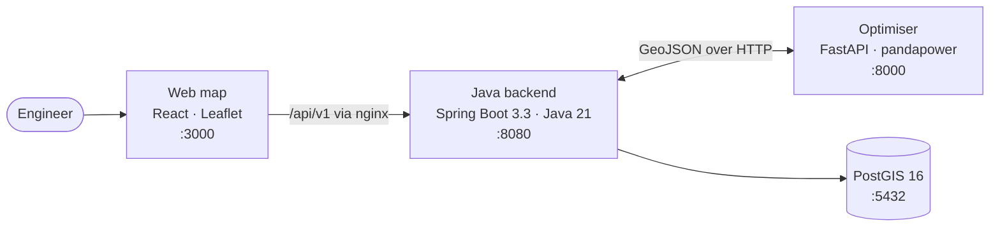

# SURGE — Smart Utility Routing and Grid Evacuation

Collector-network and evacuation routing for wind farms. Import a site survey, and SURGE lays out
the 33 kV collector network that connects every turbine to the substation — feeder grouping, route
geometry over a terrain and constraint cost surface, pole placement, an electrical check, and a
bill of materials — then shows it on a map and tells you why it chose that route.

Built for a small internal engineering team. Not a hosted product.



The frontend talks only to the backend; nginx proxies `/api/` internally, so the whole app is one
origin. The optimiser is never exposed to the browser.

---

## What it does

**Import** — Drag in a `.kmz`, `.kml`, or GeoJSON survey. Turbines, substations, evacuation towers,
reference lines, cadastral parcels and restricted areas are classified on ingest. Turbines marked
cancelled, low-AEP or to-be-shifted are stored and drawn but excluded from optimisation.

**Optimise** — Turbines are grouped into capacity-constrained feeders, a minimum spanning tree gives
each feeder its topology, and routes are traced with A\* over a cost surface built from terrain and
the site's own constraints. Poles are placed along the result and classified tangent, angle,
junction or terminal.

**Four scenarios that genuinely differ** — Balanced, Minimum Cost, Minimum Land Impact and Minimum
Environmental Impact change both the scoring weights and the constraint costs and clearances sent
to the optimiser, so they return different networks rather than the same one relabelled.

**Explain** — Every run records why its route won: the score components, the constraints it avoided,
and what it traded away.

**Report** — Network length, pole count by class, estimated capex, electrical losses from an AC load
flow, and right-of-way exposure computed from real parcel/corridor intersection. Exportable as PDF
and CSV.

**Account control and audit** — Login is required for every route. Administrators provision
accounts, reset passwords and disable users from an in-app panel, and the audit log records who did
what.

---

## Requirements

- **Docker Desktop** with Compose v2 — for the full stack
- **JDK 21**, **Python 3.11**, **Node.js 20** — only for working on a component directly

---

## Quick start

```bash
cp .env.example .env
```

Then **generate a signing key** and put it in `.env` as `APP_JWT_SECRET`:

```bash
openssl rand -base64 48
```

This is not optional — Compose refuses to start without it, deliberately. See
[Security](#security-before-you-deploy) for why.

```bash
docker compose up --build
```

Wait for all four services to report healthy, then open **http://localhost:3000**.

| Service | Health check |
| --- | --- |
| Java backend | `http://localhost:8080/actuator/health` |
| Python optimiser | `http://localhost:8000/api/v1/health` |

### First login

A fresh database seeds a single administrator from `SURGE_BOOTSTRAP_ADMIN_USERNAME` /
`SURGE_BOOTSTRAP_ADMIN_PASSWORD`. **If you do not set those, it seeds `admin` / `admin`.** Set them
before the first start, or change the password immediately afterwards in the Users tab. Every other
account is created by an administrator from inside the app; nothing here overwrites a password that
already exists, so credentials you change survive a restart.

To try it without a survey of your own, use the **Download Sample .KMZ** link in the Assets tab and
import the file it gives you.

---

## Working on it

### Web map

```bash
cd web-map-next && npm ci && npm run dev
```

> **Two builds serve this app and they do not update together.**
>
> - `http://localhost:3000` — the `frontend` container, serving a bundle baked at image build
>   time. It does **not** pick up source edits.
> - `http://localhost:5174` — the Vite dev server above, with hot reload.
>
> After changing anything under `web-map-next/src`, rebuild the container before testing on 3000:
>
> ```bash
> docker compose up -d --build frontend
> ```
>
> This has already caused a fix to be reported as working on 5174 while 3000 still served the
> broken version. Verify on the port you actually intend to use.

### Java backend

```bash
cd backend-java && ./mvnw verify
```

### Python optimiser

```bash
cd optimisation-python
py -3.11 -m venv .venv && .venv/Scripts/activate
python -m pip install -r requirements.lock.txt
python -m ruff check app tests && python -m mypy app && python -m pytest -q
```

---

## Testing

| Suite | Count | Command |
| --- | --- | --- |
| Java backend | 209 | `./mvnw verify` |
| Python optimiser | ~489 | `python -m pytest -q` |
| Web map | 26 | `npm run test` |

[`.github/workflows/ci.yml`](.github/workflows/ci.yml) runs all three plus `docker compose build`
on every push and pull request.

Security-relevant behaviour is covered deliberately rather than incidentally. `SecurityBoundaryTest`
exercises the real filter chain — every other controller test disables filters, so none of them
could catch an accidental `permitAll`.

---

## Security: before you deploy

This runs safely on a laptop. Three things must change before it is reachable from the internet,
tracked in [§5.7 of the gap closure plan](docs/MVP%20Gap%20Closure%20Plan.md):

1. **Credential defaults.** `SURGE_BOOTSTRAP_ADMIN_PASSWORD` defaults to `admin` and `DB_PASSWORD`
   to `postgres`. A fresh database seeds `admin`/`admin` unless you say otherwise.
2. **No brute-force protection.** Login has no rate limit, lockout or delay. Unlimited guessing
   against an 8-character minimum.
3. **No TLS of its own.** nginx serves plain HTTP and tokens travel in headers, so whatever sits in
   front must terminate TLS.

Already handled: the JWT signing key has no default and the backend refuses to start without one;
the authentication filter resolves the account behind every token, so disabling, demoting or
resetting a user takes effect immediately rather than whenever their token expires.

The upload path, cross-user project access and the export endpoints have never had a security
review. Fine behind a VPN; not fine on a public URL holding client survey data.

---

## Documentation

- [`CONTEXT.md`](CONTEXT.md) — implementation status and the full progress record
- [`docs/MVP Gap Closure Plan.md`](docs/MVP%20Gap%20Closure%20Plan.md) — the living plan, with what
  each piece of work actually produced and what it got wrong
- [`docs/MVP - Minimum Viable Product.md`](docs/MVP%20-%20Minimum%20Viable%20Product.md) — scope
- [`docs/Python Engine - Architecture.md`](docs/Python%20Engine%20-%20Architecture.md) — optimiser internals
- [`docs/Surge MVP Ticket Plan.md`](docs/Surge%20MVP%20Ticket%20Plan.md) — the SURGE-PY ticket sequence
- `obsidian-vault/` — design notes and research

`web-map/` is the previous vanilla-JS frontend. Kept for reference, no longer built or deployed.
