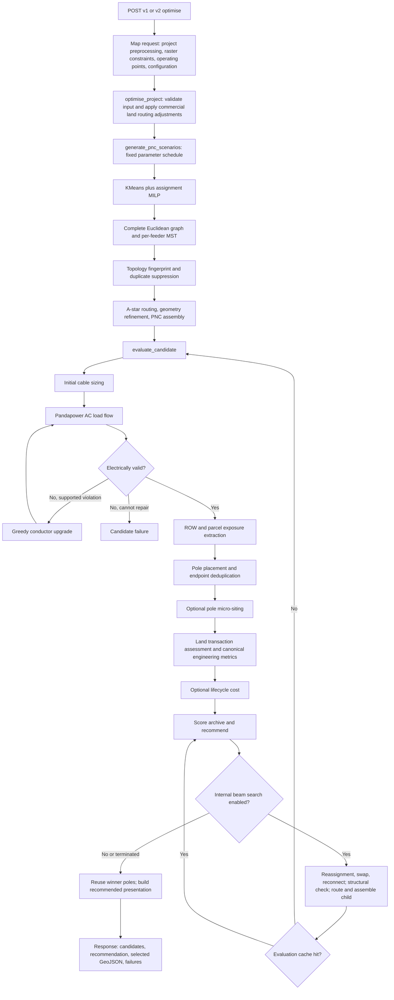

# SURGE Python optimization implementation audit

Audit date: 15 September 2026. Source of truth: checkout `f50f717c9b2fed06a77bd2ffa12137cb5531b42d`. Read-only audit: production code, tests, and dependency declarations were unchanged. This documentation PR publishes the report and supporting evidence after the audit. Source links are pinned to the audited commit.

## 1. What has actually been completed?

**SURGE has a working, integrated, deterministic candidate-design and evaluation engine.** It can assign WTGs to capacity-constrained feeders, generate radial trees, route their connections around supplied exclusions and penalties, generate preliminary poles, automatically choose conductors, attempt conductor-only electrical repair, validate the resulting design with real Pandapower AC load flow, calculate spatial/electrical/infrastructure metrics, optionally value lifecycle costs and parcel transaction choices, and recommend the best eligible generated design under disclosed scoring weights.

**Its public API currently compares a small fixed schedule of seed designs.** Objective-directed beam search is real and internally integrated, but disabled by default and unavailable through either request schema. Pole micro-siting is likewise an internal opt-in capability without an API control. ML corpus generation, training, and a saved model are present; **runtime ML-assisted search is absent from this commit**.

“Best” means best among the generated, eligible archive under the selected scalar scoring policy. It does not mean a globally optimal network, the cheapest feasible cable combination, a guaranteed set of five distinct alternatives, or a design optimized over terrain, substation location, operating controls, and structural engineering.

All **622 existing Python tests passed** in the final full-suite run; Ruff and strict mypy passed. Additional read-only probes exposed gaps the suite does not catch: ineffective seed diversity, loss of land assessments on cache hits, and incomplete publication of successful repair/conductor decisions.

## 2. Repository baseline and scope

| Item | Observed state |
|---|---|
| Repository/worktree | `C:/Users/ARK/.codex/worktrees/0822/surge` |
| Actual Python package | `optimisation-python/`; the request calls it `optimise-python` |
| Branch | Detached HEAD; `git branch --show-current` returned blank. Local `main`, cached `origin/main`, and `origin/HEAD` point at HEAD. No remote fetch performed. |
| Commit | `f50f717c9b2fed06a77bd2ffa12137cb5531b42d` |
| Tracked working tree at audit start/completion | Clean; `git status --short` and `git diff --stat` reported no changes. Git warned that its user-level ignore file could not be read. |
| Python configuration | Python 3.11 in Docker and CI; Ruff `py311`; mypy `python_version = "3.11"`, `strict = true`. No project `requires-python` declaration. |
| Runtime used | Python 3.11.9. This worktree initially lacked `.venv`; an ignored local environment was created for audit execution. |
| Dependencies | pip requirement files: fully pinned `requirements.txt` and `requirements.lock.txt`. Docker/CI install the latter; `pyproject.toml` configures tools, not package dependency resolution. |
| Test location | `tests/test_*.py`, `tests/api/`, `tests/optimisation/ml/`, fixtures in `tests/fixtures/` and `tests/fixtures/corpus/`. |
| Important configuration | [pyproject.toml](https://github.com/cookedaryan/surge/blob/f50f717c9b2fed06a77bd2ffa12137cb5531b42d/optimisation-python/pyproject.toml#L1), [requirements.lock.txt](https://github.com/cookedaryan/surge/blob/f50f717c9b2fed06a77bd2ffa12137cb5531b42d/optimisation-python/requirements.lock.txt#L1), [Dockerfile](https://github.com/cookedaryan/surge/blob/f50f717c9b2fed06a77bd2ffa12137cb5531b42d/optimisation-python/Dockerfile#L1), [.env.example](https://github.com/cookedaryan/surge/blob/f50f717c9b2fed06a77bd2ffa12137cb5531b42d/optimisation-python/.env.example#L1), [config.py](https://github.com/cookedaryan/surge/blob/f50f717c9b2fed06a77bd2ffa12137cb5531b42d/optimisation-python/app/core/config.py#L1), [ci.yml](https://github.com/cookedaryan/surge/blob/f50f717c9b2fed06a77bd2ffa12137cb5531b42d/.github/workflows/ci.yml#L1), request/domain dataclasses. |
| Existing architecture graph | No `graphify-out/graph.json` found in this package or its repository root. Findings use direct source/caller tracing; graph or filename presence was not treated as implementation proof. |

The first offline dependency-install attempt failed because uv could not access its default cache. The local interpreter was then run with dependencies exposed from the existing `D:/helloworld/surge/optimisation-python/.venv/Lib/site-packages` through process-local `PYTHONPATH`. A metadata comparison found **zero mismatches against the locked requirements**. No global installation or dependency changes were made. This is a supported-version execution check, not a fresh isolated dependency-install or Docker-build check.

Evidence sources include implementation, direct callers, tests and assertions, current fixtures/artifacts, and repository PRD/TRD/plans. Historical plan status and commit subjects were cross-checked rather than accepted as completion evidence. Other local branches were inspected only for reachability; their implementations are outside this snapshot.

### Important package structure

```text
optimisation-python/
├── app/
│   ├── api/{v1,v2}/endpoints/optimise.py       # both call optimise_project
│   ├── schemas/{legacy_mapping.py,v2/}        # actual input/config mapping
│   ├── gis/{preprocessing,crs,geometry,geojson,cost_surface,constraints,row_analysis}.py
│   ├── algorithms/
│   │   ├── wtg_grouping.py                    # KMeans + assignment MILP
│   │   ├── route_graph.py, topology.py        # complete graph + per-feeder MST
│   │   ├── a_star.py, physical_routing.py, route_refinement.py
│   │   ├── pole_placement.py, pole_micro_siting.py
│   │   └── route_scoring.py                   # legacy standalone scorer
│   ├── pnc/{assembly,models,errors,geojson}.py
│   ├── electrical/
│   │   ├── cable_sizing.py, repair.py
│   │   ├── feeder_validation.py, voltage_drop.py  # standalone screening proxy
│   │   └── load_flow/{builder,analysis,config,models}.py
│   ├── optimisation/
│   │   ├── orchestrator.py, candidate_evaluation.py
│   │   ├── scenarios.py, scenario_builder.py, scenario_models.py
│   │   ├── candidate_search.py, candidate_validation.py, search_cache.py, search_models.py
│   │   ├── engineering_metrics.py, engineering_metric_models.py
│   │   ├── scoring.py, scoring_models.py, workflow_models.py
│   │   ├── corpus/synthetic_projects.py
│   │   └── ml/{corpus,feature_schema,targets,training,validation,artifact}.py
│   ├── costing/{lifecycle,models,catalogue,failures}.py
│   ├── land/{decision,models,fingerprint}.py
│   ├── presentation/                          # recommended design output
│   ├── reporting/                             # standalone decision/report consumers
│   └── services/optimisation_service.py        # obsolete API execution path
├── scripts/{generate_search_corpus,train_search_pre_ranker}.py
├── artifacts/ml/pre_ranker_v1/                 # offline saved model + metadata
└── tests/                                     # 622 collected test cases
```

## 3. Actual execution graph

The active entry points are [optimise.py:25](https://github.com/cookedaryan/surge/blob/f50f717c9b2fed06a77bd2ffa12137cb5531b42d/optimisation-python/app/api/v1/endpoints/optimise.py#L25) and [optimise.py:20](https://github.com/cookedaryan/surge/blob/f50f717c9b2fed06a77bd2ffa12137cb5531b42d/optimisation-python/app/api/v2/endpoints/optimise.py#L20). Both reach [orchestrator.py:330](https://github.com/cookedaryan/surge/blob/f50f717c9b2fed06a77bd2ffa12137cb5531b42d/optimisation-python/app/optimisation/orchestrator.py#L330). The older `OptimisationService.optimise` is not called by either endpoint.



This is the actual order in [candidate_evaluation.py:223](https://github.com/cookedaryan/surge/blob/f50f717c9b2fed06a77bd2ffa12137cb5531b42d/optimisation-python/app/optimisation/candidate_evaluation.py#L223): **electrical sizing/repair and load flow precede pole evaluation**. Search is an outer proposal/evaluation/rescoring loop, not a final operation on a single scored network. Failed electrical candidates return before engineering/cost extraction. The recommendation reuses the winner's evaluated pole network when available.

### Stage-by-stage evidence

| Stage and function | Input → output | Active algorithm/configuration | Downstream consumer |
|---|---|---|---|
| [domain_mapping.py:141](https://github.com/cookedaryan/surge/blob/f50f717c9b2fed06a77bd2ffa12137cb5531b42d/optimisation-python/app/schemas/v2/domain_mapping.py#L141) | Request → `ProjectInput`, `OptimisationConfig` | WTG cap 500; raster cap 15,000,000 cells; request routing/cable/operating/scoring/land/cost values | Orchestrator; v1 uses [legacy_mapping.py:25](https://github.com/cookedaryan/surge/blob/f50f717c9b2fed06a77bd2ffa12137cb5531b42d/optimisation-python/app/schemas/legacy_mapping.py#L25) |
| [preprocessing.py:118](https://github.com/cookedaryan/surge/blob/f50f717c9b2fed06a77bd2ffa12137cb5531b42d/optimisation-python/app/gis/preprocessing.py#L118) | WGS84 Point GeoJSON → projected turbines and one substation | Validate Points/capacities; choose primary substation; common UTM projection | Graph, raster and all metric geometry |
| [cost_surface.py:37](https://github.com/cookedaryan/surge/blob/f50f717c9b2fed06a77bd2ffa12137cb5531b42d/optimisation-python/app/gis/cost_surface.py#L37) | Project extent → `CostSurface` | Padded bounds, affine north-up raster, base cost 1; coarsen if necessary for cell cap. V2 defaults: 20 m resolution, 1,000 m padding | Constraint rasterization, A* |
| [constraints.py:229](https://github.com/cookedaryan/surge/blob/f50f717c9b2fed06a77bd2ffa12137cb5531b42d/optimisation-python/app/gis/constraints.py#L229) | Optional lines/polygons → typed layers and prepared surface | Buffers; all-touched rasterization; hard infinity; additive finite soft penalties. Defaults 10 m buffer, soft weight 20 | Endpoint validation, route search, impact analysis |
| [orchestrator.py:289](https://github.com/cookedaryan/surge/blob/f50f717c9b2fed06a77bd2ffa12137cb5531b42d/optimisation-python/app/optimisation/orchestrator.py#L289) | Prepared input + commercial profiles → adjusted input | Unavailable parcels hard; others add 20 + 0.0001 × minimum feasible transaction PV, or 20 if unpriced | Seed and child routing |
| [wtg_grouping.py:46](https://github.com/cookedaryan/surge/blob/f50f717c9b2fed06a77bd2ffa12137cb5531b42d/optimisation-python/app/algorithms/wtg_grouping.py#L46) | Project + capacity/seed/objective → assignments | Ascending feasible feeder-count trials; KMeans fixed centroids; SciPy binary MILP for compactness or count balance | MST generation |
| [route_graph.py:18](https://github.com/cookedaryan/surge/blob/f50f717c9b2fed06a77bd2ffa12137cb5531b42d/optimisation-python/app/algorithms/route_graph.py#L18), [topology.py:24](https://github.com/cookedaryan/surge/blob/f50f717c9b2fed06a77bd2ffa12137cb5531b42d/optimisation-python/app/algorithms/topology.py#L24) | Project + membership → radial feeder trees | Complete undirected metric graph; NetworkX minimum spanning tree; one selected substation | Fingerprinting and physical materialization |
| [scenarios.py:371](https://github.com/cookedaryan/surge/blob/f50f717c9b2fed06a77bd2ffa12137cb5531b42d/optimisation-python/app/optimisation/scenarios.py#L371) | Project, surface, generation config → unique seeds + attempts | Five fixed parameter sets; stop at requested accepted count; logical deduplication before routing | Seed evaluation |
| [a_star.py:18](https://github.com/cookedaryan/surge/blob/f50f717c9b2fed06a77bd2ffa12137cb5531b42d/optimisation-python/app/algorithms/a_star.py#L18), [physical_routing.py:71](https://github.com/cookedaryan/surge/blob/f50f717c9b2fed06a77bd2ffa12137cb5531b42d/optimisation-python/app/algorithms/physical_routing.py#L71) | Selected topology edges + raster → physical routes | Eight-neighbor A*; destination-cell traversal cost; admissible Euclidean lower bound; blocked diagonal corner checks; exact physical endpoints | Refinement |
| [route_refinement.py:124](https://github.com/cookedaryan/surge/blob/f50f717c9b2fed06a77bd2ffa12137cb5531b42d/optimisation-python/app/algorithms/route_refinement.py#L124) | Raw routes + same raster → refined routes | Remove duplicates/collinear vertices; greedy visible shortcuts checked by raster supercover and continuous integrated cost; preserve endpoints | PNC assembly |
| [assembly.py:140](https://github.com/cookedaryan/surge/blob/f50f717c9b2fed06a77bd2ffa12137cb5531b42d/optimisation-python/app/pnc/assembly.py#L140) | Trees + refined routes → `ProjectPNCNetwork` | Exact route/topology validation, deterministic segment/feeder IDs, metric lengths; no added Steiner junctions | Electrical, poles, spatial metrics |
| [cable_sizing.py:75](https://github.com/cookedaryan/surge/blob/f50f717c9b2fed06a77bd2ffa12137cb5531b42d/optimisation-python/app/electrical/cable_sizing.py#L75) | Rooted trees + P/Q + voltage + catalogue → initial segment cable choices | Downstream apparent power; minimum suitable effective ampacity; deterministic tie order | Repair's first electrical configuration |
| [repair.py:170](https://github.com/cookedaryan/surge/blob/f50f717c9b2fed06a77bd2ffa12137cb5531b42d/optimisation-python/app/electrical/repair.py#L170) | Network + initial choices + operating points → final config, load flow, repair log/status | Repeated conductor upgrades; runtime evaluator limits to 10 load-flow iterations (helper default 20); overloads first, worst voltage violation next | Engineering and costs use final config |
| [builder.py:14](https://github.com/cookedaryan/surge/blob/f50f717c9b2fed06a77bd2ffa12137cb5531b42d/optimisation-python/app/electrical/load_flow/builder.py#L14), [analysis.py:24](https://github.com/cookedaryan/surge/blob/f50f717c9b2fed06a77bd2ffa12137cb5531b42d/optimisation-python/app/electrical/load_flow/analysis.py#L24) | PNC + P/Q + cable config → mapped AC results and violations | WTG `sgen`, one fixed external grid, line R/X/C/derating/parallel circuits; Newton–Raphson `runpp`, numba disabled | Repair authority; eligibility and metrics |
| [engineering_metrics.py:260](https://github.com/cookedaryan/surge/blob/f50f717c9b2fed06a77bd2ffa12137cb5531b42d/optimisation-python/app/optimisation/engineering_metrics.py#L260), [row_analysis.py:163](https://github.com/cookedaryan/surge/blob/f50f717c9b2fed06a77bd2ffa12137cb5531b42d/optimisation-python/app/gis/row_analysis.py#L163) | PNC routes + constraints + ROW width → spatial quantities and parcel exposures | Buffer/STRtree intersections; unique parcel IDs; merged per-parcel route/ROW exposure; hard centerline intersection IDs | Land evaluation and canonical metrics |
| [pole_placement.py:640](https://github.com/cookedaryan/surge/blob/f50f717c9b2fed06a77bd2ffa12137cb5531b42d/optimisation-python/app/algorithms/pole_placement.py#L640) | Routed PNC + spans/angle threshold → deduplicated physical poles | Mandatory endpoints/angles, target span subdivision, max-span bound, endpoint merge by shared topology identity and tolerance | Scoring pole count, costs, winner map |
| [pole_micro_siting.py:283](https://github.com/cookedaryan/surge/blob/f50f717c9b2fed06a77bd2ffa12137cb5531b42d/optimisation-python/app/algorithms/pole_micro_siting.py#L283) | Pole network + route/GIS/owner context → adjusted layout and move evidence | Optional bounded chainage coordinate descent; intermediate poles only; global lexicographic acceptance | Evaluation keeps adjusted poles, discards returned move report |
| [decision.py:68](https://github.com/cookedaryan/surge/blob/f50f717c9b2fed06a77bd2ffa12137cb5531b42d/optimisation-python/app/land/decision.py#L68) | Parcel exposures + commercial terms/horizon → per-parcel decisions and owner/cost totals | Minimum PV feasible purchase/lease/easement, deterministic ties, availability gates, owner IDs or parcel proxy | Metrics, costing, candidate response |
| [engineering_metrics.py:73](https://github.com/cookedaryan/surge/blob/f50f717c9b2fed06a77bd2ffa12137cb5531b42d/optimisation-python/app/optimisation/engineering_metrics.py#L73) | Network + final load flow + poles + impacts → canonical raw metrics or structured extraction failure | Route/traversal, parcels/owners, road crossings, soft overlaps, poles, active loss, loading, voltage margin; mandatory pole result | Scoring and costing |
| [lifecycle.py:114](https://github.com/cookedaryan/surge/blob/f50f717c9b2fed06a77bd2ffa12137cb5531b42d/optimisation-python/app/costing/lifecycle.py#L114) | Final electrical config + poles/exposures + catalogue/horizon → component costs/lifecycle cost or missing-component failures | Decimal conductor/pole/land CAPEX plus annuity PV of electrical losses and recurring land payments | Cost-aware scoring and API cost summaries |
| [candidate_search.py:462](https://github.com/cookedaryan/surge/blob/f50f717c9b2fed06a77bd2ffa12137cb5531b42d/optimisation-python/app/optimisation/candidate_search.py#L462) | Evaluated seeds + project/config/cache → expanded archive/recommendation/statistics | Optional deterministic beam search; capacity-screened reassignment/swap and one reconnect alternative per cut; all materialized designs use canonical evaluator | Repeated archive scoring, final winner |
| [scoring.py:229](https://github.com/cookedaryan/surge/blob/f50f717c9b2fed06a77bd2ffa12137cb5531b42d/optimisation-python/app/optimisation/scoring.py#L229) | Comparable electrical/engineering/cost wrappers → ranks/reasons | Hard eligibility; cohort min–max benefit scores; weighted groups; optional engineering/economic blend; deterministic ties | Winner selection |
| [result_builder.py:47](https://github.com/cookedaryan/surge/blob/f50f717c9b2fed06a77bd2ffa12137cb5531b42d/optimisation-python/app/presentation/result_builder.py#L47), [domain_mapping.py:449](https://github.com/cookedaryan/surge/blob/f50f717c9b2fed06a77bd2ffa12137cb5531b42d/optimisation-python/app/schemas/v2/domain_mapping.py#L449) | Winner + archived evidence → strict summaries/WGS84 GeoJSON/API response | Validate ownership/coverage; selected-network presentation; candidate initial sizing/land/cost summaries | Caller; complete engineering report is a separate standalone consumer |

## 4. Decision variables: what actually changes?

“Actively optimized” distinguishes the normal HTTP path from internal opt-in execution. A heuristic design output is not equivalent to joint optimization of that variable.

| Decision variable | Implemented | Actively optimized | Fixed/heuristic or limitation | Evidence |
|---|---|---|---|---|
| WTG feeder assignment | Yes | Yes in seeds; additional reassignment/swap only with internal search enabled | MILP uses squared distance to fixed centroids or feeder WTG-count balance, not full lifecycle objective | `group_wtgs`; `candidate_search` mutation generators |
| Feeder topology | Yes | Per-seed Euclidean MST; reconnect search internally | No general topology optimizer or new junction-node search | `build_feeder_mst`; `_generate_reconnect_mutations` |
| Physical route | Yes | Least raster cost for each selected edge | One deterministic route per edge/surface; refinement heuristic; no independent route-alternative search | `a_star`; `refine_routing_result` |
| Cable type | Yes | Automatic electrical sizing and greedy repair | Minimum effective ampacity, not cheapest lifecycle conductor. Cost catalogue does not drive cable selection. | `size_cables_for_network`; `repair_electrical_design` |
| Pole positions | Yes | Base placement heuristic; internal micro-siting opt-in | Only intermediate poles move along existing routes; poles are not inserted/deleted by micro-siting | `place_poles_on_network`; `optimize_poles` |
| Land route choice | Yes, indirectly | Raster land penalties influence routes; scoring can rank impacts/cost | Does not enumerate parcel sequences or jointly solve route/access economics | `_apply_land_routing_constraints`; `assess_candidate_land` |
| Feeder count | Yes | Ascending capacity-feasible seed count | No search mutation to create a new feeder; minimum count is favored before route/economic evaluation | `group_wtgs`; `_apply_grouping_mutation` |
| Purchase/lease/easement option | Yes | Independently choose minimum PV feasible quoted/estimated option per affected parcel | Fixed affected geometry; no negotiation or renewal optimization | `assess_candidate_land` |
| Parallel circuit count/derating | Supported input | Changes only by choosing a catalogue cable entry | Integer circuit count is not freely searched; derating is supplied, not terrain-derived | `LoadFlowCableType`; cable sizing |
| Substation location/selection | One selected connection point | Heuristic preprocessing selection, not candidate optimization | Highest supplied capacity; if no capacity signal, nearest WTG centroid. No simultaneous multiple-substation network | `_select_primary_substation` |
| Nominal voltage/slack setting | Configurable | No | Fixed throughout candidate evaluation | `LoadFlowConfig`; Pandapower builder |
| WTG dispatch/power factor/reactive control | Configurable operating point | No | One operating-factor/PF setting; no curtailment or compensation search | `to_workflow_invocation`; `WTGOperatingPoint` |
| Terrain/DEM, land-use raster and access-road choice | Absent as integrated decision variables | No | Supplied vector penalties and prepared raster only | Cost-surface builder/request schema |
| Sag, clearance, structural pole class, foundations | Absent | No | Geometry-based pole categories only | Pole placement/micro-siting |

## 5. Active algorithms and scoring policy

### Feeder assignment

Installed capacities are converted to integer kW; more than three decimal places in MW are rejected. The lower bound is `ceil(total_kW / feeder_limit_kW)`. For each count `k`, assignment variables `x[i,j]` are binary, each WTG belongs to exactly one feeder, and each feeder's summed installed capacity must stay below its limit. The first successful count is accepted; solver non-success returns `None` and advances to a larger count. No solver time limit or optimality-gap telemetry is configured.

The compactness MILP minimizes `sum(squared_distance(WTG_i, fixed_KMeans_centroid_j) * x[i,j])`. It does not iterate centroids after the constrained assignment. The balance MILP minimizes a continuous bound on maximum absolute WTG-count deviation from `n/k`. **It has no distance tie-break objective**, and the KMeans seed does not enter this balance MILP. See [wtg_grouping.py:233](https://github.com/cookedaryan/surge/blob/f50f717c9b2fed06a77bd2ffa12137cb5531b42d/optimisation-python/app/algorithms/wtg_grouping.py#L233) and [wtg_grouping.py:315](https://github.com/cookedaryan/surge/blob/f50f717c9b2fed06a77bd2ffa12137cb5531b42d/optimisation-python/app/algorithms/wtg_grouping.py#L315).

V2 derives feeder capacity from the **default** cable's effective ampacity and PF, rounded to three decimals: `sqrt(3) * nominal_kV * effective_A / 1000 * PF`. A larger available cable does not enlarge this grouping limit. V1 overrides it with the explicit legacy feeder-capacity input. Neither candidate search nor repair changes the supplied limit.

### Topology and routing

MST minimizes Euclidean topology edge weights within a fixed membership. It does not use actual detoured route length, raster cost, pole count, load flow, or lifecycle cost when choosing seed edges. A* then minimizes its directed destination-cell grid transition costs. Refinement uses a separate continuous raster-integrated cost measure. These are meaningful local optimization steps, but **not a single exact network cost objective**.

Logical crossings/overlapping physical alignments do not automatically become electrical junctions or consolidated shared trunks. PNC nodes are the selected substation and WTGs; endpoint pole deduplication merges structures at declared shared topology endpoints, not arbitrary route crossings.

### Cable selection and repair

Initial current is `hypot(downstream_P, downstream_Q) * 1000 / (sqrt(3) * kV)` when Q is nonzero. Cable order is effective ampacity, parallel count, then ID. Effective ampacity is `max_current * derating * parallel_count`.

Repair prioritizes overloads, then the most severe voltage violation. Overloads upgrade through that ordered catalogue. Undervoltage upgrades require lower equivalent impedance; overvoltage considers entries with at least equal ampacity, no worse equivalent impedance and capacitance, and a strict improvement in one. This is a **local conductor heuristic**, not Pareto network optimization. It does not reroute, split feeders, alter topology, change voltage, add compensation, or backtrack across conductor combinations. Each attempted state is checked by real AC load flow.

### Recommendation

The scorer supports `LEGACY_COMPATIBILITY`, `UNIFIED_ENGINEERING`, and `COST_AWARE`. Eligible candidates must have valid converged electrical results, matching result counts, canonical metrics and no hard route violation. Cost-aware mode additionally requires complete comparable economics.

All scored metrics are benefits after eligible-cohort min–max normalization: lower is better except voltage margin. Constant metrics contribute **zero**. Unified score is a weighted sum of physical/spatial/infrastructure/electrical groups and subweights. Cost-aware score blends that engineering score with normalized lifecycle-cost benefit. It reports engineering-best and lowest-cost candidates as well as the blended winner. Tie-breaking is explicit and stable: score then configured-policy technical/cost strengths, route length, losses and scenario ID. See [scoring.py:144](https://github.com/cookedaryan/surge/blob/f50f717c9b2fed06a77bd2ffa12137cb5531b42d/optimisation-python/app/optimisation/scoring.py#L144), [scoring.py:169](https://github.com/cookedaryan/surge/blob/f50f717c9b2fed06a77bd2ffa12137cb5531b42d/optimisation-python/app/optimisation/scoring.py#L169) and `evaluate_cohort`.

The default public policy remains legacy scoring: route length 0.40, loss 0.25, maximum loading 0.20, voltage margin 0.15. Spatial and pole weights are zero unless unified weights are explicitly supplied. The legacy string `scenario` is carried through as a response label; **it is not mapped into distinct Minimum Cost/Land/Environmental/Balanced weight profiles**. V1 also cannot request the unified/cost-aware policy fields available in V2.

## 6. What planned capability has landed?

Ticket associations below are corroborated by code and tests. They do not certify every historical acceptance statement.

| Capability / planning association | Audit classification | What exists / limitation |
|---|---|---|
| GIS foundation, grouping and MST | Implemented and operational | Validated projection, deterministic capacity assignment, radial seed trees |
| PY-007–009 cost surface/A*/refinement | Implemented and operational | Uniform base plus actual vector exclusions/penalties; terrain-derived surface still absent |
| PY-010/011 poles/ROW | Implemented and operational | Preliminary variable geometry-based spans and indexed ROW exposure; no mechanics |
| PY-012 route-only scoring | Deprecated/legacy standalone | Real tested function explicitly documents preliminary/legacy status; not runtime recommendation engine |
| PY-013 electrical screening proxy | Implemented but not integrated | Ampacity/linear voltage-drop/substation-capacity checks exist and are tested; runtime uses Pandapower repair instead |
| PY-014 PNC assembly | Implemented and operational | Active canonical network boundary, not merely a standalone file |
| PY-015 Pandapower validation | Implemented and operational | Active real AC solver and mapped violations |
| PY-016 presentation | Implemented and operational, partial repair publication | Rich winner map and electrical data; successful repair log omitted by orchestrator call |
| PY-017 deterministic scenarios | Implemented, diversity partial | Fixed schedule, deduplication, failures; nominal fourth/fifth strategies do not add the promised independent diversity |
| PY-018/019/020 scoring/orchestrator/API | Implemented and operational | Both APIs reach canonical workflow; recommendation and failure semantics covered |
| PY-021/022 constraint tests/provenance | Implemented | Hard/soft/API assertions; fixture explicitly Python-contract rather than real survey round-trip evidence |
| PY-023/024/025 physical pole deduplication/integration/presentation | Implemented and operational | Actual current evaluator places poles per valid candidate; winner reuses them. Older plan text saying winner-only/no scoring impact is stale. |
| PY-026 canonical engineering metrics | Implemented and operational | Required raw metric boundary; structured extraction failure prevents false eligibility |
| PY-027 unified engineering scoring | Implemented and operational via V2 opt-in | Infrastructure/spatial/electrical/physical metrics share one canonical scorer |
| PY-028 lifecycle costs | Implemented and operational with supplied catalogue | Final repaired cable configuration is priced; complete/partial cost components distinguish missing from zero |
| PY-029 cost-aware recommendation | Implemented and operational via V2 opt-in | Blend engineering benefit with lifecycle economics; not direct global cost minimization |
| PY-030 per-segment cable sizing | Implemented and operational, response partial | Initial sizing emitted in candidate summaries; final installed conductor not directly represented per selected segment |
| PY-031 electrical self-repair | Implemented and operational, bounded | Conductor-only loop with failure diagnostics and logs; no general design repair |
| Objective-directed candidate search | Implemented and integrated internally | Disabled/unreachable from HTTP configuration; real neighbor evaluation and archive recommendation |
| Search budgeting/caching/screening | Implemented internally, cache completeness partial | Structural invariants, budgets, fingerprints, FIFO bounded memory; cache drops land assessment |
| PY-034 land/owner decisions | Implemented and operational | Availability, owner provenance, purchase/lease/easement selection, economics and full per-parcel candidate response |
| PY-035 pole micro-siting | Implemented internally, partially scoped | Opt-in coordinate descent connected to evaluator, absent request control; constructability cost zero; move report discarded |
| PY-036/037 decision/engineering report | Implemented but not integrated with HTTP workflow | Builders consume workflow results and have tests; no active endpoint or orchestrator invocation. Reporting formatting was not otherwise audited. |
| Synthetic corpus + PY-039 pre-ranker training | Experimental offline capability | Deterministic synthetic fixtures, labels/features, project-isolated training/validation, saved Ridge artifact |
| PY-040 runtime mutation-ranking model | Absent from audited HEAD | Commit `74c8d91` is on local `feature/py-040-Wire-Mutation-Ranking-Model`; `git merge-base --is-ancestor 74c8d91 HEAD` returned 1 |
| Terrain/DEM/slope, project-boundary clipping | Planned but absent | No integrated raw DEM/elevation/slope input or study-boundary clipping |
| Advanced Pareto optimization | Planned but absent from runtime | No Pareto-front network search; no active NSGA-II, genetic, annealing or Steiner solver was found. The repair helper's “Pareto” comment is only its conductor heuristic. |
| N-1, fault/protection, tap/transformer optimization, dynamic dispatch | Planned but absent | One steady-state operating point and fixed external grid |
| Construction/structural pole optimization | Planned but absent | No sag/tension, terrain clearance, foundation/soil or crossing-structure design |

Two original modules, [cost_function.py](https://github.com/cookedaryan/surge/blob/f50f717c9b2fed06a77bd2ffa12137cb5531b42d/optimisation-python/app/algorithms/cost_function.py#L1) and [electrical_analysis.py](https://github.com/cookedaryan/surge/blob/f50f717c9b2fed06a77bd2ffa12137cb5531b42d/optimisation-python/app/algorithms/electrical_analysis.py#L1), contain only docstrings: **stubs**, not implemented cost/electrical engines. Their real replacements are `app/costing/lifecycle.py` and `app/electrical/load_flow/`. [optimisation_service.py:16](https://github.com/cookedaryan/surge/blob/f50f717c9b2fed06a77bd2ffa12137cb5531b42d/optimisation-python/app/services/optimisation_service.py#L16) is an unused older routing-only orchestration path. These should not be counted as separate active engines.

## 7. ML-assisted search audit

Offline training is implemented in [training.py:14](https://github.com/cookedaryan/surge/blob/f50f717c9b2fed06a77bd2ffa12137cb5531b42d/optimisation-python/app/optimisation/ml/training.py#L14) and [train_search_pre_ranker.py:50](https://github.com/cookedaryan/surge/blob/f50f717c9b2fed06a77bd2ffa12137cb5531b42d/optimisation-python/scripts/train_search_pre_ranker.py#L50). Models: **Ridge regression** and **HistGradientBoostingRegressor**, with scaled numerical features and one-hot mutation type. Features are heuristic score, feeder-capacity delta, turbine dispersion, parent rank, round index and mutation type. Labels rank siblings grouped by project/round/parent using canonical eligibility/rank/cost/length/ID; target is normalized relative ordinal quality. Cross-validation holds out whole projects. Selection prioritizes macro project top-K recall, capture, rank correlation, then simpler model.

[generate_search_corpus.py:67](https://github.com/cookedaryan/surge/blob/f50f717c9b2fed06a77bd2ffa12137cb5531b42d/optimisation-python/scripts/generate_search_corpus.py#L67) runs the real orchestrator over five synthetic projects containing 8, 12, 20, 30 and 40 turbines. It enables internal search/corpus emission and expands neighbor selection to 50; ordinary search uses five. The fixtures deliberately vary capacity and geometry, and one uses high resistance and hard/soft constraints. Provenance is explicitly **synthetic**, not real-source or round-trip verified: [PROVENANCE.md](https://github.com/cookedaryan/surge/blob/f50f717c9b2fed06a77bd2ffa12137cb5531b42d/optimisation-python/tests/fixtures/corpus/PROVENANCE.md#L1). The synthetic-generator helper also imports a test-fixture builder, so it is offline tooling rather than an independent production input provider.

The checked-in [metadata.json](https://github.com/cookedaryan/surge/blob/f50f717c9b2fed06a77bd2ffa12137cb5531b42d/optimisation-python/artifacts/ml/pre_ranker_v1/metadata.json#L1) identifies a Ridge model, 200 training rows, five projects, seven comparison groups, schema/contract versions, library versions and model/corpus hashes. The audit independently matched the model-file SHA256 to metadata, regenerated the corpus through the current orchestrator, and ran the complete training CLI into an external audit directory. Regeneration reproduced the canonical corpus hash `ef3e3badd295851e92ec169ab278fdd241bf6a3d0dbcc41a646f0b4c3064800f`; retraining reproduced the selected Ridge model hash and the following validation metrics. Four synthetic projects finished `SUCCESS`; the 30-turbine project finished `PARTIAL_SUCCESS`. Fresh metadata is in [metadata.json](audit_pre_ranker/metadata.json).

| Model | Capture@K | Top-K recall | Rank correlation |
|---|---:|---:|---:|
| Heuristic baseline | 0.3333 | 0.2400 | 0.4679 |
| Ridge | 0.4000 | 0.2933 | 0.2156 |
| Histogram gradient boosting | 0.3333 | 0.2533 | 0.4854 |

These are small-corpus offline measurements, not demonstrated runtime latency, search-quality improvement or generalization to real wind farms. Ridge improves recall/capture while reducing rank correlation. The training CLI also verified prediction equality across serialization for ten rows. The `OFFLINE_VALIDATED` status does not represent runtime promotion. The generic [artifact.py:44](https://github.com/cookedaryan/surge/blob/f50f717c9b2fed06a77bd2ffa12137cb5531b42d/optimisation-python/app/optimisation/ml/artifact.py#L44) writes that status even for an unfitted pipeline with arbitrary supplied validation metadata; its unit test exercises precisely that serialization case. [artifact.py:79](https://github.com/cookedaryan/surge/blob/f50f717c9b2fed06a77bd2ffa12137cb5531b42d/optimisation-python/app/optimisation/ml/artifact.py#L79) is a simple joblib load and does not enforce metadata/hash/schema/version compatibility. No model loader or prediction call is used in runtime `candidate_search.py` at HEAD.

Corpus semantics have a remaining gap: [candidate_search.py:462](https://github.com/cookedaryan/surge/blob/f50f717c9b2fed06a77bd2ffa12137cb5531b42d/optimisation-python/app/optimisation/candidate_search.py#L462) emission sets `feasible = execution_failure is None`, while canonical eligibility additionally depends on engineering/spatial/cost availability. Thus a child with unavailable engineering metrics can be labeled feasible with no rank. Existing failure regressions protect recommendation eligibility, but do not prove complete ML labeling for every such degradation. The target builder consumes this emitted feasibility flag rather than independently recomputing eligibility: [targets.py:6](https://github.com/cookedaryan/surge/blob/f50f717c9b2fed06a77bd2ffa12137cb5531b42d/optimisation-python/app/optimisation/ml/targets.py#L6).

## 8. Optimization-quality and integration findings

These are audit findings, not implemented fixes. “High” concerns materially limit reachable behavior or published design truth; “Medium” concerns search quality, objective coverage or modeling scope.

### F1 — High: beam search and micro-siting cannot be activated through either API

[search_models.py:15](https://github.com/cookedaryan/surge/blob/f50f717c9b2fed06a77bd2ffa12137cb5531b42d/optimisation-python/app/optimisation/search_models.py#L15) defaults `enabled=False`. The v2 mapper constructs `OptimisationConfig` without a search config; neither request model carries it. `PoleConfigRequest` has no micro-siting field and the mapper does not construct one. Both capabilities are callable internally and tested, but normal requests perform no candidate neighborhood expansion and no pole movement refinement. Search result/statistics also remain domain results rather than public response fields. This is not merely a Java migration gap.

### F2 — High: two seed personalities do not supply independent design diversity

[scenarios.py:177](https://github.com/cookedaryan/surge/blob/f50f717c9b2fed06a77bd2ffa12137cb5531b42d/optimisation-python/app/optimisation/scenarios.py#L177) applies `f(w)=w*(1+alpha*w/w_max)`. For nonnegative distances and the scheduled nonnegative alpha, f is strictly increasing. It preserves all edge orderings and ties, so the MST selection is unchanged. The function's comment that it can change the MST is mathematically incorrect for this usage. The audit compared **100 seeded weighted complete graphs: all 100 MST edge sets were unchanged**.

The fifth personality changes the KMeans seed but uses the balance MILP, which does not consume centroid coordinates. It therefore adds no seed-dependent objective diversity. A direct demo request for five designs accepted three; `PS-004` and `PS-005` were recorded as duplicate topologies. A smaller/one-feeder project can collapse to one design. Deduplication works correctly; the generation schedule does not establish a guarantee of three or five alternatives.

The existing [test_scenarios.py:665](https://github.com/cookedaryan/surge/blob/f50f717c9b2fed06a77bd2ffa12137cb5531b42d/optimisation-python/tests/test_scenarios.py#L665) only checks differing weight ratios. Count tests assert upper bounds, and balance comparison tests can skip when the strategy is absent. They do not prove that these personalities produce different topology.

### F3 — High: successful repair is not fully represented in the recommended design output

The canonical evaluator retains initial `CableSizingResult` plus repair actions, and passes the **final** repaired electrical config to metrics/costing. However [orchestrator.py:330](https://github.com/cookedaryan/surge/blob/f50f717c9b2fed06a77bd2ffa12137cb5531b42d/optimisation-python/app/optimisation/orchestrator.py#L330) calls `build_project_result` without its optional `repair_log`; presentation defaults it to empty. Candidate summaries emit the initial sizing through `asdict(c.cable_sizing)`, while selected segment GeoJSON does not expose final cable IDs.

The real, unmocked probe used one 5 MW turbine on a 20 km 33 kV route. Initial sizing selected `SMALL`; AC overvoltage triggered an upgrade to `LARGE`; final maximum voltage was **1.004560 pu**, below the 1.01 limit, and workflow status was `SUCCESS`. The domain candidate had one repair action, but `recommended_candidate_repair_log` had **zero** entries and initial sizing still named `SMALL`. The final physics is evaluated correctly; the published conductor/repair evidence is incomplete. Consumers must not interpret initial sizing as the installed final design.

### F4 — High: cache hits discard per-candidate land evidence

[search_cache.py:25](https://github.com/cookedaryan/surge/blob/f50f717c9b2fed06a77bd2ffa12137cb5531b42d/optimisation-python/app/optimisation/search_cache.py#L25) stores load flow, engineering, cost, initial sizing, repair logs and execution failures, **but not `land_assessment`**. Its rebind path constructs a candidate without that assessment. A shared-cache two-run probe evaluated `SCN-S1-001` with land evidence in run one; run two had one cache hit and the same child lacked its land assessment. Engineering counts and cost can remain populated while the candidate's per-parcel response becomes unavailable. Existing cache tests check hit counts/context isolation, not equality of complete semantic outcomes.

### F5 — Medium: the search is bounded and objective-ranked, but geographically heuristic

Default internal limits are two rounds, beam width three, five neighbors per parent, 40 child evaluations and 200 proposals. Seeds are evaluated **outside** the child evaluation budget. Reassignment/swap priority is Euclidean proximity; reconnect proposes only the shortest remaining bridge per cut. The shared top-N truncation happens before structural screening/deduplication, so rejected or duplicate entries can consume the proposal shortlist without filling it from other neighbors. Mutation types use different numeric heuristic scales. No mutation introduces extra feeders, free junctions, alternate routes for unchanged topology, or economically selected conductor combinations.

Only canonically eligible parents enter the frontier. If every seed is infeasible, search cannot walk through an infeasible intermediate design to a feasible neighborhood. Stop conditions are max rounds/budgets/no new unique/no eligible frontier; there is no optimality proof or general local-optimum certificate. Archive rescoring retains old candidates, but cohort normalization can change their relative order as candidates arrive. Route-length/lifecycle improvement is not guaranteed under a blended objective.

### F6 — Medium: economics scores candidates but does not optimize conductor lifecycle choice

Cable sizing/repair never receives installed conductor prices, energy prices or economic weights. A higher-ampacity cable may be cheaper, or a larger conductor may repay its cost through reduced losses; neither is selected on that basis. Lifecycle scoring compares networks after greedy conductor decisions. Lowest feeder count is also fixed by capacity feasibility before economics, so the engine cannot discover a cheaper design requiring additional feeders through its current mutations.

### F7 — Medium: environmental and ROW objectives remain incomplete

Standalone ROW analysis supports forest/environment layers and computes footprint/exposure quantities. The active typed parser maps `forest` and `environmental` aliases into `RESTRICTED_AREA`; the canonical adapter maps that to `restricted`, while `HT_LINE` maps to `environmental`. Forest identity therefore does not survive as a distinct active environmental overlap class. `environmental_overlap_m2` is published but is **not a `ScoringMetric`**. Unique ROW footprint area and river crossing count are not scored either. Generic hard avoidance/soft traversal penalties can still affect these areas, but that is not independent environmental-impact optimization.

Hard candidate violation IDs test route centerlines, not the full ROW or sag/clearance envelope. Raster buffers are caller supplied. Soft overlap lengths sum intersection lengths across layers; overlap of different layers can be counted more than once. Those are current objective/compliance semantics, not inferred full corridor engineering.

### F8 — Medium: canonical metrics require poles even when pole weight is zero

`ProjectInput`/`OptimisationConfig` allow `pole=None`; v2 also allows omission under legacy policy. Canonical metric extraction nevertheless records `POLE_CONFIG_MISSING`, and the scorer disqualifies the candidate. The direct probe returned `NO_FEASIBLE_CANDIDATE` for otherwise valid designs with zero infrastructure scoring weight. V1 supplies a default pole configuration, so this primarily affects v2/internal callers. “Optional poles” is not equivalent to “optional pole metric extraction.”

### F9 — Medium: one electrical operating point and an unconstrained external grid

Pandapower validates supplied P/Q, voltage and conductor loading for one steady-state condition. It does not model a transformer or enforce substation capacity in the active path. The older standalone proxy checks substation capacity, but is not called here, and canonical PNC/load-flow representation does not carry that capacity limit. There is no N-1, short-circuit/protection study, dispatch/curtailment, compensation/tap search or operating-envelope evaluation. Geometry-based poles are not part of the electrical line physics; moving poles does not alter cable lengths/load flow.

### F10 — Medium: land routing costs are proxies, not exact acquisition optimization

Raster PV penalties are scaled fixed per-parcel economics multiplied by traversed cell lengths, whereas acquisition valuation selects a parcel option and exposure-based fallback after routing. The raster objective is not equal to lifecycle land PV. Unknown ownership uses an explicit parcel proxy; unavailable commercial pricing may use catalogue policy. Shorter quoted terms are valued up to `min(term, analysis_horizon)`; renewal over the remainder is not modeled. No owner negotiation, package deal or joint legal-access optimization is implemented.

### F11 — Medium: scalability and reproducibility limits are not measured by the suite

The candidate graph is complete (quadratic edges). Assignment MILPs construct dense matrices and have no configured time limit. Each novel child is routed/refined before its evaluation-cache lookup, and before the electrical-evaluation budget check on a miss. Seeds are neither read from nor put into that cache. There is no route cache, parallel evaluation, wall-clock budget, production-scale benchmark or solver-status/optimality-gap report. HTTP limits constrain input/raster size, but internal callers bypass those mapper limits. Existing deterministic tests prove stability on their fixtures; they do not establish cross-version or large-project guarantees.

## 9. Tests: what evidence proves which capability?

Every listed test file was included in the final passing suite. Unit control-flow tests and synthetic integrated checks have different evidentiary strength.

| Capability | Existing behavioral evidence | What it establishes / limit |
|---|---|---|
| Point/CRS preprocessing | [test_preprocessing.py](https://github.com/cookedaryan/surge/blob/f50f717c9b2fed06a77bd2ffa12137cb5531b42d/optimisation-python/tests/test_preprocessing.py#L1), [test_crs.py](https://github.com/cookedaryan/surge/blob/f50f717c9b2fed06a77bd2ffa12137cb5531b42d/optimisation-python/tests/test_crs.py#L1), [test_geometry.py](https://github.com/cookedaryan/surge/blob/f50f717c9b2fed06a77bd2ffa12137cb5531b42d/optimisation-python/tests/test_geometry.py#L1), [test_geojson.py](https://github.com/cookedaryan/surge/blob/f50f717c9b2fed06a77bd2ffa12137cb5531b42d/optimisation-python/tests/test_geojson.py#L1) | Validity, projected conversion, expected rejection and substation selection behavior |
| Capacity grouping | [test_wtg_grouping.py:224](https://github.com/cookedaryan/surge/blob/f50f717c9b2fed06a77bd2ffa12137cb5531b42d/optimisation-python/tests/test_wtg_grouping.py#L224), `test_every_turbine_assigned_once`, `test_input_order_invariance`, fractional precision tests | Real grouping/MILP execution, capacity/identity boundaries; not full economic quality |
| Radial topology and assembly | [test_topology.py](https://github.com/cookedaryan/surge/blob/f50f717c9b2fed06a77bd2ffa12137cb5531b42d/optimisation-python/tests/test_topology.py#L1), [test_pnc_assembly.py:213](https://github.com/cookedaryan/surge/blob/f50f717c9b2fed06a77bd2ffa12137cb5531b42d/optimisation-python/tests/test_pnc_assembly.py#L213), invalid/extra/missing route tests | Tree/reachability and exact routed-network assembly invariants |
| Raster hard/soft constraints | [test_constraints.py](https://github.com/cookedaryan/surge/blob/f50f717c9b2fed06a77bd2ffa12137cb5531b42d/optimisation-python/tests/test_constraints.py#L1), [test_cost_surface.py](https://github.com/cookedaryan/surge/blob/f50f717c9b2fed06a77bd2ffa12137cb5531b42d/optimisation-python/tests/test_cost_surface.py#L1), [test_optimise_v1.py](https://github.com/cookedaryan/surge/blob/f50f717c9b2fed06a77bd2ffa12137cb5531b42d/optimisation-python/tests/api/test_optimise_v1.py#L1), [test_optimise_v2.py](https://github.com/cookedaryan/surge/blob/f50f717c9b2fed06a77bd2ffa12137cb5531b42d/optimisation-python/tests/api/test_optimise_v2.py#L1) | Actual raster/endpoint/route/API behavior with supplied synthetic vector input |
| A*/physical routes/refinement | [test_a_star.py](https://github.com/cookedaryan/surge/blob/f50f717c9b2fed06a77bd2ffa12137cb5531b42d/optimisation-python/tests/test_a_star.py#L1), [test_physical_routing.py](https://github.com/cookedaryan/surge/blob/f50f717c9b2fed06a77bd2ffa12137cb5531b42d/optimisation-python/tests/test_physical_routing.py#L1), [test_route_refinement.py](https://github.com/cookedaryan/surge/blob/f50f717c9b2fed06a77bd2ffa12137cb5531b42d/optimisation-python/tests/test_route_refinement.py#L1) | Obstacle/corner/cost/endpoints, non-increasing refinement; not global continuous or multi-route network optimum |
| ROW and parcel exposure | [test_row_analysis.py:148](https://github.com/cookedaryan/surge/blob/f50f717c9b2fed06a77bd2ffa12137cb5531b42d/optimisation-python/tests/test_row_analysis.py#L148), `test_overlapping_corridors_report_summed_and_unique_area`, [test_engineering_metrics.py](https://github.com/cookedaryan/surge/blob/f50f717c9b2fed06a77bd2ffa12137cb5531b42d/optimisation-python/tests/test_engineering_metrics.py#L1) | Unique parcel/area semantics and canonical extraction; no real survey truth verification |
| Poles and junction structures | [test_pole_placement.py](https://github.com/cookedaryan/surge/blob/f50f717c9b2fed06a77bd2ffa12137cb5531b42d/optimisation-python/tests/test_pole_placement.py#L1), [test_pole_deduplication.py](https://github.com/cookedaryan/surge/blob/f50f717c9b2fed06a77bd2ffa12137cb5531b42d/optimisation-python/tests/test_pole_deduplication.py#L1), [test_optimisation_orchestrator.py:312](https://github.com/cookedaryan/surge/blob/f50f717c9b2fed06a77bd2ffa12137cb5531b42d/optimisation-python/tests/test_optimisation_orchestrator.py#L312) | Span/angle/endpoint and workflow traceability; no sag/structural engineering |
| Cable sizing | [test_electrical_cable_sizing.py:74](https://github.com/cookedaryan/surge/blob/f50f717c9b2fed06a77bd2ffa12137cb5531b42d/optimisation-python/tests/test_electrical_cable_sizing.py#L74), catalogue tie-order/current tests | Apparent-power aggregation and minimum suitable cable selection; not lifecycle optimum |
| AC validation | [test_load_flow_analysis.py:92](https://github.com/cookedaryan/surge/blob/f50f717c9b2fed06a77bd2ffa12137cb5531b42d/optimisation-python/tests/test_load_flow_analysis.py#L92), overload/overvoltage tests, [test_load_flow_builder.py](https://github.com/cookedaryan/surge/blob/f50f717c9b2fed06a77bd2ffa12137cb5531b42d/optimisation-python/tests/test_load_flow_builder.py#L1), [test_load_flow_validation.py](https://github.com/cookedaryan/surge/blob/f50f717c9b2fed06a77bd2ffa12137cb5531b42d/optimisation-python/tests/test_load_flow_validation.py#L1) | Real Pandapower network/solve and result mapping; non-convergence/execution-error branches are mocked |
| Electrical repair | [test_electrical_repair.py:152](https://github.com/cookedaryan/surge/blob/f50f717c9b2fed06a77bd2ffa12137cb5531b42d/optimisation-python/tests/test_electrical_repair.py#L152), `test_voltage_repair`, `test_voltage_upgrade_skips_worse_impedance`, [test_repair_exhaustion_reasons.py](https://github.com/cookedaryan/surge/blob/f50f717c9b2fed06a77bd2ffa12137cb5531b42d/optimisation-python/tests/test_repair_exhaustion_reasons.py#L1) | Primarily mocked sizing/solver sequences verify deterministic upgrade logic and exhaustion reasons. Additional real-solver audit probe proves one genuine successful upgrade. |
| Feasibility failure truth | [test_candidate_evaluation_defects.py:287](https://github.com/cookedaryan/surge/blob/f50f717c9b2fed06a77bd2ffa12137cb5531b42d/optimisation-python/tests/test_candidate_evaluation_defects.py#L287), micro-siting fallback tests, [test_repair_diagnostics.py](https://github.com/cookedaryan/surge/blob/f50f717c9b2fed06a77bd2ffa12137cb5531b42d/optimisation-python/tests/test_repair_diagnostics.py#L1) | Structured unavailable/fallback/failure semantics via injected boundary failures |
| Canonical scores | [test_optimisation_scoring.py:463](https://github.com/cookedaryan/surge/blob/f50f717c9b2fed06a77bd2ffa12137cb5531b42d/optimisation-python/tests/test_optimisation_scoring.py#L463), unified weights/ties, hard eligibility, missing cost/economic mismatch tests | Numerical scoring and stable tie/eligibility behavior over constructed candidate evidence |
| Lifecycle economics | [test_lifecycle_cost.py:190](https://github.com/cookedaryan/surge/blob/f50f717c9b2fed06a77bd2ffa12137cb5531b42d/optimisation-python/tests/test_lifecycle_cost.py#L190), commercial replacement/currency/spatial-failure tests | Component formulas and missing-versus-zero semantics; not data-price accuracy |
| Parcel commercial decisions | [test_land_decision.py:66](https://github.com/cookedaryan/surge/blob/f50f717c9b2fed06a77bd2ffa12137cb5531b42d/optimisation-python/tests/test_land_decision.py#L66), unavailable/unprofiled cases | PV option choice, owner dedup/proxy and availability; fixed supplied terms |
| Scenario generation | [test_scenarios.py:258](https://github.com/cookedaryan/surge/blob/f50f717c9b2fed06a77bd2ffa12137cb5531b42d/optimisation-python/tests/test_scenarios.py#L258), shuffled-input/duplicate/routing/assembly invariants | Determinism and deduplication; several strategy tests patch `group_wtgs` and prove argument dispatch rather than quality/diversity |
| Actual neighbor search | [test_optimisation_orchestrator.py:221](https://github.com/cookedaryan/surge/blob/f50f717c9b2fed06a77bd2ffa12137cb5531b42d/optimisation-python/tests/test_optimisation_orchestrator.py#L221) | Real one-round/one-neighbor pipeline executes; does not assert quality gain or cover exhaustive mutation opportunities |
| Cache reuse and proposal budgets | [test_optimisation_orchestrator.py:251](https://github.com/cookedaryan/surge/blob/f50f717c9b2fed06a77bd2ffa12137cb5531b42d/optimisation-python/tests/test_optimisation_orchestrator.py#L251), `test_candidate_search_reports_proposal_budget_exhaustion`, [test_search_caching.py](https://github.com/cookedaryan/surge/blob/f50f717c9b2fed06a77bd2ffa12137cb5531b42d/optimisation-python/tests/test_search_caching.py#L1) | Hits, context invalidation and FIFO; no complete land-assessment round-trip assertion |
| Structural screening/fingerprints | [test_search_screening.py](https://github.com/cookedaryan/surge/blob/f50f717c9b2fed06a77bd2ffa12137cb5531b42d/optimisation-python/tests/test_search_screening.py#L1), [test_search_determinism.py](https://github.com/cookedaryan/surge/blob/f50f717c9b2fed06a77bd2ffa12137cb5531b42d/optimisation-python/tests/test_search_determinism.py#L1), [test_search_budgeting.py](https://github.com/cookedaryan/surge/blob/f50f717c9b2fed06a77bd2ffa12137cb5531b42d/optimisation-python/tests/test_search_budgeting.py#L1) | Direct invariants/configuration checks. Dedicated determinism file checks fingerprint order, not a full multi-round search run. |
| Micro-siting | [test_pole_micro_siting.py:230](https://github.com/cookedaryan/surge/blob/f50f717c9b2fed06a77bd2ffa12137cb5531b42d/optimisation-python/tests/test_pole_micro_siting.py#L230), revert/order/span tests | Real bounded pole moves and global acceptance on constructed geometry; absent HTTP activation |
| ML corpus emission | [test_search_corpus_generation.py:96](https://github.com/cookedaryan/surge/blob/f50f717c9b2fed06a77bd2ffa12137cb5531b42d/optimisation-python/tests/test_search_corpus_generation.py#L96), corpus validation tests | Real expanded-neighbor emission plus schema/label guards; no real-source corpus |
| ML training/artifact | [test_training.py:18](https://github.com/cookedaryan/surge/blob/f50f717c9b2fed06a77bd2ffa12137cb5531b42d/optimisation-python/tests/optimisation/ml/test_training.py#L18), [test_artifact.py:12](https://github.com/cookedaryan/surge/blob/f50f717c9b2fed06a77bd2ffa12137cb5531b42d/optimisation-python/tests/optimisation/ml/test_artifact.py#L12), target/metric tests | Construction, mocked project isolation, serialization/status and mathematical validation helpers; saved artifact file/status alone does not prove fitted accuracy |
| End-to-end recommendation | [test_optimisation_orchestrator.py:186](https://github.com/cookedaryan/surge/blob/f50f717c9b2fed06a77bd2ffa12137cb5531b42d/optimisation-python/tests/test_optimisation_orchestrator.py#L186), deterministic/status/failure isolation tests, v1/v2 tests | Real synthetic full workflow and selected-network contract. Does not prove user-upload round-trip, runtime ML or global quality. |
| Standalone reporting | [test_decision_report.py](https://github.com/cookedaryan/surge/blob/f50f717c9b2fed06a77bd2ffa12137cb5531b42d/optimisation-python/tests/test_decision_report.py#L1), [test_engineering_report.py](https://github.com/cookedaryan/surge/blob/f50f717c9b2fed06a77bd2ffa12137cb5531b42d/optimisation-python/tests/test_engineering_report.py#L1) | Consumers produce report evidence from supplied workflow results; not HTTP publication |

Specific missing regression/quality evidence: changed MST under long-edge weighting; distinct fifth seed; complete cached land/candidate equivalence; final repaired conductor and successful repair-log API truth; engineering degradation in emitted ML labels; search recovery from all-infeasible seeds; economically optimal cables/additional feeders; distinct forest/ROW objectives; solver/evaluation wall-time bounds; real-source reference designs and objective/constraint quality benchmarks.

## 10. Audit execution and measured examples

Commands were run from the audited Python directory. Successful test/static commands used the process-local dependency `PYTHONPATH` described above and local `./.venv/Scripts/python.exe`; they did not execute source from the dependency environment's checkout.

| Check | Result |
|---|---|
| `git status --short`; `git branch --show-current`; `git rev-parse HEAD`; `git log --oneline --decorate -20` | Baseline recorded; clean detached checkout |
| Initial `uv pip install --python .venv/Scripts/python.exe --offline -r requirements.lock.txt` | Could not access default uv cache; no dependency installation |
| Initial local-env targeted pytest before exposing complete dependencies | Collection failed: missing pyproj/Shapely/SciPy; environment setup failure |
| Targeted pytest: grouping, scenarios, search determinism/budgets, evaluation defects and v2 API | **111 passed**, one environment CPU-detection warning |
| `python -m ruff check --no-cache app tests` | **PASS** |
| `python -m mypy --cache-dir <temporary audit cache> app` | **PASS: 119 source files**, strict configured checking |
| First `python -m pytest -q -p no:cacheprovider` | **615 passed, 7 setup errors**: pytest default `pytest-of-ARK` temporary root access denied |
| Affected artifact/corpus/synthetic generation tests, with plugin autoload disabled and writable explicit `--basetemp` | **10 passed**, resolving all seven setup-error cases |
| Final full `python -m pytest -q -p no:cacheprovider --basetemp=<new writable audit temp directory>` with `PYTEST_DISABLE_PLUGIN_AUTOLOAD=1` | **622 passed**, one CPU-detection warning, **84.61 s** |
| [surge_audit_probes.py](surge_audit_probes.py) using current source and actual Pandapower | **PASS**, results in [surge_audit_probe_results.json](surge_audit_probe_results.json); exposes F2/F3/F4/F8 and validates locked version/model-hash comparisons |
| `generate_corpus(Path(<external audit CSV>))` via the local interpreter | **PASS**: five synthetic projects, 200 rows; canonical corpus hash reproduced; [corpus_generation.log](corpus_generation.log) |
| `python scripts/train_search_pre_ranker.py --corpus <external audit CSV> --output <external audit artifact directory>` | **PASS**: project-held-out validation, fitted Ridge selection, ten-row prediction serialization round-trip; model hash and metrics reproduced; [pre_ranker_training.log](pre_ranker_training.log) |

The final suite disabled unrelated globally auto-discovered pytest plugins; repository-required tests ran with normal pytest facilities. No tests were weakened, skipped by new configuration, or altered to pass. No production server or background service was launched. Dependency-install reproducibility, Docker build, Ruff formatting, non-Python checks, live production behavior, and real KMZ round-trip behavior were not verified.

### Unmocked fixture measurements

| Fixture | Status | Accepted candidates | Winner | Route length | AC active loss | Physical poles |
|---|---|---:|---|---:|---:|---:|
| `mvp_demo_project_v2.json` | SUCCESS | 3 | SCN-001 | 3,790.0724 m | 0.0181087 MW | 51 |
| `constraint_demo_project_v2.json` | SUCCESS | 1 | SCN-001 | 231.5487 m | 0.000176840 MW | 5 |

Both used default disabled search. The constraint fixture requested one candidate; its measured count is not evidence of five-seed collapse. The separate five-seed probe used the projected demo input and observed three accepted candidates plus duplicate attempts. The fixtures are synthetic/contract evidence, not accuracy measurements against installed engineering networks.

## 11. Distance from intended SURGE architecture

The intended computational chain in [TRD.md](https://github.com/cookedaryan/surge/blob/f50f717c9b2fed06a77bd2ffa12137cb5531b42d/docs/architecture/TRD.md#L1) and [PRD.md](https://github.com/cookedaryan/surge/blob/f50f717c9b2fed06a77bd2ffa12137cb5531b42d/docs/product/PRD.md#L1) has largely landed as reusable and integrated boundaries: project/GIS → assignment → logical trees → physical routes → PNC → electrical sizing/validation → impacts/poles → economics → scoring → recommendation. Current implementation goes beyond older MVP plans by including conductor repair, land decisions, candidate engineering metrics, unified scoring, lifecycle costs and internal neighborhood search.

The remaining distance is **optimization depth and reachability**, rather than absence of a coherent pipeline:

1. HTTP execution exposes seed comparison but not the implemented search/micro-siting controls or search provenance.
2. Assignment, tree selection, routing, conductor choice and pole placement are sequential local solvers/heuristics, not joint optimization against full lifecycle/land/electrical objectives.
3. Terrain and independent environmental/ROW objectives, extra feeder/junction decisions, and operating/structural engineering are incomplete or absent.
4. Candidate cache and winner presentation do not retain all final design evidence.
5. Tests establish many meaningful invariant and synthetic integration checks, but not competitive optimization quality, real survey validity, operating-envelope feasibility or production-scale resource bounds.

No defensible “percent complete” follows from ticket counts: the PRD's requirement for at least three alternatives is not guaranteed; named scenario weighting is disconnected; ML is offline; multiple major target variables remain fixed or absent. **Verdict: implemented integrated optimization baseline, verified with limitations; advanced objective-directed and ML-assisted optimization is only partly reachable or not landed.**

Historical documents materially lag code: the README and architecture status table still describe standalone PNC/Pandapower modules; the MVP plan contradicts itself about PY-024 and winner-only poles; the August integration plan says land only emits a count and sizing is absent, while current candidate responses expose both. Conversely, its concerns about absent micro-siting/search controls remain valid. This audit does not update those files.

## 12. Baseline recent history

`git log --oneline --decorate -20` at audit start:

```text
f50f717 (HEAD, origin/main, origin/HEAD, main) Merge pull request #29 from cookedaryan/codex/organize-docs-by-context
7a1f34b (origin/codex/organize-docs-by-context, codex/organize-docs-by-context) docs: organize documentation by context
f8a6e19 Merge pull request #27
e946c66 (fixes) fixes
e672571 (origin/test) Cover the multi-candidate decision, and stop listing unaffected parcels
931deca Explain the recommendation, and cost it
6d3998b Stop inventing a project for an empty account
d850957 Stop new projects opening under a false error banner
9877206 Rework the shell, sign-in and results surface
baff5a6 Give the interface a token and motion layer
198f5c0 Spec the frontend interaction and motion layer
198ce14 (test, feature/py-039-ml-pre-ranker-training) Synthetic Corpus Generation for ML Pre-Ranker Training
c5e4c68 PY-039: Harden corpus validation and offline artifacts
f05c2fe PY-039: ML Pre-Ranker Training Pipeline & Artifact Contract
182d8e8 Synthetic Corpus Generation for ML Pre-Ranker Training
2fff9d2 Synthetic Corpus Generation for ML Pre-Ranker Training
8c08641 Fix MultipleBagFetchException in CostCatalogue
6adbd61 Fix python ruff line length
9f41726 R-3: Score breakdown chart
349445f R-2: Render structured recommendation reason details in the decision card
```

## Changed / Files / Validation / Notes

**Changed:** The audit itself made zero tracked repository changes. This PR publishes documentation and supporting evidence only. Ignored local `.venv` and test/tool caches are audit execution byproducts and are not included.

**Files:** This report; [surge_audit_probes.py](surge_audit_probes.py); [surge_audit_probe_results.json](surge_audit_probe_results.json); [audit_search_corpus.csv](audit_search_corpus.csv); [metadata.json](audit_pre_ranker/metadata.json) and validation metadata; execution logs. The fitted model is not duplicated because its hash matches the checked-in artifact. Production modules and repository tests are unchanged.

**Validation:** Final full suite 622 passed; Ruff passed; strict mypy passed; actual fixture and closed-loop repair probes executed; offline corpus and training hashes/metrics reproduced. Initial environment failures and final workaround are disclosed above.

**Notes:** Conclusions apply to the recorded HEAD and supplied configuration/data. No feature implementation, repair, deployment, commit, branch checkout or external-message action was performed.
