# 00 - SURGE Master Dashboard

Welcome to the **SURGE Knowledge Vault** — the technical knowledge repository for the SURGE Renewable Collector Network Optimization Platform.

---

## Quick Navigation

```mermaid
graph TD
    classDef dash fill:#1e293b,stroke:#38bdf8,stroke-width:2px,color:#f8fafc;
    classDef domain fill:#0f172a,stroke:#64748b,stroke-width:1px,color:#e2e8f0;

    DASH["Master Dashboard"]:::dash
    
    DASH --> ARCH["🏗️ Architecture"]:::domain
    DASH --> REQ["📋 Requirements & Vision"]:::domain
    DASH --> OPT["⚡ Optimization Engine"]:::domain
    DASH --> GIS["🌐 GIS & Spatial"]:::domain
    DASH --> TEST["🧪 Testing & QA"]:::domain

    ARCH --> V04_0["[[System Overview]]"]
    ARCH --> V04_1["[[Backend]]"]
    ARCH --> V04_2["[[Python Engine]]"]
    ARCH --> V04_3["[[Frontend]]"]
    ARCH --> V04_4["[[Database]]"]
    ARCH --> V04_5["[[Authentication]]"]

    REQ --> V01_0["[[Vision]]"]
    REQ --> V01_1["[[Goals]]"]
    REQ --> V01_2["[[Scope]]"]
    REQ --> V01_3["[[Roadmap]]"]
    REQ --> V02_0["[[Functional Requirements]]"]
    REQ --> V02_1["[[Non Functional Requirements]]"]
    REQ --> V02_2["[[Constraints]]"]
    REQ --> V02_3["[[User Stories]]"]

    OPT --> V05_0["[[WTG Grouping]]"]
    OPT --> V05_1["[[Per-Feeder MST Topology]]"]
    OPT --> V05_2["[[Routing]]"]
    OPT --> V05_3["[[Pole Placement]]"]
    OPT --> V05_4["[[Cost Model]]"]
    OPT --> V05_5["[[AC Load Flow Validation]]"]
    OPT --> V05_6["[[Multi-Objective Candidate Scoring]]"]

    GIS --> V06_0["[[Geospatial Integrity & CRS]]"]
    GIS --> V06_1["[[GIS Cost Surface]]"]
    GIS --> V06_2["[[Constraint-aware Routing]]"]
    GIS --> V06_3["[[ROW Corridor Analysis]]"]

    TEST --> V12_0["[[Testing Status]]"]
    TEST --> V14_0["[[ADR-005 Python Service Architecture and Schemas]]"]
    TEST --> V14_1["[[ADR-007 Pandapower AC Load Flow Validation]]"]
```

### Direct Links
- 🎯 **Vision & Strategy**: [[Vision]] · [[Goals]] · [[Scope]] · [[Roadmap]]
- 📋 **Requirements**: [[Functional Requirements]] · [[Non Functional Requirements]] · [[Constraints]] · [[User Stories]]
- 🏗️ **Core Architecture**: [[System Overview]] · [[Backend]] (Spring Boot 3.3.2) · [[Python Engine]] (FastAPI) · [[Frontend]] (`web-map-next`) · [[Database]] (PostGIS 16) · [[Authentication]]
- ⚡ **Optimization Core**: [[WTG Grouping]] · [[Per-Feeder MST Topology]] · [[Routing]] · [[Pole Placement]] · [[AC Load Flow Validation]] · [[Multi-Objective Candidate Scoring]] · [[Cost Model]]
- 🌐 **GIS & Spatial**: [[Geospatial Integrity & CRS]] · [[GIS Cost Surface]] · [[Constraint-aware Routing]] · [[ROW Corridor Analysis]]
- 🧪 **Testing & ADRs**: [[Testing Status]] · [[MVP Execution Plan - Frontend & Java]] · [[ADR-001 Use FastAPI]] · [[ADR-002 Use PostGIS]] · [[ADR-004 Lifecycle Cost Objective]] · [[ADR-005 Python Service Architecture and Schemas]] · [[ADR-007 Pandapower AC Load Flow Validation]]

---

## High-Level Status (as of 2026-08-16)

> [!success] **End-to-End Vertical Slice MVP: Fully Operational**
> The SURGE platform has successfully achieved complete vertical-slice integration across all 4 containerized services. The full pipeline — from GeoJSON project asset ingestion, asynchronous job scheduling, 4-scenario multi-objective optimization, variable-span pole placement, Pandapower AC load flow validation, ROW parcel compensation, to interactive Leaflet Canvas visualization, CSV Bill of Materials (BOM), and Apache PDFBox engineering reports — is fully implemented, verified against real wind project data (Uravakonda benchmark), and tested with automated test suites.

| Domain | Implementation State | Test Coverage & Metrics | Primary Tech Stack | Key Capabilities & Verification |
| :--- | :--- | :--- | :--- | :--- |
| **Complete System** | `Production Ready MVP` | 4 Docker Compose containers | Docker, PostGIS, Java 21, Python 3.11, React 18 | Fully automated containerized deployment via `.github/workflows/ci.yml`. |
| **Java Backend** | `Completed & Hardened` | **112** source files, **209** unit/integration tests | Spring Boot 3.3.2, Java 21, Flyway V1–V13, Hibernate Spatial | JWT authentication, DB-backed token validation, SSE job streaming, async thread pool, Admin management (`/api/v1/admin/users`), Security Audit Logs (`/api/v1/audit-logs`), PDF/CSV report generation, 4 distinct scenario profiles (`ScenarioProfile`). |
| **Python Optimizer** | `Completed (PY-001–028)` | **79** source files, **~489** pytest unit/integration tests | FastAPI, Python 3.11, Pydantic v2, Shapely, NetworkX, Pandapower, Scikit-learn, SciPy | Capacity-constrained WTG grouping (K-Means/MILP with balance objective), MST feeder topology, cost-surface A* routing, farthest-visible shortcutting refinement, multi-layer obstacle avoidance (ROAD, HT_LINE, WATERCOURSE, PARCEL, RESTRICTED_AREA), 4-class pole placement with pairwise deduplication, Pandapower AC load flow validation, multi-objective scoring (PY-018), canonical engineering metrics (PY-026), 25-year Decimal lifecycle cost model (PY-028), V1 and V2 endpoints. |
| **Web GIS UI** | `Completed (web-map-next)` | **65** source files, **26** Vitest component tests | React 18, TypeScript, Vite, Leaflet Canvas (`preferCanvas: true`), TanStack Query v5, Zustand v4, Radix UI, Tailwind CSS v3 | Authenticated user session with login modal, project asset manager, layer toggles for 4 pole classes, substations, WTGs, parcels, restricted zones, feeder-colored route lines, real-time SSE progress stream, BOM strip and pane, "Why this route?" decision summary card, Admin management tab, Security audit log tab. Legacy vanilla JS `web-map` is preserved for historical reference but deprecated. |
| **GIS & Database** | `Completed & Indexed` | Flyway Migrations **V1 through V13** | PostgreSQL 16 + PostGIS 3.4 (SRID 4326 WGS84 + Local UTM Projections) | Spatial tables (`projects`, `wtg_locations`, `substations`, `cadastral_parcels`, `restricted_areas`, `reference_lines`, `optimization_jobs`, `generated_routes`, `poles`, `parcel_impacts`, `users`, `audit_logs`), GIST indexes, transactional cascade persistence, and strict spatial constraints. |

---

## Key Completed Tasks (Latest Progress through 2026-08-16)

### 1. Verification Against Golden Wind Benchmark (Uravakonda Project)
- Validated the complete data processing and optimization pipeline against real-world GIS survey data from the Uravakonda wind corridor.
- Verified coordinate transforms from WGS84 (`EPSG:4326`) to projected UTM Zone 43N (`EPSG:32643`) and Zone 44N (`EPSG:32644`), ensuring sub-meter geometric accuracy for distance and area calculations.

### 2. Four Real Deterministic Scenarios with Distinct Engineering Profiles
- Implemented true mathematical differentiation across 4 optimization scenarios via backend `ScenarioProfile` bias mappings and Python cost weights:
  1. **Balanced**: Standard industrial multi-objective weighting balancing capex, line losses, and land compensation.
  2. **Minimum Cost**: Aggressive bias minimizing immediate line length, conductor cross-section, and standard tangent pole counts.
  3. **Minimum Land Impact**: Heavy penalty ($5\times$ base) on private parcel crossings and high-value agricultural land, hugging road reserves and government corridors.
  4. **Minimum Environmental Impact**: Strict avoidance buffers around sensitive eco-zones, watercourses, and high-tension line corridors with maximum penalty multipliers.

### 3. Asynchronous Job Execution with Real-Time SSE Progress Streaming
- Migrated optimization job dispatch to Spring `@Async` thread pools with `CompletableFuture`.
- Integrated real-time Server-Sent Events (`/api/v1/projects/{id}/jobs/{jobId}/events`) broadcasting discrete granular lifecycle stages: `VALIDATING` $\rightarrow$ `GROUPING_WTGS` $\rightarrow$ `GENERATING_TOPOLOGY` $\rightarrow$ `ROUTING_PATHS` $\rightarrow$ `PLACING_POLES` $\rightarrow$ `CALCULATING_ELECTRICAL` $\rightarrow$ `FINALIZING` $\rightarrow$ `COMPLETED` / `FAILED`.

### 4. End-to-End Pole Placement & Deduplication Pipeline
- Implemented dynamic 4-class pole placement (Tangent/Suspension, Angle/Tension, Junction, Terminal/Dead-end).
- Added terrain slope checks (limit $\le 30^\circ$), variable span rules (30m to 250m), and pairwise coordinate deduplication ensuring zero overlapping poles at branching junctions and WTG terminations.

### 5. Pandapower AC Load Flow & Electrical Validation (ADR-007)
- Integrated Pandapower Newton-Raphson AC load flow engine alongside linear screening proxy.
- Computes exact active ($P$) and reactive ($Q$) power flows, bus voltage profiles (verifying $V_{\text{drop}} \le 5\%$), conductor thermal loading ($\le 100\%$), and 25-year cumulative technical energy losses.

### 6. Rigorous 25-Year Lifecycle Cost Model (PY-028)
- Implemented high-precision `Decimal` lifecycle cost calculation:
  $$\text{LCC} = \text{CAPEX}_{\text{cables}} + \text{CAPEX}_{\text{poles}} + \text{CAPEX}_{\text{civil}} + \text{Cost}_{\text{ROW}} + \text{NPV}(\text{Energy Losses})_{25\text{y}} + \text{OPEX}_{\text{maint}}$$
- Incorporates discount rates, tariff rates (₹4.50/kWh), and parcel-specific compensation rates.

### 7. Modern Web GIS Frontend (`web-map-next`)
- Built and integrated full React 18 + TypeScript + Vite web client replacing legacy vanilla JS app.
- Features: Leaflet Canvas rendering with `preferCanvas: true`, TanStack Query v5 cache management, Zustand v4 global state, Radix UI modals, feeder-colored route paths, 4-class pole glyphs, interactive BOM strip, "Why this route?" decision breakdown card, Admin panel, and Audit log viewer.

### 8. Enterprise Security & Audit Logging
- Enforced mandatory `APP_JWT_SECRET` environment configuration.
- Tokens answer directly to database account status (`UserEntity.isActive`), enabling instant token invalidation upon account suspension.
- Built comprehensive Admin management endpoints (`/api/v1/admin/users`) with admin lockout protection.
- Structured security audit logging (`/api/v1/audit-logs`) recording IP, user principal, action, timestamp, and metadata for all state-mutating requests.

### 9. Multi-Format Engineering Export
- Apache PDFBox executive PDF engineering report generation with single-line feeder topology, route schedules, parcel crossing lists, and BOM tables.
- Standardized CSV Bill of Materials (BOM) export (`/api/v1/projects/{id}/jobs/{jobId}/reports/csv`).

---

## Next Steps & Release Readiness

### 1. Production Security & Deployment Hardening
- [ ] Enforce strict production secret rotation and remove all local fallback secrets from runtime configurations.
- [ ] Add Redis/Bucket4j login rate limiting to `/api/v1/auth/login` to prevent brute-force attacks.
- [ ] Configure production TLS/HTTPS termination via Nginx reverse proxy with automated Let's Encrypt certificates.
- [ ] Perform comprehensive security audit of KMZ/GeoJSON file upload parser to guard against XML entity expansion (XXE) and zip-bomb attacks.

### 2. API & Data Enhancements
- [ ] Implement pagination, sorting, and date filtering on `/api/v1/audit-logs` for large enterprise deployments.
- [ ] Add batch project export/import archive format (`.surge.zip`) bundling GeoJSON layers, job results, and audit history.

### 3. Post-MVP Next-Gen Capabilities
- [ ] **Real-Time DEM Raster Processing**: Ingest raw GeoTIFF elevation rasters for dynamic on-the-fly slope cost rasterization.
- [ ] **Machine Learning Surrogate Ranker**: Train ML ranking model on historical EPC routing designs to provide learned heuristic guidance alongside deterministic A*.
- [ ] **3D Elevation Profile Visualizer**: Interactive elevation profile graph in the web client displaying line sag, pole clearances, and ground clearance contours.

---

## Related Notes

- 🎯 **Vision & Roadmap**: [[Vision]] · [[Goals]] · [[Scope]] · [[Roadmap]]
- 📋 **Requirements**: [[Functional Requirements]] · [[Non Functional Requirements]] · [[Constraints]] · [[User Stories]]
- 🏗️ **Architecture**: [[System Overview]] · [[Backend]] · [[Python Engine]] · [[Frontend]] · [[Database]] · [[Authentication]]
- ⚡ **Optimization**: [[WTG Grouping]] · [[Per-Feeder MST Topology]] · [[Routing]] · [[Pole Placement]] · [[AC Load Flow Validation]] · [[Multi-Objective Candidate Scoring]] · [[Cost Model]]
- 🌐 **GIS Systems**: [[Geospatial Integrity & CRS]] · [[GIS Cost Surface]] · [[Constraint-aware Routing]] · [[ROW Corridor Analysis]]
- 🧪 **Testing & Plans**: [[Testing Status]] · [[MVP Execution Plan - Frontend & Java]]
- 📜 **Decisions (ADRs)**: [[ADR-001 Use FastAPI]] · [[ADR-002 Use PostGIS]] · [[ADR-004 Lifecycle Cost Objective]] · [[ADR-005 Python Service Architecture and Schemas]] · [[ADR-007 Pandapower AC Load Flow Validation]]
