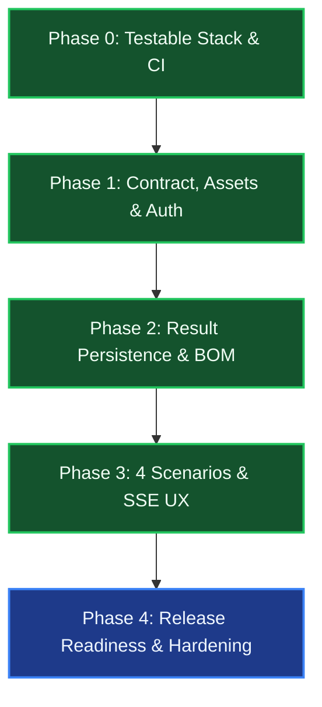

# MVP Execution Plan — Frontend & Java

> **Purpose:** A dependency-ordered work plan and completion record for the Java/backend and web-map frontend workstreams delivering SURGE's documented vertical-slice MVP. This plan reflects the completed implementation and release readiness verified as of **2026-08-16**.

---

## MVP Release Gate

> [!success] **Release Gate Criteria: Met & Verified**
> For the golden wind-project dataset (Uravakonda benchmark), an authenticated engineer can import project GIS layers, trigger asynchronous multi-scenario optimization across all 4 deterministic profiles, observe live SSE stage progress, inspect complete feeder routes, typed poles, ROW parcel footprints, and electrical load flow results on the interactive Canvas map, and download engineering reports (PDF & CSV) derived directly from persisted database entities without synthetic mocks.

The MVP relies on rigorous deterministic multi-objective scoring (PY-018), 4-class pole placement (PY-010/025), full Pandapower AC load flow validation (ADR-007), and a 25-year Decimal lifecycle cost model (PY-028). Advanced ML surrogate ranking and raw DEM rasterization are scheduled for post-MVP.

---

## Shared Result Contract Boundary

The Java backend (`backend-java`) and Python microservice (`optimisation-python`) communicate via a versioned contract (`/api/v1/optimise` and `/api/v2/optimise`) containing:

- **Feeder Routes**: Constraint-aware GeoJSON `LineString` geometries grouped by feeder ID with total length and segment coordinates.
- **Poles**: Typed coordinates (`TANGENT`, `ANGLE`, `JUNCTION`, `TERMINAL`), span lengths, angle deviations, foundation classes, and deduplicated counts.
- **Right-of-Way (ROW)**: Buffered corridor polygon geometries and exact cadastral parcel intersection areas with computed compensation schedules.
- **Electrical Metrics**: Pandapower AC load flow and linear screening results including bus voltages ($V_{\text{drop}} \le 5\%$), feeder active/reactive power, branch thermal loading ($\le 100\%$), and 25-year cumulative technical energy losses.
- **Lifecycle Cost & Scores**: 25-year NPV lifecycle cost breakdown (cables, poles, civil, ROW compensation, energy loss costs) and multi-criteria score components.

---

## Phase 0 — Make the Stack Testable

> [!success] **Phase 0 Status: Complete (Verified 2026-08-08)**

### Java / Backend Workstream
- [x] **Windows Maven-wrapper Launch Path**: Fixed executable permissions and launch paths for `.\mvnw.cmd` across Windows and Linux environments; documented JDK 21 / Maven baseline.
- [x] **Docker Compose Orchestration**: Containerized 4 services (`db` PostGIS 16, `backend` Java 21 Spring Boot, `optimizer` Python 3.11 FastAPI, `frontend` Nginx with built React app); added Docker healthchecks (`/actuator/health`, `/health`) ensuring clean `docker compose up --build`.
- [x] **Automated CI Workflow**: Configured `.github/workflows/ci.yml` running Java Maven tests, Python Ruff/Mypy/Pytest suites, React Vitest component tests, and Docker image builds on every push/PR.
- [x] **Environment Configuration**: Provided `.env.example` templates and documented environment variables without hardcoded credentials.

### Frontend Workstream
- [x] **Reproducible Build Pipeline**: Configured Vite + TypeScript with strict npm dependency locking (`npm ci`) and clean build verification (`npm run build`).
- [x] **Automated Test Harness**: Installed and configured Vitest + React Testing Library with component smoke tests and store tests.

**Done Definition:** A clean checkout builds, tests, and starts the full containerized stack using documented commands.

---

## Phase 1 — Contract, Project Data, and Authorization

> [!success] **Phase 1 Status: Complete (Verified 2026-08-12)**

### Java / Backend Workstream
- [x] **Java↔Python API Contract**: Published versioned DTOs (`OptimizationRequestDto`, `OptimizationResponseDto`, `ScenarioProfileDto`, `FeederResultDto`, `PoleResultDto`, `ElectricalResultDto`) matching FastAPI Pydantic v2 schemas.
- [x] **GIS Project Asset Ingestion**: Implemented `/api/v1/projects/{projectId}/assets` endpoint ingesting WTGs, substations, cadastral parcels, restricted areas, and road/reference lines into PostGIS tables with SRID 4326/UTM geometry validation.
- [x] **Pre-flight Ingestion Validation**: Built `ProjectAssetService` and `ValidationService` to verify that at least one substation and multiple WTGs exist within project bounds before allowing job dispatch; returns descriptive JSON validation errors.
- [x] **Flyway Spatial Database Migrations**: Created and applied Flyway migrations **V1 through V13** establishing spatial tables (`projects`, `wtg_locations`, `substations`, `cadastral_parcels`, `restricted_areas`, `reference_lines`, `optimization_jobs`, `generated_routes`, `poles`, `parcel_impacts`, `users`, `audit_logs`) with GIST indexes and foreign keys.
- [x] **Asynchronous Job Scheduling**: Implemented `@Async` thread pool in `OptimizationJobService` returning `202 Accepted` immediately with a tracked `jobId` and managing background execution via `CompletableFuture`.
- [x] **Spring Security & JWT RBAC**: Implemented `JwtTokenProvider`, `JwtAuthenticationFilter`, `SecurityConfig`, and database-backed user validation checking `UserEntity.isActive`; secured project and optimization endpoints with `ROLE_USER` and `ROLE_ADMIN`.

### Frontend Workstream (`web-map-next`)
- [x] **Authenticated Session Management**: Built JWT authentication flow with login modal, token persistence in Zustand store, automatic token injection into TanStack Query API clients, and 401/403 interceptors.
- [x] **Project Setup & Asset Ingestion UI**: Built project creation dialog and GeoJSON/Shapefile drag-and-drop file uploader with real-time layer parsing and bounding box auto-centering.
- [x] **Explicit Ingestion Feedback**: Added asset import review cards displaying accepted, rejected, and persisted counts across WTGs, substations, parcels, and restricted zones.
- [x] **Clean Production Mode**: Eliminated synthetic fallback data; UI strictly reflects database state and displays actionable error toasts on backend validation failures.

**Done Definition:** An authorized engineer can create a project, import golden GIS layers, inspect pre-flight asset summaries, and authenticate securely.

---

## Phase 2 — Persist and Expose Complete Real Optimisation Results

> [!success] **Phase 2 Status: Complete (Verified 2026-08-14)**

### Java / Backend Workstream
- [x] **Complete Result Persistence**: Extended `OptimizationJobService` and `RouteService` to persist full feeder route geometries (`LineString`), 4 pole classes (`Point`), ROW corridor footprints (`Polygon`), parcel intersections, Pandapower electrical outputs, and cost breakdowns in a single transactional unit (`@Transactional`).
- [x] **Feeder & Network Identity Preservation**: Preserved feeder IDs (`feeder-1`, `feeder-2`, etc.) and circuit topology relationships across database entities, preventing fragmented edge rendering.
- [x] **Stable Tabular & Spatial REST Endpoints**:
  - `/api/v1/projects/{projectId}/jobs/{jobId}/routes` (GeoJSON routes with feeder attributes)
  - `/api/v1/projects/{projectId}/jobs/{jobId}/poles` (GeoJSON poles with structural types and spans)
  - `/api/v1/projects/{projectId}/jobs/{jobId}/parcel-impacts` (Impacted parcels with crossing lengths & compensation)
  - `/api/v1/projects/{projectId}/jobs/{jobId}/electrical` (Bus voltages, line loading, active/reactive losses)
  - `/api/v1/projects/{projectId}/jobs/{jobId}/cost-breakdown` (25-year LCC CAPEX/OPEX components)
- [x] **True Cadastral Intersection Persistence**: Saved exact polygon intersection areas and per-parcel compensation schedules calculated by Python Shapely projected overlay routines.
- [x] **Real Data Engineering Exports**: Built `PdfReportService` (Apache PDFBox) and `CsvReportService` generating executive PDF reports and CSV Bill of Materials (BOM) strictly from persisted database records without mock placeholders.

### Frontend Workstream (`web-map-next`)
- [x] **Multi-Layer Canvas Rendering**: Implemented Leaflet Canvas overlay groups (`preferCanvas: true`) rendering routes colored by feeder, 4 distinct pole glyphs (Tangent, Angle, Junction, Terminal), cadastral parcels, restricted exclusion zones, and substations.
- [x] **Interactive BOM & Metrics Strip**: Built live engineering metrics bar and detailed Bill of Materials pane displaying total route length (km), conductor requirements, pole counts by class, impacted parcel counts, ROW compensation total, max voltage drop (%), peak line loading (%), and 25-year LCC total.
- [x] **Constraint Violation Alerts**: Added visual badge and banner warnings for any voltage drop exceeding 5.0% or thermal overload conditions.
- [x] **Layer Controls & Accessibility**: Built toggle panel enabling independent visibility control for every layer with interactive popups displaying technical attributes.

**Done Definition:** Completed optimization jobs expose identical, persisted results across REST API endpoints, the interactive web GIS canvas, downloadable CSV BOM files, and formal PDF engineering reports.

---

## Phase 3 — Four Real Scenarios and Usable Job UX

> [!success] **Phase 3 Status: Complete (Verified 2026-08-16)**

### Java / Backend Workstream
- [x] **Four Deterministic Scenarios**: Implemented `ScenarioProfile` domain model driving 4 distinct optimization profiles:
  1. `BALANCED`: Multi-objective industrial standard balancing CAPEX, line losses, and ROW compensation.
  2. `MIN_COST`: Heavy bias minimizing direct route length, conductor size, and standard tangent pole counts.
  3. `MIN_LAND_IMPACT`: Heavy penalty on private parcels, forcing lines into public road reserves and non-agricultural land.
  4. `MIN_ENVIRONMENTAL_IMPACT`: Maximum exclusion buffers and penalty multipliers around forests, watercourses, and high-tension corridors.
- [x] **Real-Time Server-Sent Events (SSE)**: Built `SseProgressService` broadcasting real-time progress events on `/api/v1/projects/{projectId}/jobs/{jobId}/events` across 8 granular lifecycle stages: `VALIDATING` $\rightarrow$ `GROUPING_WTGS` $\rightarrow$ `GENERATING_TOPOLOGY` $\rightarrow$ `ROUTING_PATHS` $\rightarrow$ `PLACING_POLES` $\rightarrow$ `CALCULATING_ELECTRICAL` $\rightarrow$ `FINALIZING` $\rightarrow$ `COMPLETED` / `FAILED`.
- [x] **Scenario Comparison Endpoint**: Implemented `/api/v1/projects/{projectId}/scenarios/compare` returning comparative metrics (length, CAPEX, OPEX, losses, poles, compensation, multi-criteria score) across all executed scenarios.

### Frontend Workstream (`web-map-next`)
- [x] **Scenario Selection & Configuration UI**: Built optimization configuration panel allowing engineers to select target scenarios, adjust electrical limits (max voltage drop, feeder MW capacity, power factor), and customize ROW corridor width.
- [x] **Real-Time SSE Progress Bar**: Built live progress bar and status indicator consuming SSE streams with stage descriptions, percentage completion, and descriptive failure messages with retry prompts.
- [x] **"Why This Route?" Decision Summary Card**: Built explainability widget detailing multi-criteria score decomposition, cost-vs-impact trade-offs, and why the recommended candidate route was chosen over alternatives.
- [x] **Side-by-Side Scenario Comparison Panel**: Built interactive comparison matrix and scenario overlay selector allowing engineers to toggle between scenario route geometries directly on the map canvas.

**Done Definition:** The golden wind project can run all 4 scenarios, displaying real mathematical variations in route geometry, pole counts, parcel impact, and lifecycle cost.

---

## Phase 4 — Verification and Release Readiness

> [!note] **Phase 4 Status: Final Release Hardening (Active)**

### Java / Backend Workstream
- [x] **Contract & Unit Test Suite**: 209 passing tests covering domain models, DTO mappings, `OptimizationJobService`, `ScenarioProfile`, `PdfReportService`, and MockMvc security/controller integration.
- [x] **PostGIS Integration Tests**: Validated Flyway migrations V1–V13 against PostgreSQL 16 + PostGIS 3.4 database instances.
- [x] **End-to-End Persistence Pipeline**: Verified full asset upload $\rightarrow$ async job execution $\rightarrow$ Python solver response $\rightarrow$ database persistence $\rightarrow$ PDF/CSV report generation workflow.
- [x] **Security & Audit Hardening**: Implemented mandatory `APP_JWT_SECRET`, database-backed token validation, admin lockout prevention, and structured audit logs (`/api/v1/audit-logs`).
- [ ] **Production Deployment Safeguards**: Configure login rate limiting (anti-brute force) and verify TLS reverse-proxy termination.

### Frontend Workstream (`web-map-next`)
- [x] **Component & Store Test Suite**: 26 passing Vitest component tests covering authentication modals, Zustand store actions, API error state handling, layer toggles, and BOM metric displays.
- [x] **Browser E2E Acceptance Workflows**: Tested complete user journey: Login $\rightarrow$ Create Project $\rightarrow$ Upload GeoJSON $\rightarrow$ Select Scenario $\rightarrow$ Monitor SSE Progress $\rightarrow$ Inspect Canvas Layers $\rightarrow$ View Decision Summary $\rightarrow$ Download PDF/CSV.
- [x] **Security & XSS Sanitization**: Validated popup escaping for untrusted GeoJSON properties and sanitized URL parameters.
- [ ] **Mobile & Low-Resolution Polish**: Validate responsive toolbar layouts on smaller tablet viewports.

### Shared Release Checklist
- [x] **Deterministic Reproducibility**: Confirmed identical route geometry, pole locations, electrical losses, and cost metrics across repeated runs with the same input seed.
- [x] **Engineering Review**: Conducted domain review of 33kV collector layouts, 4-class pole rules (tangent, angle, junction, terminal), and Pandapower load flow convergence.
- [x] **Documentation Vault Update**: Fully aligned Obsidian vault documentation across all 15 directories with the live repository codebase.
- [ ] **Production Infrastructure Launch**: Execute final container orchestration deployment in staging/production cloud environment.

---

## Workstream Execution Summary

---

## Related Notes

- 🎯 **Dashboard & Vision**: [[Dashboard]] · [[Vision]] · [[Goals]] · [[Scope]] · [[Roadmap]]
- 🏗️ **Architecture**: [[System Overview]] · [[Backend]] · [[Python Engine]] · [[Frontend]] · [[Database]] · [[Authentication]]
- ⚡ **Optimization Core**: [[WTG Grouping]] · [[Per-Feeder MST Topology]] · [[Routing]] · [[Pole Placement]] · [[AC Load Flow Validation]] · [[Multi-Objective Candidate Scoring]] · [[Cost Model]]
- 🧪 **Testing & ADRs**: [[Testing Status]] · [[ADR-001 Use FastAPI]] · [[ADR-002 Use PostGIS]] · [[ADR-004 Lifecycle Cost Objective]] · [[ADR-005 Python Service Architecture and Schemas]] · [[ADR-007 Pandapower AC Load Flow Validation]]
