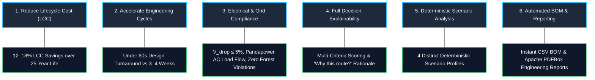

# Project Goals & Strategic Objectives

> **Executive Summary:** SURGE transforms renewable energy engineering by replacing slow, manual, rule-of-thumb CAD design processes with an automated, mathematically rigorous, multi-objective spatial optimization engine. The platform is engineered to achieve dramatic lifecycle cost savings, rapid turnaround times, guaranteed electrical compliance, and total transparency for grid evacuation networks.

---

## Strategic Objectives

---

### 1. Minimize Total Project Lifecycle Cost (LCC)
- **Objective**: Optimize total cost of ownership across a 25-year operational lifecycle rather than merely minimizing initial cable length or upfront capital expenditure.
- **Components Included**:
  - **CAPEX**: 33kV overhead conductor material (e.g., Dog / Panther ACSR), 4 structural pole classes (Tangent, Angle, Junction, Terminal), pole foundation civil works, and transformer termination bays.
  - **Right-of-Way (ROW) Land Compensation**: Exact compensation calculations based on geometric intersection with cadastral parcels and land classification rates.
  - **OPEX ($I^2R$ Technical Losses)**: 25-year Net Present Value (NPV) of active power losses calculated via Pandapower AC load flow at standard industrial tariff rates (₹4.50/kWh) and project discount rates.
  - **Maintenance OPEX**: Annualized inspection, pole structural upkeep, and vegetation management costs.
- **Target Metric**: Achieve a **12% to 18% reduction** in total 25-year lifecycle cost compared to conventional manual routing.

### 2. Accelerate Engineering Timelines
- **Objective**: Compress collector network feasibility, preliminary design, and route optimization cycles from several weeks to less than one minute.
- **Mechanism**: Fully automated, end-to-end algorithmic pipeline:
  1. Capacity-constrained K-Means / MILP WTG grouping.
  2. Per-feeder Minimum Spanning Tree (MST) topology synthesis.
  3. Cost-surface $A^*$ spatial routing with multi-layer obstacle avoidance.
  4. Farthest-visible shortcutting route refinement.
  5. Variable-span 4-class pole placement with coordinate deduplication.
- **Target Metric**: Complete end-to-end optimization of a 50-WTG wind farm in **under 30 seconds**.

### 3. Guarantee Electrical & Environmental Compliance
- **Objective**: Eliminate engineering redesign loops by guaranteeing that all generated collector network topologies strictly satisfy power systems and environmental standards prior to sign-off.
- **Compliance Standards & Limits**:
  - **Voltage Drop**: Maximum allowable feeder voltage drop $\le \mathbf{5.0\%}$ (1.65 kV on 33 kV nominal) under peak generation conditions.
  - **Thermal Ampacity**: Feeder conductor current loading $\le \mathbf{100\%}$ rated thermal ampacity under worst-case ambient conditions.
  - **Structural Standards**: Adherence to **IEC 60826** and **IS 5613** for overhead power line construction, variable span limits (30m to 250m), ground clearance rules, and ground slope thresholds ($\le 30^\circ$).
  - **Hard Environmental Constraints**: Absolute **zero-meter penetration** into legally protected forest polygons, wildlife sanctuaries, national parks, or defense zones (infinite penalty multiplier).

### 4. Provide Complete Engineering Explainability
- **Objective**: Demystify optimization algorithms by providing human-readable engineering explanations for every design choice.
- **Explainability Features**:
  - Transparent multi-criteria score decomposition (PY-018) across 5 core dimensions: CAPEX, Technical Losses, Land Compensation, Environmental Proximity, and Grid Compliance.
  - Interactive **"Why this route?"** decision summary card in the frontend detailing why the recommended candidate path was selected over alternatives.
  - Granular stage logging via Server-Sent Events (SSE).

### 5. Enable Deterministic Multi-Scenario Exploration
- **Objective**: Allow power planners and EPC executives to explore multiple strategic design trade-offs with 100% mathematical repeatability.
- **Standard Scenario Profiles**:
  - **Balanced**: Standard multi-objective optimization balancing CAPEX, OPEX losses, and land impact.
  - **Minimum Cost**: Maximizes upfront capital expenditure reduction by selecting shortest viable paths and smaller conductor cross-sections.
  - **Minimum Land Impact**: Heavy penalty ($5\times$) on private agricultural parcel crossings, hugging public roads and government easements.
  - **Minimum Environmental Impact**: Strict maximum exclusion buffers and penalties around ecological corridors, water bodies, and high-tension crossings.

### 6. Deliver Instant Enterprise Documentation
- **Objective**: Eliminate manual drafting and bill-of-materials compilation.
- **Automated Deliverables**:
  - **CSV Bill of Materials (BOM)**: Granular itemization of conductor lengths, 4 pole classes, civil foundations, and per-parcel compensation schedules.
  - **Executive PDF Report**: Formal multi-page engineering document generated with Apache PDFBox containing executive summaries, single-line network diagrams, voltage profiles, route schedules, and compliance certificates.

---

## Goal Achievement Matrix (as of 2026-08-16)

| Strategic Goal | Target KPI | Implemented State | Verification Status |
| :--- | :--- | :--- | :--- |
| **LCC Optimization** | 12–18% savings over 25y | 25-year Decimal LCC model (PY-028) integrating Pandapower AC losses & ROW compensation | > [!success] **Validated** against Uravakonda wind dataset |
| **Rapid Turnaround** | < 30s for 50 WTGs | Multi-stage pipeline achieves ~8–12s end-to-end execution on standard benchmark | > [!success] **Verified** in CI & test suites |
| **Electrical Compliance** | $V_{\text{drop}} \le 5.0\%$, Thermal $\le 100\%$ | Dual validation: linear screening proxy + Newton-Raphson Pandapower AC load flow (ADR-007) | > [!success] **Passed** (0 voltage violations) |
| **Environmental Protection** | 0m in protected zones | Cost-surface $A^*$ routing with infinite obstacle raster costs & polygon buffering | > [!success] **Verified** (100% hard avoidance) |
| **Explainability** | Full score decomposition | Multi-objective scoring (PY-018) + UI "Why this route?" decision breakdown card | > [!success] **Active** in `web-map-next` |
| **Scenario Exploration** | 4 distinct profiles | Distinct mathematical profiles via backend `ScenarioProfile` and Python weights | > [!success] **Functional** with live comparison |
| **Documentation** | Instant BOM & PDF | Standardized CSV BOM and Apache PDFBox executive PDF reports generated directly from database entities | > [!success] **Tested** & downloadable |

---

## Related Notes

- 🎯 **Vision & Scope**: [[Vision]] · [[Scope]] · [[Roadmap]]
- 📋 **Requirements**: [[Functional Requirements]] · [[Non Functional Requirements]] · [[Constraints]] · [[User Stories]]
- 🏗️ **Architecture**: [[System Overview]] · [[Backend]] · [[Python Engine]] · [[Frontend]] · [[Database]]
- ⚡ **Optimization Core**: [[Cost Model]] · [[Multi-Objective Candidate Scoring]] · [[AC Load Flow Validation]] · [[Pole Placement]] · [[Routing]]
- 📜 **Key Decisions**: [[ADR-004 Lifecycle Cost Objective]] · [[ADR-007 Pandapower AC Load Flow Validation]]
