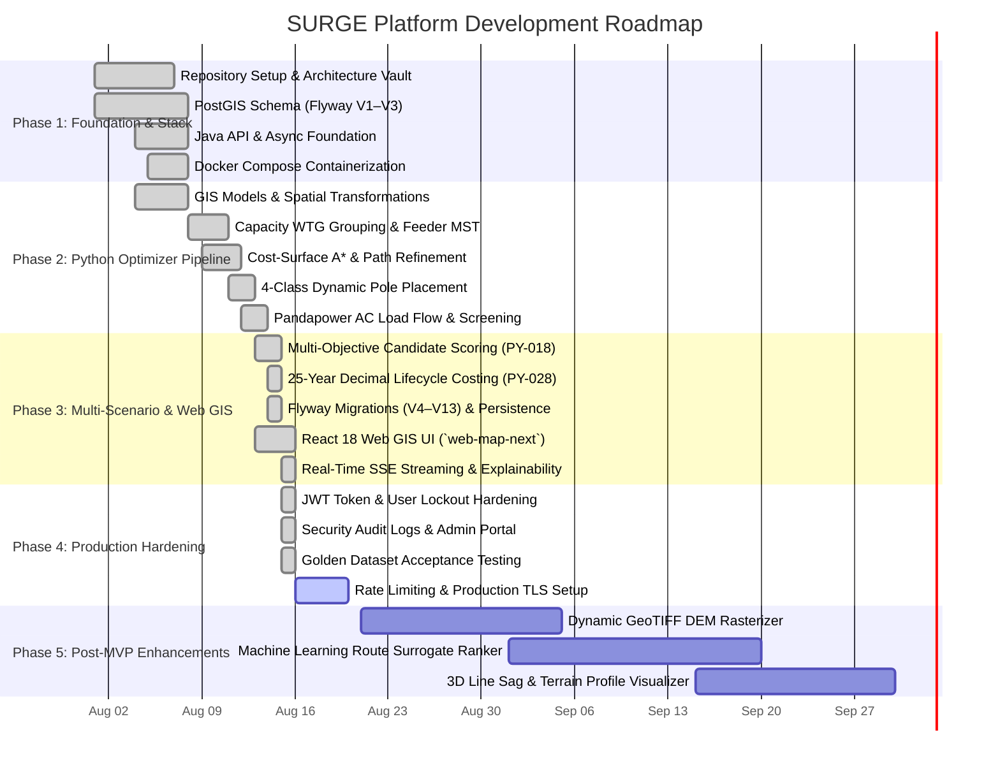

# Development Roadmap

> **Current Status (2026-08-16):** Phases 1 through 3 are fully completed and verified against the golden Uravakonda wind farm dataset. Phase 4 (Production Readiness & Security Hardening) is in the final release stages, while Phase 5 outlines planned post-MVP capabilities.

---

## Master Development Timeline

---

## Detailed Milestone Delivery Summary

### Milestone 1: Core Architecture, Database & Baseline Containerization
> [!success] **Completed: 2026-08-08**
- **Database & Spatial Storage**: Deployed PostgreSQL 16 + PostGIS 3.4 with Flyway migrations establishing spatial schemas with GIST indexing and WGS84 (`SRID 4326`) geometry constraints.
- **Java Orchestrator Baseline**: Spring Boot 3.3.2 application foundation with project entity CRUD, DTO validation, and basic REST endpoints.
- **Python Microservice Baseline**: FastAPI microservice with Pydantic v2 schemas and health probes.
- **DevOps Baseline**: Multi-container Docker Compose file (`docker-compose.yml`) orchestrating 4 services with integrated healthchecks and automated CI workflow in `.github/workflows/ci.yml`.

### Milestone 2: Algorithmic Routing, Pole Placement & Electrical Validation
> [!success] **Completed: 2026-08-12**
- **Spatial Preprocessing**: Automatic EPSG UTM zone projection (`EPSG:32643` / `EPSG:32644`), geometry buffering, and multi-layer avoidance boundaries (roads, watercourses, high-tension lines, forest parcels).
- **WTG Grouping**: Capacity-constrained clustering via balanced K-Means and Mixed-Integer Linear Programming (MILP).
- **Network Topology**: Per-feeder radial Minimum Spanning Tree (MST) topology generation.
- **Spatial Pathfinding**: Cost-surface $A^*$ grid pathfinding with farthest-visible shortcutting line refinement.
- **Structural Pole Engineering**: Variable-span pole placement algorithm supporting 4 classes (Tangent, Angle, Junction, Terminal) with slope checks ($\le 30^\circ$) and coordinate deduplication.
- **Electrical Verification**: Newton-Raphson Pandapower AC load flow simulation and linear electrical screening enforcing $V_{\text{drop}} \le 5.0\%$ and thermal limits.

### Milestone 3: Multi-Scenario Engine, Full Lifecycle Costing & Modern Web GIS
> [!success] **Completed: 2026-08-16**
- **4 Real Deterministic Scenarios**: Implemented `ScenarioProfile` domain model driving distinct mathematical outcomes: Balanced, Minimum Cost, Minimum Land Impact, and Minimum Environmental Impact.
- **Multi-Objective Scoring & Explainability**: PY-018 weighted score decomposition, canonical candidate engineering metrics (PY-026), and frontend "Why this route?" decision breakdown card.
- **High-Precision Lifecycle Costing (PY-028)**: 25-year `Decimal` LCC calculation incorporating CAPEX (cables, 4 pole classes, civil works), ROW parcel compensation, and NPV of technical line losses.
- **Database Schema Expansion**: Applied Flyway migrations **V4 through V13** to persist poles, parcel impacts, electrical results, and user audit trails.
- **Modern Web GIS UI (`web-map-next`)**: Built complete React 18 + TypeScript + Vite + Leaflet Canvas client with TanStack Query v5, Zustand v4, Radix UI modals, interactive BOM pane, and real-time SSE progress streaming.
- **Enterprise Reporting**: Apache PDFBox executive PDF engineering report generation and CSV Bill of Materials export.

### Milestone 4: Security Hardening & Release Verification (Current)
> [!note] **Active: Target Completion 2026-08-20**
- **Security Hardening**: Enforced mandatory `APP_JWT_SECRET`, database-backed token active checks, admin lockout protection, and structured audit logs (`/api/v1/audit-logs`).
- **Comprehensive Quality Assurance**: Verified 209 Java backend tests, ~489 Python optimizer tests, and 26 frontend Vitest tests.
- **Golden Benchmark Acceptance**: End-to-end verification against real Uravakonda wind survey dataset.
- **Remaining Production Tasks**: Configure login rate limiting, TLS reverse proxy termination, and KMZ upload parser hardening.

### Milestone 5: Post-MVP & Next-Gen Capabilities (Future)
> [!tip] **Planned: Q3 / Q4 2026**
- **Real-Time DEM Rasterizer**: Dynamic on-the-fly GeoTIFF digital elevation model processing for continuous slope cost surfaces.
- **ML Route Surrogate Ranker**: Deep learning heuristic model trained on historical EPC wind farm topologies to accelerate candidate generation.
- **3D Terrain & Sag Visualizer**: WebGL/Three.js 3D profile viewer showing conductor catenary sag, tower heights, and minimum ground clearance under maximum ambient temperatures.
- **Ring / Mesh Collector Topology**: Support for looped collector configurations with automated tie-breaker switchgear placement.

---

## Related Notes

- 🎯 **Vision & Goals**: [[Vision]] · [[Goals]] · [[Scope]]
- 📋 **Requirements**: [[Functional Requirements]] · [[Non Functional Requirements]] · [[Constraints]]
- 🏗️ **Architecture**: [[System Overview]] · [[Backend]] · [[Python Engine]] · [[Frontend]] · [[Database]]
- 🧪 **Testing Status**: [[Testing Status]] · [[MVP Execution Plan - Frontend & Java]]
- 📜 **ADRs**: [[ADR-001 Use FastAPI]] · [[ADR-004 Lifecycle Cost Objective]] · [[ADR-007 Pandapower AC Load Flow Validation]]
