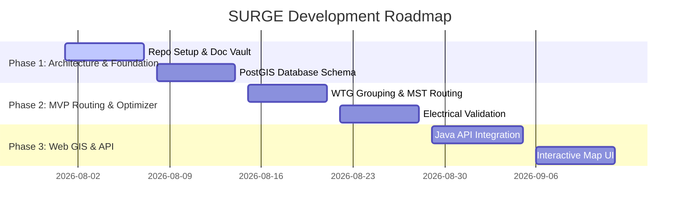

# Development Roadmap

---

## Milestones
- **Milestone 1**: Foundation & Optimization Core
- **Milestone 2**: Electrical & Cadastral Verification
- **Milestone 3**: Web UI & Scenario Comparison Engine
