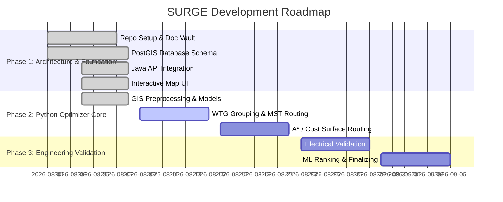

# Development Roadmap

---

## Milestones
- **Milestone 1**: Foundation, Database, API, & Web UI (Completed ahead of schedule on 2026-08-08)
- **Milestone 2**: Optimization Core (WTG Grouping, Spatial Routing, Terrain analysis)
- **Milestone 3**: Electrical Verification, Scenarios, and ML Ranking
