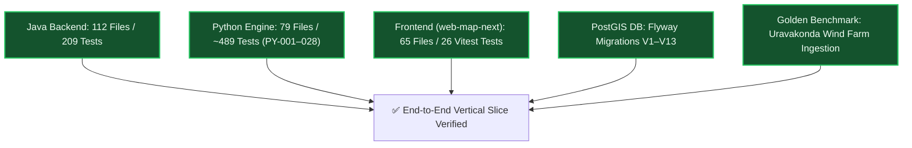

# Project Scope & Delivery Boundary

> **Current Delivery State (as of 2026-08-16):** The SURGE platform provides a complete, working, end-to-end vertical-slice MVP verified against real-world GIS survey data from the Uravakonda wind project benchmark. All core architectural layers — PostGIS spatial database (Flyway V1–V13), Spring Boot 3.3.2 backend orchestrator (112 source files, 209 tests), FastAPI Python 3.11 optimization engine (79 source files, ~489 tests), and React 18 / TypeScript Web GIS client (`web-map-next`, 65 source files, 26 tests) — are fully operational and containerized in Docker Compose.

---

## Scope Overview

```mermaid
graph LR
    classDef inScope fill:#14532d,stroke:#22c55e,stroke-width:2px,color:#f0fdf4;
    classDef outScope fill:#450a0a,stroke:#ef4444,stroke-width:2px,color:#fef2f2;

    subgraph IN["✅ In Scope (MVP & Production Baseline)"]
        IN1["Radial 33kV Feeder Routing"]:::inScope
        IN2["Multi-Layer GIS Ingestion (WGS84 & UTM)"]:::inScope
        IN3["Capacity WTG Grouping (K-Means/MILP)"]:::inScope
        IN4["Cost-Surface A* & Path Refinement"]:::inScope
        IN5["4-Class Variable Span Pole Placement"]:::inScope
        IN6["ROW Corridor & Cadastral Compensation"]:::inScope
        IN7["Pandapower AC Load Flow & Screening"]:::inScope
        IN8["4 Real Deterministic Scenarios"]:::inScope
        IN9["25-Year Decimal LCC Model (PY-028)"]:::inScope
        IN10["React 18 Canvas Web GIS (web-map-next)"]:::inScope
        IN11["Real-Time SSE Job Progress Streaming"]:::inScope
        IN12["JWT Security, RBAC & Audit Logging"]:::inScope
        IN13["CSV BOM & Apache PDFBox Reports"]:::inScope
    end

    subgraph OUT["⏳ Out of Scope (Post-MVP & Future Phases)"]
        OUT1["Ring / Meshed Network Routing"]:::outScope
        OUT2["Dynamic Real-Time Weather Degradation"]:::outScope
        OUT3["3D CAD / BIM Export (DXF / IFC)"]:::outScope
        OUT4["Real-Time Raw GeoTIFF DEM Rasterizer"]:::outScope
        OUT5["Machine Learning Heuristic Surrogate Ranker"]:::outScope
    end
```

---

## In Scope (MVP Baseline — Delivered & Operational)

### 1. Geospatial Ingestion & Coordinate Transformations
- Ingestion of wind turbine generator (WTG) point coordinates, substation terminal locations, cadastral parcel boundaries, environmental exclusion zones, roads, and high-tension (HT) transmission lines via GeoJSON, Shapefile, and PostGIS.
- Automatic spatial transformation between global WGS84 coordinates (`EPSG:4326`) and local projected Universal Transverse Mercator (UTM) metric coordinate systems (`EPSG:32643` / `EPSG:32644`) for high-precision Euclidean distance, area, and buffer operations.

### 2. Algorithmic Collector Network Optimization
- **Capacity-Constrained WTG Grouping**: Automated clustering of turbines into feeder circuits using balanced K-Means and Mixed-Integer Linear Programming (MILP), strictly enforcing feeder capacity limits (e.g. MW or current limits).
- **Per-Feeder MST Topology**: Construction of radial feeder tree topologies minimizing overall graph distance.
- **Cost-Surface Spatial Pathfinding**: $A^*$ heuristic grid pathfinding operating on multi-layer friction surfaces that incorporate terrain slope penalties and avoidance buffers (roads, watercourses, existing HT lines, private parcels, and forest zones).
- **Geometric Path Refinement**: Farthest-visible shortcutting algorithm eliminating zigzag grid artifacts while strictly preserving obstacle clearance.

### 3. Structural Pole Engineering & Variable Spans
- **Dynamic 4-Class Pole Classification**: Automated placement and structural typing of transmission poles:
  - **Tangent / Suspension**: Standard straight-line alignment ($\text{deflection} \le 5^\circ$).
  - **Angle / Tension**: Line deflection angles between $5^\circ$ and $60^\circ$ requiring structural guy wires/strain insulators.
  - **Junction**: Branching nodes where multiple feeder lines merge.
  - **Terminal / Dead-End**: Termination structures at WTG step-up transformers and substation gantries.
- **Variable Span Logic**: Terrain-aware spans (30m minimum to 250m maximum), ground slope foundation constraints ($\le 30^\circ$), and pairwise coordinate deduplication.

### 4. Right-of-Way (ROW) & Cadastral Parcel Intelligence
- Automatic buffering of route centerlines to generate standard 18.0m 33kV Right-of-Way (ROW) corridor polygons.
- Exact geometric spatial overlay with cadastral parcel boundaries.
- Per-parcel intersection area calculation and automated crop/land acquisition compensation schedules based on land valuation classifications.

### 5. Electrical Simulation & Grid Compliance
- **Linear Feeder Screening**: Fast deterministic voltage drop and thermal capacity calculations.
- **Pandapower AC Load Flow (ADR-007)**: Full Newton-Raphson AC power flow simulation calculating exact bus voltages ($V_{\text{drop}} \le 5.0\%$), branch current loadings ($\le 100\%$), and 25-year cumulative technical active/reactive energy losses.

### 6. Multi-Scenario Exploration & 25-Year Lifecycle Costing
- **4 Distinct Deterministic Scenarios**: Mathematical differentiation across 4 profiles (Balanced, Minimum Cost, Minimum Land Impact, Minimum Environmental Impact) driven by `ScenarioProfile` biases.
- **25-Year Decimal LCC Model (PY-028)**: High-precision lifecycle cost modeling calculating CAPEX (conductors, poles, civil works), ROW compensation, and Net Present Value (NPV) of energy losses at industrial discount rates and tariffs (₹4.50/kWh).
- **Multi-Objective Scoring & Explainability (PY-018)**: Multi-criteria score decomposition and "Why this route?" engineering rationale.

### 7. Modern Web GIS Frontend (`web-map-next`)
- Built with React 18, TypeScript, Vite, Leaflet Canvas (`preferCanvas: true`), TanStack Query v5, Zustand v4, Radix UI primitives, and Tailwind CSS v3.
- Features: Real-time Server-Sent Events (SSE) progress bar, feeder-colored route paths, 4-class pole glyphs, interactive BOM pane, scenario comparison matrix, and admin management tabs. (Legacy vanilla JS `web-map` is preserved for historical reference but deprecated).

### 8. Enterprise Security & Reporting
- JWT authentication with database-backed token status checks, account suspension, and admin lockout protection.
- Structured security audit logging (`/api/v1/audit-logs`).
- Automated generation of CSV Bill of Materials (BOM) and Apache PDFBox executive PDF engineering reports.

---

## Out of Scope (Post-MVP & Future Phases)

| Feature | Target Phase | Rationale & Architectural Note |
| :--- | :--- | :--- |
| **Ring / Meshed Network Routing** | Phase 5 | MVP focuses strictly on radial collector topologies standard in wind farms; loop/mesh switchgear optimization requires complex protection relay coordination. |
| **Dynamic Real-Time Weather Degradation** | Phase 5 | Real-time thermal rating (RTTR) based on live ambient temperature/wind velocity is deferred to post-MVP grid integration. |
| **3D CAD / BIM Export (DXF, IFC)** | Phase 5 | MVP provides standardized GeoJSON, CSV, and PDF exports. CAD/BIM integrations will be added via dedicated conversion pipelines. |
| **Real-Time Raw GeoTIFF DEM Rasterizer** | Phase 5 | Dynamic on-the-fly raster slope slicing from raw GeoTIFF files; currently supported via preprocessed cost surfaces and elevation profiles. |
| **Machine Learning Route Surrogate Ranker** | Phase 5 | Heuristic route ranking using deep learning surrogate models trained on EPC historical designs; currently handled by deterministic scoring (PY-018). |

---

## Current Delivery State (Detailed Verification Summary)

- **Python Optimization Microservice**: Completed tickets **PY-001 through PY-028** (covering GIS preprocessing, graph synthesis, WTG grouping, A* routing, path refinement, pole placement, Pandapower load flow, multi-objective scoring, canonical engineering metrics, and Decimal LCC costing). Strict type checking with Mypy and linting with Ruff clean.
- **Java Spring Boot Backend**: 112 source files with 209 unit/integration tests passing. Implements REST APIs, `@Async` executor thread pool, SSE progress service, Spring Security JWT filter, Admin user management, Audit logging, and PDFBox/CSV export services.
- **Web GIS Client (`web-map-next`)**: 65 source files with 26 Vitest component tests passing. Full React 18 SPA with Leaflet Canvas rendering, Radix UI modals, Zustand state management, and real-time SSE consumption.
- **Containerization & CI**: Docker Compose deploys 4 healthy containers with automated verification in GitHub Actions (`.github/workflows/ci.yml`).

---

## Related Notes

- 🎯 **Vision & Roadmap**: [[Vision]] · [[Goals]] · [[Roadmap]]
- 📋 **Requirements**: [[Functional Requirements]] · [[Non Functional Requirements]] · [[Constraints]] · [[User Stories]]
- 🏗️ **Architecture**: [[System Overview]] · [[Backend]] · [[Python Engine]] · [[Frontend]] · [[Database]]
- 🧪 **Testing**: [[Testing Status]] · [[MVP Execution Plan - Frontend & Java]]
- 📜 **ADRs**: [[ADR-001 Use FastAPI]] · [[ADR-004 Lifecycle Cost Objective]] · [[ADR-007 Pandapower AC Load Flow Validation]]
