# SURGE Vision & Core Capabilities

> **Platform Mission:** SURGE is an **AI-powered enterprise platform for renewable-energy collector and grid evacuation systems**, uniting electrical power systems engineering, GIS spatial intelligence, mathematical optimization, and decision explainability.
>
> The platform designs complete, compliant, and cost-optimal 33kV collector networks connecting Wind Turbine Generators (WTGs) to pooling substations while minimizing **total 25-year project lifecycle cost (LCC)**, not merely geometric route distance.

---

## Strategic Value Proposition

```mermaid
graph TD
    classDef cap fill:#1e293b,stroke:#38bdf8,stroke-width:2px,color:#f8fafc;
    classDef val fill:#0f172a,stroke:#22c55e,stroke-width:1px,color:#f0fdf4;

    V["⚡ SURGE Core Engine"]:::cap

    V --> C1["1. Capacity WTG Grouping"]:::cap
    V --> C2["2. Cost-Surface A* Routing"]:::cap
    V --> C3["3. 4-Class Pole Placement"]:::cap
    V --> C4["4. Variable Span Logic"]:::cap
    V --> C5["5. ROW & Cadastral Intelligence"]:::cap
    V --> C6["6. Pandapower AC Load Flow"]:::cap
    V --> C7["7. 25-Year Decimal LCC Model"]:::cap
    V --> C8["8. Multi-Scenario Exploration"]:::cap
    V --> C9["9. Async SSE Orchestration"]:::cap
    V --> C10["10. Automated BOM & PDF Reports"]:::cap

    C1 --- O1["Balanced Feeder MW Loading"]:::val
    C2 --- O2["Zero Restricted Area Encroachment"]:::val
    C3 --- O3["IS 5613 Structural Compliance"]:::val
    C4 --- O4["Slope-Aware Foundation Rules"]:::val
    C5 --- O5["Exact Land Compensation Schedules"]:::val
    C6 --- O6["V_drop ≤ 5.0%, Thermal ≤ 100%"]:::val
    C7 --- O7["12–18% LCC Reduction (CAPEX + OPEX)"]:::val
    C8 --- O8["4 Deterministic Scenario Profiles"]:::val
    C9 --- O9["Live Web GIS Stage Streaming"]:::val
    C10 --- O10["One-Click Enterprise Documentation"]:::val
```

---

## 10 Major Capability Areas

### 1. Intelligent Collector-Network Design & WTG Grouping
- **Algorithmic Clustering**: Automatically groups wind turbine generators into distinct 33kV feeder circuits using capacity-constrained K-Means clustering and Mixed-Integer Linear Programming (MILP).
- **Feeder Balance**: Enforces balanced MW capacity distribution across available circuit breakers and step-up substation bays, preventing feeder over-subscription while minimizing inter-cluster crossing.
- **Topology Synthesis**: Generates optimal radial feeder trees using Minimum Spanning Tree (MST) algorithms, ensuring strictly loop-free radial networks.

### 2. Multi-Objective Cost-Surface Route Optimization
- **Friction Surface Synthesis**: Dynamically constructs 2D spatial cost surfaces combining base terrain friction, slope penalties, and multi-layer avoidance boundaries.
- **Multi-Layer Avoidance**: Seamlessly integrates obstacle layers:
  - **Roads**: Parallel routing along road reserves with perpendicular crossings.
  - **High-Tension (HT) Lines**: Parallel safety clearances and controlled 90° crossings.
  - **Watercourses & Rivers**: Crossing minimization with designated span allowances.
  - **Cadastral Parcels**: Private land penalty multipliers to favor public easements.
  - **Restricted Environmental Zones**: Hard exclusion zones (infinite cost) with zero-meter tolerance.
- **Path Refinement**: Enhances $A^*$ grid paths using farthest-visible shortcutting to eliminate zigzag artifacts while maintaining strict clearance envelopes.

### 3. Intelligent 4-Class Pole Placement & Structural Selection
- **Dynamic Structural Classification**: Places and classifies transmission structures into 4 standard industrial classes:
  - **Tangent / Suspension**: Straight-line spans with line deflection $\le 5^\circ$.
  - **Angle / Tension**: Line deflection angles between $5^\circ$ and $60^\circ$ requiring heavy-duty strain insulators and guy supports.
  - **Junction**: Bifurcation and merging nodes connecting multiple feeder branches.
  - **Terminal / Dead-End**: Heavy termination gantries at WTG transformer pads and substation bay entrances.
- **Pairwise Coordinate Deduplication**: Ensures zero duplicate pole coordinates at branching junctions or WTG step-up terminations.

### 4. Variable Span & Terrain Optimization
- **Adaptive Spans**: Automatically modulates span lengths between 30 meters (minimum clearance) and 250 meters (maximum allowable span) based on ground profile and obstacle crossings.
- **Foundation Slope Constraints**: Flags ground slopes exceeding $30^\circ$ requiring specialized reinforced foundations; restricts standard tangent poles to slopes $\le 15^\circ$.

### 5. Right-of-Way (ROW) & Real Cadastral Intelligence
- **Corridor Buffering**: Computes standard 18.0m Right-of-Way (ROW) corridor polygons (9.0m on either side of the centerline) in projected metric coordinates (`UTM`).
- **Cadastral Spatial Overlay**: Performs exact geometric intersections between ROW corridor polygons and complex, irregular cadastral parcel boundaries.
- **Compensation Scheduling**: Computes parcel-wise crossing lengths, impacted land areas, and financial compensation schedules based on land type (agricultural, commercial, government, barren).

### 6. Rigorous Electrical AC Load Flow Simulation
- **Newton-Raphson AC Simulation (ADR-007)**: Integrates the open-source Pandapower electrical simulation engine to perform full AC power flow analysis.
- **Screening & Compliance**:
  - Voltage profile verification: Ensures maximum feeder voltage drop $\le \mathbf{5.0\%}$ (1.65 kV on 33 kV nominal).
  - Thermal ampacity verification: Ensures conductor current loading $\le \mathbf{100\%}$ of continuous rated ampacity.
  - Technical loss quantification: Computes exact active ($I^2R$) and reactive ($I^2X$) power losses.

### 7. 25-Year High-Precision Lifecycle Cost Modeling (PY-028)
- **High-Precision Financial Model**: Employs Python `Decimal` arithmetic to evaluate the complete Net Present Value (NPV) of collector networks:
  $$\text{LCC} = \text{CAPEX}_{\text{conductors}} + \text{CAPEX}_{\text{poles}} + \text{CAPEX}_{\text{civil}} + \text{Cost}_{\text{ROW}} + \text{NPV}(\text{Technical Energy Losses})_{25\text{y}} + \text{OPEX}_{\text{maint}}$$
- Incorporates industrial electricity tariffs (₹4.50/kWh), inflation, and weighted average cost of capital (WACC) discount rates.

### 8. Explainable Multi-Scenario Exploration
- **4 Deterministic Profiles**: Empowers engineers to evaluate strategic design trade-offs:
  1. **Balanced**: Standard multi-objective balance across all cost and impact factors.
  2. **Minimum Cost**: Maximizes initial capital expenditure reduction.
  3. **Minimum Land Impact**: Heavy penalty on private agricultural land acquisition.
  4. **Minimum Environmental Impact**: Maximum exclusion buffers around sensitive ecological zones.
- **Explainable Decision Rationale**: Transparent multi-criteria score breakdowns (PY-018) and frontend **"Why this route?"** decision cards.

### 9. Real-Time Enterprise Orchestration & Web GIS
- **Modern Web Client (`web-map-next`)**: Built with React 18, TypeScript, Vite, Leaflet Canvas (`preferCanvas: true`), TanStack Query v5, Zustand v4, and Radix UI.
- **Asynchronous Execution & SSE**: Spring Boot `@Async` thread pool streaming real-time stage progress over Server-Sent Events (`/events`).
- **Enterprise Security**: JWT authentication with database-backed token active checks, user administration (`/api/v1/admin/users`), and security audit trails (`/api/v1/audit-logs`).

### 10. Automated Enterprise Documentation & BOM Export
- **One-Click Engineering Reports**: Generates formal, multi-page executive PDF reports using Apache PDFBox containing executive summaries, single-line network diagrams, voltage profiles, route schedules, and compliance certificates.
- **CSV Bill of Materials**: Generates granular CSV exports itemizing conductor lengths, 4-class pole counts, civil excavation volumes, and parcel compensation lists.

---

## Related Notes

- 🎯 **Strategy & Scope**: [[Goals]] · [[Scope]] · [[Roadmap]]
- 📋 **Requirements**: [[Functional Requirements]] · [[Non Functional Requirements]] · [[Constraints]] · [[User Stories]]
- 🏗️ **Architecture**: [[System Overview]] · [[Backend]] · [[Python Engine]] · [[Frontend]] · [[Database]] · [[Authentication]]
- ⚡ **Optimization Details**: [[WTG Grouping]] · [[Per-Feeder MST Topology]] · [[Routing]] · [[Pole Placement]] · [[AC Load Flow Validation]] · [[Multi-Objective Candidate Scoring]] · [[Cost Model]]
- 📜 **Key Decisions**: [[ADR-001 Use FastAPI]] · [[ADR-002 Use PostGIS]] · [[ADR-004 Lifecycle Cost Objective]] · [[ADR-005 Python Service Architecture and Schemas]] · [[ADR-007 Pandapower AC Load Flow Validation]]
