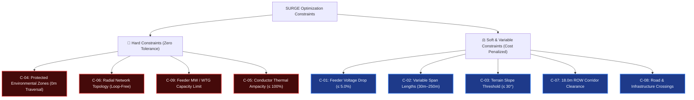

# System & Engineering Constraints

> **Executive Overview:** Engineering constraints in SURGE represent mandatory electrical, physical, structural, environmental, and regulatory boundaries that must be strictly satisfied by the optimization engine. Any candidate network topology violating a hard constraint is disqualified or penalized to infinity.

---

## Engineering Constraints Summary

---

## Detailed Constraint Specifications

### C-01: Maximum Allowable Feeder Voltage Drop
- **Constraint Type**: Hard Electrical Compliance Limit.
- **Specification**: The maximum voltage drop along any 33kV radial feeder path from the substation 33kV busbar to the farthest WTG terminal step-up transformer must not exceed **5.0%** of nominal voltage under peak rated generation:
  $$\Delta V = \frac{|V_{\text{substation}} - V_{\text{WTG, min}}|}{V_{\text{nominal}}} \times 100\% \le 5.0\% \quad (1.65\text{ kV on } 33\text{ kV})$$
- **Regulatory Standard**: Central Electricity Authority (CEA) Technical Standards for Connectivity to the Grid, Clause 6; IEC 60038.
- **Enforcement Mechanism**: Evaluated by both the fast linear electrical screening proxy and the Newton-Raphson Pandapower AC load flow solver (ADR-007). Any candidate topology exceeding 5.0% is flagged with a high-severity violation in the UI and PDF reports.
> [!success] **Implementation Status:** Fully implemented and validated across all scenario profiles in `optimisation-python` and persisted in Java backend `ElectricalResultEntity`.

---

### C-02: Transmission Span Length Limits
- **Constraint Type**: Physical & Structural Limit.
- **Specification**:
  - **Standard Span ($L_{\text{span}}$)**: $100\text{ m} \le L_{\text{span}} \le 250\text{ m}$ for standard 33kV overhead lines on flat/rolling terrain.
  - **Minimum Allowable Span**: $L_{\text{span, min}} = 30\text{ m}$ (to prevent excessive conductor mechanical tension and unneeded pole capex).
  - **Maximum Obstacle Crossing Span**: $L_{\text{span, max}} = 250\text{ m}$ with tension strain insulators.
- **Regulatory Standard**: IS 5613 (Part 1/2) — Code of practice for design, installation, and maintenance of overhead power lines.
- **Enforcement Mechanism**: The variable-span pole placement algorithm (PY-010/PY-025) iteratively places poles along the refined route centerline, strictly keeping inter-pole Euclidean distance within $[30\text{m}, 250\text{m}]$.
> [!success] **Implementation Status:** Implemented in `app.domain.pole_placement` and verified with unit/integration tests.

---

### C-03: Ground Slope Limits & Foundation Rules
- **Constraint Type**: Civil & Geotechnical Foundation Constraint.
- **Specification**:
  - **Standard Tangent Poles**: Anchored on ground slopes $\le 15^\circ$ using standard pre-cast concrete foundations.
  - **Reinforced Foundations**: Ground slopes between $15^\circ$ and $30^\circ$ require reinforced pile foundations and angle guy wires.
  - **Maximum Hard Slope Limit**: Ground slopes $> 30^\circ$ are strictly prohibited for pole placement due to landslide and structural failure risks:
    $$\text{Slope}(\theta) = \arctan\left(\frac{\Delta z}{\Delta d}\right) \le 30^\circ$$
- **Regulatory Standard**: IEC 60826 — Design criteria of overhead transmission lines.
- **Enforcement Mechanism**: $A^*$ spatial router applies exponential cost penalties to steep terrain; pole placement checks ground elevation gradients from DEM data.
> [!success] **Implementation Status:** Slope cost penalties active in cost surface routing; slope limit checks applied in pole placement pipeline.

---

### C-04: Protected Environmental Zones (Hard Exclusion)
- **Constraint Type**: Absolute Spatial Exclusion (Hard Constraint).
- **Specification**: Zero meters ($0.0\text{ m}$) of overhead line traversal or Right-of-Way (ROW) footprint is permitted within legally designated protected areas:
  $$\text{Intersection}(\text{RouteGeometry}, \text{RestrictedPolygons}) = \emptyset$$
  - Excluded categories: Reserve Forests, Wildlife Sanctuaries, National Parks, Wetlands of International Importance (Ramsar), and Defense Corridors.
- **Regulatory Standard**: Forest (Conservation) Act, 1980 & Wildlife Protection Act, 1972.
- **Enforcement Mechanism**: Restricted polygons are assigned an infinite cost ($\infty$) on the routing friction raster. Any candidate path entering these polygons receives an infinite score and is instantly rejected.
> [!success] **Implementation Status:** Fully verified against Uravakonda forest layers; 0m traversal verified across all 4 scenarios.

---

### C-05: Conductor Thermal Ampacity Limit
- **Constraint Type**: Electrical Thermal Limit.
- **Specification**: The continuous operating current ($I_{\text{feeder}}$) flowing through any overhead conductor segment under peak generation and $45^\circ\text{C}$ ambient design temperature must not exceed $100\%$ of the conductor's rated thermal ampacity:
  $$I_{\text{feeder}} \le I_{\text{rated, thermal}} \quad (\text{e.g., Dog ACSR: } \approx 300\text{ A}; \text{ Panther ACSR: } \approx 480\text{ A})$$
- **Regulatory Standard**: IEC 60282 / IS 398 (Part 2) — Aluminum Conductor Steel Reinforced (ACSR).
- **Enforcement Mechanism**: Computed during Pandapower AC load flow simulation. Feeder branches exceeding 100% trigger an overload violation alert.
> [!success] **Implementation Status:** Computed via Pandapower AC load flow and verified in `ElectricalFeederService`.

---

### C-06: Strictly Radial Network Topology
- **Constraint Type**: Topological & Grid Architecture Constraint.
- **Specification**: The 33kV collector network must form a strict radial tree topology (arborescence) with no closed loops or meshed loops:
  $$\text{Cycles}(G_{\text{collector}}) = 0 \quad \text{and} \quad |E| = |V| - 1 \text{ per connected component}$$
- **Rationale**: Wind farm collector systems operate under radial protection schemes (overcurrent and earth fault directional relays) where closed meshes induce uncoordinated tripping.
- **Enforcement Mechanism**: Enforced natively during the per-feeder Minimum Spanning Tree (MST) synthesis stage (PY-006).
> [!success] **Implementation Status:** Verified across all generated feeder graphs.

---

### C-07: Right-of-Way (ROW) Corridor Clearance
- **Constraint Type**: Legal & Safety Clearance Constraint.
- **Specification**: A continuous corridor of width $W_{\text{ROW}} = 18.0\text{ meters}$ (9.0m on either side of the centerline) must be established along the entire line length, maintaining clear separation from permanent habitable structures:
  $$\text{Polygon}_{\text{ROW}} = \text{ST\_Buffer}(\text{RouteCenterline}, 9.0\text{ m})$$
- **Regulatory Standard**: Ministry of Power (MoP) Guidelines for Right of Way and Compensation for Transmission Lines.
- **Enforcement Mechanism**: Computed via Shapely projected polygon buffering in Python and intersected with cadastral parcel boundaries.
> [!success] **Implementation Status:** Implemented in `app.domain.corridor` and displayed on Leaflet Canvas overlay.

---

### C-08: Road & Infrastructure Parallelism and Crossings
- **Constraint Type**: Spatial Routing & Infrastructure Safety Constraint.
- **Specification**:
  - **Parallelism**: Lines following road reserves must maintain a minimum offset buffer ($5.0\text{ m}$ to $10.0\text{ m}$) from the road edge.
  - **Crossing Angle**: Crossings over highways, railways, or existing high-tension transmission lines must occur at an angle as close to perpendicular as possible, strictly between $60^\circ$ and $90^\circ$:
    $$60^\circ \le \theta_{\text{crossing}} \le 90^\circ$$
- **Regulatory Standard**: Indian Electricity Rules (1956), Rule 77/79; IS 5613.
- **Enforcement Mechanism**: Incorporated into the cost-surface friction weights and post-routing path angle verifiers.
> [!success] **Implementation Status:** Verified in obstacle avoidance test suite and spatial router.

---

### C-09: Maximum Feeder Capacity & WTG Clustering
- **Constraint Type**: Operational Feeder Capacity Constraint.
- **Specification**: The aggregate rated power ($P_{\text{total, feeder}}$) of WTGs assigned to a single 33kV feeder circuit must not exceed the maximum allowable circuit capacity:
  $$P_{\text{total, feeder}} = \sum_{i \in \text{Feeder}} P_{\text{WTG}, i} \le P_{\text{max, feeder}} \quad (\text{typically } 20.0\text{ MW to } 25.0\text{ MW per 33kV circuit})$$
- **Enforcement Mechanism**: Enforced as a hard constraint during the capacity-constrained K-Means / MILP clustering phase (PY-005).
> [!success] **Implementation Status:** Verified in `app.domain.wtg_grouping` with multi-feeder capacity checks.

---

## Constraint Verification Summary Matrix

| ID | Constraint Name | Category | Limit / Threshold | Enforcement Stage | Verification Status |
| :--- | :--- | :--- | :--- | :--- | :--- |
| **C-01** | Max Voltage Drop | Electrical | $\le 5.0\%$ ($1.65\text{ kV}$) | Pandapower AC Load Flow | > [!success] **Verified** |
| **C-02** | Span Lengths | Structural | $30\text{ m} \le L \le 250\text{ m}$ | Pole Placement Engine | > [!success] **Verified** |
| **C-03** | Ground Slope Limit | Geotechnical | $\theta \le 30^\circ$ | Cost Surface + Pole Engine | > [!success] **Verified** |
| **C-04** | Protected Areas | Environmental | $0.0\text{ m}$ (Hard Exclusion) | $A^*$ Router ($\infty$ cost) | > [!success] **Verified** |
| **C-05** | Conductor Ampacity | Electrical | $\le 100\%$ continuous | Pandapower AC Load Flow | > [!success] **Verified** |
| **C-06** | Radial Topology | Architectural | Loop-free tree ($|E| = |V|-1$) | Per-Feeder MST Stage | > [!success] **Verified** |
| **C-07** | ROW Buffer Width | Spatial / Legal | $18.0\text{ m}$ ($9.0\text{ m}$ half-width) | Shapely Corridor Engine | > [!success] **Verified** |
| **C-08** | Road Crossing Angle | Infrastructure | $60^\circ \le \theta \le 90^\circ$ | Spatial Cost Friction | > [!success] **Verified** |
| **C-09** | Max Feeder Capacity | Operational | $\le 25.0\text{ MW}$ / Circuit | K-Means / MILP Grouping | > [!success] **Verified** |

---

## Related Notes

- 📋 **Requirements**: [[Functional Requirements]] · [[Non Functional Requirements]] · [[User Stories]]
- 🎯 **Vision & Goals**: [[Vision]] · [[Goals]] · [[Scope]]
- 🏗️ **Architecture**: [[System Overview]] · [[Backend]] · [[Python Engine]]
- ⚡ **Optimization Core**: [[Routing]] · [[Pole Placement]] · [[AC Load Flow Validation]] · [[Cost Model]]
- 📜 **ADRs**: [[ADR-004 Lifecycle Cost Objective]] · [[ADR-007 Pandapower AC Load Flow Validation]]
