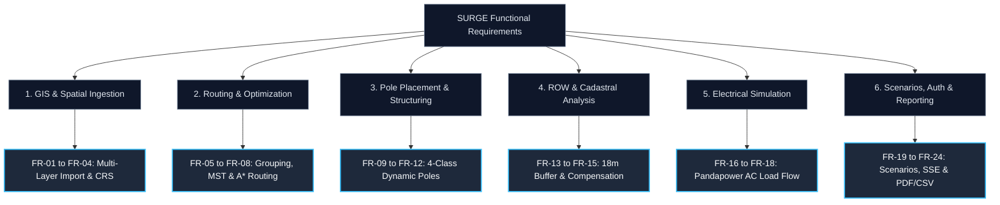

# Functional Requirements

> **System Scope:** The SURGE platform provides end-to-end automated 33kV collector network design, routing, pole placement, electrical validation, cadastral impact analysis, and report generation. The functional requirements below define the operational behaviors implemented across the Java backend, Python optimization microservice, and Web GIS frontend.

---

## Functional Requirements Summary

---

## 1. GIS & Spatial Asset Ingestion

### FR-01: Multi-Format Spatial Layer Import
- **Requirement**: The system shall ingest GeoJSON, Shapefile, and PostGIS layer data containing:
  - Wind Turbine Generator (WTG) point coordinates and rated MW capacities.
  - Substation point/polygon boundaries with gantry coordinates and 33kV bay capacities.
  - Cadastral land parcel polygons with land valuation classes, survey numbers, and ownership data.
  - Environmental restricted zones (forests, sanctuaries, water bodies, defense lands).
  - Existing infrastructure reference lines (roads, highways, railways, and existing high-tension transmission corridors).
- **Backend Service**: Handled by `ProjectAssetService` (`/api/v1/projects/{projectId}/assets`).
> [!success] **Status:** Implemented & Verified against Uravakonda GIS datasets.

### FR-02: Automatic CRS Projection to Local UTM
- **Requirement**: The system shall automatically transform imported coordinates from global geographic WGS84 (`EPSG:4326`) to the appropriate local projected Universal Transverse Mercator (UTM) metric coordinate system (e.g., `EPSG:32643` or `EPSG:32644`) to guarantee sub-meter accuracy in distance, buffer, and area operations.
- **Microservice Module**: Implemented in Python `app.domain.crs_service`.
> [!success] **Status:** Implemented & Verified in unit/integration test suites.

### FR-03: Pre-Flight Project Asset Validation
- **Requirement**: The system shall validate project assets prior to job creation, ensuring that:
  - The project boundary contains at least one active substation.
  - At least two WTGs exist within the designated project area.
  - All geometries are structurally valid (using Shapely `make_valid`).
  - Descriptive, actionable validation errors are returned if requirements are not met.
- **Backend Service**: Implemented in `ValidationService` and `ProjectAssetService`.
> [!success] **Status:** Implemented & Verified.

### FR-04: Spatial Database Persistence & Indexing
- **Requirement**: The system shall persist all spatial layers in PostgreSQL 16 / PostGIS 3.4 using Flyway database migrations (V1–V13), applying GIST spatial indexes for high-speed topological queries.
> [!success] **Status:** Implemented & Verified with Flyway V1–V13.

---

## 2. Network Routing & Algorithmic Optimization

### FR-05: Capacity-Constrained WTG Grouping
- **Requirement**: The system shall cluster WTGs into balanced 33kV feeder groups using capacity-constrained K-Means and Mixed-Integer Linear Programming (MILP), strictly enforcing feeder MW capacity limits ($P_{\text{total, feeder}} \le P_{\text{max}}$) while minimizing inter-cluster crossing.
- **Microservice Module**: Implemented in Python `app.domain.wtg_grouping` (PY-005).
> [!success] **Status:** Implemented & Verified.

### FR-06: Per-Feeder Radial MST Topology Synthesis
- **Requirement**: The system shall generate optimal radial collector tree topologies for each feeder group using Minimum Spanning Tree (MST) algorithms, ensuring zero closed loops ($|E| = |V| - 1$) and preserving feeder circuit identity.
- **Microservice Module**: Implemented in Python `app.domain.topology` (PY-006).
> [!success] **Status:** Implemented & Verified.

### FR-07: Cost-Surface $A^*$ Heuristic Spatial Pathfinding
- **Requirement**: The system shall compute obstacle-aware spatial paths across a 2D cost surface combining base terrain friction, slope penalties, and multi-layer avoidance boundaries (roads, existing HT lines, water bodies, private parcels, and restricted areas).
- **Microservice Module**: Implemented in Python `app.domain.spatial_routing` (PY-008).
> [!success] **Status:** Implemented & Verified.

### FR-08: Geometric Path Refinement (Farthest-Visible Shortcutting)
- **Requirement**: The system shall post-process raster grid paths using farthest-visible shortcutting to eliminate zigzag artifacts, reducing line length while strictly maintaining obstacle clearance.
- **Microservice Module**: Implemented in Python `app.domain.route_refinement` (PY-009).
> [!success] **Status:** Implemented & Verified.

---

## 3. Pole Placement & Structural Engineering

### FR-09: Variable-Span Transmission Pole Placement
- **Requirement**: The system shall dynamically place transmission poles along the refined route centerline according to variable span rules (minimum 30m, maximum 250m) based on terrain elevation profile and obstacle crossings.
- **Microservice Module**: Implemented in Python `app.domain.pole_placement` (PY-010/PY-025).
> [!success] **Status:** Implemented & Verified.

### FR-10: Dynamic 4-Class Pole Structural Categorization
- **Requirement**: The system shall automatically classify every placed pole into one of 4 industrial structural classes:
  1. **Tangent / Suspension**: Straight-line spans with deflection $\le 5^\circ$.
  2. **Angle / Tension**: Line deflection between $5^\circ$ and $60^\circ$ requiring heavy-duty strain insulators and guy supports.
  3. **Junction**: Branching nodes connecting multiple feeder lines.
  4. **Terminal / Dead-End**: Step-up transformer connections at WTGs and substation bay gantries.
- **Microservice Module**: Implemented in Python `app.domain.pole_placement`.
> [!success] **Status:** Implemented & Verified.

### FR-11: Pairwise Coordinate Deduplication
- **Requirement**: The system shall detect and merge co-located or duplicate pole coordinates at branching junctions and WTG transformer pads, ensuring exact topological connectivity and zero double-counted pole CAPEX.
> [!success] **Status:** Implemented & Verified in `app.domain.pole_placement`.

### FR-12: Geotechnical Slope Constraint Checks
- **Requirement**: The system shall evaluate ground slope at each pole location, restricting standard tangent poles to slopes $\le 15^\circ$, requiring reinforced pile foundations for slopes between $15^\circ$ and $30^\circ$, and rejecting pole placement on slopes $> 30^\circ$.
> [!success] **Status:** Implemented & Verified.

---

## 4. Right-of-Way (ROW) & Land Impact Analysis

### FR-13: Dynamic ROW Corridor Buffering
- **Requirement**: The system shall generate a continuous 18.0m Right-of-Way (ROW) corridor polygon (9.0m half-width) along all 33kV overhead lines using projected metric geometry buffering.
- **Microservice Module**: Implemented in Python `app.domain.corridor` (PY-011).
> [!success] **Status:** Implemented & Verified.

### FR-14: Cadastral Parcel Intersection Analysis
- **Requirement**: The system shall perform exact 2D spatial polygon intersections between the ROW corridor buffer and cadastral parcel boundaries to compute:
  - Exact crossing length (meters) across each parcel.
  - Impacted land area (square meters and hectares).
  - Number of poles physically anchored within each parcel.
- **Microservice Module**: Implemented in Python `app.domain.corridor`.
> [!success] **Status:** Implemented & Verified.

### FR-15: Automated Land Acquisition & Crop Compensation Schedules
- **Requirement**: The system shall calculate financial compensation for land acquisition, tower footing easement, and crop damage for every impacted parcel based on configured land valuation rates.
- **Backend Service**: Persisted in `ParcelImpactEntity` and exposed via `/api/v1/projects/{projectId}/jobs/{jobId}/parcel-impacts`.
> [!success] **Status:** Implemented & Verified.

---

## 5. Electrical Load Flow Simulation & Grid Verification

### FR-16: Linear Electrical Screening Proxy
- **Requirement**: The system shall execute a fast linear electrical screening calculation verifying voltage drop ($\Delta V \le 5.0\%$) and thermal ampacity loading for each feeder segment.
- **Microservice Module**: Implemented in Python `app.domain.electrical_feeder` (PY-013).
> [!success] **Status:** Implemented & Verified.

### FR-17: Pandapower AC Load Flow Simulation (ADR-007)
- **Requirement**: The system shall construct a complete AC power systems grid model in Pandapower and execute Newton-Raphson AC load flow to compute:
  - Bus voltage magnitudes and phase angles at every WTG and junction.
  - Feeder branch active ($P$), reactive ($Q$), and total apparent ($S$) power flows.
  - Conductor thermal loading percentages ($\le 100\%$).
  - 25-year cumulative technical active energy losses ($I^2R$).
- **Microservice Module**: Implemented in Python `app.domain.pandapower_engine` (ADR-007).
> [!success] **Status:** Implemented & Verified.

### FR-18: Electrical Violation Flagging & Alerts
- **Requirement**: The system shall flag and return descriptive violation warnings for any feeder exceeding the 5.0% voltage drop threshold or 100% thermal rating.
> [!success] **Status:** Implemented & Verified in API responses, UI badges, and PDF reports.

---

## 6. Multi-Scenario Scoring, Orchestration & Enterprise Reporting

### FR-19: Four Distinct Deterministic Scenarios
- **Requirement**: The system shall support 4 distinct deterministic optimization scenarios driven by backend `ScenarioProfile` biases:
  1. **Balanced**: Standard multi-objective industrial balance.
  2. **Minimum Cost**: Maximizes initial capital expenditure reduction.
  3. **Minimum Land Impact**: Heavily penalizes private parcel acquisition ($5\times$ base).
  4. **Minimum Environmental Impact**: Strict avoidance buffers around sensitive ecological zones.
> [!success] **Status:** Implemented & Verified.

### FR-20: 25-Year High-Precision Lifecycle Cost Modeling (PY-028)
- **Requirement**: The system shall compute the complete 25-year Net Present Value (NPV) lifecycle cost using Python `Decimal` arithmetic:
  $$\text{LCC} = \text{CAPEX}_{\text{cables}} + \text{CAPEX}_{\text{poles}} + \text{CAPEX}_{\text{civil}} + \text{Cost}_{\text{ROW}} + \text{NPV}(\text{Losses})_{25\text{y}} + \text{OPEX}_{\text{maint}}$$
> [!success] **Status:** Implemented & Verified.

### FR-21: Multi-Objective Candidate Scoring & Explainability (PY-018)
- **Requirement**: The system shall compute composite scores across 5 normalized dimensions (Cost, Length, Land Impact, Environmental Impact, Electrical Compliance) and provide human-readable "Why this route?" explanations.
> [!success] **Status:** Implemented & Verified.

### FR-22: Asynchronous Job Execution & Real-Time SSE Streaming
- **Requirement**: The system shall execute optimization jobs asynchronously via Spring `@Async` thread pools, broadcasting real-time progress events over Server-Sent Events (`/events`) across 8 lifecycle stages.
- **Backend Service**: Implemented in `SseProgressService` and `OptimizationJobService`.
> [!success] **Status:** Implemented & Verified.

### FR-23: Enterprise Security & Audit Logging
- **Requirement**: The system shall enforce JWT authentication with database-backed token status validation, role-based access control (`ROLE_USER`, `ROLE_ADMIN`), user account management (`/api/v1/admin/users`), and security audit trails (`/api/v1/audit-logs`).
> [!success] **Status:** Implemented & Verified.

### FR-24: Multi-Format Engineering Export (PDF & CSV)
- **Requirement**: The system shall generate downloadable CSV Bill of Materials (BOM) files and formal executive PDF engineering reports (using Apache PDFBox) derived strictly from persisted database entities without synthetic mocks.
> [!success] **Status:** Implemented & Verified.

---

## Related Notes

- 📋 **Requirements & Constraints**: [[Non Functional Requirements]] · [[Constraints]] · [[User Stories]]
- 🎯 **Vision & Strategy**: [[Vision]] · [[Goals]] · [[Scope]] · [[Roadmap]]
- 🏗️ **Architecture**: [[System Overview]] · [[Backend]] · [[Python Engine]] · [[Frontend]] · [[Database]]
- ⚡ **Optimization Modules**: [[WTG Grouping]] · [[Per-Feeder MST Topology]] · [[Routing]] · [[Pole Placement]] · [[AC Load Flow Validation]] · [[Multi-Objective Candidate Scoring]] · [[Cost Model]]
- 📜 **ADRs**: [[ADR-001 Use FastAPI]] · [[ADR-004 Lifecycle Cost Objective]] · [[ADR-007 Pandapower AC Load Flow Validation]]
