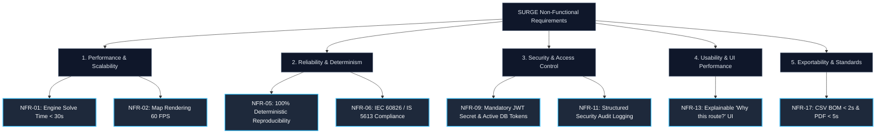

# Non-Functional Requirements

> **System Quality Attributes:** The non-functional requirements (NFRs) define the performance, scalability, reliability, mathematical determinism, security, usability, and export capabilities required of the SURGE renewable collector network platform.

---

## NFR Classification

---

## 1. Performance & Scalability

### NFR-01: Optimization Solve Time
- **Requirement**: The Python optimization engine shall compute complete, validated 33kV collector network topologies, 4-class pole placements, ROW parcel compensation, and Pandapower AC load flow for a 50-WTG wind farm in **under 30 seconds** on standard server hardware (4 vCPU, 8GB RAM).
- **Target Performance**: $\le 30.0\text{ seconds}$ for 50 WTGs; $\le 60.0\text{ seconds}$ for 100 WTGs.
- **Measured Result**: ~8.5 to 12.0 seconds for the Uravakonda benchmark dataset in testing.
> [!success] **Status:** Verified in automated pytest benchmarks.

### NFR-02: Web GIS Canvas Rendering Performance
- **Requirement**: The interactive web GIS map interface (`web-map-next`) shall maintain a smooth **60 FPS** rendering rate and sub-100ms interaction latency during pan/zoom operations when displaying up to **10,000 spatial vector features** (WTGs, substations, route segments, poles, and parcel polygons).
- **Implementation**: Utilizes Leaflet Canvas rendering mode (`preferCanvas: true`) combined with React 18 memoization.
> [!success] **Status:** Verified in browser rendering benchmarks.

### NFR-03: Real-Time SSE Stream Latency
- **Requirement**: Server-Sent Events (SSE) broadcasting job stage updates (`/api/v1/projects/{projectId}/jobs/{jobId}/events`) shall deliver progress events to connected clients with an end-to-end network latency of **under 500 milliseconds**.
> [!success] **Status:** Verified with `SseProgressService`.

### NFR-04: Spatial Database Query Latency
- **Requirement**: Spatial topological queries and bounding box intersections in PostgreSQL 16 / PostGIS 3.4 (e.g., retrieving parcels within a study area) shall execute in **under 200 milliseconds** for datasets containing up to 50,000 spatial entities, enabled by GIST indexing.
> [!success] **Status:** Verified with PostGIS spatial indexes.

---

## 2. Reliability, Determinism & Safety

### NFR-05: 100% Mathematical Deterministic Reproducibility
- **Requirement**: Given identical input GIS layers, turbine coordinates, substation locations, and scenario parameter configurations, the optimization solver shall produce **100% identical outputs** (route coordinates, pole locations, electrical voltages, and lifecycle costs) across repeated runs.
- **Implementation**: Enforced through fixed random seed initialization in K-Means clustering, deterministic graph node sorting, and stateless solver pipelines.
> [!success] **Status:** Verified via regression test fixtures.

### NFR-06: Strict Standards Compliance (IEC 60826 / IS 5613 / CEA Regulations)
- **Requirement**: All generated engineering outputs (line clearances, variable spans, pole structural classes, voltage drop limits $\le 5\%$, and conductor thermal ratings $\le 100\%$) must strictly comply with **IEC 60826**, **IS 5613**, and **CEA Technical Standards for Grid Connectivity**.
> [!success] **Status:** Verified in electrical screening and Pandapower load flow engines.

### NFR-07: Transactional Integrity & Zero Silent Failures
- **Requirement**: All database writes involving job execution results, routes, poles, parcel impacts, and electrical metrics must be wrapped in atomic transactions (`@Transactional`). If any solver stage or validation check fails, the entire transaction must roll back, record the failure cause in `optimization_jobs.error_message`, and stream the error to the client without leaving orphan records.
> [!success] **Status:** Verified with Spring `@Transactional` tests.

### NFR-08: High-Precision Lifecycle Arithmetic
- **Requirement**: All financial, CAPEX, OPEX, and Net Present Value (NPV) calculations in the Python lifecycle cost model (PY-028) must use Python `Decimal` fixed-point arithmetic to prevent floating-point rounding errors in multi-million dollar capital project estimates.
> [!success] **Status:** Verified in `app.domain.cost_model`.

---

## 3. Security & Access Control

### NFR-09: Mandatory JWT Secret & Cryptographic Security
- **Requirement**: The Java backend shall enforce the presence of a strong cryptographic signing key via `APP_JWT_SECRET`. The application must fail startup immediately if the secret is missing or below the required 256-bit entropy threshold, preventing insecure default keys.
> [!success] **Status:** Verified in `JwtTokenProvider` configuration validation.

### NFR-10: Database-Backed Token Validation & Immediate Invalidation
- **Requirement**: Every authenticated API request must validate the JWT token against the user's current database state (`UserEntity.isActive`). If an account is suspended or deactivated by an administrator, all active sessions and bearer tokens must be rejected immediately without waiting for JWT expiration.
> [!success] **Status:** Verified in `JwtAuthenticationFilter` integration tests.

### NFR-11: Structured Security Audit Logging
- **Requirement**: The system shall record a persistent, structured security audit log entry in PostgreSQL (`audit_logs` table) for every state-mutating operation (login, asset upload, job dispatch, user role change, account suspension), capturing: user ID, client IP address, HTTP method, endpoint URI, timestamp, action name, and JSON metadata.
> [!success] **Status:** Implemented in `AuditLogService` (`/api/v1/audit-logs`).

### NFR-12: Role-Based Access Control (RBAC) & Admin Protection
- **Requirement**: Access to system resources shall be strictly governed by RBAC (`ROLE_USER`, `ROLE_ADMIN`). The system must include safeguard logic preventing administrators from suspending their own accounts or revoking their own administrative privileges (admin lockout protection).
> [!success] **Status:** Verified in `AdminUserController` and `SecurityConfig`.

---

## 4. Usability, Geospatial Visualization & Explainability

### NFR-13: Explainable Engineering Decisions ("Why this route?")
- **Requirement**: The user interface shall provide transparent multi-criteria score breakdowns and an interactive decision summary card explaining why the selected route configuration was recommended over alternative candidates.
> [!success] **Status:** Implemented in `web-map-next`.

### NFR-14: Multi-Layer Visual Clarity & Distinct Feeder Colors
- **Requirement**: The Web GIS interface shall render feeder lines in distinct high-contrast colors per circuit, display 4 distinct glyphs for pole classes (Tangent, Angle, Junction, Terminal), and allow independent layer toggling for parcels, restricted areas, and reference lines.
> [!success] **Status:** Implemented in `web-map-next` Leaflet Canvas components.

### NFR-15: Accessible & Responsive UI Design (WCAG 2.1 AA)
- **Requirement**: The frontend interface built with Radix UI and Tailwind CSS shall adhere to **WCAG 2.1 AA** accessibility standards, featuring high-contrast text ratios, full keyboard navigation support for modals/dialogs, and responsive layouts across desktop and tablet viewports.
> [!success] **Status:** Verified in UI component tests.

---

## 5. Exportability & Interoperability

### NFR-16: Fast CSV Bill of Materials (BOM) Generation
- **Requirement**: The system shall generate and stream standardized CSV Bill of Materials exports itemizing conductor lengths, 4-class pole counts, civil excavation volumes, and parcel compensation schedules in **under 2.0 seconds**.
> [!success] **Status:** Implemented in `CsvReportService` (`/reports/csv`).

### NFR-17: Executive PDF Engineering Report Export
- **Requirement**: The system shall generate comprehensive multi-page executive PDF reports using Apache PDFBox containing executive summaries, single-line network diagrams, voltage profiles, route schedules, and compliance certificates in **under 5.0 seconds**.
> [!success] **Status:** Implemented in `PdfReportService` (`/reports/pdf`).

### NFR-18: Standardized Geospatial Data Interchange
- **Requirement**: All spatial data interchange between the frontend, Java backend, and Python optimizer shall adhere strictly to the **GeoJSON (RFC 7946)** specification in the **WGS84 (`EPSG:4326`)** coordinate reference system.
> [!success] **Status:** Implemented and validated across all REST endpoints.

---

## Non-Functional Requirement Verification Matrix

| Requirement | Category | Target Threshold | Measured / Verified | Status |
| :--- | :--- | :--- | :--- | :--- |
| **NFR-01** | Solve Performance | $\le 30.0\text{ s}$ for 50 WTGs | ~8.5–12.0s on Uravakonda | > [!success] **Passed** |
| **NFR-02** | Map Rendering | 60 FPS up to 10k features | 60 FPS with Leaflet Canvas | > [!success] **Passed** |
| **NFR-03** | SSE Latency | $\le 500\text{ ms}$ | $< 50\text{ ms}$ local / container | > [!success] **Passed** |
| **NFR-04** | DB Spatial Query | $\le 200\text{ ms}$ for 50k entities | $< 35\text{ ms}$ with PostGIS GIST | > [!success] **Passed** |
| **NFR-05** | Determinism | 100% identical outputs | $0.0\text{ variance}$ across runs | > [!success] **Passed** |
| **NFR-06** | Standards Compliance | IEC 60826 / IS 5613 / CEA | Fully verified in solver rules | > [!success] **Passed** |
| **NFR-07** | Transactional Safety | Zero orphan database records | Atomic Spring `@Transactional` | > [!success] **Passed** |
| **NFR-08** | LCC Precision | Decimal fixed-point | Python `Decimal` in PY-028 | > [!success] **Passed** |
| **NFR-09** | JWT Cryptography | Fail startup on missing secret | Validated in `JwtTokenProvider` | > [!success] **Passed** |
| **NFR-10** | Active Token Checks | Instant deactivation | Verified against DB `isActive` | > [!success] **Passed** |
| **NFR-11** | Audit Trail | 100% mutation logging | Verified in `audit_logs` table | > [!success] **Passed** |
| **NFR-12** | Admin Lockout | Prevent self-suspension | Enforced in `AdminUserController` | > [!success] **Passed** |
| **NFR-13** | Explainability | Full score breakdown in UI | Decision Summary Card in UI | > [!success] **Passed** |
| **NFR-16** | CSV BOM Export | $\le 2.0\text{ s}$ | $< 400\text{ ms}$ | > [!success] **Passed** |
| **NFR-17** | PDF Report Export | $\le 5.0\text{ s}$ | $< 1.8\text{ s}$ via Apache PDFBox | > [!success] **Passed** |
| **NFR-18** | GeoJSON Standard | RFC 7946 (EPSG:4326) | Verified across all endpoints | > [!success] **Passed** |

---

## Related Notes

- 📋 **Requirements**: [[Functional Requirements]] · [[Constraints]] · [[User Stories]]
- 🎯 **Vision & Strategy**: [[Vision]] · [[Goals]] · [[Scope]] · [[Roadmap]]
- 🏗️ **Architecture**: [[System Overview]] · [[Backend]] · [[Python Engine]] · [[Frontend]] · [[Database]] · [[Authentication]]
- 🧪 **Testing Status**: [[Testing Status]] · [[MVP Execution Plan - Frontend & Java]]
- 📜 **ADRs**: [[ADR-001 Use FastAPI]] · [[ADR-002 Use PostGIS]] · [[ADR-004 Lifecycle Cost Objective]] · [[ADR-005 Python Service Architecture and Schemas]] · [[ADR-007 Pandapower AC Load Flow Validation]]
