# User Stories & Acceptance Criteria

> **User Personas & Workflows:** The user stories below define the end-to-end capabilities provided by the SURGE platform across power planning engineers, electrical engineers, civil/structural engineers, land acquisition specialists, project executives, and system administrators.

---

## User Personas Overview

```mermaid
graph TD
    classDef persona fill:#1e293b,stroke:#38bdf8,stroke-width:2px,color:#f8fafc;
    classDef story fill:#0f172a,stroke:#64748b,stroke-width:1px,color:#e2e8f0;

    P1["🧑‍💼 Planning Engineer"]:::persona
    P2["⚡ Electrical Engineer"]:::persona
    P3["🏗️ Structural Engineer"]:::persona
    P4["📜 Land & Legal Specialist"]:::persona
    P5["💼 Project Executive"]:::persona
    P6["🛡️ System Administrator"]:::persona

    P1 --> US_01["US-01: Asset Import & Feeder Routing"]:::story
    P1 --> US_02["US-02: 4-Scenario Multi-Objective Comparison"]:::story
    P1 --> US_03["US-03: Explainable 'Why this route?' Breakdown"]:::story

    P2 --> US_04["US-04: Pandapower AC Load Flow & Screening"]:::story
    P2 --> US_05["US-05: Electrical Parameter Configuration"]:::story

    P3 --> US_06["US-06: 4-Class Pole Schedule & Spans"]:::story
    P3 --> US_07["US-07: Terrain Slope & Foundation Checks"]:::story

    P4 --> US_08["US-08: 18m ROW Corridor Parcel Overlay"]:::story
    P4 --> US_09["US-09: Parcel Compensation Schedules"]:::story

    P5 --> US_10["US-10: CSV BOM & Executive PDF Reports"]:::story
    P5 --> US_11["US-11: 25-Year Lifecycle Cost (LCC) Evaluation"]:::story

    P6 --> US_12["US-12: User Management & Suspension"]:::story
    P6 --> US_13["US-13: Security Audit Log Inspection"]:::story
```

---

## 1. Power Systems & Planning Engineer

### US-01: GIS Asset Ingestion & Automated 33kV Feeder Optimization
- **As a** Renewable Planning Engineer,
- **I want to** upload WTG coordinates, substation boundaries, and avoidance layers (roads, parcels, restricted zones) via GeoJSON or Shapefile,
- **So that** I can automatically generate an optimal, capacity-balanced, obstacle-free 33kV radial collector network in under 30 seconds.
- **Acceptance Criteria**:
  - [x] Ingestion endpoint `/api/v1/projects/{projectId}/assets` accepts WTG and Substation GeoJSON features and persists them into PostGIS.
  - [x] Pre-flight validation confirms presence of at least 1 substation and $\ge 2$ WTGs within project boundaries.
  - [x] Capacity-constrained K-Means / MILP clustering groups WTGs into balanced circuits respecting feeder MW limits.
  - [x] Per-feeder radial MST and cost-surface $A^*$ spatial router generate zero-loop, obstacle-safe routes.
  - [x] Real-time SSE stream (`/events`) updates stage progress on the frontend progress bar.
> [!success] **Status:** Implemented & Verified in `backend-java`, `optimisation-python`, and `web-map-next`.

---

### US-02: Side-by-Side 4-Scenario Exploration
- **As a** Renewable Planning Engineer,
- **I want to** run and compare 4 distinct deterministic optimization scenarios (Balanced, Minimum Cost, Minimum Land Impact, Minimum Environmental Impact),
- **So that** I can present clear engineering trade-offs to project developers and stakeholders.
- **Acceptance Criteria**:
  - [x] Backend `ScenarioProfile` drives distinct mathematical weighting in Python solver for all 4 profiles.
  - [x] Frontend displays side-by-side scenario comparison matrix showing total route length, CAPEX, OPEX, pole counts, and land compensation.
  - [x] Engineer can toggle scenario layers on the Leaflet Canvas map to visually inspect route variations.
> [!success] **Status:** Implemented & Verified.

---

### US-03: Explainable Engineering Decisions ("Why this route?")
- **As a** Renewable Planning Engineer,
- **I want to** view a transparent score breakdown and decision rationale for the generated candidate routes,
- **So that** I can defend the selected layout during internal review and regulatory approval.
- **Acceptance Criteria**:
  - [x] Python engine computes normalized multi-criteria scores across 5 dimensions (Cost, Length, Land Impact, Environmental Impact, Electrical Compliance) via PY-018.
  - [x] Frontend displays interactive **"Why this route?"** decision summary card highlighting key trade-off metrics.
> [!success] **Status:** Implemented in `web-map-next`.

---

## 2. Electrical Engineer

### US-04: Automated Pandapower AC Load Flow & Compliance Screening
- **As an** Electrical Engineer,
- **I want** automated AC load flow simulation and electrical screening for every feeder line,
- **So that** I can verify that maximum voltage drop is $\le 5.0\%$ and line thermal loading is $\le 100\%$ without exporting to external power simulation software.
- **Acceptance Criteria**:
  - [x] Pandapower Newton-Raphson AC load flow executes on generated collector topology (ADR-007).
  - [x] Bus voltages, feeder active/reactive power flows, and thermal loadings are calculated and persisted in `electrical_results` table.
  - [x] Feeder segments exceeding 5.0% voltage drop or 100% ampacity trigger prominent red violation badges on the web map and PDF report.
> [!success] **Status:** Implemented in Python `app.domain.pandapower_engine` and Java `ElectricalResultEntity`.

---

### US-05: Flexible Conductor & Electrical Parameter Selection
- **As an** Electrical Engineer,
- **I want to** configure nominal voltage (33kV), target power factor (e.g. 0.95 lagging), and standard conductor types (Dog ACSR, Panther ACSR),
- **So that** the optimization engine sizes feeders and evaluates losses under accurate project electrical specifications.
- **Acceptance Criteria**:
  - [x] Optimization request schema accepts conductor impedance parameters ($R, X, B$), rated ampacity, and operating power factor.
  - [x] Technical active energy losses ($I^2R$) are calculated accurately over the 25-year operational lifecycle.
> [!success] **Status:** Implemented & Verified in API schemas.

---

## 3. Civil & Structural Line Engineer

### US-06: 4-Class Pole Placement & Tower Schedule
- **As a** Civil / Structural Line Engineer,
- **I want** transmission poles automatically placed and classified into 4 structural types (Tangent, Angle, Junction, Terminal) with variable spans,
- **So that** I can immediately produce a structural pole schedule for procurement and foundation design.
- **Acceptance Criteria**:
  - [x] Transmission poles are placed along the centerline with spans bounded between 30m and 250m.
  - [x] Poles are typed based on line deflection angle: Tangent ($\le 5^\circ$), Angle ($5^\circ$–$60^\circ$), Junction (merging nodes), Terminal (WTG/substation ends).
  - [x] Coordinate deduplication merges redundant poles at junctions and WTG terminations.
  - [x] Distinct visual glyphs and colors are rendered on the map canvas for each pole class.
> [!success] **Status:** Implemented in Python `app.domain.pole_placement` and rendered on Canvas in `web-map-next`.

---

### US-07: Terrain Slope & Foundation Verification
- **As a** Civil / Structural Line Engineer,
- **I want** the system to flag pole locations situated on steep terrain slopes,
- **So that** I can specify reinforced foundations or adjust pole placement to prevent structural failure.
- **Acceptance Criteria**:
  - [x] Ground slopes at pole coordinates are evaluated from DEM elevation rasters.
  - [x] Poles on slopes $> 15^\circ$ are marked for reinforced foundation requirements.
  - [x] Hard slope limit ($> 30^\circ$) prohibits pole anchoring and triggers routing detour.
> [!success] **Status:** Implemented & Verified in solver rules.

---

## 4. Land Acquisition & Legal Specialist

### US-08: 18m Right-of-Way (ROW) Corridor & Cadastral Parcel Overlay
- **As a** Land Acquisition Specialist,
- **I want to** view the 18.0m Right-of-Way (ROW) corridor polygon superimposed on cadastral land parcels,
- **So that** I can identify all affected private landowners and survey numbers along the route.
- **Acceptance Criteria**:
  - [x] System generates standard 18.0m ROW corridor buffer (9.0m on either side of centerline) in projected metric UTM coordinates.
  - [x] Spatial overlay calculates exact crossing length (m) and impacted area ($m^2$ and ha) per cadastral parcel.
  - [x] Frontend displays cadastral parcel boundaries with color-coded impact intensity.
> [!success] **Status:** Implemented in `app.domain.corridor` and persisted in `parcel_impacts` table.

---

### US-09: Automated Land Compensation Schedule Export
- **As a** Land Acquisition Specialist,
- **I want to** export a detailed parcel-wise compensation schedule,
- **So that** the legal team can disburse land acquisition, tower footing easement, and crop damage compensation.
- **Acceptance Criteria**:
  - [x] Compensation calculations apply land valuation rates based on parcel classification (agricultural, barren, commercial).
  - [x] Persisted parcel impact records are included in the downloadable CSV Bill of Materials and PDF executive report.
> [!success] **Status:** Implemented in `ParcelImpactEntity` and CSV/PDF export services.

---

## 5. Project Executive & Estimator

### US-10: Instant Bill of Materials (BOM) & Executive PDF Report Export
- **As a** Renewable Project Executive,
- **I want to** download formal CSV Bill of Materials and multi-page executive PDF reports with one click,
- **So that** I can present cost estimates, network schedules, and compliance certificates to investors and EPC contractors.
- **Acceptance Criteria**:
  - [x] CSV export generates granular itemization of conductor lengths, 4-class pole counts, civil foundation types, and parcel compensation.
  - [x] Apache PDFBox generates multi-page executive PDF report with single-line diagrams, voltage profiles, route schedules, and compliance certificates.
  - [x] Reports are generated in under 5.0 seconds directly from database records without mock placeholders.
> [!success] **Status:** Implemented in `CsvReportService` and `PdfReportService`.

---

### US-11: 25-Year Lifecycle Cost (LCC) Evaluation
- **As a** Renewable Project Estimator,
- **I want to** evaluate the 25-year Net Present Value (NPV) lifecycle cost combining CAPEX, OPEX line losses, and land compensation,
- **So that** I can select designs with the lowest true total cost of ownership over the project lifetime.
- **Acceptance Criteria**:
  - [x] Python `Decimal` lifecycle cost model (PY-028) evaluates CAPEX, OPEX, and NPV of losses at configured discount rate and tariff (₹4.50/kWh).
  - [x] Cost breakdown is displayed on the frontend BOM pane and persisted in database entities.
> [!success] **Status:** Implemented & Verified in `app.domain.cost_model`.

---

## 6. System Administrator & Security Officer

### US-12: User Management, RBAC & Account Suspension
- **As a** System Administrator,
- **I want to** create users, assign roles (`ROLE_USER`, `ROLE_ADMIN`), and suspend/reactivate accounts,
- **So that** I can manage enterprise access control and immediately revoke compromised accounts.
- **Acceptance Criteria**:
  - [x] Admin management endpoints (`/api/v1/admin/users`) allow listing, creating, and updating user accounts.
  - [x] Account suspension (`isActive = false`) immediately invalidates active JWT sessions upon the next request.
  - [x] Admin lockout protection prevents administrators from suspending their own accounts.
  - [x] Frontend provides dedicated Admin tab accessible only to users with `ROLE_ADMIN`.
> [!success] **Status:** Implemented in `AdminUserController` and `web-map-next`.

---

### US-13: Comprehensive Security Audit Log Inspection
- **As a** Security Officer,
- **I want to** inspect immutable audit logs of all user logins, asset modifications, job runs, and administrative actions,
- **So that** I can maintain compliance with corporate IT governance and investigate security events.
- **Acceptance Criteria**:
  - [x] Backend automatically captures IP address, user principal, endpoint, action, and JSON metadata for all state-mutating requests.
  - [x] Security audit logs are queryable via `/api/v1/audit-logs`.
  - [x] Frontend provides dedicated Audit Log tab displaying real-time security event history.
> [!success] **Status:** Implemented in `AuditLogService` and `web-map-next`.

---

## Related Notes

- 📋 **Requirements & Constraints**: [[Functional Requirements]] · [[Non Functional Requirements]] · [[Constraints]]
- 🎯 **Vision & Strategy**: [[Vision]] · [[Goals]] · [[Scope]] · [[Roadmap]]
- 🏗️ **Architecture**: [[System Overview]] · [[Backend]] · [[Python Engine]] · [[Frontend]] · [[Database]] · [[Authentication]]
- 🧪 **Testing Status**: [[Testing Status]] · [[MVP Execution Plan - Frontend & Java]]
- 📜 **ADRs**: [[ADR-001 Use FastAPI]] · [[ADR-004 Lifecycle Cost Objective]] · [[ADR-007 Pandapower AC Load Flow Validation]]
