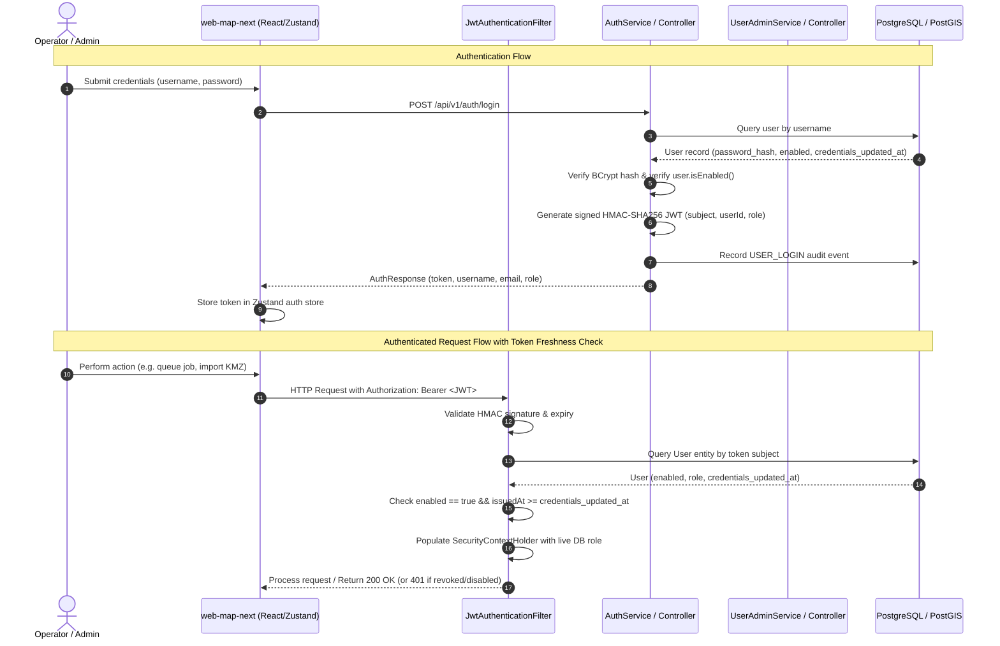

# Authentication and Authorization Architecture

> [!success] Implementation status: Implemented
> SURGE implements stateless token-based authentication and role-based access control (RBAC) via Spring Security 6, JWT (`jjwt 0.12.6`), BCrypt password hashing, and Flyway schema migrations (V3, V11, V13). Access revocation, suspension toggles, and administrator lockout protection are fully enforced at the database and security filter layers.



---

## Core Security Principles

1. **Authentication vs. Authorization**: Authentication identifies the caller using cryptographic signatures. Authorization verifies whether the identified user possesses the required role or ownership permissions.
2. **Stateless Tokens with Live State Verification**: JWTs are stateless and carry identity claims (`userId`, `role`, `sub`), but the `JwtAuthenticationFilter` performs a live, single-indexed database lookup on every request to guarantee that suspensions, role changes, and credential updates take effect immediately.
3. **No Published Key Defaults**: The HMAC signing key must be supplied explicitly via the environment. Hardcoded fallbacks or published keys are rejected at application boot, failing fast to prevent insecure deployments.
4. **Defense in Depth & Auditability**: All identity and account mutations are recorded synchronously in dedicated transactions via `AuditLogService`.

---

## Role-Based Access Control (RBAC)

SURGE defines three explicit roles in the `UserRole` enumeration:

| Role | Permissions & Scope |
| :--- | :--- |
| `ROLE_ADMIN` | Full administrative control. Access to `/api/v1/admin/users` (create users, update roles, toggle suspension, reset passwords), viewing audit logs (`/api/v1/audit-logs`), creating/deleting projects, and running optimizations. |
| `ROLE_ENGINEER` | Standard engineering access. Create, modify, and delete assigned projects, upload KMZ/GeoJSON survey files, configure and trigger optimization jobs, inspect routes and poles, download BOM CSV and PDF executive reports. |
| `ROLE_VIEWER` | Read-only access. Browse projects, inspect map layers, view route details and electrical metrics, and download reports. Cannot mutate assets or trigger optimization runs. |

---

## Token Architecture & Security Hardening

### 1. Mandatory Environment Secret (`APP_JWT_SECRET`)

The `JwtTokenProvider` strictly validates the signing secret at runtime:

- **Mandatory configuration**: The application refuses to start if `app.jwt.secret` (injected from `APP_JWT_SECRET`) is null or blank.
- **Minimum key length**: HMAC-SHA256 requires a secret of at least 256 bits (32 UTF-8 bytes). If the key is shorter, initialization throws `IllegalStateException`.
- **Blacklisted published keys**: Any key matching the legacy placeholder `SURGE_SECRET_KEY_FOR_JWT_TOKEN_GENERATION` is explicitly rejected.

```java
public JwtTokenProvider(
        @Value("${app.jwt.secret:}") String secret,
        @Value("${app.jwt.expiration-ms:86400000}") long expirationMs
) {
    if (secret == null || secret.isBlank()) {
        throw new IllegalStateException(
                "app.jwt.secret is not set. Generate a random value (at least 32 bytes) and supply it "
                        + "via the APP_JWT_SECRET environment variable. There is deliberately no default.");
    }
    if (secret.getBytes(StandardCharsets.UTF_8).length < 32) {
        throw new IllegalStateException(
                "app.jwt.secret must be at least 32 bytes for HMAC-SHA signing; got "
                        + secret.getBytes(StandardCharsets.UTF_8).length + " bytes.");
    }
    if (secret.startsWith(PUBLISHED_PLACEHOLDER)) {
        throw new IllegalStateException("app.jwt.secret is set to a burned placeholder.");
    }
    this.key = Keys.hmacShaKeyFor(secret.getBytes(StandardCharsets.UTF_8));
    this.expirationMs = expirationMs;
}
```

### 2. Live Token Verification & Revocation (`JwtAuthenticationFilter`)

Stateless tokens normally survive until their expiration timestamp (default: 24 hours / `86,400,000 ms`). To prevent suspended users or compromised tokens from remaining valid, `JwtAuthenticationFilter` executes the following checks on every request:

1. **Extract and validate signature**: Verifies JWT format, signature against `SecretKey`, and expiry date.
2. **Database Account Verification**: Queries `UserRepository.findByUsername(subject)`.
3. **Suspension Check**: If `!user.isEnabled()`, the request is immediately unauthenticated (HTTP 401).
4. **Token Freshness Check (`credentials_updated_at`)**: Compares the token's `issuedAt` claim against `user.getCredentialsUpdatedAt()` (Flyway migration `V13`). If `issuedAt < credentialsUpdatedAt` (truncated to second precision), the token is considered stale and rejected.
5. **Live Role Binding**: The granted authority in `SecurityContextHolder` is bound directly to `user.getRole().name()` from the database entity, preventing privilege escalation if a user was demoted after token issuance.

```java
private void authenticate(String token, HttpServletRequest request) {
    Optional<User> found = userRepository.findByUsername(tokenProvider.getUsernameFromToken(token));
    if (found.isEmpty()) return;

    User user = found.get();
    if (!user.isEnabled() || isStale(token, user)) {
        return;
    }

    UsernamePasswordAuthenticationToken authentication = new UsernamePasswordAuthenticationToken(
            user.getUsername(),
            null,
            List.of(new SimpleGrantedAuthority(user.getRole().name()))
    );
    authentication.setDetails(new WebAuthenticationDetailsSource().buildDetails(request));
    SecurityContextHolder.getContext().setAuthentication(authentication);
}

private boolean isStale(String token, User user) {
    Instant issuedAt = tokenProvider.getIssuedAtFromToken(token);
    Instant changedAt = user.getCredentialsUpdatedAt();
    return changedAt != null && issuedAt.isBefore(changedAt.truncatedTo(ChronoUnit.SECONDS));
}
```

### 3. Bootstrap Administrator Seeding

When the Spring Boot application initializes (`SurgeApplication.java`), `AuthService.seedBootstrapAdmin` executes:

- Checks if the configured bootstrap administrator (default username `admin`) already exists in PostgreSQL.
- If absent, creates the account with `ROLE_ADMIN` and BCrypt-encoded password.
- **Immutability guarantee**: If the administrator account already exists, credentials are left untouched. This ensures password changes or credential updates made in production are never silently overwritten during service restarts.

---

## Admin User Management API

Account lifecycle management is centralized in `UserAdminController` (`/api/v1/admin/users`), secured by `@PreAuthorize("hasRole('ADMIN')")`.

### Endpoints

| Method | Endpoint | Description | Request Body / Params | Response |
| :--- | :--- | :--- | :--- | :--- |
| `GET` | `/api/v1/admin/users` | List all accounts sorted alphabetically | None | `List<UserSummaryResponse>` |
| `POST` | `/api/v1/admin/users` | Provision a new user account | `CreateUserRequest` (`username`, `email`, `password`, `role`) | `201 Created` (`UserSummaryResponse`) |
| `PATCH` | `/api/v1/admin/users/{userId}` | Update role or toggle suspension state | `UpdateUserRequest` (`role?`, `enabled?`) | `200 OK` (`UserSummaryResponse`) |
| `POST` | `/api/v1/admin/users/{userId}/password` | Reset user password (audited event) | `ResetPasswordRequest` (`newPassword`) | `204 No Content` |

### Invariant Checks & Lockout Protection

`UserAdminService` enforces critical safety rules:

1. **No Self-Demotion or Self-Suspension**:
   - An administrator cannot change their own role: `if (isSelf(user, actingAdmin)) throw new IllegalArgumentException("You cannot change your own role.");`
   - An administrator cannot suspend their own account: `if (isSelf(user, actingAdmin)) throw new IllegalArgumentException("You cannot suspend your own account.");`
2. **Never Zero Enabled Administrators**:
   - Demoting or suspending an administrator verifies `userRepository.countByRoleAndEnabledTrue(UserRole.ROLE_ADMIN) > 1`. If the target user is the sole remaining active administrator, the operation is blocked with HTTP 400.
3. **Audit Trail Recording**:
   - Every mutation records a detailed audit log entry (`USER_CREATED`, `USER_ROLE_CHANGED`, `USER_SUSPENDED`, `USER_REINSTATED`, `USER_PASSWORD_RESET`) attributing the action to `actingAdmin`. Passwords are never logged.

---

## Filter Chain Configuration (`SecurityConfig`)

Spring Security 6 is configured as a stateless filter chain:

```java
@Bean
public SecurityFilterChain filterChain(HttpSecurity http) throws Exception {
    http
        .csrf(AbstractHttpConfigurer::disable)
        .sessionManagement(session -> session.sessionCreationPolicy(SessionCreationPolicy.STATELESS))
        .authorizeHttpRequests(auth -> auth
            .dispatcherTypeMatchers(DispatcherType.ERROR).permitAll()
            .requestMatchers(
                "/api/v1/auth/login",
                "/api/v1/health",
                "/actuator/health",
                "/actuator/health/**"
            ).permitAll()
            .requestMatchers("/api/v1/auth/register").hasRole("ADMIN")
            .anyRequest().authenticated()
        )
        .exceptionHandling(handling -> handling
            .authenticationEntryPoint(new HttpStatusEntryPoint(HttpStatus.UNAUTHORIZED)))
        .addFilterBefore(jwtAuthenticationFilter, UsernamePasswordAuthenticationFilter.class);

    return http.build();
}
```

> [!important] SSE Streaming & Authentication
> The Server-Sent Events (SSE) progress endpoint (`/api/v1/jobs/{jobId}/progress/stream`) requires an authenticated token. Because standard browser `EventSource` cannot supply headers, the React frontend (`web-map-next`) uses `fetch` with the `Authorization: Bearer <token>` header rather than sending tokens via query parameters.

---

## Related Notes

- [[Backend]] — Java Spring Boot controllers, services, and asynchronous job execution.
- [[Database]] — Database schema, including Flyway `V3`, `V11`, and `V13` user migrations.
- [[Frontend]] — React client authentication gateway and Admin management panel.
- [[System Overview]] — Complete system architecture and microservice boundaries.
