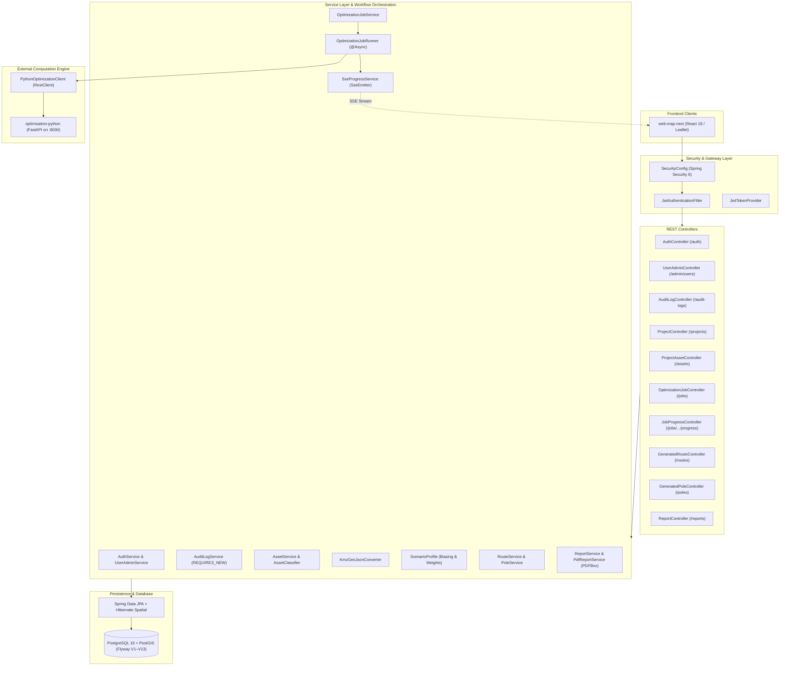
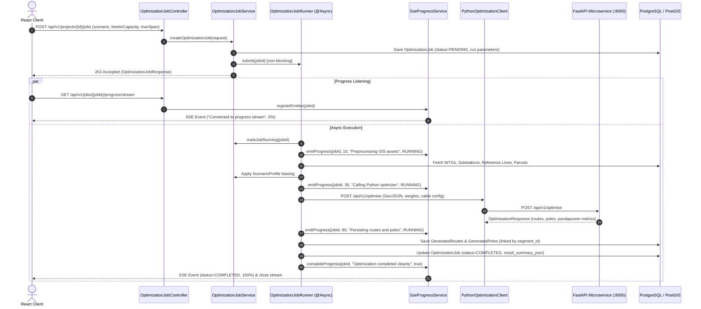

# Backend Architecture (Java Spring Boot)

> [!success] Implementation Status: Implemented
> The SURGE Java backend is a production-grade Spring Boot 3.3.2 microservice on Java 21, encompassing 112+ source files and 209 unit/integration tests. It acts as the system-of-record, securing API boundaries, managing spatial entities in PostgreSQL/PostGIS, orchestrating asynchronous optimization jobs via dedicated thread pools, streaming real-time SSE progress events, and generating engineering BOMs and PDF reports.



---

## Technology Stack

- **Runtime & Framework**: Java 21 (Temurin LTS), Spring Boot 3.3.2
- **Persistence**: Spring Data JPA, Hibernate Spatial 6.5, PostgreSQL 16 + PostGIS 3.4
- **Migrations**: Flyway (V1 through V13)
- **Security**: Spring Security 6, JWT (`jjwt 0.12.6`), BCrypt
- **HTTP Client**: Spring `RestClient` with configured connection/read timeouts (120s for optimization payload transfers)
- **Spatial Modeling**: LocationTech JTS (`org.locationtech.jts`) geometries (Point, Polygon, LineString, MultiPoint)
- **Asynchronous Execution**: Spring Task Execution (`ThreadPoolTaskExecutor`)
- **Document Generation**: Apache PDFBox 3.0.2 for executive PDF reports, OpenCSV for BOM schedules
- **Build & CI**: Maven Wrapper (`mvnw`), GitHub Actions (`.github/workflows/ci.yml`)

---

## Layer Architecture & Component Responsibilities

### 1. Controllers (`com.power.surge.controller`)

Controllers provide strictly typed REST endpoints and map business domain exceptions into standard RFC 7807 / structured `ApiErrorResponse` JSON objects via `ApiExceptionHandler`.

- `AuthController`: User sign-in (`/api/v1/auth/login`), bootstrap admin authentication, current user identity verification (`/api/v1/auth/me`).
- `UserAdminController`: Admin-only account provisioning, role updates, suspension toggling, and password resets (`/api/v1/admin/users`), guarded with `@PreAuthorize("hasRole('ADMIN')")`.
- `AuditLogController`: Query recent system audit records (`/api/v1/audit-logs`), accessible to administrators.
- `ProjectController`: CRUD management of wind farm project boundaries and metadata.
- `ProjectAssetController`: Multi-step and single-step ingestion of survey KMZ/GeoJSON packages:
  - `POST /assets/kmz/preview`: Parse and stage KMZ assets without database mutation.
  - `POST /assets/import/commit`: Commit reviewed and override-classified assets to persistence.
  - `POST /assets/kmz`: Single-step direct upload with automatic classification and coordinate deduplication.
  - `GET /assets`: Retrieve project asset collections (WTGs, substations, evacuation towers, reference lines).
- `CadastralParcelController` & `RestrictedAreaController`: Query and upload land ownership parcels and environmental avoidance zones.
- `OptimizationJobController`: Queue and retrieve 33kV collector network optimization jobs (`/api/v1/projects/{projectId}/jobs`).
- `JobProgressController`: Authenticated Server-Sent Events (SSE) stream endpoint (`/api/v1/jobs/{jobId}/progress/stream`).
- `GeneratedRouteController` & `GeneratedPoleController`: Retrieve 33kV routed feeder LineStrings and placed physical pole points.
- `ReportController`: Generate engineering Bill of Materials (BOM) summary JSON, tabular CSV exports, side-by-side scenario comparisons, and Apache PDFBox executive reports.

### 2. Services (`com.power.surge.service`)

Services implement transactional workflows, asset classification algorithms, and computational dispatch.

#### `AuditLogService`
Provides system-wide audit logging. Uses `Propagation.REQUIRES_NEW` so audit records survive even when the outer transaction fails (e.g. failed asset imports or rejected jobs). Exceptions during audit writing are caught and logged to avoid breaking business operations.

```java
@Transactional(propagation = Propagation.REQUIRES_NEW)
public void record(String action, String resourceType, String resourceId, String details) {
    try {
        auditLogRepository.save(new AuditLog(currentUsername(), action, resourceType, resourceId, details));
    } catch (RuntimeException e) {
        log.warn("Failed to write audit entry: {}", e.toString());
    }
}
```

#### `OptimizationJobService` & `OptimizationJobRunner`
Manages the lifecycle of collector network optimization:
1. Validates presence of approved WTG locations and at least one substation.
2. Persists job entity as `PENDING` with configured run parameters (`feederCapacityMw`, `maxVoltageDropPct`, `rowWidthM`, `voltageKv`, `scenario`).
3. Submits job execution to `OptimizationJobRunner` via `@Async(AsyncConfig.OPTIMIZATION_EXECUTOR)`.
4. Dispatches the serialized GeoJSON payload to Python FastAPI `/api/v1/optimise`.
5. Persists returned feeder LineStrings into `generated_routes` and physical poles into `generated_poles`.
6. Links segments and poles via `segment_id` (Flyway migration `V9`).
7. Broadcasts real-time step progress to connected UI clients via `SseProgressService`.

#### `ScenarioProfile`
Differentiates the four MVP optimization scenarios through two coupled mechanisms:
1. **Scoring weights**: Transmitted to Python's candidate evaluation engine (`CandidateScoringConfig`).
2. **Cost surface & clearance biasing**: Multipliers applied to crossing constraints and environmental buffers during spatial routing:

| Scenario | Route Length Weight | Electrical Loss Weight | Cable Loading Weight | Voltage Margin Weight | Constraint & Buffer Bias |
| :--- | :--- | :--- | :--- | :--- | :--- |
| **Balanced** | 0.40 | 0.25 | 0.20 | 0.15 | Base costs (1.0x), standard 10 m buffer |
| **Minimum Cost** | 0.70 | 0.12 | 0.10 | 0.08 | Halved soft crossing penalties (0.5x) to prioritize shorter paths |
| **Minimum Land Impact** | 0.40 | 0.25 | 0.20 | 0.15 | 3.0x penalty on private cadastral parcel crossings |
| **Minimum Environmental Impact**| 0.40 | 0.25 | 0.20 | 0.15 | 3.0x watercourse penalty + 25 m buffer bonus on restricted zones |

#### `SseProgressService`
Maintains a thread-safe `ConcurrentHashMap<UUID, List<SseEmitter>>` mapped by `jobId`. Emits real-time progress percentages and phase messages (e.g. *Preprocessing GIS data*, *Clustering WTGs*, *Routing A* Cost Surface*, *Placing Poles*, *Pandapower AC Load Flow*, *Persisting Routes*). Includes automatic timeout (5 minutes) and disconnect cleanup handlers.

#### `AssetService`, `KmzGeoJsonConverter`, & `AssetClassifier`
- **KMZ Ingestion**: Depth-first folder tree parsing (`kmlFolderPath`), XXE-protected XML DOM parsing, multi-geometry coordinate extraction.
- **Classification Engine**: Rule-driven regex pattern matcher mapping placemarks to `WtgLocation` (with micro-siting status `APPROVED`, `PROPOSED`, `LOW_AEP`, `CANCELLED`), `Substation`, `EvacuationTower` (`GANTRY`, `ANGLE_POINT`, `SUSPENSION`), `ReferenceLine` (`ROAD`, `HT_LINE`, `WATERCOURSE`), `CadastralParcel`, or `RestrictedArea`.
- **Deduplication**: Coordinate fingerprinting and suffix stripping (`ensureUniqueExternalId`).

#### `ReportService` & `PdfReportService`
- **Real AC Losses**: Integrates electrical power loss values per feeder and segment computed by Pandapower AC power flow.
- **Corridor Intersection Compensation**: Evaluates exact Right-of-Way (ROW) corridor polygon overlaps against PostGIS cadastral parcel boundaries using ellipsoidal area calculations (`ST_Intersection(ST_Buffer(route_path, row_width), parcel_geom)`), multiplying by parcel acquisition rates.
- **Executive PDF Reports**: Formats network BOM, feeder summaries, pole schedules, and land impact tables using Apache PDFBox 3.0.

---

## Flyway Schema Evolution (V1 – V13)

The database schema is managed via 13 sequential Flyway SQL migrations:

| Migration | Scope & Description |
| :--- | :--- |
| `V1__create_project_workspace.sql` | Core tables: `projects`, `wtg_locations` (capacity, Point 4326), `substations` (Point 4326). GiST spatial indexes. |
| `V2__create_optimization_and_gis_tables.sql` | `cadastral_parcels` (Polygon), `restricted_areas` (Polygon), `optimization_jobs`, `generated_routes` (LineString, length, cost, losses, pole count). |
| `V3__create_users_and_audit_tables.sql` | `users` (username, email, password_hash, role) and `audit_logs` (username, action, resource, details, timestamp). |
| `V4__create_evacuation_towers_and_asset_metadata.sql` | `evacuation_towers` table; added `source_folder` and `status` (`APPROVED`, `PROPOSED`, `CANCELLED`, etc.) to `wtg_locations`. |
| `V5__reclassify_existing_wtg_imports.sql` | Data cleanup migration: reclassifies legacy towers and substations out of `wtg_locations`, removes duplicate suffixes. |
| `V6__create_reference_lines.sql` | `reference_lines` (LineString 4326, line_type: `ROAD`, `HT_LINE`, `WATERCOURSE`, `EVACUATION_ROUTE`, crossing costs). |
| `V7__reclassify_evacuation_towers_and_substations.sql` | Advanced reclassification of legacy survey assets based on pattern matching and folder origins. |
| `V8__create_generated_poles.sql` | `generated_poles` table (Point 4326, pole_role: `TERMINAL`, `ANGLE`, `INTERMEDIATE`, `JUNCTION`, recommended pole type). |
| `V9__link_routes_and_poles_by_segment.sql` | Adds `segment_id` to `generated_routes` and `connected_route_ids` to `generated_poles` for exact route-to-pole linkage. |
| `V10__add_scenario_to_optimization_jobs.sql` | Adds `scenario` column to `optimization_jobs` to persist chosen scenario profile for multi-run comparison. |
| `V11__add_enabled_to_users.sql` | Adds `enabled BOOLEAN NOT NULL DEFAULT TRUE` to `users` for account suspension without orphaning audit history. |
| `V12__persist_job_run_parameters.sql` | Persists `feeder_capacity_mw`, `max_voltage_drop_pct`, and `row_width_m` directly on `optimization_jobs` for reproducible execution. |
| `V13__add_credentials_updated_at_to_users.sql` | Adds `credentials_updated_at TIMESTAMPTZ` to `users` to enable immediate stateless JWT revocation upon password or role change. |

---

## Asynchronous Optimization Execution Flow



---

## Related Notes

- [[Authentication]] — Spring Security 6, JWT filters, and user admin endpoints.
- [[Database]] — Complete PostGIS relational and spatial schema.
- [[Python Engine]] — FastAPI optimization algorithms, A* routing, Pandapower load flow.
- [[Frontend]] — React `web-map-next` architecture and state management.
- [[System Overview]] — End-to-end system context.
