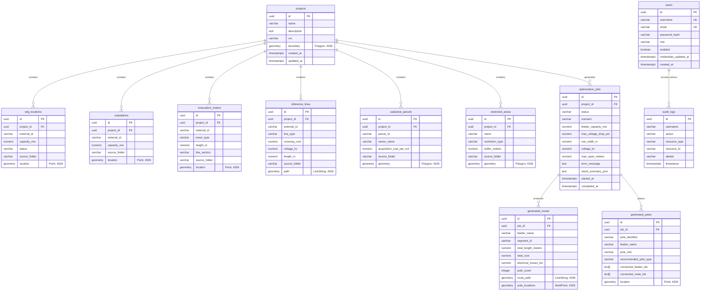

# Database Architecture (PostGIS & PostgreSQL)

> [!success] Implementation Status: Implemented
> SURGE uses PostgreSQL 16 with PostGIS 3.4 for transactional geospatial persistence. Database structure and data integrity are maintained through 13 ordered Flyway migrations (`V1` through `V13`). All spatial geometries are indexed via GiST (Generalized Search Trees) and stored using SRID 4326 (WGS84).

---

## Coordinate Storage & Projection Rules

1. **Storage CRS**: All geometry columns strictly use **SRID 4326 (WGS84)** (`geometry(GeometryType, 4326)`). This preserves a uniform standard for GeoJSON serialization, Leaflet web map visualization, and cross-system data interchange.
2. **Metric Calculations**: PostGIS calculations involving distance, buffers, or area are either performed by casting to `geography` (for ellipsoidal geodesics) or projected via `ST_Transform` to the appropriate local UTM zone. Degree-based Euclidean measurements are prohibited.
3. **Stateless Computation Boundary**: The Python optimization engine does not connect directly to PostgreSQL. The Java backend serializes database entities into GeoJSON FeatureCollections, and Python projects coordinates to metric UTM grids during solving.

---

## Complete Schema & Migration History (V1 – V13)

### V1: Project Workspace & Core Generation Assets
- `projects`: Wind farm project metadata, coordinate reference system, and optional boundary polygon (`geometry(Polygon, 4326)`).
- `wtg_locations`: Wind turbine generator coordinates (`geometry(Point, 4326)`), external identifier, and non-negative nameplate capacity (`capacity_mw > 0`). Unique constraint on `(project_id, external_id)`.
- `substations`: Grid interconnection point coordinates (`geometry(Point, 4326)`), optional capacity, and external identifier. Unique constraint on `(project_id, external_id)`.

### V2: Optimization, Constraints, and Routes
- `cadastral_parcels`: Land parcel boundary polygons (`geometry(Polygon, 4326)`), landowner identifier, and acquisition rate (`acquisition_cost_per_m2 >= 0`). Unique on `(project_id, parcel_id)`.
- `restricted_areas`: Environmental, waterbody, archaeological, or infrastructure exclusion zones (`geometry(Polygon, 4326)`), restriction classification, and non-negative clearance buffer distance (`buffer_meters >= 0`).
- `optimization_jobs`: Collector network optimization execution records. Tracks status (`PENDING`, `RUNNING`, `COMPLETED`, `FAILED`), weighting parameters (`capex_weight`, `losses_weight`), electrical criteria (`voltage_kv`, `max_span_meters`), error diagnostics, and full JSON results.
- `generated_routes`: Persisted 33kV collector line strings (`geometry(LineString, 4326)`), feeder classification, physical length in meters, estimated capital cost, Pandapower electrical losses (kW), and pole count.

### V3: Authentication & Audit Trails
- `users`: User identity records with `username` (unique), `email` (unique), BCrypt `password_hash`, and authorization `role` (`ROLE_ADMIN`, `ROLE_ENGINEER`, `ROLE_VIEWER`).
- `audit_logs`: Append-only audit trail capturing user actions (`action`, `resource_type`, `resource_id`, `details`, `timestamp`). Indexed by `timestamp DESC`.

### V4: Evacuation Towers & Asset Provenance
- `evacuation_towers`: High-voltage transmission line reference assets (`geometry(Point, 4326)`), tower type (`GANTRY`, `ANGLE_POINT`, `SUSPENSION`), tower height, line section, and KML source folder provenance.
- `wtg_locations` & `substations`: Added `source_folder` and micro-siting `status` (`APPROVED`, `REGISTRATION`, `PROPOSED`, `TO_BE_SHIFTED`, `LOW_AEP`, `CANCELLED`, `UNKNOWN`).

### V5: Legacy Ingestion Reclassification
- Data repair migration: Identified and migrated misplaced transmission towers, gantries, and substations out of `wtg_locations` into `evacuation_towers` and `substations`.
- Dropped geotechnical markers (boreholes, CBR, ERT test points) and deduplicated repeated survey placemarks using coordinate and normalized name fingerprinting.

### V6: Linear Reference Features
- `reference_lines`: Linear infrastructure features (`geometry(LineString, 4326)`) representing roads (`ROAD`), existing high-voltage transmission lines (`HT_LINE`), watercourses (`WATERCOURSE`), and historical routes (`EVACUATION_ROUTE`).
- Stores crossing cost penalty rates (`crossing_cost`), operating voltage (`voltage_kv`), line length, and source folder.
- Added `source_folder` provenance column to `cadastral_parcels` and `restricted_areas`.

### V7: Advanced Survey Reclassification
- Comprehensive rule-based migration reclassifying legacy imported survey placemarks based on regex patterns (`TWR-*`, `POLE-*`, `STR-*`, `T-*`, `AP-*`, `GANTRY`, `PSS`, `SUBSTATION`, `SWITCHYARD`) and folder keywords.

### V8: Physical Pole Placement
- `generated_poles`: Point locations (`geometry(Point, 4326)`) for physical power line poles placed along optimized collector routes.
- Stores `pole_identifier`, `feeder_name`, structural role (`TERMINAL`, `ANGLE`, `INTERMEDIATE`, `JUNCTION`), `recommended_pole_type` (e.g. `11m_steel_tubular_heavy_angle`, `11m_spun_concrete_intermediate`), and connected feeder IDs array (`TEXT[]`).

### V9: Route-to-Pole Segment Linkage
- Added `segment_id VARCHAR(60)` to `generated_routes` and `connected_route_ids TEXT[]` to `generated_poles`.
- Eliminates fallback span estimates by allowing exact bidirectional lookup between physical poles and routed line segments.

### V10: Scenario Persistence on Jobs
- Added `scenario VARCHAR(60)` to `optimization_jobs` to record the selected scenario (`Balanced`, `Minimum Cost`, `Minimum Land Impact`, `Minimum Environmental Impact`) for multi-scenario comparative reporting.

### V11: User Account Suspension
- Added `enabled BOOLEAN NOT NULL DEFAULT TRUE` to `users`.
- Enables administrators to suspend compromised or deactivated accounts immediately without deleting rows and orphaning audit log history.

### V12: Reproducible Job Run Parameters
- Added `feeder_capacity_mw NUMERIC(8, 3) NOT NULL DEFAULT 20.000`, `max_voltage_drop_pct NUMERIC(5, 2) NOT NULL DEFAULT 5.00`, and `row_width_m NUMERIC(6, 2) NOT NULL DEFAULT 18.00` to `optimization_jobs`.
- Ensures asynchronous worker runs and historical BOM reports faithfully record the exact parameters used during execution.

### V13: Immediate Stateless Token Revocation
- Added `credentials_updated_at TIMESTAMPTZ NOT NULL DEFAULT CURRENT_TIMESTAMP` to `users`.
- Backfilled to `created_at`. When a password reset, suspension, or role demotion occurs, `credentials_updated_at` is updated to `CURRENT_TIMESTAMP`, causing `JwtAuthenticationFilter` to reject older tokens on subsequent requests.

---

## Spatial Indexes (GiST)

GiST indexes are created on every spatial column to accelerate bounding box queries, containment tests, and geometric intersections:

| Table | Geometry Column | Index Name | Index Type |
| :--- | :--- | :--- | :--- |
| `wtg_locations` | `location` | `idx_wtg_locations_location` | GiST |
| `substations` | `location` | `idx_substations_location` | GiST |
| `evacuation_towers` | `location` | `idx_evacuation_towers_location`| GiST |
| `reference_lines` | `path` | `idx_reference_lines_path` | GiST |
| `cadastral_parcels` | `geometry` | `idx_cadastral_parcels_geometry` | GiST |
| `restricted_areas` | `geometry` | `idx_restricted_areas_geometry` | GiST |
| `generated_routes` | `route_path` | `idx_generated_routes_path` | GiST |
| `generated_poles` | `location` | `idx_generated_poles_location` | GiST |

---

## Related Notes

- [[Backend]] — Java Spring Boot repositories and Hibernate Spatial persistence.
- [[Authentication]] — User authentication and token revocation mechanisms.
- [[Geospatial Integrity & CRS]] — WGS84 coordinate reference systems and UTM transformations.
- [[ADR-002 Use PostGIS]] — Architectural decision record for PostGIS selection.
