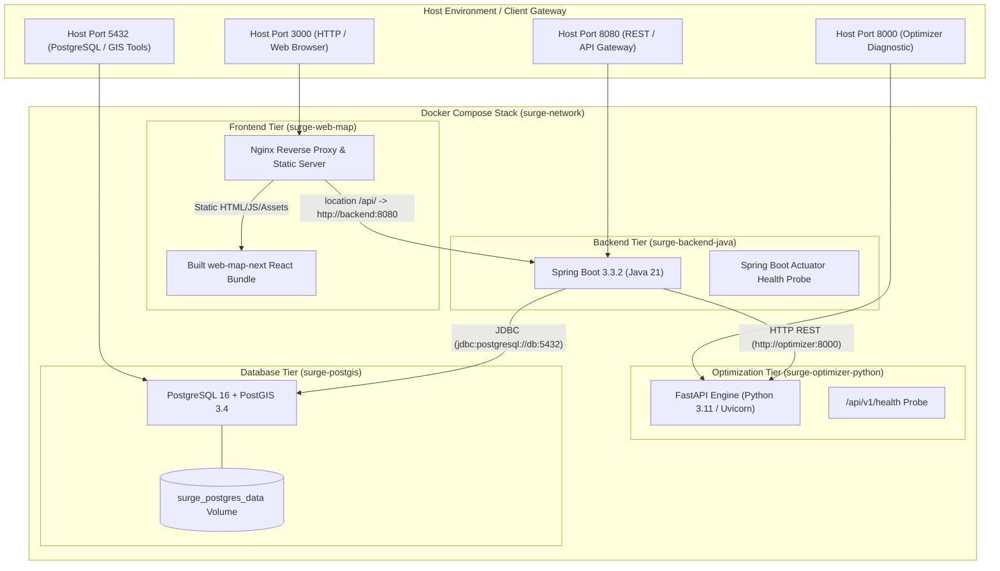
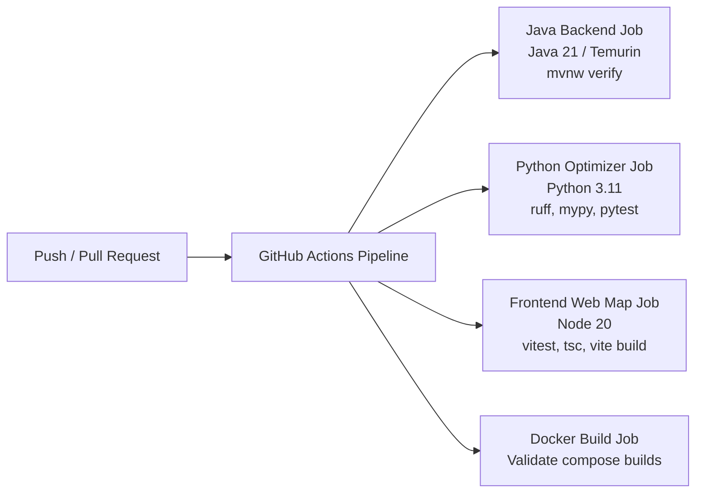

# Deployment & DevOps Architecture

> [!success] Implementation Status: Implemented
> SURGE is fully containerized using Docker Compose with a 4-tier service architecture comprising the PostGIS database, Java Spring Boot API, Python FastAPI optimization microservice, and an Nginx reverse-proxy container serving the built `web-map-next` React client. Continuous integration is automated via GitHub Actions (`.github/workflows/ci.yml`).



---

## Docker Compose Multi-Container Topology

The application stack is orchestrated via `docker-compose.yml`:

| Service Name | Image / Context | Port Mapping | Healthcheck Probe | Dependencies |
| :--- | :--- | :--- | :--- | :--- |
| `db` | `postgis/postgis:16-3.4` | `5432:5432` | `pg_isready -U postgres -d surgedb` (5s interval) | Persistent named volume `surge_postgres_data` |
| `backend` | `./backend-java` (OpenJDK 21) | `8080:8080` | `wget -q http://localhost:8080/actuator/health` | `db` (healthy), `optimizer` (healthy) |
| `optimizer` | `./optimisation-python` (Python 3.11) | `8000:8000` | Python urllib request to `/api/v1/health` | Stateless computation |
| `frontend` | `./web-map-next` (Nginx Alpine) | `3000:80` | `wget -q http://127.0.0.1/` | `backend` (healthy) |

---

## Nginx Reverse Proxy Configuration (`nginx.conf`)

The `frontend` container uses an optimized Nginx server configuration:

1. **Same-Origin API Proxying**: All requests to `/api/` are proxied internally to `http://backend:8080`. This eliminates Cross-Origin Resource Sharing (CORS) complexity in production and avoids hardcoding `localhost:8080` in the client.
2. **Single Page Application (SPA) Fallback**: Uses `try_files $uri $uri/ /index.html` to support client-side React routing.
3. **Cache Invalidation Policy**:
   - `index.html` is served with `Cache-Control: "no-cache"` so browser sessions immediately receive updated script bundle hashes upon redeployment.
   - Hashed static assets in `/assets/` are cached aggressively with `Cache-Control: "public, immutable"` and `expires 1y`.

```nginx
server {
    listen 80;
    server_name localhost;

    root /usr/share/nginx/html;
    index index.html;

    location /api/ {
        proxy_pass http://backend:8080;
        proxy_http_version 1.1;
        proxy_set_header Host $host;
        proxy_set_header X-Real-IP $remote_addr;
        proxy_set_header X-Forwarded-For $proxy_add_x_forwarded_for;
        proxy_set_header X-Forwarded-Proto $scheme;
        proxy_read_timeout 120s;
    }

    location / {
        try_files $uri $uri/ /index.html;
        add_header Cache-Control "no-cache";
    }

    location /assets/ {
        expires 1y;
        add_header Cache-Control "public, immutable";
    }
}
```

---

## Mandatory Environment & Secret Management

The stack enforces secure environment configuration through Docker Compose parameter expansion:

```yaml
APP_JWT_SECRET: ${APP_JWT_SECRET:?APP_JWT_SECRET must be set in .env}
```

- **Fail-Fast Bootstrapping**: If `APP_JWT_SECRET` is omitted from the `.env` file, Docker Compose immediately halts with an error, preventing the application from starting with an insecure default.
- **Key Constraints**: The secret must contain at least 32 UTF-8 bytes (256 bits) for HMAC-SHA256 signing, and must not match public repository defaults.

---

## Continuous Integration (GitHub Actions)

Continuous integration is declared in `.github/workflows/ci.yml` and triggers on every push and pull request:



### Job Breakdown

1. **`backend` (Java 21)**: Runs `./mvnw verify --batch-mode`, compiling 112+ source files and executing 209 unit and integration tests (including Flyway migrations and MockMvc security tests).
2. **`optimiser` (Python 3.11)**: Installs `requirements.lock.txt`, verifies code formatting with `ruff check`, enforces strict static typing with `mypy app`, and executes ~489 `pytest` test cases.
3. **`frontend` (Node 20)**: Installs locked dependencies via `npm ci`, runs 26 unit tests via `vitest`, verifies TypeScript types with `tsc --noEmit`, and compiles production bundles with `vite build`.
4. **`docker`**: Tests multi-stage image builds for all containers via `docker compose build`.

---

## Related Notes

- [[System Overview]] — System component overview.
- [[Backend]] — Spring Boot configuration and runtime properties.
- [[Frontend]] — React client build configuration and environment variables.
- [[Authentication]] — JWT signing secret mechanics and security validation.
