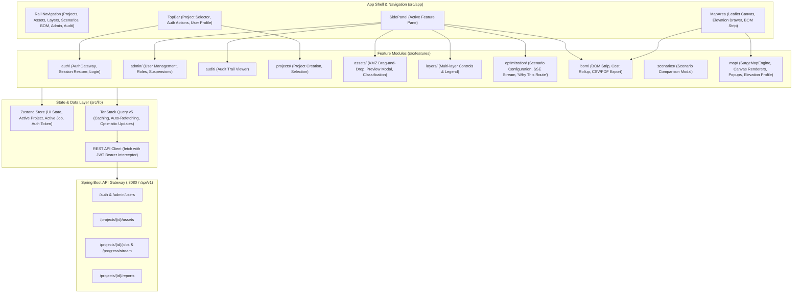

# Frontend Architecture (React Web GIS Client)

> [!success] Implementation Status: Implemented (`web-map-next`)
> The active SURGE web frontend is **`web-map-next`**, a high-performance React 18 and TypeScript application built with Vite, Leaflet (`preferCanvas: true`), TanStack Query v5, Zustand v4, Radix UI, and Tailwind CSS v3. It contains 65 source files and 26 Vitest unit tests.
> 
> *Note: The legacy vanilla JavaScript `web-map` directory is preserved solely for historical reference and is deprecated.*

---

## Technology Stack & Architecture

- **Core Framework**: React 18.3, TypeScript 5.6, Vite 5.4
- **Mapping & GIS Engine**: Leaflet 1.9.4 with `preferCanvas: true` for hardware-accelerated rendering of thousands of vector features and markers.
- **Server State & Caching**: TanStack React Query v5.62 with custom query hooks (`useProjectData`, `useJob`, `useRunOptimization`).
- **Client State**: Zustand v4.5 for UI state (active tab, active project ID, active job ID, toast notifications, auth session).
- **UI Components & Styling**: Radix UI Primitives (Dialog, Select, Slider, Switch), Tailwind CSS v3.4, glassmorphic styling, and dark theme palette.
- **Testing**: Vitest 2.1, React Testing Library, and Playwright 1.62.

---

## Feature Directory Structure (`web-map-next/src/features`)

### 1. `auth/` — Identity & Access Control
- `AuthGateway.tsx`: Non-blocking authentication modal for sign-in. Automatically triggers on unauthenticated actions or expired sessions (HTTP 401 responses).
- `AuthTopBarActions.tsx`: User badge, role pill (`ADMIN`, `ENGINEER`, `VIEWER`), and sign-out button.
- `useSessionRestore.ts`: Reads stored JWT from local storage, queries `/api/v1/auth/me` on initial boot, and clears stale credentials.

### 2. `admin/` — Account Administration
- `AdminPane.tsx`: Accessible only to `ROLE_ADMIN` users.
  - Lists all system users with status badges (`Active` / `Suspended`).
  - Create user dialog supporting `ROLE_ADMIN`, `ROLE_ENGINEER`, `ROLE_VIEWER`.
  - Account suspension toggle via `PATCH /api/v1/admin/users/{userId}`.
  - Password reset dialog via `POST /api/v1/admin/users/{userId}/password`.
  - Self-lockout and zero-admin protection feedback displayed directly in the UI.

### 3. `audit/` — System Audit Trail
- `AuditPane.tsx`: Real-time tabular audit viewer querying `/api/v1/audit-logs`. Displays timestamps, acting user, action type (`USER_LOGIN`, `ASSET_IMPORTED`, `OPTIMIZATION_QUEUED`, `USER_ROLE_CHANGED`), affected resource ID, and details.

### 4. `assets/` — Survey Ingestion & Classification
- `AssetDropzone.tsx`: Drag-and-drop zone supporting `.kmz`, `.kml`, and `.geojson` survey files.
- `ImportPreviewModal.tsx`: Two-step ingestion workflow. Displays the KML folder tree, automatic classification confidence, detected coordinates, and allows bulk or per-feature type overriding (WTG, Substation, Evacuation Tower, Reference Line, Cadastral Parcel, Restricted Area) prior to persisting.
- `useAssetImport.ts`: Manages upload progress and calls `POST /assets/kmz/preview` and `POST /assets/import/commit`.

### 5. `layers/` — Multi-Layer GIS Control
- `LayersPane.tsx`: Fine-grained visibility toggles:
  - **Generation Assets**: WTGs (filtered by micro-siting status: Approved, Proposed, Low AEP, Cancelled), Substations.
  - **Reference Infrastructure**: Evacuation towers, Reference lines (Roads, High-Voltage Lines, Watercourses).
  - **Land & Constraints**: Cadastral parcel polygons (with ownership and acquisition cost tooltips), Restricted area exclusion buffers.
  - **Optimized Network**: 33kV Feeder routes (color-coded by feeder ID) and Physical Poles categorized into 4 structural classes:
    - 🔴 **Terminal Poles**: Substation and WTG dead-end structures.
    - 🟡 **Angle Poles**: Direction change structures (>10° deviation).
    - ⚪ **Intermediate Poles**: Inline suspension structures.
    - 🔵 **Junction Poles**: Feeder branch/merging intersection structures.

### 6. `optimization/` — Execution & Decision Intelligence
- `OptimizationPane.tsx`:
  - **Confirmed Assets Card**: Validates prerequisite counts (optimisable WTGs, substations, parcels, constraints) before permitting a run.
  - **Scenario & Parameter Inputs**: Scenario dropdown (Balanced, Minimum Cost, Minimum Land Impact, Minimum Environmental Impact) and numeric sliders for Feeder Capacity (MW), Maximum Pole Span (m), and System Voltage (kV).
  - **Real-Time Progress Bar**: Consumes SSE events via `useJobProgress.ts` to show live execution percentage and stage descriptions.
  - **"Why This Route" Decision Card**: Deep inspection summary for the completed optimization run:
    - Scenario optimization target.
    - Deterministic recommendation reasons.
    - Network summary (feeders, WTGs, segment count, total length).
    - Electrical validation (load flow convergence, active losses kW, max cable loading %, voltage profile range).
    - Pole schedule breakdown (terminal, angle, intermediate, junction counts).
    - Land and constraint impact (hard violations, parcel crossings, road/HT-line crossings, soft crossing length).

### 7. `bom/` — Bill of Materials & Exporting
- `BomStrip.tsx`: Persistent summary bar at the bottom of the map area displaying total network length (km), pole count, estimated CapEx ($), and active losses (kW).
- `BomPane.tsx` & `ExportPdfButton.tsx`: Detailed BOM schedule rollup and triggers for downloading CSV tables and executive PDF reports.

### 8. `scenarios/` — Multi-Scenario Comparison
- `ScenarioComparisonModal.tsx`: Side-by-side comparison modal evaluating candidate routes across Capex, line length, pole counts, electrical losses, affected parcels, and crossing counts.

---

## High-Performance Map Engine (`SurgeMapEngine.ts`)

The map architecture is encapsulated within `SurgeMapEngine`:

1. **Canvas Rendering (`preferCanvas: true`)**: Vector geometries and marker points are rendered to an HTML5 Canvas context instead of creating thousands of individual SVG DOM elements. This guarantees 60 FPS panning and zooming even on dense wind farms with hundreds of turbines and thousands of poles.
2. **Deterministic Feeder Coloring**: Uses `feederColors.ts` to assign high-contrast, distinct visual colors based on feeder identifiers (`F1`, `F2`, `F3`, etc.).
3. **Geometry-First Cache Hydration**: When an optimization job settles, `OptimizationPane` fetches the new routes and poles GeoJSON into TanStack Query cache *before* updating `resultJobId`. This prevents transient empty-map flashes.
4. **Elevation Drawer**: `ElevationDrawer.tsx` displays interactive terrain elevation profiles along clicked route segments.

---

## Related Notes

- [[System Overview]] — Complete system overview.
- [[Backend]] — Java Spring Boot REST and SSE endpoints.
- [[Authentication]] — Security token mechanics and authentication flows.
- [[FastAPI Endpoints|FastAPI Microservice Specification]] — Python engine API contracts.
