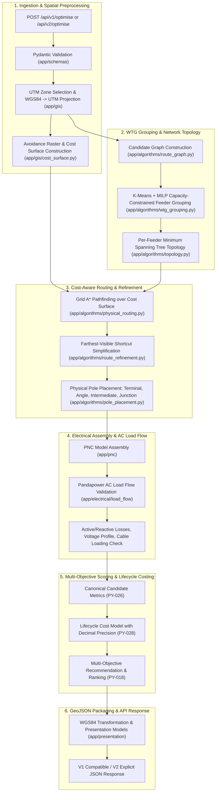

# Python Optimization Engine (FastAPI Microservice)

> [!success] Implementation Status: Implemented
> The Python optimization engine (`optimisation-python`) is a stateless computational microservice built on FastAPI, Python 3.11, NetworkX, NumPy, SciPy, Shapely, and Pandapower. It contains 79 source files and ~489 automated tests covering geospatial transformations, capacity-constrained clustering, cost-surface A* routing, physical pole placement, AC load-flow screening, candidate scoring, and lifecycle costing.

---

## Complete Computational Pipeline

### 1. Ingestion & UTM Coordinate Transformation
- **Input Validation**: Pydantic models validate GeoJSON Point features for WTGs and Substations, electrical parameters (`feeder_capacity_mw`, `nominal_voltage_kv`), avoidance geometries, and scoring weights.
- **Unified UTM Projection**: Analyzes the bounding centroid of input assets and selects the optimal local projected coordinate reference system (e.g. `EPSG:32643` for UTM zone 43N). Transforms all WGS84 degree coordinates into metric meter coordinates.

### 2. Capacity-Constrained WTG Grouping
- Evaluates total wind farm generation capacity against maximum feeder ratings ($P_{\text{feeder}}$).
- Executes K-Means clustering to seed spatial centroids, followed by Mixed-Integer Linear Programming (MILP) optimization balancing two competing objectives:
  1. Minimizing total Euclidean distance from WTGs to the assigned substation.
  2. Balancing generation capacity across feeders to prevent single-feeder saturation.

### 3. Per-Feeder Minimum Spanning Tree (MST) Topology
- Constructs radial network topologies per feeder group using Kruskal's or Prim's algorithm on metric candidate graphs, enforcing zero tree cycles and strict radial feeder operation.

### 4. Cost-Surface Grid A* Routing
- Rasterizes constraint layers into an avoidance cost grid:
  - **Hard Exclusions** (`RESTRICTED_AREA`): Assigned infinite/blocked traversal cost ($+\infty$) with mandatory clearance buffers (default: 10 m + scenario bonus).
  - **Soft Crossing Layers** (`ROAD`, `HT_LINE`, `WATERCOURSE`, `PARCEL`): Assigned weighted traversal cost penalties based on the active `ScenarioProfile`.
- Solves optimal physical paths for each topological MST edge using 8-neighbor grid A* search with Euclidean distance heuristics.

### 5. Route Refinement & Obstacle-Safe Shortcutting
- Evaluates raw grid-stepped A* paths and applies **farthest-visible shortcutting**:
  - Tests direct line-of-sight segments between non-adjacent vertices.
  - Replaces jagged grid staircases with direct straight line segments provided they do not intersect hard exclusion buffers or cross higher-cost raster cells.
  - Removes collinear and duplicate coordinates.

### 6. Physical Pole Placement (`app/algorithms/pole_placement.py`)
- Places discrete structural support poles along refined route strings:
  - **Terminal Poles**: Placed at WTG and substation termination endpoints.
  - **Angle Poles**: Placed at vertices where route deviation angle exceeds the threshold (default: >10°).
  - **Intermediate (Suspension) Poles**: Placed at equidistant intervals along long straight spans ($\le \text{max\_span\_m}$, default: 100–120 m).
  - **Junction Poles**: Placed at locations where branching route segments intersect.
  - **Pairwise Deduplication**: Automatically deduplicates co-located endpoint poles across adjacent segments.

### 7. Pandapower AC Load-Flow Validation
- Translates the physical collector network into a mathematical Pandapower AC network model:
  - Substation modeled as external grid slack bus ($V_{\text{slack}} = 1.0\,\text{p.u.}$).
  - WTGs modeled as PQ generators with specified active power and operating power factor (default: 0.95 lagging).
  - Line segments modeled with standard 33kV cable impedance parameters ($R', X', C'$, rated ampacity $I_{\text{max}}$).
- Executes Newton-Raphson AC load flow to solve bus voltages and branch currents.
- Verifies voltage bounds ($0.95 \le V \le 1.05\,\text{p.u.}$) and branch thermal ampacity limits ($I \le I_{\text{rated}}$). Computes exact active ($P_{\text{loss}}$ in MW) and reactive ($Q_{\text{loss}}$ in MVAR) system losses.

### 8. Multi-Objective Scoring & Recommendation (PY-018)
- Generates multiple candidate topologies across varying clustering seeds and constraint heuristics.
- Evaluates each candidate across four normalized engineering dimensions:
  1. **Physical Score**: Route length and physical pole count.
  2. **Spatial Score**: Traversal cost, parcel crossing count, road crossings, and soft overlap length.
  3. **Infrastructure Score**: Pole schedule structural complexity.
  4. **Electrical Score**: Active power losses, maximum cable thermal loading %, and minimum voltage margin.
- Ranks candidate networks deterministically using scenario-specific weight vectors (`CandidateScoringConfig`).

### 9. Lifecycle Cost Model (PY-028)
- Calculates complete Total Cost of Ownership (TCO) using exact `Decimal` arithmetic:
  - **Conductor CapEx**: $\sum (\text{Length} \times \text{Installed Cost per km})$.
  - **Pole CapEx**: $\sum (\text{Count}_{\text{type}} \times \text{Unit Cost}_{\text{type}})$ for terminal, angle, intermediate, and junction poles.
  - **Land Compensation CapEx**: Fixed per-parcel fees plus variable rates based on exact Right-of-Way (ROW) corridor overlap area ($m^2$).
  - **Present Value of Energy Losses (OpEx)**:
    $$\text{Annual Energy Loss (MWh)} = P_{\text{loss}} \times \text{Annual Operating Hours} \times \text{Loss Load Factor}$$
    $$\text{PV Loss OpEx} = \text{Annual Loss Cost} \times \left[\frac{1 - (1 + r)^{-N}}{r}\right]$$
    where $r$ is the discount rate and $N$ is the analysis period (years).

---

## Package Responsibilities

| Directory / Module | Core Responsibility |
| :--- | :--- |
| `app/api/v1` | Backward-compatible REST adapter for Java Spring Boot callers |
| `app/api/v2` | Explicit engineering API endpoint supporting granular cable and cost configurations |
| `app/schemas` | Pydantic v2 schemas for requests, responses, summaries, and metrics |
| `app/gis` | GeoJSON parsing, UTM zone determination, WGS84 $\leftrightarrow$ UTM transforms |
| `app/gis/cost_surface.py` | Avoidance raster grid generation, coordinate conversions, barrier dilation |
| `app/algorithms/route_graph.py` | Metric candidate graph construction |
| `app/algorithms/wtg_grouping.py` | Capacity-constrained WTG clustering (K-Means + MILP balance) |
| `app/algorithms/topology.py` | Per-feeder radial Minimum Spanning Tree generation |
| `app/algorithms/physical_routing.py` | Grid A* pathfinding over the avoidance raster |
| `app/algorithms/route_refinement.py` | Line-of-sight shortcutting and vertex reduction |
| `app/algorithms/pole_placement.py` | Structural pole placement and deduplication |
| `app/pnc` | Power Collection Network assembly and topological validation |
| `app/electrical/load_flow` | Pandapower network builder and AC power flow execution |
| `app/costing` | PY-028 Decimal lifecycle cost model and itemized CapEx/OpEx breakdowns |
| `app/optimisation` | Multi-candidate generation, scoring (PY-018), and recommendation orchestrator |
| `app/presentation` | Presentation packaging and WGS84 GeoJSON serialization |

---

## API Endpoints Overview

- **`GET /api/v1/health`**: Microservice health check returning service name and status.
- **`POST /api/v1/optimise`**: Backward-compatible endpoint consumed by Spring Boot. Accepts WTG/substation GeoJSON, electrical parameters, and avoidance features. Returns recommended route LineStrings, pole MultiPoints, and summary metrics.
- **`POST /api/v2/optimise`**: Explicit engineering endpoint. Accepts detailed cable catalogues, multi-scenario candidate counts, structural pole parameters, custom scoring weights, and lifecycle cost assumptions.

---

## Related Notes

- [[FastAPI Endpoints|FastAPI Microservice Specification]] — Exhaustive API schemas and contract details.
- [[System Overview]] — System-wide architecture and microservice boundaries.
- [[Backend]] — Java Spring Boot caller and persistence boundary.
- [[Geospatial Integrity & CRS]] — Coordinate systems and projection standards.
- [[WTG Grouping]] — Capacity-constrained clustering algorithms.
- [[Per-Feeder MST Topology]] — Radial MST formulation.
- [[Routing]] — Cost-surface A* routing and route refinement.
- [[Electrical Feeder Screening]] — Pandapower load-flow validation.
