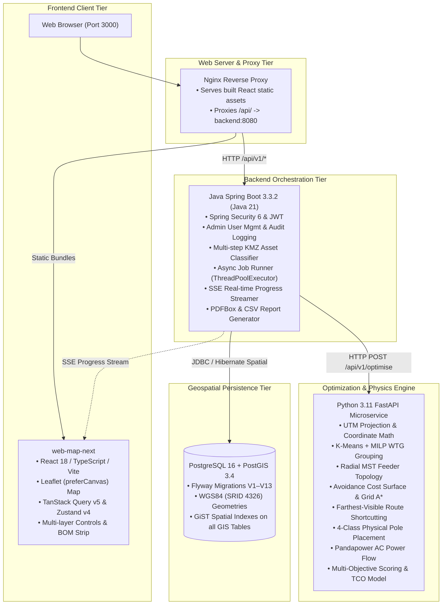
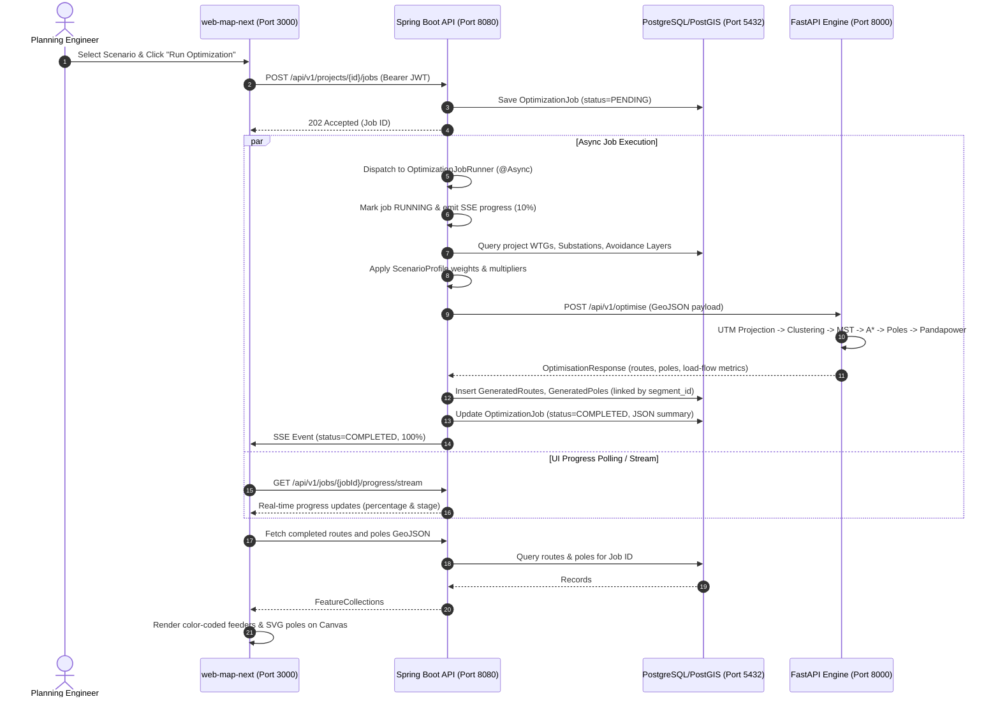

# System Architecture Overview

> [!success] Implementation Status: Implemented
> SURGE (Smart Utility Routing & Grid Evacuation) is a modular microservice platform for automated 33kV Power Collection Network (PCN) design, spatial routing, electrical validation, and Bill of Materials generation for utility-scale wind farms.



---

## Microservice Responsibility Split

### 1. Frontend Client (`web-map-next`)
- **Technology**: React 18, TypeScript, Vite, Leaflet (`preferCanvas: true`), TanStack Query v5, Zustand v4, Radix UI, Tailwind CSS v3.
- **Responsibilities**:
  - Interactive Web GIS map canvas with hardware-accelerated rendering.
  - KMZ / GeoJSON drag-and-drop asset ingestion with 2-step preview and classification override.
  - Multi-layer visibility toggles (WTGs by status, substations, evacuation towers, reference lines, cadastral parcels, restricted areas, routes by feeder, and 4 physical pole classes).
  - Optimization scenario selection (`Balanced`, `Minimum Cost`, `Minimum Land Impact`, `Minimum Environmental Impact`) and electrical slider controls.
  - Live progress monitoring via Server-Sent Events (SSE).
  - Decision intelligence inspection ("Why This Route" card).
  - Account administration panel (`/admin/users`) and system audit log viewer (`/audit-logs`).
  - Engineering BOM display and CSV/PDF report download triggers.

### 2. Java Spring Boot Backend (`backend-java`)
- **Technology**: Java 21, Spring Boot 3.3.2, Spring Security 6, Spring Data JPA, Hibernate Spatial, Apache PDFBox 3.0.
- **Responsibilities**:
  - Public API gateway, authentication, and token management.
  - Live DB-backed JWT validation on every request, verifying enabled status and checking token freshness against `credentials_updated_at`.
  - Administrative user lifecycle management with self-lockout and zero-admin invariants.
  - Synchronous system auditing via `AuditLogService` using `REQUIRES_NEW` transactions.
  - Asset ingestion, KML folder parsing, XXE-hardened XML DOM extraction, coordinate fingerprint deduplication, and rule-based asset classification.
  - Asynchronous optimization job scheduling via dedicated `ThreadPoolTaskExecutor`.
  - Real-time progress broadcasting via `SseProgressService` (`SseEmitter`).
  - Spatial intersection land compensation calculation and executive PDF report rendering.

### 3. Python FastAPI Optimization Engine (`optimisation-python`)
- **Technology**: Python 3.11, FastAPI, NetworkX, NumPy, SciPy, Shapely, PyProj, Pandapower.
- **Responsibilities**:
  - Stateless computational microservice invoked by Spring Boot.
  - Automatic UTM coordinate reference system projection from WGS84 coordinates.
  - Capacity-constrained WTG clustering using K-Means and Mixed-Integer Linear Programming (MILP).
  - Per-feeder radial Minimum Spanning Tree (MST) topology synthesis.
  - Avoidance raster grid generation combining hard exclusions (`RESTRICTED_AREA`) and soft penalty layers (`ROAD`, `HT_LINE`, `WATERCOURSE`, `PARCEL`).
  - Grid A* pathfinding and line-of-sight route simplification (farthest-visible shortcutting).
  - Structural pole placement: Terminal, Angle (>10°), Intermediate, and Junction poles with pairwise deduplication.
  - AC load-flow validation using Pandapower: active/reactive loss calculation, bus voltage limits ($0.95 \le V \le 1.05\,\text{p.u.}$), and cable ampacity screening.
  - Multi-objective scoring (PY-018), canonical engineering metrics (PY-026), and itemized Decimal lifecycle costing (PY-028).

### 4. PostGIS Database (`db`)
- **Technology**: PostgreSQL 16 with PostGIS 3.4.
- **Responsibilities**:
  - Relational and spatial data persistence.
  - 13 ordered Flyway migrations (`V1` to `V13`).
  - Spatial storage using SRID 4326 (WGS84) for Points, Polygons, and LineStrings.
  - GiST spatial indexing on all geometric attributes for accelerated spatial queries.

---

## Inter-Service Communication & Data Flow



---

## Containerized Deployment Stack

The entire system is deployed via Docker Compose:

```text
Host Architecture:
  • Port 3000: surge-web-map (Nginx + web-map-next React build)
  • Port 8080: surge-backend-java (Spring Boot 3.3.2 on OpenJDK 21)
  • Port 8000: surge-optimizer-python (FastAPI on Python 3.11)
  • Port 5432: surge-postgis (PostgreSQL 16 + PostGIS 3.4 with named volume)
```

- **Environment Guard**: `APP_JWT_SECRET` is strictly enforced at Compose startup (`${APP_JWT_SECRET:?APP_JWT_SECRET must be set in .env}`).
- **CI Automation**: GitHub Actions runs automated build, lint, and test suites across all three tiers on every push and PR.

---

## Related Notes

- [[Authentication]] — Security, JWT mechanics, and admin user APIs.
- [[Backend]] — Spring Boot architecture, services, and Flyway schema.
- [[Python Engine]] — FastAPI optimization algorithms and Pandapower load flow.
- [[Frontend]] — React web-map-next architecture.
- [[Database]] — Complete PostGIS relational schema and migrations.
- [[Deployment]] — Docker Compose configurations and CI workflows.
- [[FastAPI Endpoints|FastAPI Microservice Specification]] — Microservice API specifications.
