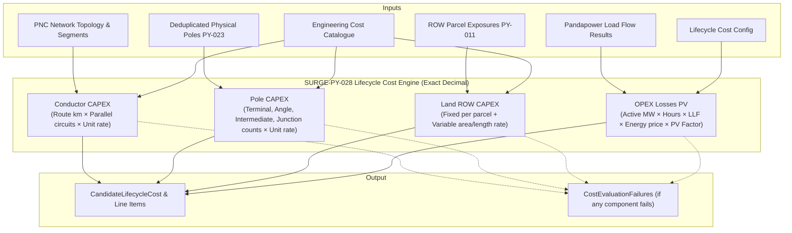

# Lifecycle Cost Objective Model (SURGE-PY-028)

> [!success] Implementation status: Fully Implemented
> `app/costing/lifecycle.py`, `app/costing/models.py`, and `app/costing/failures.py` implement the lifecycle cost evaluation engine within the Python optimization microservice using exact `Decimal` arithmetic and strict currency enforcement.

---

## 1. Overview & Purpose

In collector network design for wind farms, the shortest physical route is rarely the least expensive overall investment. A route that appears short may traverse expensive private parcels, require more heavy angle/tension structures, use undersized conductors with excessive Joule heating losses, or encounter high construction resistance.

SURGE implements a **25-year Total Lifecycle Cost Model** combining up-front capital expenditure (**CAPEX**) and the discounted present value of recurring electrical loss expenditures (**OPEX**):

$$
\text{Lifecycle Cost} = \text{Total CAPEX} + \text{PV}(\text{OPEX}_{\text{losses}})
$$

Where:
$$
\text{Total CAPEX} = \text{CAPEX}_{\text{conductor}} + \text{CAPEX}_{\text{pole}} + \text{CAPEX}_{\text{land}}
$$



---

## 2. Mathematical & Component Breakdown

All calculations use Python's `decimal.Decimal` with exact arithmetic to eliminate binary floating-point rounding errors in commercial cost estimations. Monetary outputs are quantized to two decimal places (`_quantize_money` with `ROUND_HALF_EVEN`).

### 2.1 Conductor CAPEX ($\text{CAPEX}_{\text{conductor}}$)
Conductor cost represents the installed supply and stringing cost of phase conductors across all routed feeder segments:

$$
\text{CAPEX}_{\text{conductor}} = \sum_{f \in \text{Feeders}} \sum_{s \in f.\text{segments}} \left( \frac{L_s}{1000} \times N_{\text{parallel}, s} \times R_{\text{conductor}, s} \right)
$$

- $L_s$: Refined route length of segment $s$ in meters ($\text{m}$).
- $N_{\text{parallel}, s}$: Number of parallel circuits per phase for the configured cable/line type (default `1`).
- $R_{\text{conductor}, s}$: Installed unit cost per circuit-kilometer ($\text{currency / circuit-km}$) defined in `ConductorCostItem`.

### 2.2 Pole & Structure CAPEX ($\text{CAPEX}_{\text{pole}}$)
Pole cost is computed from the deduplicated network-level physical structures produced by [[Pole Placement]] (SURGE-PY-023):

$$
\text{CAPEX}_{\text{pole}} = \sum_{t \in \{\text{terminal, angle, intermediate, junction}\}} N_t \times R_{\text{pole}, t}
$$

- $N_t$: Distinct physical structure count for pole class $t$.
- $R_{\text{pole}, t}$: Installed unit rate per pole structure ($\text{currency / each}$) defined in `PoleCostItem`.

All 4 pole classes (`terminal`, `angle`, `intermediate`, `junction`) must be present in the cost catalogue. Missing pole classes or un-deduplicated pole inputs trigger explicit failure codes.

### 2.3 Land Right-of-Way CAPEX ($\text{CAPEX}_{\text{land}}$)
Land compensation is calculated from cadastral parcel intersections derived during [[ROW Corridor Analysis]] (SURGE-PY-011):

$$
\text{CAPEX}_{\text{land}} = \left( N_{\text{parcels}} \times R_{\text{fixed}} \right) + \text{Variable Land Cost}
$$

Where:
- $N_{\text{parcels}}$: Count of unique affected cadastral parcels intersecting the corridor footprint.
- $R_{\text{fixed}}$: Fixed compensation/administrative rate per affected parcel (`fixed_cost_per_affected_parcel`).
- **Variable Land Cost** depends on the catalogue's `LandPricingBasis`:
  - `ROUTE_OVERLAP_LENGTH_M`: $\sum \text{overlap\_length}_i \times R_{\text{variable}}$ ($\text{currency / m}$).
  - `ROW_INTERSECTION_AREA_M2`: $\sum \text{intersection\_area}_i \times R_{\text{variable}}$ ($\text{currency / m}^2$).
  - `NONE`: $0.00$.

### 2.4 Present Value of Electrical Loss OPEX ($\text{PV}(\text{OPEX}_{\text{losses}})$)
Active power losses ($P_{\text{loss}}$ in $\text{MW}$) from Pandapower AC load flow are evaluated across the asset operating lifespan ($n$ years, typically 25) at annual discount rate $r$:

1. **Annual Loss Energy ($\text{MWh/year}$)**:
   $$
   E_{\text{loss, annual}} = P_{\text{loss, MW}} \times H_{\text{annual}} \times \text{LLF}
   $$
   - $H_{\text{annual}}$: Annual operating hours ($8,760\text{ h/year}$ default).
   - $\text{LLF}$: Loss Load Factor ($0.0 \leq \text{LLF} \leq 1.0$), capturing generation intermittency (approx. $\text{LLF} \approx 0.2 \times \text{CF} + 0.8 \times \text{CF}^2$).

2. **Annual Loss Cost**:
   $$
   C_{\text{loss, annual}} = E_{\text{loss, annual}} \times P_{\text{energy}}
   $$
   - $P_{\text{energy}}$: Levelized energy price ($\text{currency / MWh}$).

3. **Uniform Series Present Value Factor ($\text{PVRF}$)**:
   $$
   \text{PV Factor} = \begin{cases}
   \frac{1 - (1 + r)^{-n}}{r} & \text{if } r > 0 \\
   n & \text{if } r = 0
   \end{cases}
   $$

4. **Present Value of Lifetime Losses**:
   $$
   \text{PV}(\text{OPEX}_{\text{losses}}) = C_{\text{loss, annual}} \times \text{PV Factor}
   $$

---

## 3. Engineering Cost Catalogue & Configuration Models

```python
@dataclass(frozen=True)
class EngineeringCostCatalogue:
    catalogue_id: str
    version: str
    currency: str                       # ISO 3-letter code (e.g. "USD", "INR", "EUR")
    price_basis_date: datetime.date
    conductor_items: tuple[ConductorCostItem, ...]
    pole_items: tuple[PoleCostItem, ...]
    land_policy: LandCostPolicy

@dataclass(frozen=True)
class LifecycleCostConfig:
    currency: str
    energy_price_basis_date: datetime.date
    analysis_period_years: int          # e.g., 25 years
    discount_rate: Decimal              # e.g., Decimal("0.08") for 8%
    annual_operating_hours: int         # e.g., 8760
    loss_load_factor: Decimal           # e.g., Decimal("0.30")
    energy_price_per_mwh: Decimal       # e.g., Decimal("50.00")
```

### Validation Invariants:
- `catalogue.currency` must equal `config.currency` (case-insensitive); mismatch raises `CostConfigurationError`.
- All rates, hours, factors, and periods must be positive/non-negative and finite numbers.
- Discount rate $r$ must satisfy $0 \leq r < 1$.
- Catalogue must define all 4 required pole types: `terminal`, `angle`, `intermediate`, `junction`.

---

## 4. Structured Failure Modes & Resilience

SURGE never crashes the optimization pipeline if cost evaluation fails for an individual candidate. Instead, it captures granular `CostEvaluationFailure` records while preserving successfully evaluated components:

| Failure Code | Component | Description |
| :--- | :--- | :--- |
| `CABLE_COST_NOT_FOUND` | `conductor_capex` | Segment conductor ID does not exist in catalogue. |
| `POLE_RESULT_UNAVAILABLE` | `pole_capex` | Deduplicated pole result is missing or pole count mismatches physical pole array. |
| `POLE_COST_NOT_FOUND` | `pole_capex` | A pole class (`intermediate`, etc.) is missing from the catalogue. |
| `LAND_EXPOSURE_UNAVAILABLE`| `land_capex` | Upstream spatial analysis failed or was bypassed. |
| `LOAD_FLOW_NOT_CONVERGED` | `loss_opex` | Pandapower AC power flow did not converge for this topology. |
| `ACTIVE_LOSS_MISSING` | `loss_opex` | Converged network result omitted active loss figure. |
| `ACTIVE_LOSS_INVALID` | `loss_opex` | Active loss value was non-finite or negative. |
| `COST_EVALUATION_ERROR` | Global | Unexpected runtime exception during calculation. |

### Component-Level Availability
The returned `CandidateCostAssessment` tracks partial evaluations:
- `capex_available`: True only when Conductor, Pole, Land, and Total CAPEX are all non-null.
- `opex_available`: True only when Loss OPEX PV is non-null.
- `cost` (`CandidateLifecycleCost`): Published only when **all 4 components** evaluate successfully without failures.

---

## 5. Line Item Auditability

For full engineering traceability, `CandidateLifecycleCost` emits granular `CostLineItem` records:
- Each cable segment length and cost contribution (`category="conductor"`).
- Each pole type breakdown count and cost contribution (`category="pole"`).
- Fixed and variable land impact items (`category="land_fixed"`, `category="land_variable"`).
- Lifetime electrical loss present value item (`category="opex"`).

This audit record is exposed in the API, saved in PDFBox engineering reports, and presented in the UI BOM panel.

---

## 6. Related Notes

- [[Routing]] — Physical A* route generation and length inputs.
- [[Pole Placement]] — Discrete pole classification and deduplicated physical structures.
- [[ROW Corridor Analysis]] — Cadastral parcel intersection area and overlap length.
- [[Explainability]] — Audit trail and candidate score justification.
- [[ADR-004 Lifecycle Cost Objective]] — Architectural decision on lifecycle costing.
