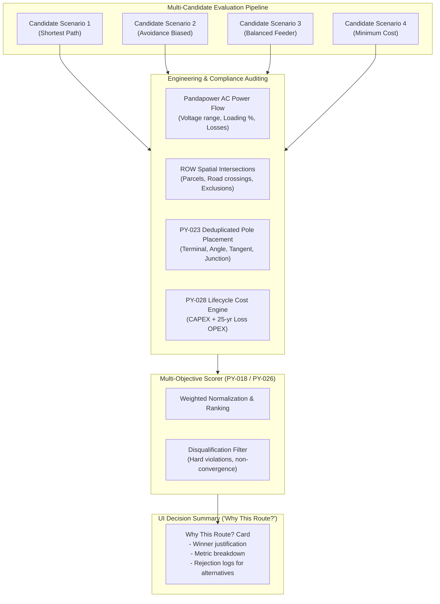

# Explainable Engineering Decisions & Audit Trail

> [!success] Implementation status: Implemented in UI & API
> Deterministic multi-scenario scoring, raw metric provenance, candidate disqualification tracking, and the frontend **Decision Summary Card ("Why this route?")** provide end-to-end explainability across the Python optimizer, Java backend, and React/Leaflet UI.

---

## 1. Concept: Explainability in SURGE

Explainability in SURGE is the ability to trace every final routing decision back to inputs, constraints, physical algorithms, electrical power flow results, and lifecycle cost components.

Unlike black-box AI tools, SURGE ensures:
1. **Deterministic Ground Truth**: All candidate scores are computed using transparent engineering metrics, not opaque heuristic embeddings.
2. **Raw Metrics Retained**: Raw physical quantities (route length in meters, active power losses in kW, maximum thermal loading %, voltage bounds in pu, pole structure counts by type, parcel intersections) are never lost or obscured by normalized score weights.
3. **Explicit Rejection Audit**: Any candidate scenario rejected during multi-objective evaluation captures explicit disqualification reasons (e.g., thermal overload, voltage collapse, hard-exclusion violation).



---

## 2. Decision Summary ("Why This Route?")

When an optimization job completes, the Python Orchestrator emits an `OptimisationWorkflowResult` containing comprehensive recommendation rationale. The web UI (`OptimizationPane.tsx`) surfaces this inside the **"Why This Route?"** Decision Summary Card:

### 2.1 Recommendation Justification
A bulleted summary explaining why the winning candidate scored highest according to the active `ScenarioProfile` (e.g., *“Lowest lifecycle cost with 0 hard exclusion violations, 14.2% maximum thermal loading, and standard 33 kV voltage profile maintained within 0.978–1.000 pu”*).

### 2.2 Metric Breakdown Categories

| Category | Explanatory Metrics Displayed in UI |
| :--- | :--- |
| **Network** | Total feeder count, connected WTG count, total routed segments, total route length ($\text{km}$). |
| **Electrical** | Load flow convergence (`true`/`false`), compliance validity, maximum cable loading ($\%$), voltage profile range ($V_{\min} - V_{\max}$ in $\text{pu}$), total active losses ($\text{kW}$). |
| **Poles & Structures** | Total physical structures, breakdown of Terminal poles, Angle poles, Intermediate/Tangent poles, and Junction structures. |
| **Land & Constraints** | Hard exclusion violations (must be 0 for feasible solutions), road/HT-line crossing events, unique affected parcels count, soft constraint overlap length ($\text{m}$). |
| **Cost (BOM)** | Total CAPEX, conductor CAPEX, pole CAPEX, land compensation CAPEX, 25-year loss OPEX PV, total lifecycle cost. |

---

## 3. Candidate Comparison & Disqualification Tracking

SURGE evaluates multiple candidate project networks (PNC scenarios) generated via different topological, spatial, and electrical strategies. 

### 3.1 Disqualification Invariants
A candidate is disqualified from winning when:
- **Load Flow Non-Convergence**: Pandapower fails to reach Newton-Raphson power flow convergence.
- **Thermal Overload**: Any segment exceeds $100\%$ rated thermal ampacity under full generation.
- **Voltage Band Breach**: Voltage at any WTG bus falls outside $[0.95, 1.05]\text{ pu}$ (or project-configured limits).
- **Hard Constraint Violation**: Any route segment or buffer penetrates a `RESTRICTED_AREA` or hard exclusion polygon.
- **Spatial Infeasibility**: A* routing cannot find an obstacle-free corridor.

### 3.2 Audit Log of Rejected Candidates
The API response and UI include the full list of evaluated candidates with their scenario IDs, strategies, and exact rejection messages:
```json
{
  "scenario_id": "scenario_min_distance",
  "strategy": "MINIMIZE_DISTANCE",
  "status": "DISQUALIFIED",
  "disqualifications": [
    "Thermal limit exceeded on feeder F2 segment F2-S03 (loading: 112.4%)",
    "Hard exclusion violation: route intersects restricted_area 'sanctuary_zone_north'"
  ]
}
```

---

## 4. Full Audit Trail Architecture

The end-to-end audit trail is preserved across the stack:
1. **Python Optimizer**: Attaches `CandidateEngineeringAssessment`, `CandidateCostAssessment`, and `SpatialConstraintSummary` to every candidate.
2. **Java Backend**: Stores full job request/response payloads in PostGIS/PostgreSQL, tracks user identity, emits Server-Sent Events (SSE) progress milestones, and logs events to `audit_logs` table (`/api/v1/audit-logs`).
3. **PDFBox Export**: Generates stamped PDF engineering reports containing the complete Decision Summary, single-line diagram data, bill of materials (BOM), and compliance certificates.
4. **React Frontend**: Allows engineers to compare candidate trade-offs side-by-side using the `ScenarioComparisonModal`.

---

## 5. Related Notes

- [[Cost Model]] — Exact Decimal lifecycle cost breakdown and line items.
- [[Routing]] — 3-step spatial routing pipeline and avoidance layers.
- [[Pole Placement]] — Discrete pole classification and deduplicated structures.
- [[ML Ranking]] — Deterministic scoring vs future machine-learning surrogate models.
- [[Constraint-aware Routing]] — Hard exclusions and soft penalties compliance.
- [[Feeder Planning]] — Topology generation and capacity constraints.
