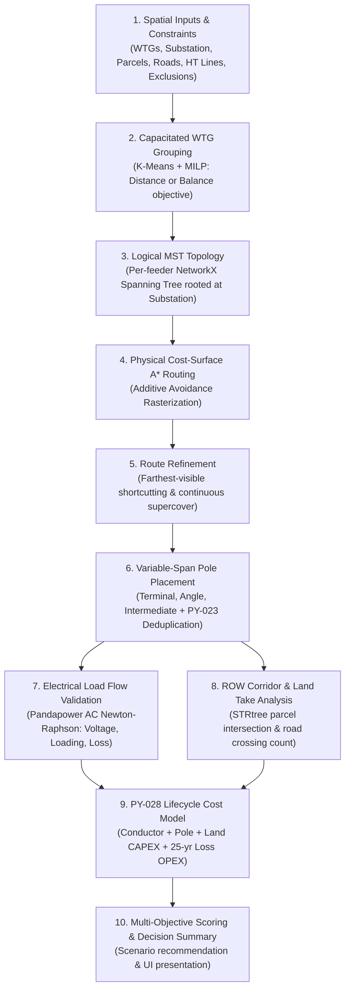

# Feeder Topology & Physical Network Planning

> [!success] Pipeline Status: End-to-End Implemented
> Collector feeder planning in SURGE operates as a complete multi-stage pipeline: starting from active-power capacity-constrained WTG grouping and radial MST topology, translating each logical edge into physical terrain-aware A* routes, refining geometries, placing discrete pole structures, validating electrical load flow with Pandapower, analyzing cadastral land take, and calculating 25-year lifecycle costs.

---

## 1. End-to-End Feeder Planning Pipeline

Feeder planning transforms unstructured spatial coordinates and electrical capacities into a constructible, code-compliant, and economically optimized medium-voltage ($33\text{ kV}$) collector system.

---

## 2. Pipeline Stages in Detail

### 2.1 Capacitated WTG Grouping
- **Module**: `app/algorithms/wtg_grouping.py` (see [[WTG Grouping]]).
- **Role**: Partitions $N$ wind turbines into $K$ disjoint feeders such that the aggregated capacity on each feeder does not exceed $P_{\text{feeder, max}}$ (e.g., $25.0\text{ MW}$).
- **Objectives**: Supports dual MILP formulations — `MINIMIZE_DISTANCE` (spatially compact clusters seeded by K-Means) and `BALANCE_WTG_COUNT` (uniform turbine counts across feeders).

### 2.2 Per-Feeder Minimum Spanning Tree (MST)
- **Module**: `app/algorithms/topology.py` (see [[Per-Feeder MST Topology]]).
- **Role**: Establishes a deterministic radial tree topology for each feeder group, connecting all assigned WTGs and the project substation with $M - 1$ logical edges.
- **Radial Guarantee**: Guarantees zero electrical loops within any feeder branch.

### 2.3 Physical A* Cost-Surface Routing
- **Module**: `app/algorithms/a_star.py` & `app/algorithms/physical_routing.py` (see [[Routing]] and [[GIS Cost Surface]]).
- **Role**: Converts each straight-line logical MST edge into a constructible geographic path across a projected raster cost surface.
- **Constraint-Awareness**: Traverses soft penalty layers (roads, watercourses, existing HT lines, cadastral parcels) while strictly bypassing hard exclusion zones (`np.inf` cost).

### 2.4 Farthest-Visible Route Refinement
- **Module**: `app/algorithms/route_refinement.py` (see [[Routing]]).
- **Role**: Eliminates jagged grid-step artifacts from A* output. Uses continuous supercover raycasting to take the longest direct line of sight that does not clip hard obstacles or increase traversal cost.

### 2.5 Variable-Span Pole Placement & Network Deduplication
- **Module**: `app/algorithms/pole_placement.py` (see [[Pole Placement]]).
- **Role**: Places physical structures along refined centrelines:
  - Mandatory **Terminal** poles at WTGs and substation.
  - Mandatory **Angle** poles at bends exceeding $\theta_{\text{threshold}}$ (default $10^\circ$).
  - Evenly spaced **Intermediate** (tangent) poles respecting $S_{\text{target}}$ and $S_{\max}$.
  - Merges coincident endpoints into **Junction** structures using pairwise coordinate tolerance (SURGE-PY-023).

### 2.6 Pandapower AC Load Flow Analysis
- **Module**: `app/electrical/load_flow/`
- **Role**: Builds an equivalent Pandapower AC network model:
  - Substation modeled as external grid (slack bus).
  - WTGs modeled as PQ generators delivering rated active power at configured power factor ($\cos \phi = 0.95$).
  - Exact $\Pi$-model overhead lines/cables with resistance $R'$, reactance $X'$, and capacitance $C'$.
- **Validation**: Checks bus voltage bands ($[0.95, 1.05]\text{ pu}$), branch thermal loading ($\leq 100\%$), and computes active Joule losses ($P_{\text{loss}}$ in $\text{kW}$).

### 2.7 ROW Corridor & Land Impact Analysis
- **Module**: `app/gis/row_analysis.py` (see [[ROW Corridor Analysis]]).
- **Role**: Generates flat-capped metric corridor polygons (e.g., $18\text{ m}$ total ROW width) and queries a spatial `STRtree` against project vector layers to quantify unique parcel land take ($\text{m}^2$), road crossing events, and verify 0 hard exclusion breaches.

### 2.8 Lifecycle Costing & Multi-Objective Decision
- **Module**: `app/costing/lifecycle.py` (see [[Cost Model]]) and `app/optimisation/scoring.py`.
- **Role**: Evaluates total 25-year lifecycle cost using exact `Decimal` arithmetic and ranks candidate scenarios against the active `ScenarioProfile` (Balanced, Lowest Capital Cost, Minimal Environmental Impact, Maximum Reliability).

---

## 3. Key Invariants & Design Rules

1. **Radial Topology Invariant**: Every feeder is strictly radial; parallel or looped connections are prohibited to maintain standard distribution protection schemes.
2. **Deterministic Execution**: Given identical inputs, grouping, routing, pole placement, power flow, and costing produce byte-identical results.
3. **Hard Constraint Non-Negotiability**: Any route that breaches a hard exclusion zone is immediately marked invalid and disqualified from recommendation.
4. **Separation of Concerns**: Logical topology (graph connectivity), physical routing (raster geometry), and electrical sizing (cable ampacity) are decoupled into dedicated, testable stages.

---

## 4. Related Notes

- [[Per-Feeder MST Topology]] — Logical graph spanning tree formulation.
- [[WTG Grouping]] — K-Means and MILP capacity-constrained clustering.
- [[Routing]] — 3-step physical A* routing and continuous refinement.
- [[Pole Placement]] — Discrete pole classification and deduplication.
- [[Constraint-aware Routing]] — Avoidance layer ingestion and rasterization.
- [[Cost Model]] — Exact Decimal lifecycle cost model.
- [[Explainability]] — Audit trail and Decision Summary.
