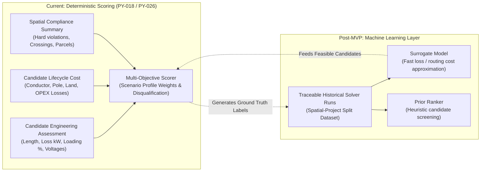

# Machine-Learning Route Ranking & Deterministic Ground Truth

> [!note] Architectural Status: Deferred to Post-MVP (Deterministic Scoring Implemented)
> Deterministic multi-objective candidate scoring and engineering metric evaluation (SURGE-PY-018 / PY-026) provide the explainable ground truth for all current route ranking. Machine learning models are deferred until a sufficiently large, validated corpus of real solver runs is collected.

---

## 1. Role of Deterministic Scoring vs. ML

SURGE evaluates and ranks multiple candidate network topologies using transparent, deterministic multi-objective functions rather than opaque neural networks or heuristics:

---

## 2. Why ML Ranking Is Deferred

Training an ML ranking model prior to completing the deterministic physical, electrical, and costing pipeline would create severe architectural risks:

1. **Absence of Valid Ground Truth**: Without deterministic A* routing, Pandapower AC power flow, and 25-year lifecycle cost models, any training data would be based on synthetic heuristics or straight-line approximations, teaching the model to reproduce flawed assumptions.
2. **Auditability & Legal Liability**: Wind farm capital expenditures involve tens of millions of dollars and strict grid-code compliance. Regulators, transmission system operators (TSOs), and EPC contractors require mathematically verifiable proofs (e.g. Newton-Raphson voltage convergence, exact cable thermal ratings), which black-box ML predictions cannot legally guarantee.
3. **Hard Constraint Integrity**: ML models cannot be trusted to strictly enforce binary hard exclusions (e.g., environmental sanctuaries, military radar zones). A single probabilistic hallucination could breach a no-go zone.

---

## 3. Ground Truth Generation (SURGE-PY-018 & PY-026)

The current pipeline creates a rich, structured dataset on every optimization run that will serve as the future training corpus:

- **`CandidateEngineeringAssessment`**:
  - `total_route_length_m`: Physical routed length.
  - `active_power_losses_kw`: Real Pandapower AC losses.
  - `maximum_line_loading_pct`: Maximum thermal loading among all segments.
  - `voltage_margin_pu`: Minimum voltage margin from operating limits.
  - `physical_pole_count`: Deduplicated pole count by structure type.
  - `affected_parcel_count` & `road_crossing_count`: Cadastral and infrastructure impacts.
- **`CandidateCostAssessment`**: Exact Decimal line items and lifecycle cost totals.
- **`ScenarioProfile`**: Configured stakeholder trade-off weights (Balanced, Lowest Capital Cost, Minimal Environmental Impact, Maximum Reliability).

---

## 4. Governance Requirements for Future ML Introduction

When machine learning is introduced to accelerate scenario exploration or act as a surrogate evaluator, the following governance rules are mandatory:

1. **Zero Hard-Constraint Override**: An ML model may prioritize or filter candidate topologies, but it can **never** mark a candidate feasible if it violates a hard exclusion, exceeds thermal limits, or fails voltage stability.
2. **Spatial-Project Split Validation**: Training, validation, and test datasets must be partitioned by entire geographic wind farm projects (not randomly sampled across turbines) to prevent spatial autocorrelation leakage.
3. **Model Versioning in Audit Trail**: Every prediction must record the exact ML model hash, dataset snapshot version, and inference confidence in the decision metadata.
4. **Deterministic Fallback**: If an ML surrogate model exhibits uncertainty or out-of-distribution inputs, the pipeline automatically falls back to full deterministic A* routing and Pandapower load flow.

---

## 5. Related Notes

- [[Explainability]] — Audit trail and Decision Summary.
- [[Cost Model]] — Exact Decimal lifecycle cost model.
- [[Routing]] — 3-step physical A* routing and continuous refinement.
- [[Feeder Planning]] — Multi-stage feeder optimization.
- [[ADR-003 ML Ranking]] — Architectural decision record on ML deferral.
