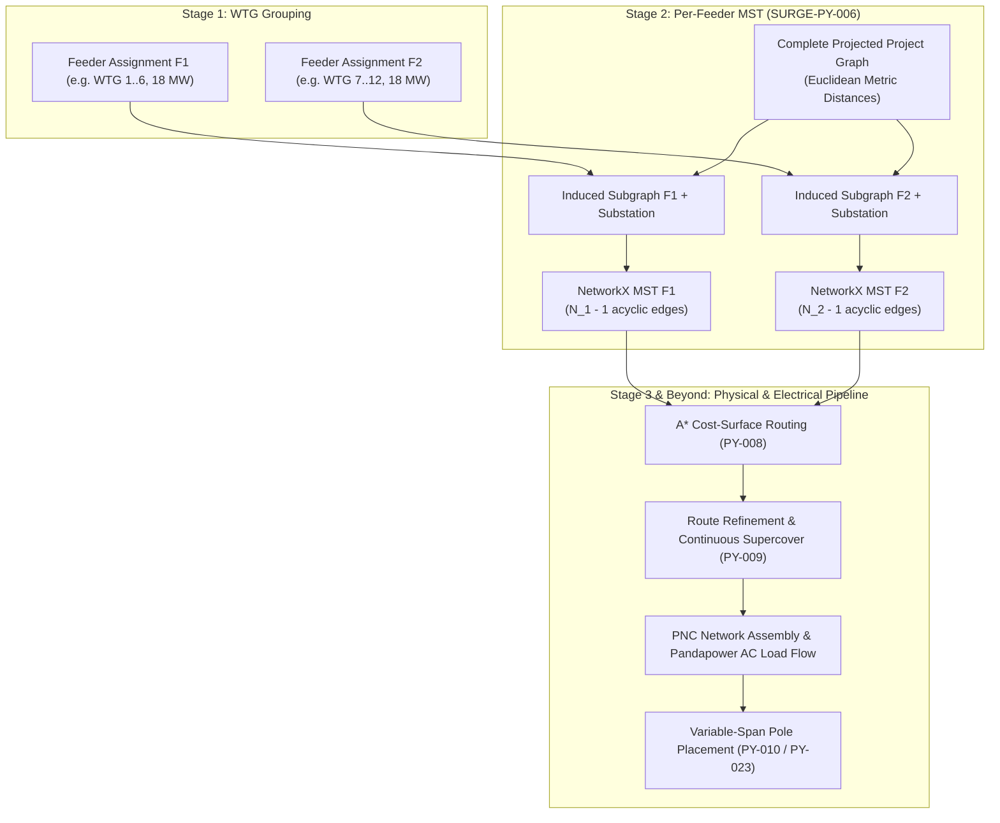

# SURGE-PY-006: Per-Feeder MST Topology Planning

> [!success] Algorithm status: Implemented & Integrated
> `app/algorithms/topology.py` builds deterministic per-feeder radial minimum spanning trees (MSTs) rooted at the project substation. The resulting edges feed downstream A* cost-surface routing, PNC network assembly, Pandapower load flow, and variable-span pole placement.

---

## 1. Purpose & Architectural Role

Within the SURGE collector optimization pipeline:
- **[[WTG Grouping]]** decides **which turbines belong to each feeder**.
- **Per-Feeder MST Topology** decides **which assets connect to one another** in a radial graph.
- **[[Routing]]** and **[[GIS Cost Surface]]** decide **where the physical conductor corridor runs across the terrain**.

SURGE-PY-006 constructs a deterministic radial topology for each feeder assignment. Every feeder tree includes its assigned WTGs and the project collector substation as the root connection point.



---

## 2. Mathematical Spanning Tree Concept

A **spanning tree** $T = (V, E_T)$ of a connected graph $G = (V, E)$ is an acyclic subgraph connecting all vertices in $V$. For a feeder with $|V| = N$ nodes (one substation plus $N - 1$ turbines), a valid radial tree has exactly:

$$
|E_T| = N - 1 \text{ edges}
$$

A **Minimum Spanning Tree (MST)** selects the edge subset $E_T \subset E$ that minimizes the total edge weight:

$$
\min \sum_{e \in E_T} w(e)
$$

In the initial candidate graph, edge weight $w(e)$ is the straight-line Euclidean distance in the projected metric CRS (UTM). This provides a mathematically optimal, deterministic radial baseline.

---

## 3. Algorithm Step-by-Step

For each feeder assignment, `app/algorithms/topology.py`:

1. **Substation Discovery**: Locates the designated `substation:<id>` node in the project graph.
2. **Namespace Conversion**: Maps raw turbine IDs (e.g. `WTG01`) to namespaced graph identifiers (`wtg:WTG01`).
3. **Membership Validation**: Verifies that every assigned turbine exists in the graph and that no turbine is assigned to multiple feeders.
4. **Induced Subgraph Extraction**: Extracts a subgraph containing only the feeder's assigned WTG nodes plus the substation node, retaining all connecting metric edges.
5. **MST Extraction**: Executes Kruskal's or Prim's algorithm via `networkx.minimum_spanning_tree(subgraph, weight="weight")`.
6. **Acyclicity & Connectivity Check**: Validates that `networkx.is_tree(mst)` is true; any disconnected component raises an immediate domain error.
7. **Deterministic Normalization**: Normalizes edge directions and sorts edge pairs `(from_node, to_node)` lexicographically to guarantee byte-identical outputs across runs.
8. **Length Summation**: Sums preliminary edge distances into `total_length_m`.

```python
@dataclass(frozen=True)
class FeederTopology:
    feeder_id: str
    node_ids: tuple[str, ...]
    total_capacity_mw: float
    total_length_m: float
    mst_edges: tuple[tuple[str, str], ...]
    mst_graph: nx.Graph

@dataclass(frozen=True)
class CollectorTopologyResult:
    feeders: tuple[FeederTopology, ...]
```

---

## 4. Downstream Pipeline Integration

Once the logical MST edges are computed:
1. **Physical Routing**: Each MST edge `(u, v)` is converted into a physical start and goal point for [[Routing|A* grid routing]] across the [[GIS Cost Surface]].
2. **PNC Assembly**: The routed and refined physical paths are packaged into `ProjectPNCNetwork` containing `PNCFeeder` and `PNCSegment` models.
3. **Electrical Verification**: The topology graph directly defines the branch connectivity for Pandapower AC power flow modeling, enabling Newton-Raphson voltage and line loading calculations.
4. **Pole Placement**: Physical structures are placed along each segment, and coincident substation/WTG endpoints are merged using [[Pole Placement|SURGE-PY-023 deduplication]].

---

## 5. Correctness Invariants

- **Rooted at Substation**: The substation is present in every feeder tree, serving as the electrical evacuation point.
- **Strict Radiality**: No cycles or looped configurations exist within any feeder.
- **Disjoint Completeness**: Every WTG belongs to exactly one feeder tree; no turbine is orphaned or duplicated.
- **Coordinate System**: All lengths and distances are computed in projected metric coordinates (UTM), never in spherical degrees.

---

## 6. Related Notes

- [[WTG Grouping]] — Capacitated clustering that generates feeder memberships.
- [[Feeder Planning]] — End-to-end feeder engineering workflow.
- [[Routing]] — Physical A* routing and farthest-visible refinement.
- [[GIS Cost Surface]] — Raster surface for terrain-aware traversal.
- [[Pole Placement]] — Discrete support placement along routed segments.
- [[Geospatial Integrity & CRS]] — Metric projection and coordinate transformations.
