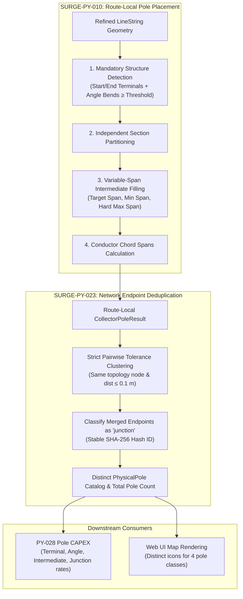
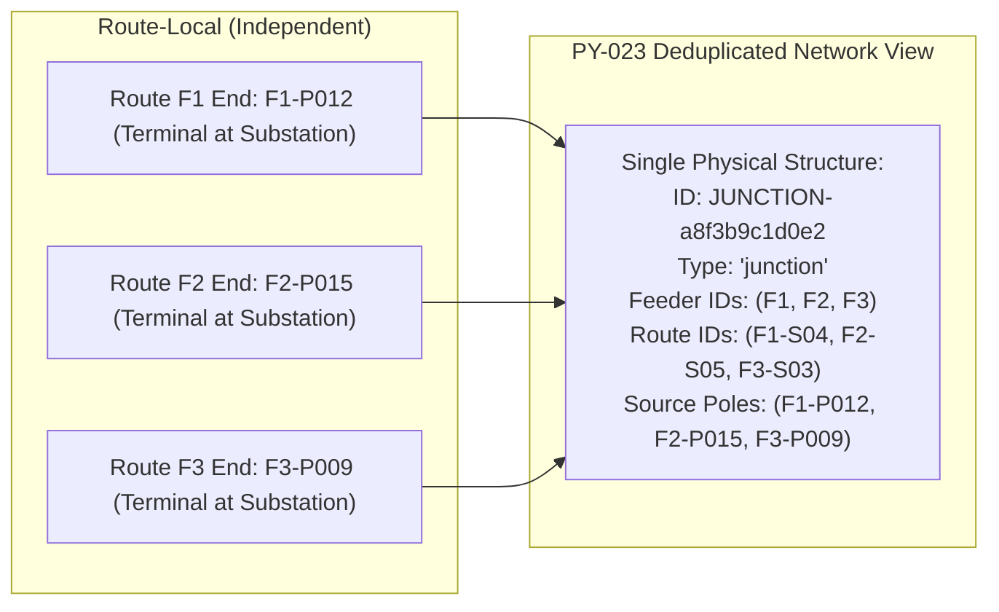

# Variable-Span Pole Placement & Network Deduplication

> [!success] Implementation Status: Fully Implemented (SURGE-PY-010 / PY-023 / PY-024)
> `app/algorithms/pole_placement.py` implements geometry-based variable-span pole placement along refined physical routes (PY-010), network-level endpoint deduplication into distinct physical junction structures (PY-023), and end-to-end integration with the recommended PNC network workflow (PY-024).

---

## 1. Overview & Pipeline Position

In an overhead collector network ($33\text{ kV}$), conductors are supported by discrete pole structures. Pole placement converts continuous refined route centrelines into discrete structural assets and conductor spans:

```text
Refined LineString Geometry (PY-009)
    ──> Route-Local Variable-Span Placement (PY-010)
    ──> Batch Per-Feeder Sequencing (place_poles_on_routes)
    ──> Network-Level Endpoint Deduplication (PY-023)
    ──> PhysicalPole View & Lifecycle Costing (PY-024 / PY-028)
```



---

## 2. Structure Classifications

SURGE recognizes 4 distinct physical pole classes:

| Pole Class | Role in Network | Placement Criteria |
| :--- | :--- | :--- |
| `terminal` | Dead-end / Anchor structure | Placed at route start ($d = 0$) and route end ($d = L$). Anchors full line tension at WTG and substation interfaces. |
| `angle` | Tension / Direction change | Placed at interior LineString vertices where line deflection $\theta_{\text{deflection}} \geq \theta_{\text{threshold}}$ (default $10.0^\circ$). |
| `intermediate` | Suspension / Tangent pole | Evenly spaced fill structures along straight sections between mandatory poles to keep conductor sag within allowable limits. |
| `junction` | Multi-circuit junction hub | Created when multiple route endpoints converge at the same physical topology node (e.g. substation bus or tee-off). Formed via PY-023 deduplication. |

---

## 3. Placement Algorithm (SURGE-PY-010)

### 3.1 Deflection Angle Calculation
At each interior vertex $i$ of a route LineString with coordinates $(x_{i-1}, y_{i-1})$, $(x_i, y_i)$, and $(x_{i+1}, y_{i+1})$, the forward direction vectors are:
$$
\vec{v}_{\text{prev}} = (x_i - x_{i-1}, y_i - y_{i-1}), \quad \vec{v}_{\text{next}} = (x_{i+1} - x_i, y_{i+1} - y_i)
$$

The deflection angle $\theta_{\text{deflection}}$ is computed via the clamped vector dot product:
$$
\cos \theta = \frac{\vec{v}_{\text{prev}} \cdot \vec{v}_{\text{next}}}{\|\vec{v}_{\text{prev}}\| \|\vec{v}_{\text{next}}\|}
$$
$$
\theta_{\text{deflection}} = \arccos(\text{clamp}(\cos \theta, -1.0, 1.0)) \times \frac{180^\circ}{\pi}
$$
- $0^\circ$: Straight continuation.
- $90^\circ$: Right-angle turn.
- $180^\circ$: Complete reversal.

If $\theta_{\text{deflection}} \geq \text{angle\_pole\_threshold\_deg}$, vertex $i$ becomes a mandatory angle pole.

### 3.2 Section Partitioning & Span Count Rules
Mandatory pole positions (terminals and angles) divide the route into independent sections of arc-length $L_{\text{section}}$:

1. **Soft Minimum Threshold (`min_span_m`)**: If $L_{\text{section}} \leq \text{min\_span\_m}$, no intermediate fill poles are added. (Mandatory angle poles are never removed).
2. **Initial Span Count**:
   $$
   N_{\text{spans}} = \max\left(1, \text{round}\left(\frac{L_{\text{section}}}{S_{\text{target}}}\right)\right)
   $$
   where $S_{\text{target}}$ is `target_span_m` (e.g. $100\text{ m}$).
3. **Hard Maximum Span Enforcement (`max_span_m`)**:
   While $\frac{L_{\text{section}}}{N_{\text{spans}}} > S_{\max} + \epsilon$, increment $N_{\text{spans}} \leftarrow N_{\text{spans}} + 1$.
4. **Intermediate Spacing**: Fill poles are placed at uniform intervals $d_k = d_{\text{start}} + k \times \frac{L_{\text{section}}}{N_{\text{spans}}}$ for $k \in \{1, \dots, N_{\text{spans}} - 1\}$.

### 3.3 Chord Span Length
For adjacent poles with 2D coordinates $P_i$ and $P_{i+1}$, the conductor span length is measured as the Euclidean chord distance:
$$
\text{span\_length\_m} = \|P_{i+1} - P_i\|_2
$$
This represents the actual physical straight span between crossarms, which may be slightly shorter than the centerline arc-length when minor sub-threshold bends occur between poles.

---

## 4. Network Endpoint Deduplication (SURGE-PY-023)

In radial collector networks, multiple route segments terminate at shared facilities (such as the main collector substation or a shared junction node). Route-local placement generates independent terminal poles for each segment, which would artificially multiply physical structure counts and CAPEX if not deduplicated.

`deduplicate_pole_endpoints()` executes a network-level post-pass:



### 4.1 Strict Pairwise Clustering Invariant
A terminal pole record joins an endpoint cluster if and only if:
1. It shares the exact same `topology_node_id` (e.g. `substation:SUB_MAIN`).
2. Its route ID is distinct from existing cluster members.
3. Its projected coordinate is within `coordinate_tolerance_m` (default $0.1\text{ m}$) of **every existing member** in the cluster (preventing chained drift).

### 4.2 Merged Identity & Class Promotion
- Any cluster containing $\geq 2$ route endpoints is promoted to `pole_type = "junction"`.
- The pole ID is deterministically generated from a SHA-256 digest:
  $$
  \text{pole\_id} = \text{JUNCTION-} + \text{SHA256}(\text{repr}((\text{node\_id}, \text{feeder\_ids}, \text{route\_ids})))[:12]
  $$
- The physical coordinate is preserved from the deterministically sorted first member (avoiding off-route centroid drift).

### 4.3 Separation of Spans and Structures
- `total_spans`: Retains the total number of overhead conductor spans across all routes (needed for conductor stringing).
- `total_poles`: Reports the true number of distinct physical structures (needed for foundation and structure CAPEX).

---

## 5. Domain Models

```python
@dataclass(frozen=True)
class PolePlacementConfig:
    target_span_m: float                # Preferred span (e.g. 100.0 m)
    min_span_m: float                   # Subdivision threshold (e.g. 40.0 m)
    max_span_m: float                   # Hard upper limit (e.g. 250.0 m)
    angle_pole_threshold_deg: float = 10.0
    coordinate_tolerance_m: float = 0.1

@dataclass(frozen=True)
class PhysicalPole:
    pole_id: str
    geometry: Point
    pole_type: str                      # "terminal" | "angle" | "intermediate" | "junction"
    feeder_ids: tuple[str, ...]
    route_ids: tuple[str, ...]
    source_pole_ids: tuple[str, ...]
    topology_node_id: str | None

@dataclass(frozen=True)
class CollectorPoleResult:
    routes: tuple[PoleRouteResult, ...]
    total_poles: int                    # Distinct physical structures
    total_spans: int                    # Total conductor spans
    physical_poles: tuple[PhysicalPole, ...]
```

---

## 6. Related Notes

- [[Routing]] — Refined physical route geometry inputs.
- [[Feeder Planning]] — Feeder architecture and network topology.
- [[Cost Model]] — Exact Decimal pole CAPEX pricing by structure type.
- [[Per-Feeder MST Topology]] — Topology graph node definitions.
