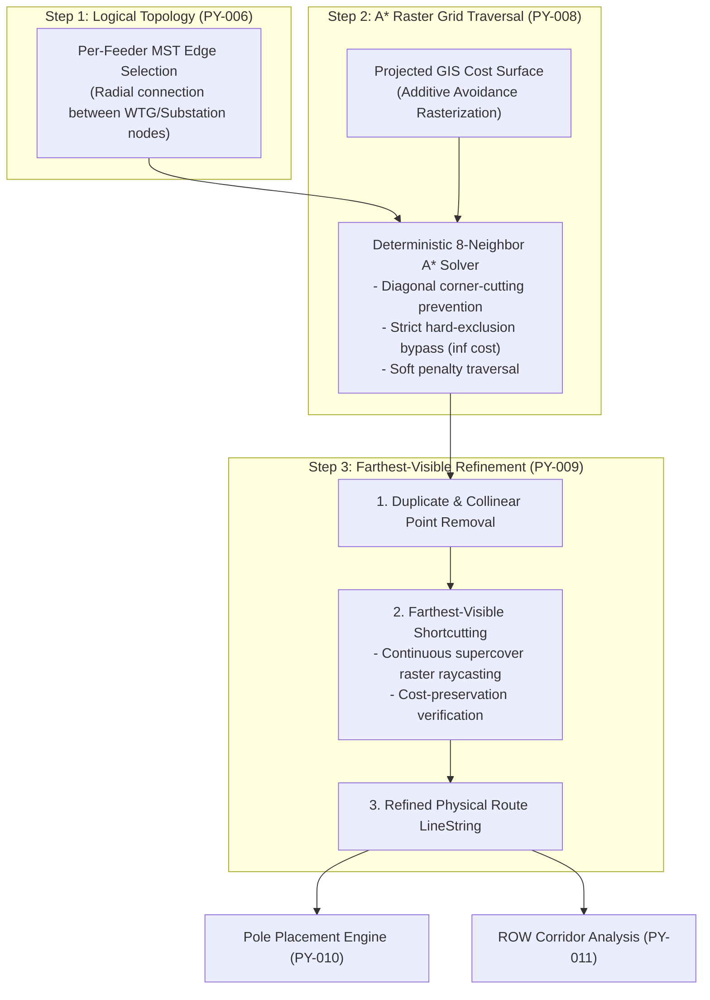

# Spatial Physical Routing & Geometric Refinement

> [!success] Implementation Status: Fully Implemented (SURGE-PY-008 / PY-009 / PY-021)
> `app/algorithms/physical_routing.py`, `app/algorithms/a_star.py`, and `app/algorithms/route_refinement.py` implement the complete 3-step routing pipeline: converting logical graph edges into optimal raster paths across the [[GIS Cost Surface]] with avoidance layers, followed by farthest-visible continuous supercover geometry refinement.

---

## 1. The 3-Step Routing Pipeline

Spatial routing in SURGE bridges the gap between abstract network graph connections and constructible physical terrain corridors:



---

## 2. Step 1: Logical Topology
Logical edge selection is performed by [[Per-Feeder MST Topology]]. It establishes *which* assets connect within each feeder group. The start and end coordinates of each selected edge are projected into the project's metric Coordinate Reference System (UTM).

---

## 3. Step 2: Physical A* Routing on Cost Surface (SURGE-PY-008)

For each logical edge $(u, v)$:
1. **Coordinate Mapping**: Converts the projected metric coordinates $(x_u, y_u)$ and $(x_v, y_v)$ into 2D raster grid cell indices $(r_{\text{start}}, c_{\text{start}})$ and $(r_{\text{goal}}, c_{\text{goal}})$.
2. **Endpoint Validation**: Verifies that both start and goal cells lie within the raster bounds and have finite cost ($< \infty$). An endpoint positioned inside a buffered hard exclusion zone is immediately rejected with HTTP 422.
3. **8-Neighbor A* Search**:
   - **Cost Function**: $g(n)$ accumulates traversal costs between adjacent cells.
   - **Heuristic**: $h(n)$ is the Euclidean distance from cell $n$ to goal multiplied by the minimum base surface cost (guaranteeing admissibility).
   - **Diagonal Movement & Corner-Cutting Prevention**: Movement to diagonal neighbors $(\pm 1, \pm 1)$ has distance $\sqrt{2} \times \text{resolution\_m}$. Diagonal traversal is prohibited if either adjacent orthogonal neighbor is blocked ($\infty$), preventing conductor paths from clipping the corner of a hard obstacle.
4. **Coordinate Reconstruction**: The sequence of traversed raster cells is mapped back to projected world coordinates, retaining exact sub-cell start and end point locations.

---

## 4. Step 3: Farthest-Visible Route Refinement (SURGE-PY-009)

Raw A* output consists of discrete, 8-directional grid steps ($0^\circ, 45^\circ, 90^\circ, \dots$) that do not reflect real transmission line construction practices. Refinement simplifies the path into long, constructible straight tangent spans without violating spatial constraints.

### 4.1 Cleaning Passes
1. **Duplicate Point Removal**: Eliminates consecutive identical coordinates within $\epsilon = 10^{-12}\text{ m}$.
2. **Collinear Point Removal**: Removes intermediate vertices lying along straight lines where direction does not change.

### 4.2 Farthest-Visible Shortcutting & Continuous Supercover
Starting at vertex $i$, the algorithm seeks the farthest forward vertex $j > i + 1$ such that a direct line segment $\overline{P_i P_j}$ can safely replace all intermediate vertices $\{P_{i+1}, \dots, P_{j-1}\}$:

```text
A* Raw Path:      P_i ───> P_{i+1} ───> P_{i+2} ───> P_j
Shortcut:         P_i ─────────────────────────────> P_j  (Direct line-of-sight)
```

A shortcut is accepted if and only if **both** conditions are met:
1. **Zero Blocked Cells (Continuous Supercover)**:
   - `segment_supercover_cells()` calculates all grid cells intersected by the continuous world-coordinate segment $\overline{P_i P_j}$ (using exact floating-point raster boundary crossings).
   - If any touched cell has infinite cost ($C_{\text{cell}} = \infty$), the shortcut is rejected.
2. **Cost-Preservation ($\Delta C \leq 0$)**:
   - The continuous line-integral traversal cost of the shortcut must not exceed the replaced subpath traversal cost:
     $$
     \int_{\overline{P_i P_j}} C(\vec{r}) \, ds \leq \int_{\text{subpath}} C(\vec{r}) \, ds + \epsilon_{\text{cost}}
     $$
   - This ensures a shortcut does not cut across a high-penalty soft zone (e.g. crossing private parcel land) just to shave off minor geometric distance.

---

## 5. Domain Models & API Metrics

```python
@dataclass(frozen=True)
class RefinedPhysicalRoute:
    feeder_id: str
    start_node_id: str
    end_node_id: str
    geometry: LineString                # Refined metric LineString
    original_length_m: float            # Raw A* discrete path length
    refined_length_m: float             # Post-refinement smoothed length
    original_traversal_cost: float      # Discrete A* path cost
    refined_traversal_cost: float       # Continuous integrated cost of refined geometry
    route_id: str | None = None
```

### Invariants & Guarantees:
- **Refined Length Property**: Refinement strictly reduces or preserves route length:
  $$
  \text{refined\_length\_m} \leq \text{original\_length\_m} + 10^{-6}
  $$
- **Exact Endpoints**: Start and goal coordinates are bit-identical to the original WTG and substation coordinates.
- **WGS84 Transformation**: Exported GeoJSON coordinates are transformed back to WGS-84 (`EPSG:4326`) with 7-decimal-place precision ($\approx 1\text{ cm}$).

---

## 6. Multi-Scenario Cost Biasing

The Java backend (`OptimizationJobService`) and Python optimizer support dynamic scenario biasing by varying avoidance cost weights during A* rasterization:

| Scenario Profile | Avoidance Biasing Strategy |
| :--- | :--- |
| **Balanced** | Standard soft penalties ($w_{\text{road}} = 20.0$, $w_{\text{parcel}} = 10.0$, $w_{\text{water}} = 25.0$). |
| **Lowest Capital Cost** | Minimizes total route length; lower penalty weights to favor direct paths where acceptable. |
| **Minimal Environmental Impact** | Multiplies soft penalties by $2.5\times$; increases hard exclusion buffer clearances by $+25\text{ m}$. |
| **Maximum Reliability** | Strict HT-line clearance; penalizes angle turns and crossings. |

---

## 7. Related Notes

- [[GIS Cost Surface]] — Raster array generation, padding, affine transform.
- [[Constraint-aware Routing]] — Typed avoidance layers and routing modes.
- [[Per-Feeder MST Topology]] — Logical candidate graph and MST selection.
- [[Pole Placement]] — Discrete structure placement along refined centrelines.
- [[ROW Corridor Analysis]] — Right-of-way corridor buffering and intersection checks.
- [[Cost Model]] — Conductor, pole, land, and loss lifecycle costing.
