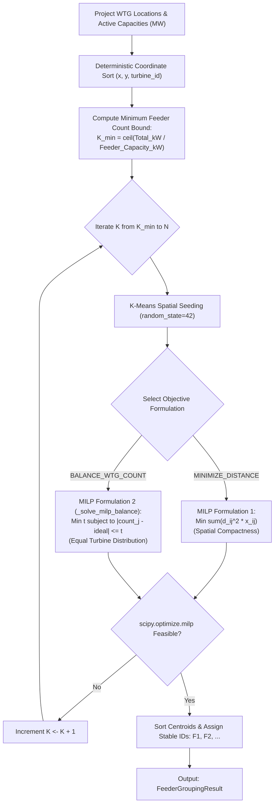

# WTG Grouping & Capacitated Feeder Assignment

> [!success] Implementation Status: Fully Implemented (SURGE-PY-005)
> `app/algorithms/wtg_grouping.py` implements capacity-constrained turbine clustering using a deterministic hybrid of spatial K-Means clustering and Mixed-Integer Linear Programming (MILP) via `scipy.optimize.milp`, supporting dual optimization objectives (`MINIMIZE_DISTANCE` and `BALANCE_WTG_COUNT`).

---

## 1. Overview & Problem Definition

In wind farm collector systems, turbines are grouped into medium-voltage ($33\text{ kV}$) radial feeder circuits connected to the central substation. Each feeder has a strict physical and electrical capacity ceiling $P_{\text{feeder, max}}$ (typically $20\text{--}35\text{ MW}$ based on cable thermal ampacity).

WTG grouping solves the **Capacitated Clustering Problem (CCP)**:
- Partition $N$ turbines into the minimum number of feasible feeders $K$.
- Ensure no feeder's aggregate active generation exceeds $P_{\text{feeder, max}}$:
  $$
  \sum_{i \in \text{Feeder } j} P_i \leq P_{\text{feeder, max}} \quad \forall j \in \{1, \dots, K\}
  $$
- Ensure every turbine belongs to exactly one feeder ($\bigcup F_j = \{1, \dots, N\}$ and $F_j \cap F_k = \emptyset$).



---

## 2. Dual MILP Objectives

SURGE provides two distinct MILP optimization objectives via `GroupingObjective`:

```python
class GroupingObjective(StrEnum):
    MINIMIZE_DISTANCE = "minimize_distance"
    BALANCE_WTG_COUNT = "balance_wtg_count"
```

### 2.1 Objective 1: `MINIMIZE_DISTANCE` (Default)
Minimizes the sum of squared Euclidean distances between wind turbines and their assigned K-Means cluster seed centroids:

$$
\min \sum_{i=1}^N \sum_{j=1}^K d_{ij}^2 \, x_{ij}
$$

- $x_{ij} \in \{0, 1\}$: Binary decision variable indicating if turbine $i$ is assigned to feeder $j$.
- $d_{ij}^2 = (x_i - c_{jx})^2 + (y_i - c_{jy})^2$: Squared distance from turbine $i$ to centroid $j$.
- **Result**: Produces spatially compact, geographically localized feeder clusters that minimize overall collector cable length.

### 2.2 Objective 2: `BALANCE_WTG_COUNT` (`_solve_milp_balance`)
Replaces the distance objective with an objective that minimizes the maximum deviation of turbine count from the ideal equal distribution across feeders ($\text{ideal} = N / K$):

$$
\min t
$$

Subject to:
$$
\begin{aligned}
\sum_{j=1}^K x_{ij} &= 1 && \forall i \in \{1, \dots, N\} && \text{(Unique assignment)} \\
\sum_{i=1}^N P_i \, x_{ij} &\leq P_{\text{feeder, max}} && \forall j \in \{1, \dots, K\} && \text{(Capacity ceiling)} \\
\sum_{i=1}^N x_{ij} - t &\leq \frac{N}{K} && \forall j \in \{1, \dots, K\} && \text{(Balance upper bound)} \\
-\sum_{i=1}^N x_{ij} - t &\leq -\frac{N}{K} && \forall j \in \{1, \dots, K\} && \text{(Balance lower bound)} \\
x_{ij} &\in \{0, 1\}, \quad t \geq 0
\end{aligned}
$$

- **Result**: Balances the operational load and maintenance scope by assigning approximately equal numbers of turbines to every collector circuit while strictly respecting electrical ampacity.

---

## 3. Detailed Grouping Algorithm Workflow

1. **Validation & Exact Conversion**:
   - Validates positive finite $P_{\text{feeder, max}}$.
   - Converts MW capacities to exact integer kilowatts ($\text{kW}$) using `Decimal` (rejects values with $>3$ decimal places) to prevent floating-point representation leakage.
   - Verifies no single turbine exceeds $P_{\text{feeder, max}}$.
2. **Deterministic Pre-sorting**:
   - Sorts turbines by projected $(x, y, \text{turbine\_id})$ to achieve strict input-order invariance.
3. **Theoretical Feeder Lower Bound**:
   $$
   K_{\text{base}} = \left\lceil \frac{\sum_{i=1}^N P_{i, \text{kW}}}{P_{\text{feeder, max, kW}}} \right\rceil
   $$
4. **Feasibility Iteration**:
   - Iterates $K \in [K_{\text{base}}, N]$.
   - For a given $K$, if unique coordinates $< K$, uses direct coordinate picks; otherwise runs `sklearn.cluster.KMeans(n_clusters=K, random_state=random_state, n_init="auto")` to compute cluster seed centroids.
   - Formulates and solves the binary MILP with `scipy.optimize.milp`.
   - Stops at the first feasible $K$, ensuring the global minimum number of feeder lines is built.
5. **Post-Processing & Stable Identifiers**:
   - Computes exact geometric centroids $(\bar{x}_j, \bar{y}_j)$ for each cluster.
   - Sorts feeder clusters lexicographically by $(\bar{x}_j, \bar{y}_j)$ and assigned turbine IDs.
   - Assigns stable sequential identifiers `F1`, `F2`, `F3`, etc.

---

## 4. Domain Models

```python
@dataclass(frozen=True)
class FeederAssignment:
    feeder_id: str                      # e.g., "F1"
    turbine_ids: tuple[str, ...]        # Sorted assigned turbine IDs
    total_capacity_mw: float            # Aggregate active capacity
    centroid: Point                     # Projected 2D geometric centroid

@dataclass(frozen=True)
class FeederGroupingResult:
    feeder_count: int                   # Total number of feeder circuits (K)
    assignments: tuple[FeederAssignment, ...]
```

---

## 5. Invariants & Edge Cases

- **Deterministic Replay**: Given identical turbine coordinates and capacities, grouping results are 100% reproducible across operating systems.
- **Coincident Turbines**: Co-located turbines (e.g., multi-rotor platforms or colocated test towers) are handled seamlessly by the MILP without K-Means singularity errors.
- **Ampacity Non-Violation**: An assertion verifies that $\sum P_i \leq P_{\text{feeder, max}}$ for every group; violation raises an immediate `RuntimeError`.

---

## 6. Related Notes

- [[Feeder Planning]] — Complete feeder optimization workflow.
- [[Per-Feeder MST Topology]] — Downstream MST tree generation from feeder assignments.
- [[Routing]] — Physical cable routing over terrain cost surfaces.
- [[Geospatial Integrity & CRS]] — Metric projection and coordinate validation.
