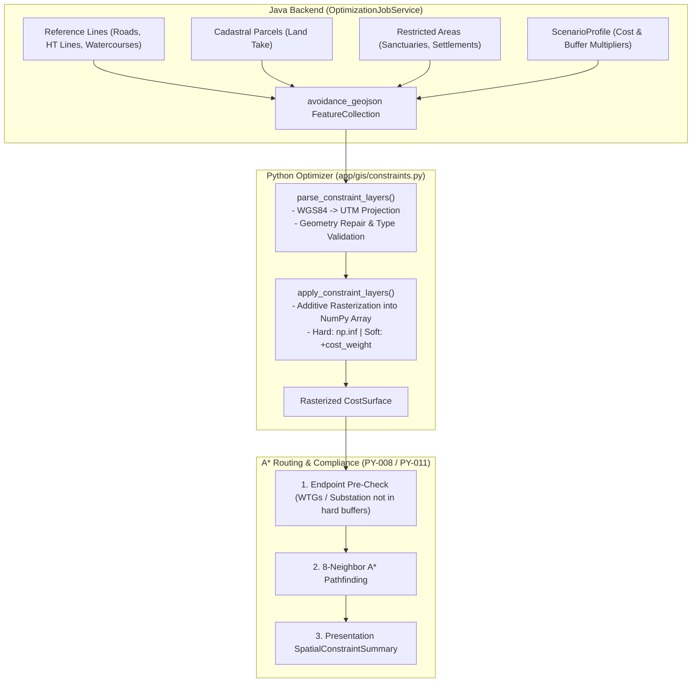

# Constraint-Aware Routing & Spatial Avoidance Layers

> [!success] Implementation Status: Fully Implemented (SURGE-PY-021)
> `app/gis/constraints.py` implements typed spatial constraint parsing and deterministic cost-surface rasterization. In the Java backend, `OptimizationJobService.buildAvoidanceGeoJson()` translates project reference lines, cadastral parcels, and restricted areas into typed GeoJSON features with scenario-biased penalties and buffers.

---

## 1. Overview & Architecture

Collector line routing in wind farms must respect legal, physical, and environmental constraints. SURGE categorizes constraints into **Hard Exclusions** (strictly impassable zones) and **Soft Penalties** (traversable features where crossings or land take incur economic or engineering costs).



---

## 2. Supported Constraint Classifications

SURGE defines 5 standardized `ConstraintType` classifications:

| Constraint Type | Default Mode | Typical Real-World Assets | Treatment in Pipeline |
| :--- | :--- | :--- | :--- |
| `ROAD` | `SOFT_PENALTY` | Highways, district roads, access tracks. | Soft cost penalty ($w = 20.0$). Point crossings are recorded and counted. |
| `HT_LINE` | `SOFT_PENALTY` | Existing high-tension transmission lines ($110\text{--}400\text{ kV}$). | Soft penalty ($w = 30.0$). Enforces clearance to prevent induction/clearance hazards. |
| `WATERCOURSE` | `SOFT_PENALTY` | Rivers, seasonal streams, canals. | Soft penalty ($w = 25.0$). Penalizes span crossings requiring elevated towers. |
| `PARCEL` | `SOFT_PENALTY` | Private agricultural or commercial cadastral land. | Soft penalty ($w = 10.0$). Generates ROW land-take compensation in [[Cost Model]]. |
| `RESTRICTED_AREA` | `HARD_EXCLUSION` | Wildlife sanctuaries, archaeological sites, defense zones, steep cliffs. | Hard exclusion ($C = \infty$). Conductor and buffer cannot enter. |

---

## 3. Policy Properties & Routing Modes

Each feature in `avoidance_geojson` carries explicit policy attributes:

```python
class ConstraintMode(StrEnum):
    HARD_EXCLUSION = "hard_exclusion"
    SOFT_PENALTY = "soft_penalty"

@dataclass(frozen=True)
class ConstraintLayer:
    layer_id: str                       # Unique identifier (e.g., "line-14", "restricted-2")
    layer_type: ConstraintType          # ROAD, HT_LINE, WATERCOURSE, PARCEL, RESTRICTED_AREA
    mode: ConstraintMode                # HARD_EXCLUSION or SOFT_PENALTY
    geometry: BaseGeometry              # Projected Shapely 2D geometry (UTM)
    buffer_m: float                     # Safety clearance / buffer width in meters
    cost_weight: float | None           # Additive cost (required for soft; None for hard)
    crs: CRS                            # Metric projected CRS
```

### 3.1 Hard Exclusions (`HARD_EXCLUSION`)
- Rasterized to positive infinity (`np.inf`) using `rasterio.features.rasterize`.
- **A* Traversal**: A* pathfinding strictly prohibits traversal of cells with cost $\infty$.
- **Disqualification Invariant**: `cost_weight` is prohibited on hard exclusions (raises `ValueError`). Environmental stringency is expressed via increased `buffer_m` instead.

### 3.2 Soft Penalties (`SOFT_PENALTY`)
- Adds a positive finite value `cost_weight` to the existing cell traversal cost:
  $$
  C_{\text{cell}} \leftarrow C_{\text{cell}} + \text{cost\_weight}
  $$
- The router will cross the feature only when detour distance around the obstacle would cost more than the penalty.

---

## 4. Java-to-Python Avoidance Serialization

In `backend-java`, `OptimizationJobService.buildAvoidanceGeoJson()` serializes project constraints dynamically based on the selected `ScenarioProfile`:

```java
// Example: Java building avoidance payload
Map<String, Object> properties = new LinkedHashMap<>();
properties.put("constraint_id", "line-" + line.getId());
properties.put("constraint_type", lineConstraintType(line.getLineType()));
properties.put("routing_mode", "soft");
properties.put("cost_weight", profile.crossingCost(line.getCrossingCost()));
```

### Scenario Bias Multipliers:
- **Balanced**: Standard weights ($w_{\text{road}} = 20.0, w_{\text{parcel}} = 10.0, w_{\text{water}} = 25.0$).
- **Lowest Capital Cost**: Lower penalty multipliers ($0.6\times$) to prioritize short direct lines.
- **Minimal Environmental Impact**: Elevated penalties ($2.5\times$) and extra safety buffer ($\Delta \text{buffer} = +25\text{ m}$) on sensitive areas.
- **Maximum Reliability**: Elevated HT-line crossing penalties ($3.0\times$) and strict angle limits.

---

## 5. Compliance Verification & Spatial Constraint Summary

After routing and refinement, the pipeline calculates a `SpatialConstraintSummary` returned in the API and displayed in the frontend Decision Summary:

```python
@dataclass(frozen=True)
class SpatialConstraintSummary:
    hard_exclusion_violation_count: int         # MUST BE 0 for a valid route
    soft_constraint_intersection_count: int     # Count of soft layer contact events
    soft_constraint_overlap_length_m: float     # Total route length inside soft zones
    road_crossing_count: int                    # Distinct transverse road crossings
    affected_parcel_count: int                  # Unique parcels entered by ROW corridor
```

### Endpoint Safety Invariant:
Before running A*, all turbine and substation coordinates are tested against buffered hard exclusions. If a turbine is located inside a hard restricted area, the job fails immediately with HTTP 422:
```text
"Turbine WTG04 is located within hard exclusion zone 'restricted-sanctuary-north'"
```

---

## 6. Related Notes

- [[GIS Cost Surface]] — Raster data structures, affine transformations, and resolution.
- [[Routing]] — 3-step physical A* routing and farthest-visible refinement.
- [[ROW Corridor Analysis]] — Detailed polygon buffering and cadastral parcel intersection.
- [[Explainability]] — Decision Summary Card and audit logging.
- [[Cost Model]] — Land ROW compensation pricing.
