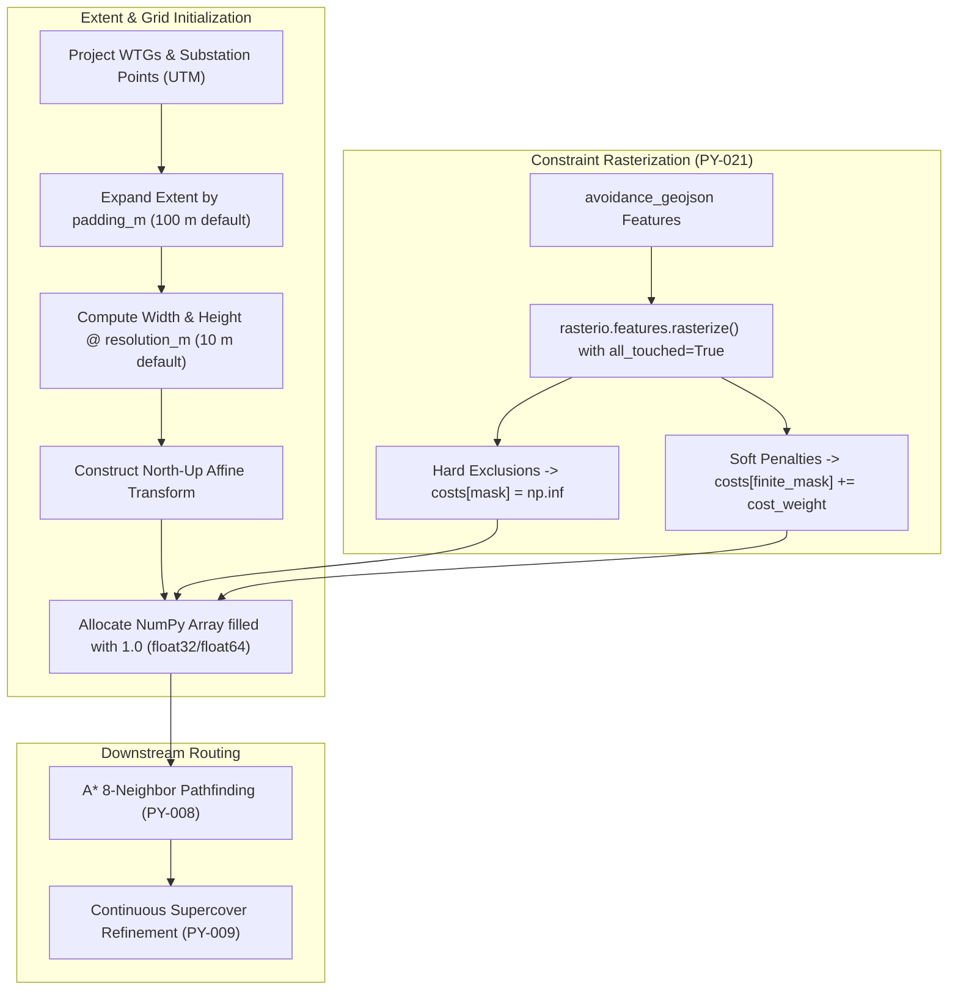

# GIS Cost Surface Architecture (SURGE-PY-007)

> [!success] Implementation Status: Fully Implemented & Integrated
> `app/gis/cost_surface.py` constructs a high-performance projected 2D raster cost surface using NumPy arrays and affine coordinate transforms, serving as the spatial foundation for A* grid routing and constraint rasterization.

---

## 1. Overview & Mathematical Purpose

A **Cost Surface** is a 2D discrete grid where each cell $(r, c)$ represents a geographical area of size $r \times r$ meters and stores the scalar cost of traversing that cell.

The total cost to traverse between adjacent cells is governed by:

$$
C_{\text{traversal}} = d_{\text{step}} \times \left( \frac{C(r_1, c_1) + C(r_2, c_2)}{2} \right)
$$

Where:
- $d_{\text{step}} = \text{resolution\_m}$ for orthogonal moves ($\text{N, S, E, W}$).
- $d_{\text{step}} = \sqrt{2} \times \text{resolution\_m}$ for diagonal moves ($\text{NE, NW, SE, SW}$).
- $C(r, c) = 1.0$ (base traversable terrain).
- $C(r, c) = 1.0 + \sum w_i$ (soft penalties for roads, parcels, watercourses).
- $C(r, c) = \infty$ (hard exclusion zones).



---

## 2. The `CostSurface` Domain Model

```python
@dataclass(frozen=True)
class CostSurface:
    costs: np.ndarray                   # 2D float array indexed as [row, column]
    transform: Affine                   # Affine mapping: (col, row) <-> (x, y)
    crs: CRS                            # Metric projected CRS (e.g., EPSG:32643)
    width: int                          # Grid columns (X-axis)
    height: int                         # Grid rows (Y-axis)
    resolution_m: float                 # Cell dimension in meters (e.g. 10.0 m)
```

---

## 3. Extent Construction & Affine Transformation

### 3.1 Bounding Box Calculation
Given project coordinates $\{ (x_i, y_i) \}_{i=1}^N$:
$$
x_{\min} = \min(x_i) - \text{padding\_m}, \quad x_{\max} = \max(x_i) + \text{padding\_m}
$$
$$
y_{\min} = \min(y_i) - \text{padding\_m}, \quad y_{\max} = \max(y_i) + \text{padding\_m}
$$

Grid dimensions use ceiling division:
$$
\text{width} = \max\left(1, \left\lceil \frac{x_{\max} - x_{\min}}{\text{resolution\_m}} \right\rceil\right), \quad \text{height} = \max\left(1, \left\lceil \frac{y_{\max} - y_{\min}}{\text{resolution\_m}} \right\rceil\right)
$$

### 3.2 North-Up Affine Transform Matrix
The raster uses standard GIS convention where row $0$ is the northernmost (top) row:

$$
\begin{bmatrix} x \\ y \\ 1 \end{bmatrix} =
\begin{bmatrix}
\text{resolution\_m} & 0 & x_{\min} \\
0 & -\text{resolution\_m} & y_{\max} \\
0 & 0 & 1
\end{bmatrix}
\begin{bmatrix} c \\ r \\ 1 \end{bmatrix}
$$

### 3.3 Coordinate Conversion Functions

1. **`world_to_grid(x, y)`**:
   $$
   c = \left\lfloor \frac{x - x_{\min}}{\text{resolution\_m}} \right\rfloor, \quad r = \left\lfloor \frac{y_{\max} - y}{\text{resolution\_m}} \right\rfloor
   $$
2. **`grid_to_world(r, c)`** (Cell Center):
   $$
   x = x_{\min} + (c + 0.5) \times \text{resolution\_m}
   $$
   $$
   y = y_{\max} - (r + 0.5) \times \text{resolution\_m}
   $$

---

## 4. Additive Constraint Rasterization

When avoidance layers are supplied:
1. Geometry features are buffered in projected metric space (e.g. $10\text{ m}$ road buffer, $25\text{ m}$ restricted zone buffer).
2. `rasterio.features.rasterize()` renders the polygon geometries with `all_touched=True`, ensuring that any raster cell touching the feature boundary is included.
3. **Hard Exclusions**:
   ```python
   costs[mask] = np.inf
   ```
4. **Soft Penalties**:
   ```python
   finite_mask = mask & np.isfinite(costs)
   costs[finite_mask] += layer.cost_weight
   ```
   Multiple overlapping soft constraints (e.g., crossing a road that runs inside a private parcel) accumulate additively.

---

## 5. Performance & Memory Characteristics

- **Memory Efficiency**: For a large $10\text{ km} \times 10\text{ km}$ wind farm at $10\text{ m}$ resolution ($1,000 \times 1,000 = 1,000,000$ cells), a `float32` array consumes only $\approx 4\text{ MB}$ of RAM.
- **Fast Traversal**: NumPy vectorized indexing allows instant mask application across millions of cells in $<15\text{ ms}$.
- **Resolution Trade-Off**: $10\text{ m}$ resolution captures field boundaries and roads while keeping A* execution under $100\text{ ms}$ per feeder.

---

## 6. Related Notes

- [[Constraint-aware Routing]] — Avoidance layer properties and routing modes.
- [[Routing]] — 3-step physical A* routing and supercover refinement.
- [[Geospatial Integrity & CRS]] — Metric projection and coordinate validation.
- [[ROW Corridor Analysis]] — Continuous vector corridor intersection analysis.
