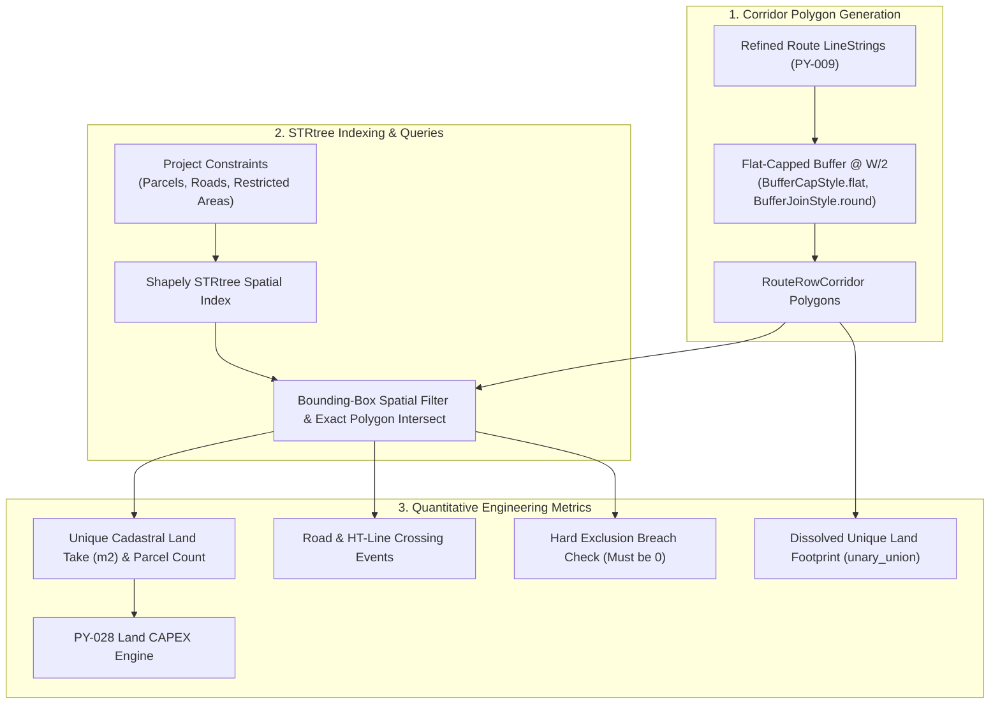
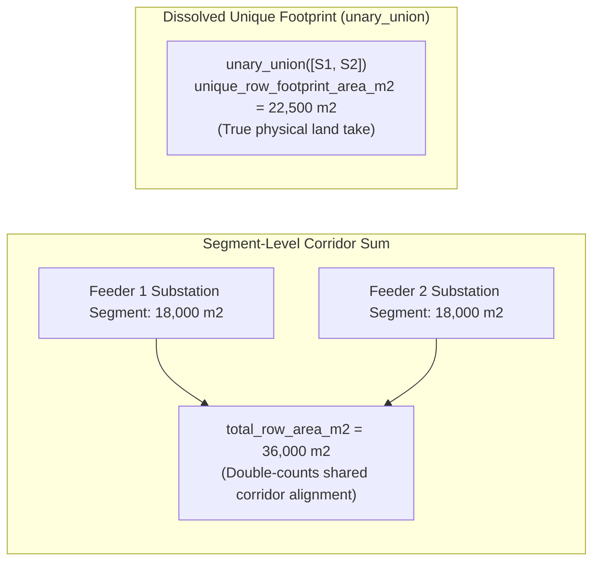

# SURGE-PY-011: ROW Corridor & Constraint Analysis

> [!success] Implementation Status: Fully Implemented & Integrated (SURGE-PY-011 / PY-026 / PY-028)
> `app/gis/row_analysis.py` constructs projected Right-of-Way (ROW) corridor polygons along refined route centrelines and performs high-speed geometric intersection queries via `shapely.strtree.STRtree` against cadastral parcels, road networks, and environmental exclusion zones.

---

## 1. Purpose & Core Concepts

A **Right-of-Way (ROW) Corridor** is the strip of land reserved along a collector power line for safe construction, conductor swing clearance, emergency access, and vegetation maintenance.

SURGE models ROW as a **total metric corridor width** $W_{\text{corridor}}$ (default $18.0\text{ m}$ for $33\text{ kV}$ overhead lines):

$$
\text{Buffer Distance} = \frac{W_{\text{corridor}}}{2} = 9.0\text{ m on each side}
$$



---

## 2. Corridor Geometry & Buffering Rules

Corridor generation adheres to strict geometric constraints defined in `RowConfig`:

```python
@dataclass(frozen=True)
class RowConfig:
    corridor_width_m: float             # Total ROW width in meters (e.g. 18.0 m)
    cap_style: Literal["flat", "round", "square"] = "flat"
    join_style: Literal["round", "mitre", "bevel"] = "round"
    minimum_overlap_area_m2: float = 0.0
    minimum_overlap_length_m: float = 0.0
    crossing_tolerance_m: float = 1e-7
```

### 2.1 Flat End Caps (`BufferCapStyle.flat`)
The buffer terminates with a flat perpendicular edge at the exact start (WTG) and end (substation) coordinates. This prevents the corridor from artificially expanding behind wind turbine towers or substation boundaries.

### 2.2 Rounded Joins (`BufferJoinStyle.round`)
Route direction changes utilize smooth rounded joins to accurately represent conductor blowout clearances at angle structures.

---

## 3. Spatial Intersections & STRtree Performance

For large wind farms with hundreds of parcels and road segments, naive $O(N \times M)$ pairwise geometric intersections are computationally prohibitive. SURGE utilizes an R-tree spatial index via Shapely's `STRtree`:

1. **Index Construction**: Builds an `STRtree` over all validated, projected constraint geometries in $<5\text{ ms}$.
2. **Bounding-Box Filtering**: Queries the tree with each corridor polygon's envelope to retrieve only potential intersection candidates.
3. **Exact Geometric Operations**:
   - `corridor.row_geometry.intersection(feature.geometry)`: Computes exact overlapping polygon area ($\text{m}^2$).
   - `corridor.route_geometry.intersection(feature.geometry)`: Computes centerline traversal length ($\text{m}$).
4. **Touch vs. Penetration**: Records `touches_only = corridor.touches(feature)` to distinguish boundary contact from interior land-take.

---

## 4. Segment Sums vs. Dissolved Unique Footprint

Collector routes often converge into common substation corridors, creating overlapping ROW polygons between different feeders. SURGE explicitly distinguishes between two area metrics:



- **`total_row_area_m2`**: Arithmetic sum of each segment's corridor polygon area. Useful for segment-specific civil clearing estimates.
- **`unique_row_footprint_area_m2`**: Computed via `shapely.ops.unary_union`. Merges overlapping polygons to report the true, distinct land footprint required for the wind farm.

---

## 5. Infrastructure Crossing & Cadastral Calculations

### 5.1 Road & Transmission Line Crossings
- **Linear Features**: Counts distinct transverse crossing points where the route LineString crosses the road/line geometry (`route.crosses(road)`). Multipart crossing points are deduplicated within `crossing_tolerance_m`.
- **Areal Features**: Counts connected positive-length passages through the road polygon footprint.
- **Crossing Count**: Tracks crossing permit requirements and mandatory crossing support clearances.

### 5.2 Cadastral Parcel Land Take & Costing Integration
The intersection results directly feed the [[Cost Model|SURGE-PY-028 Land CAPEX Engine]]:
- `unique_parcel_count`: Multiplied by fixed compensation / legal fee per parcel ($R_{\text{fixed}}$).
- `row_intersection_area_m2` or `route_overlap_length_m`: Multiplied by variable land rate ($R_{\text{variable}}$) depending on the active `LandPricingBasis`.

---

## 6. Domain Models

```python
@dataclass(frozen=True)
class RouteRowCorridor:
    feeder_id: str
    start_node_id: str
    end_node_id: str
    route_geometry: LineString
    row_geometry: Polygon | MultiPolygon
    corridor_width_m: float
    route_length_m: float
    row_area_m2: float

@dataclass(frozen=True)
class RowAnalysisResult:
    corridors: tuple[RouteRowCorridor, ...]
    intersections: tuple[RowIntersection, ...]
    total_row_area_m2: float
    unique_row_footprint_area_m2: float
    unique_parcel_count: int
    road_crossing_count: int
    restricted_intersection_count: int
    unique_restricted_feature_count: int
    has_hard_violation: bool
    skipped_constraints: tuple[SkippedConstraint, ...]
```

---

## 7. Related Notes

- [[Cost Model]] — Exact Decimal Land ROW CAPEX pricing.
- [[Routing]] — Physical A* route generation and geometry refinement.
- [[Constraint-aware Routing]] — Avoidance layer properties and routing modes.
- [[Pole Placement]] — Variable-span pole placement and endpoint deduplication.
- [[Geospatial Integrity & CRS]] — Metric projection and coordinate validation.
