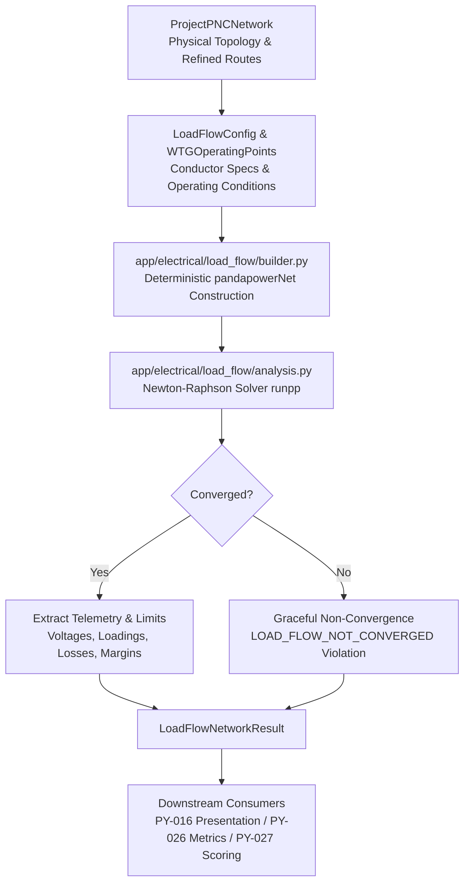

# AC Load Flow Validation

**Ticket:** SURGE-PY-015  
**Module:** `optimisation-python/app/electrical/load_flow/`  
**Status:** Complete & Production-Ready  
**Dependencies:** `pandapower`, `numpy`, `scipy`

---

## Overview

SURGE uses **Pandapower** to perform rigorous, non-linear AC load-flow simulations (using the standard Newton-Raphson method) on physically routed `ProjectPNCNetwork` collector networks.

The core question answered by this package is:
> *“Given a physically routed 33 kV collector topology under specified turbine operating points, is the network steady-state AC load flow convergent and electrically compliant with cable ampacity and voltage limits?”*

This package is non-destructive: it evaluates proposed physical topologies and returns detailed per-bus, per-line, per-feeder, and network-level telemetry without altering or mutating the underlying network.

---

## Architecture & Pipeline Position



---

## Domain Models & Configurations (`models.py` & `config.py`)

### 1. `LoadFlowCableType`
Represents an immutable electrical conductor type in the standard library or custom project specification:
```python
@dataclass(frozen=True)
class LoadFlowCableType:
    cable_type_id: str
    voltage_kv: float = 33.0          # Nominal line-to-line voltage
    r_ohm_per_km: float               # AC resistance at operating temperature (Ω/km)
    x_ohm_per_km: float               # AC reactance at system frequency (Ω/km)
    c_nf_per_km: float                # Capacitance to ground (nF/km)
    max_i_ka: float                   # Rated thermal ampacity (kA)
    parallel_runs: int = 1            # Number of parallel circuits per phase
    derating_factor: float = 1.0      # Thermal installation derating factor
```

### 2. `LoadFlowConfig`
Defines operational parameters, grid limits, and conductor mappings:
```python
@dataclass(frozen=True)
class LoadFlowConfig:
    nominal_voltage_kv: float = 33.0
    v_min_pu: float = 0.95            # Lower statutory voltage limit (0.95 p.u.)
    v_max_pu: float = 1.05            # Upper statutory voltage limit (1.05 p.u.)
    max_line_loading_pct: float = 100.0
    default_cable_type: LoadFlowCableType
    segment_cable_types: dict[str, LoadFlowCableType] = field(default_factory=dict)
```

### 3. `WTGOperatingPoint` & Sign Convention
SURGE uses a **positive generator sign convention**:
- `active_power_mw > 0`: Turbine generates active power and injects it into the 33 kV collector bus.
- `reactive_power_mvar > 0`: Turbine injects inductive reactive power into the collector bus (over-excited, boosting local voltage).
- In Pandapower, generators are modeled via the `sgen` (static generator) element where $P_{\text{sgen}} > 0$ corresponds to generation.

```python
@dataclass(frozen=True)
class WTGOperatingPoint:
    turbine_id: str
    active_power_mw: float            # Injected P (MW) > 0
    reactive_power_mvar: float = 0.0  # Injected Q (MVar)
```

---

## Deterministic Grid Builder (`builder.py`)

The translation from a `ProjectPNCNetwork` to a `pandapowerNet` instance is strictly deterministic:
1. **Lexicographical Sorting**: Node IDs and Segment IDs are sorted lexicographically before insertion into Pandapower dataframes, ensuring identical integer bus/line indices across runs.
2. **Substation Modeling**: The central project substation node is modeled as an **External Grid (`ext_grid`)** slack bus with $V_{\text{slack}} = 1.0\text{ p.u.}$ and $\angle V = 0.0^\circ$.
3. **Collector Lines**: Each `PNCSegment` is modeled as a standard $\Pi$-model `line` with length derived from `route_length_m / 1000.0` (km) and impedance parameters scaled by the assigned `LoadFlowCableType`.
4. **Turbines**: Each WTG is assigned a distinct MV collector bus and a connected `sgen` element mapped to its `WTGOperatingPoint`.
5. **Bidirectional Index Mapping**: `build_load_flow_network()` returns both the `pandapowerNet` object and explicit bidirectional mapping dictionaries (`node_to_bus`, `bus_to_node`, `segment_to_line`, `line_to_segment`), enabling $O(1)$ index translation without heuristic string matching.

---

## Solver Execution & Graceful Non-Convergence (`analysis.py`)

The load-flow solver calls `pandapower.runpp()` with standard Newton-Raphson options:
- `algorithm="nr"`
- `enforce_q_lims=False` (unbounded slack reactive capability for MV collection screening)
- `max_iteration=30`
- `tolerance_mva=1e-3`

### Non-Convergence Protection
Power-flow non-convergence (divergence due to extreme impedance, severe overloads, or ill-conditioned topologies) does **not** raise an unhandled exception or crash the orchestration pipeline. It is trapped structurally:

```python
try:
    pp.runpp(net, algorithm="nr", max_iteration=30, tolerance_mva=1e-3)
except (pp.LoadflowNotConverged, Exception) as exc:
    logger.warning("Pandapower AC load-flow did not converge: %s", exc)
    return LoadFlowNetworkResult(
        converged=False,
        is_valid=False,
        violations=(
            LoadFlowViolation(
                code="LOAD_FLOW_NOT_CONVERGED",
                message=f"AC load-flow failed to converge: {exc}",
                element_id=network.project_id,
            ),
        ),
    )
```

This ensures that:
- Non-converged candidates remain visible in comparison tables and logs.
- Downstream multi-objective scoring (`app/optimisation/scoring.py`) marks the candidate as infeasible with zero benefit score, preventing it from being selected as the recommended design.
- The presentation layer (`app/presentation/`) produces a valid map containing the physical routes and an explicit convergence failure banner.

---

## Extracted Electrical Telemetry

For converged networks, `run_load_flow()` computes and validates:

### 1. Bus Results (`LoadFlowBusResult`)
- `vm_pu`: Voltage magnitude in per-unit ($V / V_{\text{nominal}}$).
- `va_degree`: Voltage angle in degrees.
- `p_mw`, `q_mvar`: Net active and reactive power demand / generation.
- **Voltage Violations**: Emitted if $V < V_{\min}$ (`UNDER_VOLTAGE`) or $V > V_{\max}$ (`OVER_VOLTAGE`).

### 2. Segment / Line Results (`LoadFlowSegmentResult`)
- `loading_pct`: Thermal line loading percentage relative to derated ampacity ($I_{\max} / I_{\text{rated}} \times 100$).
- `i_ka`: Current magnitude (kA).
- `p_loss_mw`, `q_loss_mvar`: Real and reactive power losses in the line segment.
- **Overload Violations**: Emitted if `loading_pct` $> 100.0\%$ (`CABLE_OVERLOAD`).

### 3. Feeder & Network Aggregates (`LoadFlowNetworkResult`)
- `total_generation_p_mw`, `total_generation_q_mvar`: Total injected active and reactive power.
- `total_loss_p_mw`, `total_loss_q_mvar`: Total conductor losses across the entire wind farm.
- `max_loading_pct`: Peak cable loading across all segments.
- `min_vm_pu`, `max_vm_pu`: Extreme bus voltages observed across all nodes.
- `voltage_margin_pu`: Operating margin to the closest statutory limit:
  $$\text{margin} = \min(V_{\max} - V_{\text{worst\_high}}, V_{\text{worst\_low}} - V_{\min})$$

---

## Downstream Integration

- **[[presentation-boundary|Presentation Boundary (SURGE-PY-016)]]**: Maps bus voltages and segment currents directly to WGS84 GeoJSON properties (`voltage_pu`, `current_a`, `loss_kw`, `loading_pct`).
- **[[Canonical Candidate Engineering Metrics|Canonical Metrics (SURGE-PY-026)]]**: Feeds `active_loss_mw`, `max_cable_loading_pct`, and `voltage_operating_margin_pu` directly into candidate comparison datasets.
- **[[Multi-Objective Candidate Scoring|Candidate Scoring (SURGE-PY-027)]]**: Normalizes active losses and cable loadings (lower is better) and voltage operating margins (higher is better) for multi-criteria candidate ranking.
- **[[Surge MVP Ticket Plan|Lifecycle Costing (SURGE-PY-028)]]**: Multiplies `total_loss_p_mw` by project operating hours (8,760 h/yr), capacity factor, and unit energy tariff to compute 25-year discounted OPEX NPV.

---

## Related Notes

- [[PNC Network Assembly]]
- [[presentation-boundary|Python Presentation Boundary]]
- [[Canonical Candidate Engineering Metrics]]
- [[Multi-Objective Candidate Scoring]]
- [[Electrical Feeder Screening]]
- [[Overview & Layout]]
