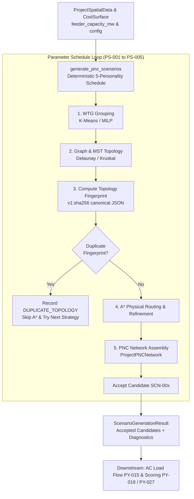

# Candidate PNC Scenario Generation

**Ticket:** SURGE-PY-017  
**Module:** `optimisation-python/app/optimisation/` (`scenarios.py`, `scenario_models.py`)  
**Status:** Complete & Production-Ready  
**Dependencies:** `app.pnc.assembly`, `app.algorithms.wtg_grouping`, `app.algorithms.topology`

---

## Overview

SURGE-PY-017 extends the optimization engine from generating a single static collector layout to producing a deterministic cohort of **1 to 5 distinct, structurally valid `ProjectPNCNetwork` candidates**.



---

## Deterministic Parameter Schedule

To create structurally diverse yet engineering-sound network alternatives, the generator iterates through a fixed parameter schedule of five distinct optimization personalities:

| Personality ID | Strategy Name | KMeans Seed | MILP Grouping Objective | Edge-Weight Profile | Engineering Rationale |
|---|---|---|---|---|---|
| **PS-001** | `baseline` | 42 | `MINIMIZE_DISTANCE` | Default Euclidean | Standard baseline layout prioritizing shortest straight-line turbine connections. |
| **PS-002** | `alternative_grouping` | 17 | `MINIMIZE_DISTANCE` | Default Euclidean | Shifts KMeans centroid initialization, creating an alternative spatial partitioning of wind turbines across feeders. |
| **PS-003** | `balanced_feeders` | 42 | `BALANCE_WTG_COUNT` | Default Euclidean | Solves a dedicated MILP formulation that minimizes the variance of turbine counts per feeder, balancing electrical loading. |
| **PS-004** | `long_edge_penalty` | 42 | `MINIMIZE_DISTANCE` | Non-uniform convex penalty ($\alpha = 2.0$) | Heavily penalizes long collector runs, encouraging compact clustering and local stringing. |
| **PS-005** | `alternative_grouping_balanced` | 7 | `BALANCE_WTG_COUNT` | Default Euclidean | Combines alternative spatial seeding with feeder turbine count balancing for dense 5-candidate explorations. |

### Determinism Guarantee
For identical `ProjectSpatialData`, `feeder_capacity_mw`, and `CostSurface`, `generate_pnc_scenarios()` is guaranteed to produce byte-for-byte identical candidates in the exact same sequence with identical fingerprints.

---

## Strategy Mechanics

### 1. PS-001: Baseline
Executes the standard pipeline. Groups turbines using constrained K-Means ($k = \lceil \sum P_{\text{wtg}} / C_{\text{feeder}} \rceil$) and solves an integer linear program (ILP) minimizing total turbine-to-cluster distance.

### 2. PS-002: Alternative Grouping
Passes `random_state=17` to `group_wtgs()`. The shifted initial centroid seeds alter the feeder cluster boundaries while strictly respecting the maximum feeder capacity constraint ($C_{\text{feeder}}$).

### 3. PS-003: Balanced Feeders (`_solve_milp_balance`)
Activates `GroupingObjective.BALANCE_WTG_COUNT` in `wtg_grouping.py`. Rather than solely minimizing spatial distance, the MILP objective minimizes the maximum deviation of turbine count per feeder from the ideal average ($N / k$):

$$\begin{aligned}
\min_{x, t} \quad & t \\
\text{subject to} \quad & \sum_{j=1}^k x_{ij} = 1 \quad \forall i \in \{1, \dots, N\} \\
& \sum_{i=1}^N P_i x_{ij} \le C_{\text{feeder}} \quad \forall j \in \{1, \dots, k\} \\
& \sum_{i=1}^N x_{ij} - \frac{N}{k} \le t \quad \forall j \in \{1, \dots, k\} \\
& \frac{N}{k} - \sum_{i=1}^N x_{ij} \le t \quad \forall j \in \{1, \dots, k\} \\
& x_{ij} \in \{0, 1\}, \quad t \ge 0
\end{aligned}$$

### 4. PS-004: Long-Edge Penalty Profile
Applies a non-uniform convex penalty transformation to graph edge weights prior to Kruskal MST construction:

$$w' = w \cdot \left(1 + \alpha \cdot \frac{w}{w_{\max}}\right)$$

where $\alpha = 2.0$ and $w_{\max}$ is the maximum finite edge weight in the candidate graph. This quadratic amplification makes long single-span interconnections disproportionately expensive compared to multi-hop short spans, altering the chosen MST tree topology.

### 5. PS-005: Alternative Grouping + Balanced
Applies `random_state=7` combined with the `BALANCE_WTG_COUNT` MILP objective, providing a fifth unique configuration for extensive comparison cohorts.

---

## Topology Fingerprinting & Pre-Routing Deduplication

Grid-based A* raster routing (`app/algorithms/a_star.py`) over high-resolution cost surfaces is the most computationally expensive stage of optimization. To eliminate redundant routing calculations, SURGE computes a **canonical topology fingerprint** immediately after MST construction and before physical routing.

### Fingerprint Schema: `v1:<sha256>`
The fingerprint is constructed from sorted, canonical JSON representations of feeder groupings and topological graph edges:

```json
[
  {
    "wtgs": ["wtg:T01", "wtg:T02", "wtg:T03"],
    "edges": ["substation:SUB1:wtg:T01", "wtg:T01:wtg:T02", "wtg:T02:wtg:T03"]
  },
  {
    "wtgs": ["wtg:T04", "wtg:T05"],
    "edges": ["substation:SUB1:wtg:T04", "wtg:T04:wtg:T05"]
  }
]
```

1. Each edge is formatted as `nodeA:nodeB` with node IDs sorted lexicographically.
2. Edge lists within each feeder are sorted lexicographically.
3. Feeder records are sorted based on their canonical serialized content (ensuring feeder permutation invariance).
4. The entire JSON structure is hashed using SHA-256 and prefixed with `v1:`.

### Pre-Routing Short-Circuiting
If an attempt produces a topology fingerprint that matches an already accepted candidate in the current run:
- The attempt is aborted before running A* or route refinement.
- An `AttemptOutcome.DUPLICATE_TOPOLOGY` diagnostic record is logged.
- The generator advances to the next personality in the parameter schedule.

---

## Domain Models (`scenario_models.py`)

### `ScenarioGenerationConfig`
```python
@dataclass(frozen=True)
class ScenarioGenerationConfig:
    candidate_count: int = 3           # Desired number of valid candidates (1 to 5)
    base_seed: int = 42                # Deterministic random seed
    project_id: str = "PROJECT"        # Target project identifier
```

### `PNCScenario`
```python
@dataclass(frozen=True)
class PNCScenario:
    scenario_id: str                   # SCN-001, SCN-002, etc.
    strategy: str                      # baseline, alternative_grouping, etc.
    parameters: ScenarioParameters     # Seed, objective, and edge-profile records
    network: ProjectPNCNetwork         # Fully routed and validated physical network
    topology_fingerprint: str          # v1:<sha256>
    comparison_group_id: str           # Unique shared ID for the cohort
    feeder_count: int
    wtg_count: int
    segment_count: int
    total_route_length_m: float
    route_length_by_feeder: dict[str, float]
    wtg_count_by_feeder: dict[str, int]
```

### `ScenarioAttempt` & `AttemptOutcome`
Tracks diagnostic history for every tried personality:
- `AttemptOutcome.ACCEPTED`: Candidate successfully generated, routed, and assembled.
- `AttemptOutcome.DUPLICATE_TOPOLOGY`: MST topology identical to an earlier candidate; skipped prior to A*.
- `AttemptOutcome.ROUTING_FAILED`: A* pathfinding could not connect nodes (`RouteNotFoundError`).
- `AttemptOutcome.ASSEMBLY_FAILED`: Topological network assembly failed validation (`PNCAssemblyError`).
- `AttemptOutcome.GROUPING_FAILED`: Turbine capacity clustering infeasible (`ValueError`).

---

## Error Handling

- **`NoValidScenarioError`**: Raised if all 5 attempts fail to produce even 1 structurally valid candidate.
- **`InvalidScenarioConfigError`**: Raised if `candidate_count < 1` or `candidate_count > 5`.
- **Graceful Under-Generation**: If a project geometry only supports 2 unique valid topologies when 3 were requested, the service does not crash; it returns the 2 valid candidates along with attempt diagnostics explaining why 3 could not be reached.

---

## Related Notes

- [[Surge MVP Ticket Plan]]
- [[PNC Network Assembly]]
- [[AC Load Flow Validation]]
- [[Canonical Candidate Engineering Metrics]]
- [[Multi-Objective Candidate Scoring]]
- [[Overview & Layout]]
