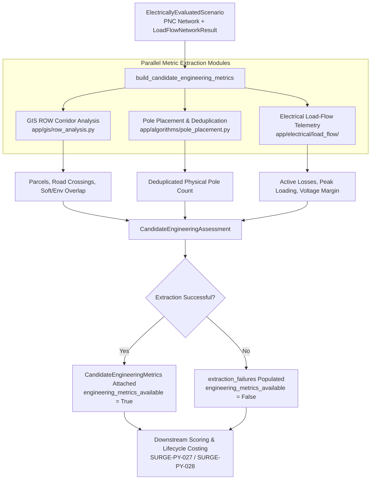

# Canonical Candidate Engineering Metrics

**Ticket:** SURGE-PY-026  
**Module:** `optimisation-python/app/optimisation/` (`engineering_metrics.py`, `engineering_metric_models.py`)  
**Status:** Complete & Production-Ready  
**Dependencies:** `app.gis.row_analysis`, `app.algorithms.pole_placement`, `app.electrical.load_flow`

---

## Overview

SURGE-PY-026 establishes a standardized, candidate-level engineering metric extraction boundary. 

Before candidates enter multi-objective cohort scoring (`app/optimisation/scoring.py`) or lifecycle costing (`app/costing/lifecycle.py`), every candidate that completes Pandapower AC load flow undergoes an engineering assessment that extracts a truthful, standardized set of spatial, infrastructure, and electrical quantities encapsulated in **`CandidateEngineeringMetrics`**.



---

## Canonical Quantities

A complete `CandidateEngineeringMetrics` instance provides deterministic, auditable engineering values across four domains:

```python
@dataclass(frozen=True)
class CandidateEngineeringMetrics:
    # Physical
    route_length_m: float
    refined_traversal_cost: float

    # Spatial & Cadastral
    affected_parcel_count: int
    road_crossing_count: int
    soft_constraint_overlap_m: float
    environmental_overlap_m2: float

    # Infrastructure
    physical_pole_count: int

    # Electrical (AC Newton-Raphson)
    active_loss_mw: float
    max_cable_loading_pct: float
    voltage_operating_margin_pu: float
```

### Detailed Metric Definitions

1. **Route Length (`route_length_m`)**: The exact sum of refined, projected corridor LineString lengths across all feeders in metres.
2. **Refined Traversal Cost (`refined_traversal_cost`)**: The total path traversal cost across the cost surface raster including base terrain resistance and soft crossing penalties.
3. **Affected Parcel Count (`affected_parcel_count`)**: The number of unique cadastral land parcels intersected by the Right-of-Way (ROW) corridor buffer.
4. **Road Crossing Count (`road_crossing_count`)**: The total count of perpendicular/diagonal intersections between the route centrelines and classified road geometries.
5. **Soft Constraint Overlap (`soft_constraint_overlap_m`)**: The total linear route centreline length traversing non-exclusionary soft constraint zones (e.g., agricultural land, pipeline buffers).
6. **Environmental Overlap (`environmental_overlap_m2`)**: The dissolved planar footprint area ($m^2$) of the ROW corridor intersecting designated environmental or forestry buffers. *(Extracted for reporting; excluded from default scoring weights).*
7. **Physical Pole Count (`physical_pole_count`)**: The total number of unique, physical overhead transmission structures after SURGE-PY-023 network-level endpoint deduplication.
8. **Active Electrical Loss (`active_loss_mw`)**: Total 33 kV cable $I^2 R$ active power dissipation across the collector network under nominal turbine generation.
9. **Max Cable Loading (`max_cable_loading_pct`)**: The peak thermal loading percentage observed on any individual cable segment relative to its continuous rated ampacity.
10. **Voltage Operating Margin (`voltage_operating_margin_pu`)**: The minimum headroom between observed bus voltages and statutory boundaries:
    $$\text{margin} = \min(V_{\max} - V_{\text{worst\_high}}, V_{\text{worst\_low}} - V_{\min})$$
    *(Higher is better. May be negative if bus voltages breach limits).*

---

## All-or-Nothing Availability & Diagnostics

The extraction pipeline enforces an **all-or-nothing availability contract**:
- If all spatial, infrastructure, and electrical pipelines succeed, `engineering_metrics_available = True` and `metrics` contains the fully populated `CandidateEngineeringMetrics`.
- If any required extraction phase fails (for example, if pole configuration is omitted or spatial buffers fail), `metrics` is set to `None`, `engineering_metrics_available = False`, and `extraction_failures` records structured reason codes.

### Standard Extraction Failure Reason Codes

| Failure Code | Description |
|---|---|
| `POLE_CONFIG_MISSING` | Optimization request did not supply pole spacing/clearance parameters. |
| `POLE_PLACEMENT_FAILED` | Geometric pole generation failed along one or more route segments. |
| `LOAD_FLOW_FAILED` | AC power flow failed to execute or did not produce valid bus telemetry. |
| `ROW_ANALYSIS_FAILED` | Spatial intersection buffering failed against constraint layers. |
| `HARD_EXCLUSION_INTERSECTION` | Candidate intersects an exclusionary no-go zone. |

---

## Workflow Integration

1. **Pole Placement Reuse**: When pole configuration is available, `build_candidate_engineering_metrics()` runs placement and endpoint deduplication once per candidate and caches the resulting `CollectorPoleResult`. When the winning candidate is selected, this cached pole network is directly attached to `OptimisationWorkflowResult.pole_network` without re-running placement.
2. **Input to Unified Scoring ([[Multi-Objective Candidate Scoring|SURGE-PY-027]])**: The 4 objective groups (Physical, Spatial, Infrastructure, Electrical) pull their raw values directly from `CandidateEngineeringMetrics`.
3. **Input to Lifecycle Costing ([[Surge MVP Ticket Plan|SURGE-PY-028]])**: `app/costing/lifecycle.py` uses `route_length_m`, `affected_parcel_count`, `road_crossing_count`, `physical_pole_count`, and `active_loss_mw` to calculate CAPEX and OPEX cash flows.

---

## Related Notes

- [[Overview & Layout]]
- [[Surge MVP Ticket Plan]]
- [[Multi-Objective Candidate Scoring]]
- [[AC Load Flow Validation]]
- [[PNC Network Assembly]]
- [[presentation-boundary|Python Presentation Boundary]]
