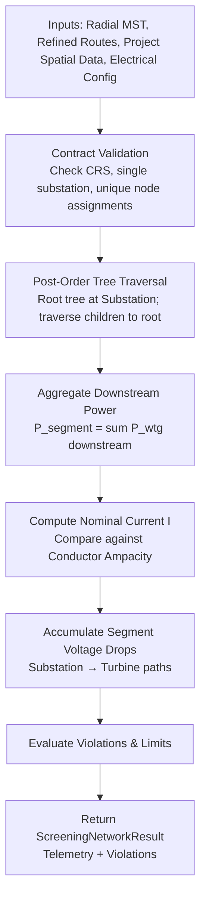

# Electrical Feeder Screening

**Ticket:** SURGE-PY-013  
**Module:** `optimisation-python/app/electrical/` (`feeder_validation.py`, `voltage_drop.py`, `models.py`, `errors.py`)  
**Status:** Standalone Analytical Engine (Implemented & Tested)

---

## Purpose

The **Electrical Feeder Screening Engine** provides a fast, deterministic, analytical proxy to answer an initial sizing question:
> *“Under a configured steady-state operating point, does the proposed radial collector topology exceed conductor thermal ampacity, cumulative linear voltage deviation, or total substation capacity limits?”*

It serves as a preliminary analytical filter to reject structurally flawed or grossly overloaded layouts prior to running full nonlinear simulations.

> [!important] Analytical Proxy vs. Pandapower AC Load Flow
> Feeder screening is a **linear balanced analytical proxy** (using constant nominal voltage and series impedance). It does **not** replace the full nonlinear Newton-Raphson power flow engine provided by Pandapower in [[AC Load Flow Validation|SURGE-PY-015]]. Production optimization workflows use Pandapower for authoritative candidate validation.

---

## Architectural Components

```text
app/electrical/
├── models.py              # Domain models: ConductorSpecification, FeederElectricalConfig,
│                          # ElectricalViolation, ScreeningFeederResult, ScreeningNetworkResult
├── voltage_drop.py        # Pure mathematical primitives for 3-phase current and voltage drop
├── feeder_validation.py   # Tree traversal, power aggregation, and violation detection
└── errors.py              # Electrical domain exception definitions
```

Keeping analytical formulas in `voltage_drop.py` strictly isolated from graph traversal in `feeder_validation.py` ensures mathematical rigor and direct unit-testability without GIS dependencies.

---

## Mathematical Formulation

### 1. Balanced Three-Phase Current
At nominal line-to-line voltage $V_{LL}$ (e.g., 33 kV) and operating power factor $\cos\phi$:

$$I = \frac{P}{\sqrt{3} \cdot V_{LL} \cdot \cos\phi}$$

where $P$ is the aggregated active power downstream of the evaluated cable segment (MW) and $I$ is nominal current in kA.

### 2. Segment Impedance
Conductor resistance $R$ and inductive reactance $X$ are computed from per-kilometre specifications and refined route length $L_{\text{km}}$:

$$R = r_{\text{ohm\_per\_km}} \cdot L_{\text{km}}, \quad X = x_{\text{ohm\_per\_km}} \cdot L_{\text{km}}$$

### 3. Linear Voltage Change ($\Delta V$)
Voltage change across each segment is calculated using the standard balanced approximation:

$$\Delta V = \sqrt{3} \cdot I \cdot (R \cos\phi \pm X \sin\phi)$$

- **Lagging Power Factor ($+$)**: Voltage drop along the line.
- **Leading Power Factor ($-$)**: Voltage rise along the line.

### 4. Cumulative Voltage Deviation
Segment voltage drops are accumulated along the radial tree from the substation bus ($V_0 = V_{\text{nominal}}$) to each wind turbine generator ($V_{\text{wtg}} = V_0 - \sum \Delta V$). The percentage voltage deviation is checked against statutory limits:

$$\Delta V_{\%} = \left| \frac{V_0 - V_{\text{wtg}}}{V_0} \right| \times 100$$

---

## Tree Traversal & Validation Flow



### Deterministic Violations

Violations are returned as structured domain records rather than raising Python exceptions, allowing scoring algorithms to evaluate or reject candidates gracefully:

| Violation Code | Condition | Severity |
|---|---|---|
| `AMPACITY_EXCEEDED` | Nominal segment current $I > I_{\text{rated}}$ (thermal limit exceeded). | Disqualifying |
| `VOLTAGE_LIMIT_EXCEEDED` | Cumulative turbine $\Delta V_{\%} > \text{max\_voltage\_drop\_pct}$ (e.g. $> 5\%$). | Disqualifying |
| `SUBSTATION_CAPACITY_EXCEEDED` | Total active generation $\sum P_{\text{wtg}} > P_{\text{substation\_capacity}}$. | Disqualifying |

---

## Input Contract & Integrity Rules

`validate_collector_network(topology, routing, project, config)` enforces strict structural requirements:
- **Projected Metric CRS**: Graph and route geometries must be in a projected metre-based coordinate system.
- **Tree Topology**: Exactly one connected tree per feeder containing the central substation node.
- **Bi-directional Integrity**: Refined physical routes must exist for every declared MST edge with matching endpoint coordinates.
- **Disjoint Partitioning**: Every turbine must belong to exactly one feeder with no orphan or duplicate assignments.

Input contract violations raise `ValueError` because no reliable electrical calculations can be executed on malformed network topologies.

---

## Related Notes

- [[AC Load Flow Validation]]
- [[Canonical Candidate Engineering Metrics]]
- [[Multi-Objective Candidate Scoring]]
- [[Overview & Layout]]
- [[Surge MVP Ticket Plan]]
