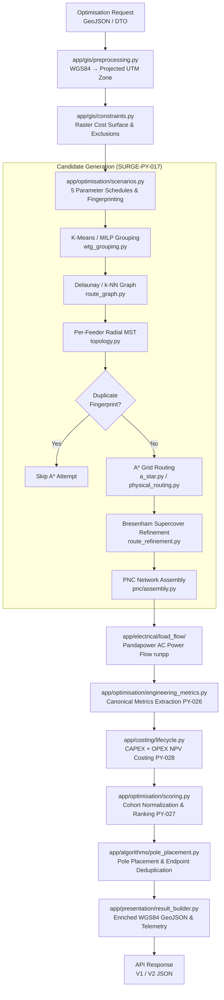

# Python Microservice Overview & Layout

The **SURGE Python GIS & Optimization Service** (located under `optimisation-python/`) is a high-performance spatial optimization, electrical simulation, and multi-objective routing microservice built with **FastAPI**, **NetworkX**, **Shapely**, **PyProj**, **SciPy**, and **Pandapower** running on **Python 3.11**.

> [!note] Status & Test Coverage (as of 2026-08-16)
> The microservice consists of **79 source files** across 12 domain packages and **~489 automated tests** spanning 28+ test suites in `tests/` (including comprehensive V1 and V2 API integration suites).

---

## Directory Layout

```text
optimisation-python/
├── .dockerignore
├── .env.example
├── .gitignore
├── Dockerfile
├── README.md
├── pyproject.toml
├── requirements.lock.txt
├── requirements.txt
├── app/
│   ├── __init__.py
│   ├── main.py                                # FastAPI application entry point & CORS
│   ├── algorithms/                            # Pure core graph, geometry, and placement algorithms
│   │   ├── __init__.py
│   │   ├── a_star.py                          # 8-connectivity grid A* routing over cost rasters
│   │   ├── cost_function.py                   # Directional/terrain cost weighting functions
│   │   ├── electrical_analysis.py             # Internal graph electrical helpers
│   │   ├── physical_routing.py                # Projected segment A* corridor routing
│   │   ├── pole_placement.py                  # Span-based pole placement & structural deduplication
│   │   ├── route_graph.py                     # Candidate Delaunay/k-NN graph builder
│   │   ├── route_refinement.py                # Supercover Bresenham shortcutting & collinear removal
│   │   ├── route_scoring.py                   # Legacy standalone spatial scoring (SURGE-PY-012)
│   │   ├── topology.py                        # Per-feeder capacity-constrained MST (Kruskal/NetworkX)
│   │   └── wtg_grouping.py                    # Constrained K-Means + MILP balancing (PuLP)
│   ├── api/                                   # REST API routing and endpoints
│   │   ├── __init__.py
│   │   ├── v1/
│   │   │   ├── __init__.py
│   │   │   ├── router.py                      # V1 API router
│   │   │   └── endpoints/
│   │   │       ├── __init__.py
│   │   │       ├── health.py                  # GET /api/v1/health liveness probe
│   │   │       └── optimise.py                # POST /api/v1/optimise (Java DTO backwards-compatible)
│   │   └── v2/
│   │       ├── __init__.py
│   │       ├── router.py                      # V2 API router
│   │       └── endpoints/
│   │           ├── __init__.py
│   │           └── optimise.py                # POST /api/v2/optimise (explicit engineering schema)
│   ├── core/
│   │   ├── __init__.py
│   │   └── config.py                          # Pydantic Settings & environment configuration
│   ├── costing/                               # Lifecycle & financial cost models (SURGE-PY-028)
│   │   ├── __init__.py
│   │   ├── catalogue.py                       # Component unit-cost catalogue loaders
│   │   ├── failures.py                        # Cost calculation failure taxonomy
│   │   ├── lifecycle.py                       # Decimal-precision CAPEX + OPEX NPV engine
│   │   └── models.py                          # Cost catalogue, policy, and breakdown domain models
│   ├── electrical/                            # Electrical modeling & load flow engines
│   │   ├── __init__.py
│   │   ├── errors.py                          # Electrical domain exception hierarchy
│   │   ├── feeder_validation.py               # Analytical screening validator (SURGE-PY-013)
│   │   ├── models.py                          # Conductor, impedance, & screening result models
│   │   ├── voltage_drop.py                    # Balanced 3-phase linear voltage change calculations
│   │   └── load_flow/                         # Pandapower AC Load-Flow package (SURGE-PY-015)
│   │       ├── __init__.py
│   │       ├── analysis.py                    # Newton-Raphson solver & non-convergence trapping
│   │       ├── builder.py                     # Deterministic pandapowerNet graph construction
│   │       ├── config.py                      # Load flow parameters & cable library mapping
│   │       └── models.py                      # Bus, segment, feeder, and network result models
│   ├── gis/                                   # Geospatial transformations and raster operations
│   │   ├── __init__.py
│   │   ├── constraints.py                     # Exclusion layers & crossing penalty rasterization
│   │   ├── cost_surface.py                    # Uniform 2D raster grid abstraction & Bresenham line
│   │   ├── crs.py                             # Dynamic UTM projection & transformation utilities
│   │   ├── geojson.py                         # GeoJSON parsing, validation & RFC 7946 serialization
│   │   ├── geometry.py                        # Shapely geometric repairs, buffers & validation
│   │   ├── preprocessing.py                   # WGS84 GeoJSON to projected ProjectSpatialData
│   │   └── row_analysis.py                    # Right-of-Way (ROW) corridor polygon spatial analysis
│   ├── models/                                # Shared spatial data primitives
│   │   ├── __init__.py
│   │   └── spatial.py                         # Turbine, Substation, and ProjectSpatialData dataclasses
│   ├── optimisation/                          # Multi-scenario candidate generation & scoring
│   │   ├── __init__.py
│   │   ├── engineering_metric_models.py       # CandidateEngineeringMetrics dataclasses (PY-026)
│   │   ├── engineering_metrics.py             # Metric extraction from GIS, load-flow & poles
│   │   ├── orchestrator.py                    # Top-level workflow runner (optimise_project)
│   │   ├── scenario_models.py                 # Parameter schedules, strategies, & PNCScenario
│   │   ├── scenarios.py                       # 5-strategy scenario generation & fingerprinting
│   │   ├── scoring.py                         # Unified multi-objective benefit scorer (PY-027/PY-029)
│   │   ├── scoring_models.py                  # MetricScore, ObjectiveGroup, & Policy models
│   │   └── workflow_models.py                 # Workflow stages, status codes, and result containers
│   ├── pnc/                                   # Collector network assembly package (SURGE-PY-014)
│   │   ├── __init__.py
│   │   ├── assembly.py                        # Graph-to-network assembly & topological validation
│   │   ├── errors.py                          # PNC structural failure taxonomy
│   │   ├── geojson.py                         # PNC domain to GeoJSON FeatureCollection converter
│   │   └── models.py                          # ProjectPNCNetwork, PNCFeeder, PNCSegment
│   ├── presentation/                          # API presentation adapter & GeoJSON formatting
│   │   ├── __init__.py
│   │   ├── exceptions.py                      # Presentation reconciliation exception models
│   │   ├── geojson.py                         # Presentation layer GeoJSON enricher & bbox builder
│   │   ├── models.py                          # Pydantic presentation models (ProjectOptimizationResult)
│   │   └── result_builder.py                  # Result assembler & electrical telemetry enricher
│   ├── schemas/                               # Pydantic DTOs for external API boundaries
│   │   ├── __init__.py
│   │   ├── legacy_mapping.py                  # V1 DTO adapter to workflow models
│   │   ├── optimise.py                        # V1 Request & Response schemas
│   │   └── v2/                                # V2 Explicit engineering schemas
│   │       ├── __init__.py
│   │       ├── domain_mapping.py              # V2 DTO to domain model converters
│   │       └── optimise.py                    # V2 Request & Response schemas
│   ├── services/                              # Service-layer facades
│   │   ├── __init__.py
│   │   └── optimisation_service.py            # Legacy single-candidate service adapter
│   └── utils/
│       ├── __init__.py
│       └── coordinate_transform.py            # Low-level coordinate transformation helpers
└── tests/                                     # Automated test suites (~489 tests)
    ├── api/
    │   ├── test_optimise_v1.py                # V1 API compatibility & constraint regression tests
    │   └── test_optimise_v2.py                # V2 API multi-candidate & schema tests
    ├── fixtures/                              # Versioned golden test fixtures (JSON/Python)
    │   ├── README.md
    │   ├── constraint_demo_project_v2.json
    │   ├── demo_project.py
    │   └── mvp_demo_project_v2.json
    ├── test_a_star.py
    ├── test_constraints.py
    ├── test_cost_surface.py
    ├── test_crs.py
    ├── test_engineering_metrics.py
    ├── test_feeder_validation.py
    ├── test_geojson.py
    ├── test_geometry.py
    ├── test_health.py
    ├── test_lifecycle_cost.py
    ├── test_load_flow_analysis.py
    ├── test_load_flow_builder.py
    ├── test_load_flow_config.py
    ├── test_load_flow_validation.py
    ├── test_optimisation_orchestrator.py
    ├── test_optimisation_scoring.py
    ├── test_optimise.py
    ├── test_physical_routing.py
    ├── test_pnc_assembly.py
    ├── test_pole_deduplication.py
    ├── test_pole_placement.py
    ├── test_preprocessing.py
    ├── test_presentation.py
    ├── test_route_graph.py
    ├── test_route_refinement.py
    ├── test_route_scoring.py
    ├── test_row_analysis.py
    ├── test_scenarios.py
    ├── test_topology.py
    ├── test_voltage_drop.py
    └── test_wtg_grouping.py
```

---

## Key Architectural Principles

1. **Decoupled Orchestration**: The high-level optimization pipeline is orchestrated by `app/optimisation/orchestrator.py` (`optimise_project()`), which coordinates spatial data preprocessing, multi-scenario candidate generation, Pandapower AC load flow, canonical metrics extraction, multi-objective ranking, lifecycle costing, and map presentation.
2. **Unified UTM Metric Engineering Domain**: Geographic coordinates (WGS84 / EPSG:4326) are strictly kept at the API and database boundary. All distance, area, buffer, obstacle routing, and electrical impedance calculations are executed within a dynamically selected, projected UTM zone (with metric units) via `app/gis/crs.py`. Output geometries are converted back to WGS84 with `always_xy=True` (longitude, latitude) prior to JSON serialization.
3. **Multi-Scenario Candidate Generation (SURGE-PY-017)**: Rather than producing a single static layout, the engine deterministically generates 1–5 candidate topologies using a fixed parameter schedule (`baseline`, `alternative_grouping`, `balanced_feeders`, `long_edge_penalty`, `alternative_grouping_balanced`). Topologies are deduplicated via canonical SHA-256 fingerprints before invoking expensive A* raster routing.
4. **Rigorous Electrical Validation (SURGE-PY-015)**: Every generated candidate is evaluated with Pandapower's Newton-Raphson AC power flow solver (`runpp`). Solver non-convergence is trapped gracefully as a structured `LOAD_FLOW_NOT_CONVERGED` violation, rendering the candidate infeasible without crashing the service.
5. **Canonical Engineering Metrics (SURGE-PY-026)**: A standardized, all-or-nothing assessment extracts physical length, traversal penalties, parcel crossings, road crossings, soft corridor overlap, environmental overlap, deduplicated pole counts, active power losses, cable loading, and voltage operating margins.
6. **Multi-Objective Benefit Scoring (SURGE-PY-027 / PY-029)**: Eligible candidates are scored using cohort min-max normalization across Physical, Spatial, Infrastructure, and Electrical objective groups, optionally combined with Decimal-precision 25-year lifecycle NPV costing (CAPEX + OPEX). Recommendations include plain-language trade-off rationales.
7. **Network-Level Pole Placement & Deduplication (SURGE-PY-023 / PY-024)**: Physical overhead transmission poles are placed along refined routes (tangent, angle, terminal), and coincident topology endpoints are merged into deterministic `junction` structures with full feeder/route traceability.
8. **Dual API Compatibility (V1 & V2)**: `POST /api/v1/optimise` provides backwards compatibility with Java Spring Boot DTO contracts, while `POST /api/v2/optimise` exposes explicit engineering parameters, lifecycle costing, and detailed candidate comparisons.

---

## End-to-End Execution Flow



---

## Core Algorithmic Components

### 1. Cost-Surface A* Routing (`app/algorithms/a_star.py` & `app/gis/cost_surface.py`)
- Represents spatial terrain, exclusion buffers, and crossing penalties as a 2D raster grid.
- A* search uses an 8-connectivity neighborhood (horizontal/vertical cost 1.0, diagonal cost $\sqrt{2}$).
- Obstacles with infinite weight are impenetrable hard exclusions. Soft penalties (roads, existing HT lines, parcel boundaries) add additive traversal resistance.

### 2. Route Refinement & Farthest-Visible Supercover (`app/algorithms/route_refinement.py`)
- Eliminates staircase grid artifacts from raster A* paths.
- Removes duplicate and collinear vertices.
- Applies iterative farthest-visible shortcutting verified against a continuous supercover raster check (Bresenham line touching all intercepted cells including corner-touches). Shortcutting is only accepted if the direct segment cost is $\le$ the subpath cost.

### 3. Pole Placement & Endpoint Deduplication (`app/algorithms/pole_placement.py`)
- Classifies poles into `terminal` (substations, WTGs), `angle` (deflections $\ge 5^\circ$), `intermediate` / `tangent` (spaced along straight sections based on `target_span_m` and `max_span_m`), and `junction` (merged shared topology nodes).
- SURGE-PY-023 merges coincident terminal records across different routes into single junction structures with pairwise distance tolerance ($< 0.1\text{ m}$).

### 4. Pandapower AC Load Flow (`app/electrical/load_flow/`)
- Constructs deterministic `pandapowerNet` models using sorted node/segment indices.
- Models 33 kV medium-voltage collector lines with positive generator injection convention ($P > 0, Q > 0$).
- Computes bus voltages (pu), line current loadings (%), active/reactive power losses (MW/MVar), and detects overloads or voltage limit excursions ($\pm 5\%$).

### 5. Multi-Objective Scoring & Explainable Recommendation (`app/optimisation/scoring.py`)
- Evaluates eligible candidates across 4 objective groups:
  - **Physical**: Route length (m).
  - **Spatial**: Refined traversal cost, parcel count, road crossings, soft constraint overlap (m).
  - **Infrastructure**: Physical pole count.
  - **Electrical**: Active power loss (MW), maximum cable loading (%), voltage operating margin (pu).
- Ranks candidates with 12-decimal precision and generates explainable reasons (`BEST_METRIC`, `GROUP_STRENGTH`, `TRADE_OFF_ACCEPTED`).

---

## Related Notes

- [[Surge MVP Ticket Plan]]
- [[Candidate PNC Scenario Generation]]
- [[AC Load Flow Validation]]
- [[Canonical Candidate Engineering Metrics]]
- [[Multi-Objective Candidate Scoring]]
- [[PNC Network Assembly]]
- [[presentation-boundary|Python Presentation Boundary]]
- [[Geospatial Integrity & CRS]]
- [[Electrical Feeder Screening]]
- [[Route Scoring Architecture]]
- [[Sunday KMZ to 33kV Network Plan]]
