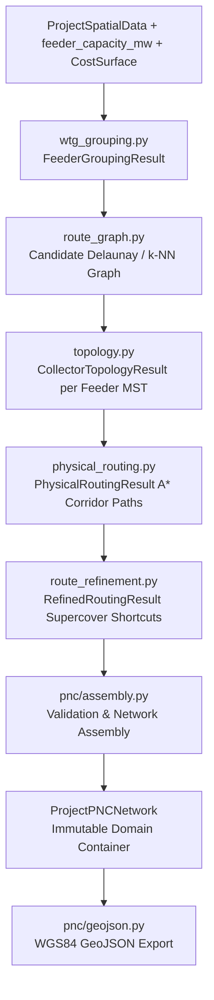

# PNC Network Assembly

**Ticket:** SURGE-PY-014  
**Module:** `optimisation-python/app/pnc/` (`assembly.py`, `models.py`, `errors.py`, `geojson.py`)  
**Status:** Complete & Production-Ready  
**Dependencies:** `app.algorithms.wtg_grouping`, `app.algorithms.topology`, `app.algorithms.physical_routing`, `app.algorithms.route_refinement`

---

## Overview

The `app.pnc` package serves as the core orchestration and data-structuring layer that binds discrete algorithmic steps (WTG grouping, graph construction, MST topology, A* corridor routing, and route refinement) into a unified, topologically consistent, and immutable **`ProjectPNCNetwork`**.



The package contains zero duplicated routing or grouping logic; its responsibility is strict structural integration, invariant enforcement, and standardized domain representation.

---

## Domain Models (`models.py`)

### 1. `PNCSegment`
Represents an individual physical connection between two nodes (substation or WTG) along a refined corridor:

```python
@dataclass(frozen=True)
class PNCSegment:
    segment_id: str                   # SEG-FDR001-0001 (deterministic)
    feeder_id: str                    # FDR-001
    from_node_id: str                 # e.g., substation:SUB1 or wtg:T01
    to_node_id: str                   # e.g., wtg:T02
    route_geometry: LineString        # Projected metric LineString
    route_length_m: float             # Exact refined length in metres
    segment_type: Literal["substation_to_wtg", "wtg_to_wtg"]
```

### 2. `PNCFeeder`
Encapsulates a single radial collector circuit rooted at the substation:

```python
@dataclass(frozen=True)
class PNCFeeder:
    feeder_id: str                    # FDR-001
    substation_id: str                # ID of root substation
    wtg_ids: tuple[str, ...]          # Lexicographically sorted turbine IDs
    ordered_node_ids: tuple[str, ...] # Deterministic BFS traversal sequence from substation
    segments: tuple[PNCSegment, ...]  # All routed segments comprising this feeder
    total_length_m: float             # Sum of refined segment lengths
    mst_graph: nx.Graph               # Authoritative NetworkX MST graph
```

### 3. `ProjectPNCNetwork`
The master container for the complete wind farm collector system:

```python
@dataclass(frozen=True)
class ProjectPNCNetwork:
    project_id: str
    substation_id: str
    substation_geometry: Point        # Projected coordinate
    feeders: tuple[PNCFeeder, ...]    # Sorted tuple of feeders
    wtg_coordinates: dict[str, Point] # Node ID -> Projected Point
    total_route_length_m: float       # Sum across all feeders
    feeder_count: int
    wtg_count: int
    segment_count: int
    crs: pyproj.CRS                   # Active projected UTM CRS
    route_length_by_feeder: dict[str, float]
    wtg_count_by_feeder: dict[str, int]
```

---

## Structural Invariants & Validation (`assembly.py`)

During assembly via `build_pnc_network()` or `assemble_pnc_network()`, the network is verified against structural constraints. Any violation immediately raises a `PNCAssemblyError`:

| Error Code | Structural Invariant Enforced |
|---|---|
| `FEEDER_WITHOUT_SUBSTATION_CONNECTION` | Every feeder tree must contain a path connecting its turbines back to the central substation node. |
| `UNROUTED_TOPOLOGY_EDGE` | Every edge in the selected MST topology must have a corresponding refined physical route. |
| `ORPHAN_WTG` | Every turbine in `ProjectSpatialData` must be assigned to exactly one feeder. |
| `DUPLICATE_WTG_ASSIGNMENT` | A turbine cannot appear in more than one feeder (disjoint partition). |
| `UNKNOWN_FEEDER_SEGMENT` | A segment's declared `feeder_id` must match its parent feeder object. |
| `INVALID_NETWORK_CONNECTIVITY` | The graph must be radial and cycle-free (tree topology per feeder). |
| `DUPLICATE_SEGMENT_ID` | Every segment across the entire project must have a globally unique identifier. |

---

## Stable Identifier Generation

To ensure identical inputs produce byte-for-byte identical output across runs and between microservices:

- **Feeder Identifiers**: `FDR-{index:03d}` (e.g., `FDR-001`, `FDR-002`).
- **Segment Identifiers**: `SEG-{feeder_suffix}-{segment_index:04d}` (e.g., `SEG-FDR001-0001`, `SEG-FDR001-0002`).

---

## GeoJSON Export (`geojson.py`)

`network_to_feature_collection(network, output_crs="EPSG:4326")` exports the assembled network as an RFC 7946 GeoJSON `FeatureCollection`:

- **Substation Feature (`Point`)**:
  - `properties`: `{"feature_type": "pnc_substation", "node_id": "substation:SUB1"}`
- **Turbine Features (`Point`)**:
  - `properties`: `{"feature_type": "pnc_wtg", "node_id": "wtg:T01", "feeder_id": "FDR-001"}`
- **Segment Features (`LineString`)**:
  - `properties`: `{"feature_type": "pnc_segment", "segment_id": "SEG-FDR001-0001", "feeder_id": "FDR-001", "from_node": "...", "to_node": "...", "length_m": 432.5}`

Coordinates are transformed to WGS84 with `always_xy=True` ($[\text{longitude}, \text{latitude}]$).

---

## Downstream Pipeline Consumption

- **[[AC Load Flow Validation|Pandapower AC Load Flow (SURGE-PY-015)]]**: Direct consumer of `ProjectPNCNetwork` to construct bus/line topologies.
- **[[Candidate PNC Scenario Generation|Scenario Generation (SURGE-PY-017)]]**: Produces `PNCScenario` instances wrapping assembled networks.
- **[[presentation-boundary|Presentation Boundary (SURGE-PY-016)]]**: Converts `ProjectPNCNetwork` into user-facing API responses and map layers.

---

## Related Notes

- [[Candidate PNC Scenario Generation]]
- [[AC Load Flow Validation]]
- [[presentation-boundary|Python Presentation Boundary]]
- [[Canonical Candidate Engineering Metrics]]
- [[Overview & Layout]]
- [[Surge MVP Ticket Plan]]
