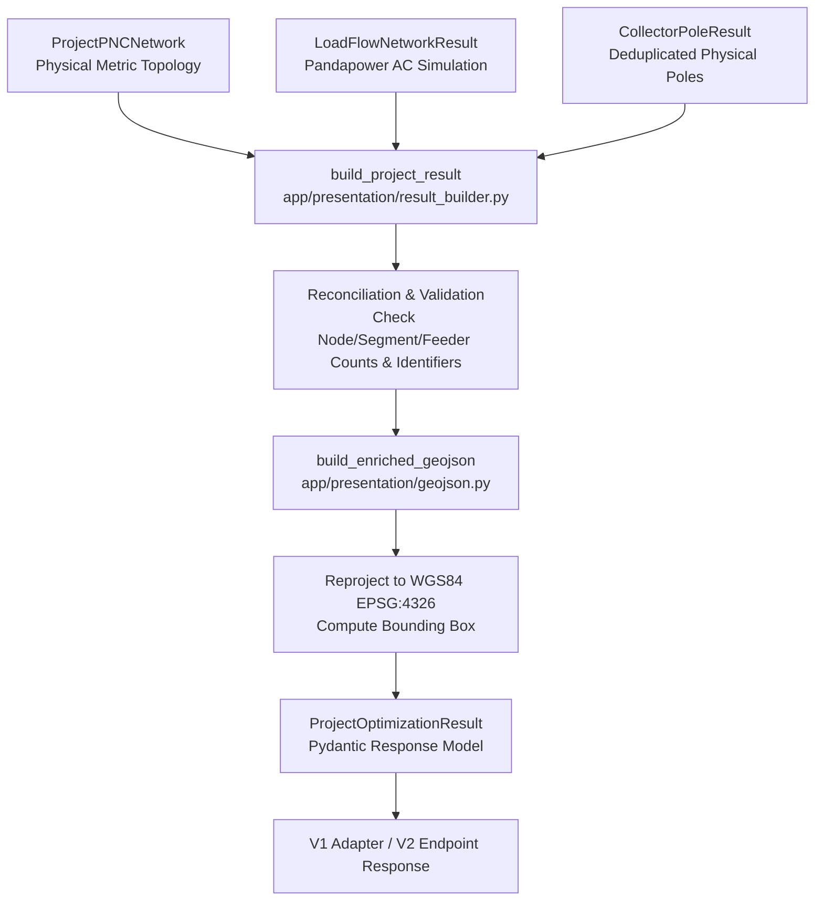

# Python Presentation Boundary

**Ticket:** SURGE-PY-016 & SURGE-PY-025  
**Module:** `optimisation-python/app/presentation/` (`result_builder.py`, `geojson.py`, `models.py`, `exceptions.py`)  
**Status:** Complete & Production-Ready  
**Dependencies:** `app.pnc.models`, `app.electrical.load_flow.models`, `app.algorithms.pole_placement`

---

## Purpose & Architectural Role

The **Presentation Layer** acts as the formal adapter boundary between internal projected engineering models and external public API contracts (consumed by Java Spring Boot and the React web map).

It combines:
1. **`ProjectPNCNetwork`**: The authoritative projected physical network (feeders, routed segments, turbines, substation).
2. **`LoadFlowNetworkResult`**: The Pandapower AC power flow analysis results for that exact network.
3. **`CollectorPoleResult`**: The deduplicated physical pole infrastructure network (SURGE-PY-023 / PY-024).

It emits the map-ready **`ProjectOptimizationResult`** and **`PNCFeatureCollection`** with complete WGS84 GeoJSON geometries, nullable electrical telemetry, exact violation flags, and collection bounding boxes.



---

## Strict Reconciliation Rules

To prevent rendering mismatched or corrupted engineering data, `build_project_result()` performs strict structural reconciliation before packaging:

- **Entity Cardinality**: For a converged simulation, there must exist exactly one bus result for every WTG and substation, exactly one line result for every PNC segment, and exactly one feeder result for every PNC feeder.
- **Identifier Matching**: All IDs in load flow results must match corresponding PNC domain objects.
- **Finite Numbers**: Any non-finite float (`NaN`, `+inf`, `-inf`) in electrical outputs raises `PresentationDataMismatchError`.
- **Violation Ownership**: Node and segment violations (overloads, under-voltages) are mapped deterministically to their parent `FeederResult` and parent feature properties.

---

## Stable GeoJSON Feature Collection

The presentation layer outputs an RFC 7946-compliant GeoJSON `FeatureCollection` where features are emitted in a strict, deterministic sequence:

1. **Substation Point**: Feature ID `substation-{id}` (`feature_type: "pnc_substation"`).
2. **Turbine Points**: Feature IDs `wtg-{id}` sorted lexicographically (`feature_type: "pnc_wtg"`).
3. **Collector Segment LineStrings**: Feature IDs `segment-{id}` sorted lexicographically (`feature_type: "pnc_segment"`).
4. **Physical Pole Points (SURGE-PY-025)**: Feature IDs `pole-{id}` sorted by topology node, pole ID, and feeder ID (`feature_type: "pnc_pole"`).

### Coordinate Standards & Bounding Box
- Coordinates are strictly transformed to **WGS84 (EPSG:4326)** with $[ \text{longitude}, \text{latitude} ]$ order.
- Top-level GeoJSON contains `bbox = [min_lon, min_lat, max_lon, max_lat]` for instant map camera framing.

---

## Feature Properties & Nullable Telemetry

To allow frontend clients (`web-map-next`) to render a stable UI without checking for property existence, all feature properties adhere to a fixed schema with nullable values:

### Segment Feature Properties (`pnc_segment`)
```json
{
  "feature_type": "pnc_segment",
  "segment_id": "SEG-FDR001-0001",
  "feeder_id": "FDR-001",
  "from_node": "substation:SUB1",
  "to_node": "wtg:T01",
  "length_m": 450.2,
  "nominal_voltage_kv": 33.0,
  "current_a": 154.2,
  "max_loading_pct": 48.6,
  "losses_kw": 8.4,
  "has_cable_overload": false
}
```

### WTG Feature Properties (`pnc_wtg`)
```json
{
  "feature_type": "pnc_wtg",
  "node_id": "wtg:T01",
  "feeder_id": "FDR-001",
  "installed_capacity_mw": 3.0,
  "active_power_mw": 3.0,
  "reactive_power_mvar": 0.0,
  "voltage_pu": 1.012,
  "voltage_kv": 33.396,
  "voltage_angle_deg": 1.45,
  "has_voltage_violation": false
}
```

### Physical Pole Feature Properties (`pnc_pole` — SURGE-PY-025)
```json
{
  "feature_type": "pnc_pole",
  "pole_id": "POL-FDR001-0012",
  "pole_type": "junction",
  "connected_feeder_ids": ["FDR-001", "FDR-002"],
  "connected_route_ids": ["SEG-FDR001-0003", "SEG-FDR002-0001"],
  "connected_node_ids": ["wtg:T04"],
  "distance_along_route_m": 1250.0
}
```

---

## Non-Convergence Handling

When Pandapower AC power flow fails to converge:
- The presentation layer does **not** fail or raise an error.
- It generates a valid topology map containing physical routes, turbines, substation, and poles.
- Electrical telemetry properties (`voltage_pu`, `current_a`, `losses_kw`, `loading_pct`) are populated as `null`.
- Boolean violation flags (`has_voltage_violation`, `has_cable_overload`) default to `false`.
- The top-level result includes an explicit `LoadFlowViolation(code="LOAD_FLOW_NOT_CONVERGED")`.

This ensures that frontend map inspection remains fully functional even when diagnosing electrical simulation failures.

---

## API Layer Compatibility (V1 vs. V2)

- **`POST /api/v1/optimise`**: Adapts the presentation model into the legacy Java DTO schema (`feeder_routes_geojson`, `metrics`, `status`), while attaching additive multi-candidate comparisons and pole results.
- **`POST /api/v2/optimise`**: Exposes the complete `ProjectOptimizationResult` directly, including comprehensive candidate trade-off summaries, group benefit contributions, and lifecycle cost breakdowns.

---

## Related Notes

- [[PNC Network Assembly]]
- [[AC Load Flow Validation]]
- [[Multi-Objective Candidate Scoring]]
- [[Canonical Candidate Engineering Metrics]]
- [[Overview & Layout]]
- [[Surge MVP Ticket Plan]]
