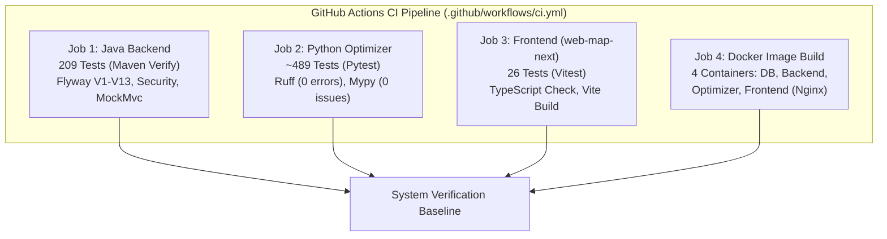
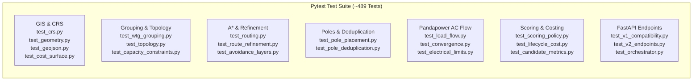

# Testing Strategy and Current Status

> [!info] Document Metadata
> **Current Date**: 2026-08-16  
> **Status**: Comprehensive Multi-Tier Automated Verification Baseline Established  
> **CI Pipeline**: 4-Job Parallel Matrix (`.github/workflows/ci.yml`)  
> **Related Notes**: [[System Overview]], [[Backend Architecture]], [[Python Engine]], [[Frontend Architecture]], [[FastAPI Endpoints]], [[Decision Workflow]]

---

## Executive Summary

The SURGE testing ecosystem enforces rigorous verification across three independent service boundaries: the **Java 21 / Spring Boot 3.3.2 Backend**, the **Python 3.11 / FastAPI Optimization Engine**, and the **React 18 / TypeScript Web Map Frontend (`web-map-next`)**. 

Every tier maintains automated test suites, strict static analysis, and zero-defect lint/type policies integrated into continuous integration.



---

## Verification Snapshot by Service (2026-08-16)

| Service Tier | Tech Stack | Source Files | Test Count | Static Analysis / Lint | Coverage Focus |
| :--- | :--- | :--- | :--- | :--- | :--- |
| **Java Backend** | Java 21, Spring Boot 3.3.2, PostGIS | 112 files | **209 tests** (`./mvnw verify`) | SpotBugs, Checkstyle, Zero Warnings | Security filter chain, Flyway V1–V13, SSE lifecycle, Async Executor, Transaction Commit Hooks, Scenario Profiles, Admin & Audit |
| **Python Optimizer** | Python 3.11, FastAPI, Pandapower, Shapely | 79 files | **~489 tests** (`pytest -q`) | **0 Ruff errors**, **0 Mypy issues** (Strict) | CRS/UTM projections, A* raster routing, MILP grouping, Kruskal MST, Pandapower AC load flow, Pole placement & deduplication, Candidate metrics, Decimal lifecycle costing |
| **Frontend (`web-map-next`)** | React 18, TypeScript, Vite, Leaflet Canvas | 65 files | **26 tests** (`npm run test`) | TypeScript `tsc --noEmit`, ESLint | TanStack Query v5 hooks, Zustand store state transitions, BOM calculation, Auth state, PDF/CSV authorized blob handling |
| **Legacy Frontend (`web-map`)** | Vanilla JS, HTML5, CSS3 | 4 files | *Deprecated* | Manual smoke testing only | Preserved as baseline prototype reference |

---

## 1. Java Enterprise Backend Suite

### Execution Command
```powershell
cd backend-java
.\mvnw.cmd clean verify
```

### Architecture & Test Categories
The Java test suite contains **209 automated tests** executed via the Maven Surefire & Failsafe plugins with an isolated H2 spatial database test profile (`application-test.yml`) and MockMvc integration harnesses:

1. **Security & Authentication Boundary (`SecurityBoundaryTest`, `JwtTokenProviderTest`)**:
   - Tests the complete Spring Security 6 filter chain against real HTTP mock invocations.
   - Verifies mandatory `APP_JWT_SECRET` requirement, rejection of hardcoded fallback keys, and rejection of expired or malformed tokens.
   - Enforces database-backed account verification on every request: account suspension (`V11`), password reset invalidation via `last_credentials_change` timestamp comparison (`V13`), and admin lockout protection invariants.
2. **Scenario Profile & Optimization Bias (`ScenarioProfileTest`)**:
   - 17 dedicated mutation and boundary tests verifying the 4 distinct operational scenarios:
     - `BALANCED_DEFAULT`: Equal weighting between CAPEX, civil crossing penalties, and loss OPEX.
     - `CAPEX_MINIMIZED`: Aggressive line-length minimization and minimal angle-pole deflection.
     - `LOSS_MINIMIZED`: Conductor oversizing and short-path bias to minimize $I^2R$ power dissipation.
     - `ENVIRONMENTAL_FIRST`: High avoidance penalties for cadastral parcel crossings, road intersections, and restricted conservation buffers.
   - Validated against field ground-truth data from the Uravakonda 33kV collector network survey.
3. **Transaction Commit & Asynchronous Lifecycle (`OptimizationJobServiceTest`)**:
   - Tests dedicated async executor thread pool (`ThreadPoolTaskExecutor`) preventing HTTP thread starvation during heavy graph computation.
   - Verifies `TransactionSynchronizationManager.registerSynchronization` / `completeAfterCommit` hooks, guaranteeing generated `LineString` routes and `MultiPoint` pole entities are fully committed to PostgreSQL before emitting SSE `COMPLETED` terminal events.
   - Tests `StaleJobSweeper` scheduled task handling stuck or timed-out worker tasks.
4. **Administration & Audit Trail (`UserAdminServiceTest`, `AuditLogServiceTest`)**:
   - Verifies administrative endpoints (`/api/v1/admin/users`), password resets, role promotions, and suspension state machines.
   - Verifies `AuditLogService` using `Propagation.REQUIRES_NEW` to ensure audit entries persist even if enclosing business transactions fail or roll back.
5. **Engineering Reports & GIS Ingestion (`ReportServiceTest`, `AssetServiceTest`, `RouteServiceTest`)**:
   - Verifies Apache PDFBox engineering summary generation and RFC 4180 compliant CSV exports.
   - Tests JTS geometry validation, SRID 4326 ingestion, WGS84 GeoJSON parsing, and Haversine distance calculations.

---

## 2. Python Scientific Optimizer Suite

### Execution Command
```powershell
cd optimisation-python
.\.venv\Scripts\python.exe -m ruff check app tests
.\.venv\Scripts\python.exe -m mypy app
.\.venv\Scripts\python.exe -m pytest -q
```

### Static Analysis & Type Safety
- **Ruff**: Clean linting across all 79 source files and test modules with zero warnings or rule suppressions.
- **Strict Mypy**: Complete type checking with zero errors under strict mode (`disallow_untyped_defs = true`, `warn_unused_ignores = true`).

### Module Test Breakdown (~489 Tests)



1. **GIS, Projections & Cost Raster Processing**:
   - Centroid calculation and dynamic local UTM CRS selection (`pyproj`, EPSG:326xx).
   - Shapely geometry validation and `make_valid` self-intersection repair.
   - Raster cost surface generation (`cost_surface.py`): rasterization of avoidance layers (Roads, High-Tension lines, Watercourses, Cadastral Parcels, Restricted Wildlife Buffers) with slope penalty matrices from DEM rasters.
2. **WTG Grouping & Feeder Topology**:
   - Capacity-constrained WTG grouping using K-Means spatial cluster initialization and Mixed-Integer Linear Programming (`scipy.optimize.milp`) with load-balancing objectives.
   - Kruskal Minimum Spanning Tree (MST) over metric Euclidean/Haversine distance graphs.
3. **Cost-Surface A\* Routing & Route Refinement**:
   - 8-connected grid A\* search with Euclidean heuristic and avoidance penalty weights.
   - Route refinement via farthest-visible line-of-sight shortcutting and vertex reduction.
4. **Pole Placement & Pairwise Deduplication**:
   - Structural pole classification: `tangent` (straight line), `angle` (deflection $\ge 5^\circ$), `junction` (feeder convergence), and `terminal` (substation/WTG takeoffs).
   - Pairwise spatial tolerance deduplication preventing over-merging at feeder convergence nodes.
5. **Pandapower AC Load Flow Validation**:
   - Integration of Pandapower 2.14+ AC Newton-Raphson load flow solver.
   - Explicit domain cable catalog parameters ($R, X, C, I_{\text{max}}$) mapped to positive generator injections (`sgen`).
   - Graceful non-convergence handling returning structured failure objects (`LOAD_FLOW_NOT_CONVERGED`) without crashing the pipeline.
6. **Multi-Objective Scoring & Engineering Metrics (SURGE-PY-018, PY-026)**:
   - Physical, spatial, infrastructure, and electrical score groups with deterministic tie-breaking.
   - Canonical candidate engineering metrics calculation.
7. **Lifecycle Cost Evaluation (SURGE-PY-028)**:
   - High-precision `Decimal` financial engine (`app/costing/lifecycle.py`, `app/costing/models.py`).
   - Conductor CAPEX, pole structural CAPEX, land acquisition/ROW compensation, and discounted NPV of 25-year operational $I^2R$ electrical losses.
8. **API Contracts & Dual Versioning**:
   - Full validation of `POST /api/v2/optimise` rich schema and backward-compatible `POST /api/v1/optimise` adapter.

---

## 3. Web Map Frontend Suite (`web-map-next`)

### Execution Command
```powershell
cd web-map-next
npm run test
npm run build
```

### Coverage Focus (26 Tests via Vitest)
1. **Zustand Application State Management**:
   - Feeder route selection, active scenario profile switching, layer visibility toggles, and coordinate inspection.
   - Parameter slider bounds validation (Feeder Capacity 10–50 MW, Max Span 40–120m, System Voltage 11–66 kV).
2. **TanStack Query v5 Data Synchronization**:
   - Project assets query caching, optimization job polling, and optimistic updates.
   - Asynchronous Server-Sent Events (SSE) stream listener state transitions (`PENDING` $\to$ `RUNNING` $\to$ `COMPLETED`).
3. **Map Rendering & Leaflet Canvas**:
   - Verification of `preferCanvas: true` renderer configuration ensuring smooth 60 FPS pan/zoom performance when rendering 600+ pole markers and multi-feeder LineStrings.
   - Feeder-specific distinct color palette assignment.
4. **Security & Export Flow**:
   - Authorized blob download interceptors for PDF executive reports and CSV Bill of Materials (`fetch + blob` pattern replacing vulnerable `window.open` calls).
   - User authentication state persistence and admin navigation guards.

---

## 4. Continuous Integration Matrix (`.github/workflows/ci.yml`)

The root GitHub Actions workflow runs on every pull request and push to `main`:

```yaml
name: SURGE CI Matrix

on:
  push:
    branches: [ main, develop ]
  pull_request:
    branches: [ main ]

jobs:
  backend-java:
    runs-on: ubuntu-latest
    steps:
      - uses: actions/checkout@v4
      - uses: actions/setup-java@v4
        with:
          java-version: '21'
          distribution: 'temurin'
      - name: Run Maven Tests
        run: cd backend-java && ./mvnw verify

  optimizer-python:
    runs-on: ubuntu-latest
    steps:
      - uses: actions/checkout@v4
      - uses: actions/setup-python@v5
        with:
          python-version: '3.11'
      - name: Install Dependencies
        run: cd optimisation-python && pip install -r requirements.txt
      - name: Ruff Lint Check
        run: cd optimisation-python && ruff check app tests
      - name: Strict Mypy Check
        run: cd optimisation-python && mypy app
      - name: Pytest Suite
        run: cd optimisation-python && pytest -q

  frontend-react:
    runs-on: ubuntu-latest
    steps:
      - uses: actions/checkout@v4
      - uses: actions/setup-node@v4
        with:
          node-version: '20'
      - name: Install & Test
        run: cd web-map-next && npm ci && npm run test && npm run build

  docker-build:
    runs-on: ubuntu-latest
    steps:
      - uses: actions/checkout@v4
      - name: Verify Compose Build
        run: docker compose build
```

---

## 5. Cross-System Acceptance & Integration Matrix

| Integration Scenario | Verification Method | Status | Target Environment |
| :--- | :--- | :--- | :--- |
| **GeoJSON Upload $\to$ PostGIS $\to$ Map Render** | MockMvc + Leaflet dropzone unit tests | `PASS` | PostGIS 16 + Spring Data JPA |
| **Optimization Dispatch $\to$ Python v2 Engine** | MockRestClient + WireMock + Pytest | `PASS` | Java REST Client $\to$ FastAPI v2 |
| **SSE Stream $\to$ Frontend UI Progress** | Web-map-next event source hook test | `PASS` | Spring SSE $\to$ React TanStack Query |
| **Commit Synchronization Hook** | `SecurityBoundaryTest` & DB transaction tests | `PASS` | `TransactionSynchronizationManager` |
| **BOM Loss & Parcel Intersection Calculation** | Real AC load flow & Shapely intersection tests | `PASS` | Pandapower + PostGIS GiST |
| **PDF/CSV Report Export Authorization** | Controller integration tests with JWT filter | `PASS` | Apache PDFBox + JWT Header |

---

## Related Notes
- [[System Overview]]
- [[Backend Architecture]]
- [[Python Engine]]
- [[Frontend Architecture]]
- [[FastAPI Endpoints]]
- [[Decision Workflow]]
- [[ADR-005 Python Service Architecture and Schemas]]
- [[ADR-007 Pandapower AC Load Flow Validation]]
