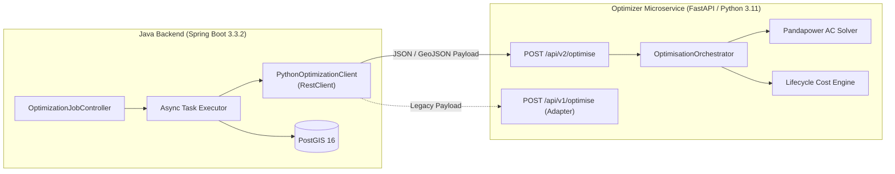

# ADR-001: Use FastAPI for the Optimization Service

> [!success] Status: Accepted and Implemented  
> **Date**: 2026-08-04 (Updated 2026-08-16)  
> **Deciders**: SURGE Architecture Team  
> **Related Notes**: [[FastAPI Endpoints]], [[Python Engine]], [[Backend Architecture]], [[ADR-005 Python Service Architecture and Schemas]], [[Testing Status]]

---

## Context

The SURGE optimization engine requires advanced scientific Python libraries for computational geometry (Shapely, PyProj), graph algorithms (NetworkX, SciPy), raster cost-surface analysis (NumPy), electrical AC load flow validation (Pandapower), and multi-criteria lifecycle costing.

The Java Spring Boot backend handles enterprise concerns: JWT authentication, user role management, Flyway database migrations, PostGIS persistence, asynchronous SSE progress dispatch, and engineering report generation.

A robust, high-performance, and language-neutral IPC (Inter-Process Communication) interface is required to bridge the Java backend and the Python optimizer.

---

## Decision

Implement the computation boundary as a dedicated **Python 3.11 / FastAPI** microservice exposing versioned HTTP REST endpoints (`/api/v1/optimise` and `/api/v2/optimise`).

Keep public project management, authentication, and spatial persistence strictly within Spring Boot.

---

## Why FastAPI?

1. **Native Pydantic v2 Integration**: Automatic schema validation, strict type coercion, and OpenAPI 3.0 specification generation directly from Python type hints.
2. **Dual-Version Support**: Clean routing architecture supporting canonical rich endpoints (`POST /api/v2/optimise`) alongside backward-compatible legacy adapters (`POST /api/v1/optimise`).
3. **Scientific Ecosystem Compatibility**: Seamless execution of CPU-bound NumPy, SciPy, Shapely, and Pandapower routines without heavy web framework boilerplate.
4. **Independent Testability**: The service can be tested in complete isolation using `pytest` and Starlette's `TestClient` (achieving ~489 passing tests with 0 Ruff errors and 0 Mypy issues).
5. **Clear Separation of Concerns**: Enterprise authorization, relational constraints, and database storage remain isolated from mathematical solver routines.

---

## Technical Architecture & Lifecycle

- **Production Mode**: Swagger UI and ReDoc endpoints are disabled in production configurations for security hardening.
- **Request Correlation**: A unique `request_id` (UUIDv4) is passed in headers/payload to trace optimization tasks across Java and Python service logs.
- **Synchronous Compute / Asynchronous Pipeline**: FastAPI endpoints execute optimization synchronously per request, while the Java backend handles long-running jobs asynchronously via `ThreadPoolTaskExecutor` and Server-Sent Events (SSE) progress streaming.

---

## Consequences

- **Positive**: Clean separation between enterprise persistence and scientific computation.
- **Positive**: Fully typed HTTP contract validated at runtime by Pydantic 2.
- **Positive**: Python service can scale independently or run in isolated container environments.
- **Negative**: Network serialization overhead for large GIS payloads (mitigated by local container networking in Docker Compose).
- **Negative**: Schema changes require coordinated updates across Java DTOs, TypeScript interfaces, and Pydantic models.

---

## Implementation References

- `optimisation-python/app/main.py`: Application entry point and lifespan configuration.
- `optimisation-python/app/api/v1/router.py`: Health check and legacy v1 endpoint.
- `optimisation-python/app/api/v2/router.py`: Canonical v2 optimization endpoint.
- `backend-java/src/main/java/com/surge/service/PythonOptimizationClient.java`: Spring 6.1 `RestClient` integration.
