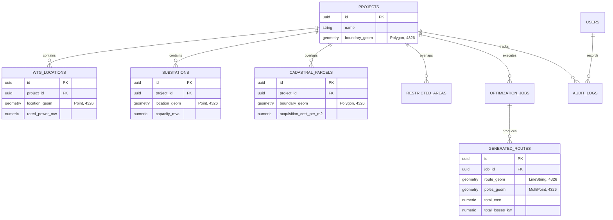

# ADR-002: Use PostGIS for Spatial Persistence

> [!success] Status: Accepted and Implemented  
> **Date**: 2026-08-04 (Updated 2026-08-16)  
> **Deciders**: SURGE Architecture Team  
> **Related Notes**: [[Database Architecture]], [[Backend Architecture]], [[Spatial Model]], [[ADR-006 Spatial Models and Unified UTM]], [[Testing Status]]

---

## Context

SURGE is an enterprise geospatial CAD and optimization platform for renewable energy collector networks. It must persist complex heterogeneous spatial data alongside relational enterprise records:

- **Point Geometries**: Wind Turbine Generators (`wtg_locations`) and Substation terminals (`substations`).
- **Polygon Geometries**: Cadastral land parcels (`cadastral_parcels`) and exclusion zones (`restricted_areas`).
- **LineString & MultiPoint Geometries**: 33kV collector feeder routes and structural pole coordinates (`generated_routes`).
- **Relational Metadata**: User accounts, password credentials, audit logs, scenario profiles, job lifecycle states, and Bill of Materials summaries.

These datasets require strict referential integrity, ACID transactional guarantees, high-performance spatial indexing, and schema evolution controls.

---

## Decision

Use **PostgreSQL 16 with the PostGIS 3.4+ extension** as the primary authoritative datastore.

Store all public and API-facing vector geometries in standard **WGS84 (EPSG:4326)** and use **Flyway Database Migrations (V1–V13)** to manage schema evolution.

---

## Why PostGIS?

1. **Integrated Spatial + Relational Model**: Eliminates the need for separate spatial and relational databases. Asset ownership, project boundaries, and route results share atomic transaction boundaries.
2. **Standard OGC / ISO Spatial Types**: Full native support for `geometry(Point, 4326)`, `geometry(Polygon, 4326)`, `geometry(LineString, 4326)`, and `geometry(MultiPoint, 4326)`.
3. **High-Performance Spatial Indexing**: GiST (Generalized Search Tree) 2D R-Tree spatial indexing provides sub-millisecond bounding box searches and spatial intersection queries.
4. **Spatial SQL Predicates**: Enables native database-level operations (`ST_Intersects`, `ST_Buffer`, `ST_Distance`, `ST_Area`, `ST_Length`) for Right-of-Way (ROW) corridor analysis.
5. **Schema Versioning via Flyway**: Schema evolution across 13 distinct migration versions (`V1__init.sql` through `V13__add_last_credentials_change.sql`) guarantees reproducible database states across developer environments, Docker Compose, and production deployments.

---

## Migration History (V1–V13 Overview)

| Migration | Scope & Functionality |
| :--- | :--- |
| `V1` | Initial core schema: `projects`, `wtg_locations`, `substations` tables with SRID 4326. |
| `V2` | Optimization tables: `cadastral_parcels`, `restricted_areas`, `optimization_jobs`, `generated_routes` with GiST indexes. |
| `V3–V10` | Route metadata extensions, pole classifications, scenario profile parameters, and cost columns. |
| `V11` | User suspension status and role-based access control flags in `users` table. |
| `V12` | System-wide audit log table (`audit_logs`) tracking project lifecycle events. |
| `V13` | Security token invalidation tracking via `last_credentials_change` timestamp column. |

---

## Consequences

- **Positive**: Single authoritative source of truth for both business data and spatial geometries.
- **Positive**: GiST spatial indexing accelerates geospatial queries and bounding-box queries on large wind farms.
- **Positive**: ACID transactions guarantee that route lines and pole points are persisted atomically.
- **Negative**: Calculation of metric lengths and areas requires projecting coordinates into local UTM (EPSG:326xx) or using `geography` type functions.
- **Negative**: Requires PostGIS extension installed on all target PostgreSQL environments (managed via `postgis/postgis:16-3.4-alpine` Docker container).

---

## Implementation References

- `backend-java/src/main/resources/db/migration/`: Flyway migration scripts V1 through V13.
- `backend-java/src/main/java/com/surge/domain/`: Hibernate Spatial entity mappings (`GeneratedRoute`, `CadastralParcel`, `RestrictedArea`, `WtgLocation`, `Substation`).
- `docker-compose.yml`: PostGIS 16 container definition with persistent volume configuration.
