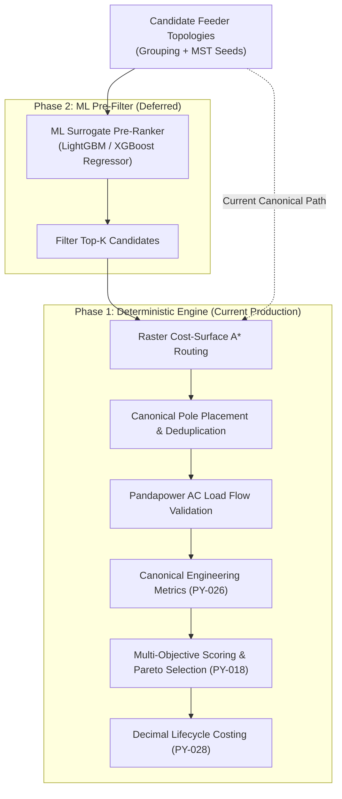

# ADR-003: Allow Machine Learning-Assisted Candidate Pre-Ranking

> [!note] Status: Accepted Architectural Direction; Implementation Deferred  
> **Date**: 2026-08-04 (Updated 2026-08-16)  
> **Deciders**: SURGE Architecture Team  
> **Related Notes**: [[Python Engine]], [[Decision Workflow]], [[Cost Model]], [[ADR-004 Lifecycle Cost Objective]], [[Testing Status]]

---

## Context

The SURGE optimization engine generates and evaluates multiple candidate collector network topologies across various WTG grouping clusters, routing corridors, and electrical parameters.

As project scale increases (e.g., 100+ WTGs across 5+ substations), generating high-resolution raster cost surfaces, running 8-connected grid A\* pathfinding, computing detailed pole placement, and performing Newton-Raphson AC load flow simulations for dozens of candidate topologies incurs non-trivial computational overhead.

---

## Decision

Permit the future integration of a **Machine Learning surrogate model** to pre-rank or prioritize candidate topologies prior to full downstream physical and electrical evaluation.

However, **ML must strictly operate as a heuristic pre-filtering mechanism** and must **NEVER bypass deterministic engineering, environmental, or electrical safety constraints**.

Implementation of the ML surrogate model is deferred until a large, verified, and deterministically generated corpus of collector network designs is accumulated.

---

## Why Defer Implementation?

1. **Deterministic Foundation First**: The primary focus of the platform is engineering safety, mathematical determinism, and full explainability. Deterministic algorithms (MILP grouping, A\* cost surface routing, Pandapower load flow) provide verifiable, legally defensible designs for utility developers.
2. **Data Integrity & Label Provenance**: Training a surrogate model requires a large baseline of representative real-world wind farm projects. Training on unvalidated synthetic topologies introduces bias and hallucinations into engineering calculations.
3. **Current Performance Adequacy**: With NumPy-vectorized raster operations and optimized A\* search with line-of-sight shortcutting, current execution times for 40-WTG collector networks complete within seconds, rendering an ML surrogate unnecessary for current MVP throughput.

---

## Operating Boundaries for Future ML Integration

When implemented, the ML model must adhere to the following architectural guardrails:

1. **Feature Provenance**: Input features must be derived strictly from canonical spatial metrics (e.g., turbine dispersion, bounding box area, obstacle density, topological MST length).
2. **No Black-Box Output**: The ML component may only output candidate rankings ($k \in [1..N]$); it may not fabricate coordinates, line geometries, or electrical loss values.
3. **Deterministic Fallback**: If inference fails, times out, or encounters out-of-distribution inputs, the pipeline must seamlessly fall back to deterministic evaluation of all candidates.
4. **Validation Benchmark**: An ML speedup claim must demonstrate equivalent solution quality (within 1% of optimal lifecycle cost) against a deterministic ground truth across verified wind farm test suites.

---

## Current Status

- Scikit-learn is included in `requirements.txt` for spatial K-Means clustering seeds in `app/algorithms/wtg_grouping.py`.
- No surrogate regression model or black-box inference pipeline is active in the production routing workflow.
- All candidate evaluation is handled by deterministic scoring (`app/scoring/policy.py`) and engineering metric calculation (`app/optimisation/engineering_metrics.py`).

---

## Consequences

- **Positive**: Protects engineering integrity by relying on verified physics and spatial geometry.
- **Positive**: Avoids premature optimization and complex model retraining pipelines during early platform adoption.
- **Negative**: High-candidate search spaces remain constrained by CPU execution time for full A\* and AC load-flow calculations.
