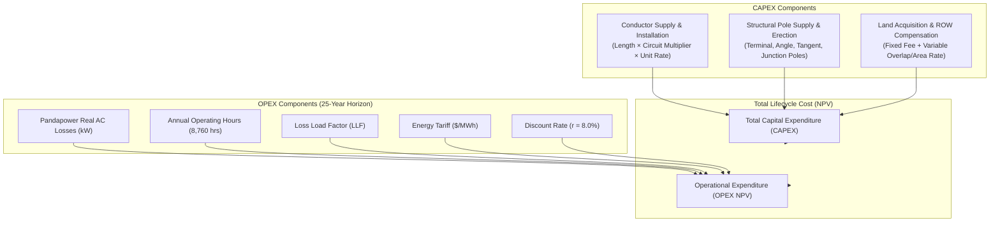

# ADR-004: Lifecycle Cost as the Primary Financial Objective

> [!success] Status: Implemented (SURGE-PY-028)  
> **Date**: 2026-08-04 (Updated 2026-08-16)  
> **Deciders**: SURGE Architecture & Optimization Teams  
> **Related Notes**: [[Cost Model]], [[Python Engine]], [[Decision Workflow]], [[ADR-007 Pandapower AC Load Flow Validation]], [[Testing Status]]

---

## Context

In wind farm collector network planning, minimizing route length alone produces suboptimal real-world designs. A geometrically shortest path may:
- Traverse steep terrain requiring expensive heavy-angle transmission towers.
- Cross high-value cadastral parcels with exorbitant Right-of-Way (ROW) acquisition costs.
- Utilize undersized conductors resulting in catastrophic operational $I^2R$ power dissipation over a 25-year plant lifetime.

A comprehensive, mathematically rigorous, and auditable financial objective is required to compare route alternatives on equal economic terms.

---

## Decision

Implement **Net Present Value (NPV) Lifecycle Cost** as the primary financial metric for evaluating and comparing collector network candidates.

The lifecycle costing engine is implemented in Python under `app/costing/` (`lifecycle.py`, `models.py`, `catalogue.py`, `failures.py`) using **arbitrary-precision `Decimal` arithmetic** and **bankers rounding (`ROUND_HALF_EVEN`)** to prevent floating-point accumulation errors in multi-million dollar capital budgets.

---

## Mathematical Formulation

The total lifecycle cost $C_{\text{lifecycle}}$ is defined as:

$$C_{\text{lifecycle}} = C_{\text{CAPEX, conductor}} + C_{\text{CAPEX, poles}} + C_{\text{CAPEX, land}} + \text{PV}(C_{\text{OPEX, losses}})$$

### 1. Conductor Capital Expenditure ($C_{\text{CAPEX, conductor}}$)
For each route segment $s \in \mathcal{S}$ with installed conductor type $c(s)$, length $L_s$ (in km), and parallel circuit count $n_{\text{circuits}}$:

$$C_{\text{CAPEX, conductor}} = \sum_{s \in \mathcal{S}} \left( L_s \times n_{\text{circuits}} \times \text{Rate}_{\text{conductor}}(c(s)) \right)$$

### 2. Structural Pole Capital Expenditure ($C_{\text{CAPEX, poles}}$)
Based on canonical pole classification (`terminal`, `angle`, `intermediate`/`tangent`, `junction`):

$$C_{\text{CAPEX, poles}} = \sum_{t \in \{\text{terminal}, \text{angle}, \text{intermediate}, \text{junction}\}} \left( N_{\text{poles}}(t) \times \text{Rate}_{\text{pole}}(t) \right)$$

### 3. Land Acquisition & ROW Compensation ($C_{\text{CAPEX, land}}$)
Configured via `LandCostPolicy` with support for three pricing bases:
- `NONE`: Zero variable land compensation.
- `ROUTE_OVERLAP_LENGTH_M`: Linear meter corridor compensation ($L_{\text{overlap}} \times \text{Rate}_{\text{variable}}$).
- `ROW_INTERSECTION_AREA_M2`: Geometric corridor polygon area compensation ($A_{\text{ROW}} \times \text{Rate}_{\text{variable}}$).

$$C_{\text{CAPEX, land}} = \left( N_{\text{affected parcels}} \times \text{Fee}_{\text{fixed}} \right) + \sum_{p \in \mathcal{P}_{\text{affected}}} \text{Cost}_{\text{variable}}(p)$$

### 4. Present Value of Operational Electrical Losses ($\text{PV}(C_{\text{OPEX, losses}})$)
Calculated from real AC load flow active power loss $P_{\text{loss, kW}}$ over an $N$-year lifetime (default 25 years) at discount rate $r$:

$$\text{Annual Loss Cost} = \left( \frac{P_{\text{loss, kW}}}{1000} \right) \times H_{\text{operating}} \times \text{LLF} \times \text{Tariff}_{\text{MWh}}$$

$$\text{PVIFA}(r, N) = \sum_{y=1}^{N} \frac{1}{(1 + r)^y} = \frac{1 - (1 + r)^{-N}}{r}$$

$$\text{PV}(C_{\text{OPEX, losses}}) = \text{Annual Loss Cost} \times \text{PVIFA}(r, N)$$

---

## Domain Architecture (`app/costing/`)

The costing engine is isolated from external frameworks through strongly-typed domain models:

1. **`EngineeringCostCatalogue` (`catalogue.py`, `models.py`)**:
   - `catalogue_id`, `version`, `currency` (ISO-4217 3-letter code), and `price_basis_date`.
   - `conductor_items`: Tuple of `ConductorCostItem` with per-km rates.
   - `pole_items`: Tuple of `PoleCostItem` covering all four required pole types.
   - `land_policy`: `LandCostPolicy` defining fixed parcel fees and variable corridor rates.
2. **`LifecycleCostConfig` (`models.py`)**:
   - `analysis_period_years` (e.g., 25 years).
   - `discount_rate` (e.g., $0.08$ for 8.0%).
   - `annual_operating_hours` (e.g., 8,760 hours).
   - `loss_load_factor` (e.g., $0.35$).
   - `energy_price_per_mwh` (e.g., $\$65.00$).
3. **`CandidateCostAssessment` & `CostLineItem` (`models.py`)**:
   - Transparent line-item ledger recording individual item codes, quantities, units, unit rates, and totals.
4. **Structured Failure Recovery (`failures.py`)**:
   - Explicit failure codes (`MISSING_CONDUCTOR_RATE`, `MISSING_POLE_RATE`, `INVALID_LOSS_DATA`, `CURRENCY_MISMATCH`) returning structured non-fatal diagnostic errors without crashing the optimization batch.

---

## Consequences

- **Positive**: Provides utility developers and EPC contractors with defensible, auditable financial projections.
- **Positive**: Unifies physical CAPEX and 25-year operational electrical OPEX into a single comparable currency figure.
- **Positive**: `Decimal` arithmetic eliminates IEEE 754 floating-point inaccuracies.
- **Positive**: Seamless integration with the Pareto multi-objective scoring pipeline (SURGE-PY-018).
- **Negative**: Requires accurate regional cost catalogues and energy price assumptions for realistic comparisons.

---

## Implementation References

- `optimisation-python/app/costing/lifecycle.py`: Core financial evaluation engine and NPV formulas.
- `optimisation-python/app/costing/models.py`: Frozen domain dataclasses and validation rules.
- `optimisation-python/app/costing/catalogue.py`: Catalogue repository and standard equipment pricing.
- `optimisation-python/tests/test_lifecycle_cost.py`: Pytest suite covering CAPEX, OPEX, rounding, and failure handling.
