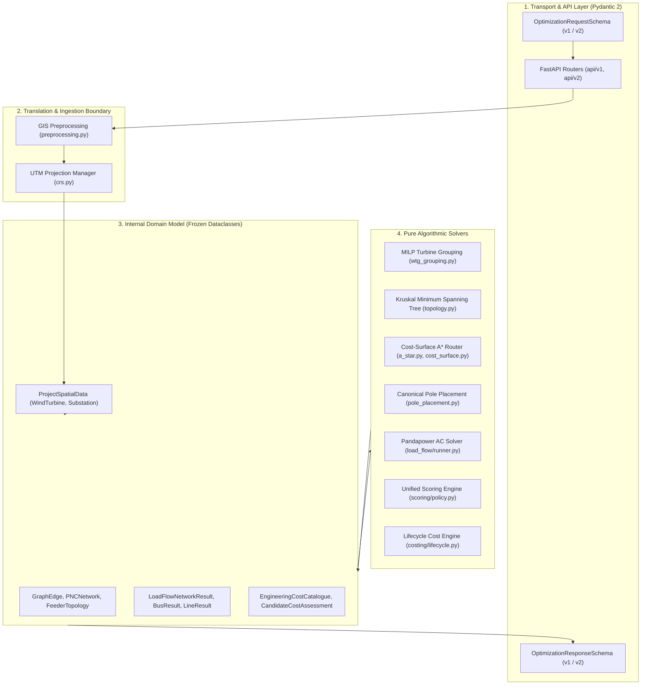

# ADR-005: Python Service Layered Architecture and Two-Model Family Pattern

> [!success] Status: Accepted and Implemented  
> **Date**: 2026-08-06 (Updated 2026-08-16)  
> **Deciders**: SURGE Architecture & Optimization Teams  
> **Related Notes**: [[Python Engine]], [[FastAPI Endpoints]], [[Domain Model]], [[ADR-001 Use FastAPI]], [[ADR-006 Spatial Models and Unified UTM]], [[Testing Status]]

---

## Context

The Python optimization microservice performs complex multi-stage engineering calculations involving external HTTP serialization, geographic data transformations, mixed-integer linear programming, graph traversal, electrical network simulation, and financial modeling.

If data parsing, validation, spatial transformations, and algorithmic solvers are combined within monolithic HTTP route handlers or dynamic dictionary structures, the system becomes fragile, difficult to test, prone to regression bugs, and tightly coupled to transport-level details.

---

## Decision

Enforce a **Strict Layered Service Architecture** governed by the **Two-Model Family Pattern**:

1. **External API Layer (Pydantic 2 Models)**:
   - Located in `app/schemas/`.
   - Dedicated strictly to HTTP request/response serialization, JSON schema validation, numeric range checks, and OpenAPI documentation generation.
   - Pydantic models never leak internal solver objects (e.g., Shapely geometries, PyProj transformers, Pandapower network handles).
2. **Internal Domain Layer (Frozen Dataclasses & Geometry Objects)**:
   - Located in `app/models/`, `app/electrical/load_flow/models.py`, `app/costing/models.py`, and `app/optimisation/`.
   - Immutable, strongly-typed frozen dataclasses holding projected metric coordinates (UTM), Shapely geometric primitives, and physical engineering parameters.
   - Solvers and algorithms interact exclusively with domain dataclasses.
3. **Translation Boundary (`app/gis/preprocessing.py` & `app/optimisation/orchestrator.py`)**:
   - Explicit bidirectional conversion between Pydantic GeoJSON DTOs and internal domain models.
   - Enforces automatic coordinate transformation (WGS84 $\leftrightarrow$ UTM) at the service perimeter.

---

## Architectural Layer Responsibilities

| Layer | Directory | Primary Responsibility | Dependencies |
| :--- | :--- | :--- | :--- |
| **API Routers** | `app/api/` | Route registration, dependency injection, HTTP status mapping, error formatting | FastAPI, Pydantic |
| **Schemas** | `app/schemas/` | Input validation, contract versioning (`v1` adapter, `v2` canonical), OpenAPI models | Pydantic 2 |
| **Service Orchestrator** | `app/optimisation/` | End-to-end pipeline coordination, candidate generation, winner selection | Domain models |
| **GIS & Projections** | `app/gis/` | Dynamic UTM detection, geometry repair, raster cost surface generation, ROW clipping | Shapely, PyProj, NumPy |
| **Algorithms** | `app/algorithms/` | MILP grouping, Kruskal MST topology, 8-connected grid A\* search, line-of-sight shortcutting | NetworkX, SciPy |
| **Electrical** | `app/electrical/` | Pandapower AC load flow simulation, voltage drop and thermal limit validation | Pandapower |
| **Costing** | `app/costing/` | Conductor/pole CAPEX, ROW land cost, and discounted electrical loss OPEX | Decimal arithmetic |

---

## Why Two Model Families?

- **Type Safety & Immutability**: Domain models use `@dataclass(frozen=True)` and tuples instead of mutable lists, preventing accidental state mutation across parallel solver iterations.
- **Fast Execution**: Pure Python dataclasses avoid Pydantic validation overhead inside tight algorithmic loops (e.g., millions of A\* node evaluations).
- **Decoupled Evolution**: The external API can evolve (e.g., adding presentation formatting or metadata fields) without modifying core mathematical solvers.

---

## Consequences

- **Positive**: Strict modularity allows unit testing every algorithm in isolation without mocking HTTP requests.
- **Positive**: Zero type ambiguities (enforced by strict Mypy and Ruff across all 79 Python source files).
- **Positive**: Clear boundary for error handling—validation errors return HTTP 422, while solver failures produce structured diagnostic objects.
- **Negative**: Requires explicit mapping code to convert between Pydantic DTOs and internal domain dataclasses.

---

## Implementation References

- `optimisation-python/app/schemas/`: API schema definitions for v1 and v2.
- `optimisation-python/app/models/spatial.py`: Core internal spatial domain models.
- `optimisation-python/app/optimisation/orchestrator.py`: Pipeline execution and model translation.
- `optimisation-python/app/costing/models.py`: Frozen costing domain definitions.
