# ADR-006: Unified Local UTM Projection for Engineering Calculations

> [!success] Status: Accepted and Implemented  
> **Date**: 2026-08-07 (Updated 2026-08-16)  
> **Deciders**: SURGE Architecture & GIS Teams  
> **Related Notes**: [[Spatial Model]], [[Python Engine]], [[Backend Architecture]], [[ADR-002 Use PostGIS]], [[ADR-005 Python Service Architecture and Schemas]], [[Testing Status]]

---

## Context

Geospatial data for wind farm planning is commonly exchanged in WGS84 geographic coordinates (EPSG:4326) with angular units (decimal degrees longitude and latitude).

However, wind collector network engineering requires linear distance calculations (in meters) for:
- Maximum pole span distances ($40\text{ m} \le \Delta s \le 120\text{ m}$).
- Structural angle pole deflection calculations ($\theta \ge 5^\circ$).
- 8-connected grid raster resolution ($5\text{ m} \times 5\text{ m}$ cells).
- Conductor length and physical cable resistance calculations ($R = \rho \cdot L / A$).
- Right-of-Way (ROW) corridor buffer polygons ($w_{\text{corridor}} = 10\text{ m}$ to $30\text{ m}$).

If coordinates remain in angular degrees, distance metrics distort with latitude, planar Euclidean math fails, and raster cells become non-square.

---

## Decision

At the Python microservice ingestion perimeter:

1. **Calculate Geographic Mean Center**: Compute the arithmetic mean $(\bar{\lambda}, \bar{\phi})$ of all project WTGs and Substation coordinates.
2. **Determine Optimal UTM Zone**: Query the EPSG registry via `pyproj.database.query_utm_crs_info` to identify the optimal local Universal Transverse Mercator (UTM) zone (e.g., EPSG:32642 for Gujarat Kutch / Zone 42N; EPSG:32643 for Uravakonda / Zone 43N).
3. **Instantiate Fast Transformer**: Create a high-performance `pyproj.Transformer` with `always_xy=True` to eliminate axis-order flipping issues.
4. **Project All Project Assets**: Transform all WTG Points, Substation Points, Cadastral Parcel Polygons, and Restricted Area Buffers into this single unified UTM CRS.
5. **Execute Solvers in Metric Plane**: Run all graph generation, raster cost-surface A\* routing, line-of-sight refinement, and pole placement algorithms strictly in metric UTM coordinates.
6. **Project Back to WGS84 for Egress**: Transform resulting route LineStrings and pole Point geometries back to WGS84 (EPSG:4326) before serializing into the GeoJSON response.

```mermaid
graph LR
    subgraph Ingestion["Ingestion Boundary"]
        WGS_IN["GeoJSON (EPSG:4326 Degrees)"]
        CRS_DET["Centroid & UTM Detection<br/>(app/gis/crs.py)"]
        TRANS_FWD["Forward Transform (pyproj)"]
    end

    subgraph MetricEngine["Internal Algorithmic Engine (Metric UTM Plane)"]
        UTM_ASSETS["ProjectSpatialData (Meters)"]
        RASTER["Raster Cost Grid (5m x 5m)"]
        ASTAR["A* Routing & Line-of-Sight"]
        POLES["Pole Spacing & Angle Classification"]
    end

    subgraph Egress["Egress Boundary"]
        TRANS_REV["Reverse Transform (pyproj)"]
        WGS_OUT["GeoJSON LineStrings & MultiPoints (EPSG:4326)"]
    end

    WGS_IN --> CRS_DET --> TRANS_FWD --> UTM_ASSETS
    UTM_ASSETS --> RASTER --> ASTAR --> POLES
    POLES --> TRANS_REV --> WGS_OUT
```

---

## Why Single Project-Unified UTM?

- **Zero Multi-Zone Inconsistencies**: Even if a large wind farm sits near a UTM boundary, projecting all assets into a single shared projection maintains topological continuity and consistent Euclidean metrics across all feeder lines.
- **Minimal Local Distortion**: Within a typical wind farm corridor ($10\text{ km} \times 10\text{ km}$), scale distortion in local UTM is less than $0.04\%$, which is well within civil engineering survey tolerances.
- **Elimination of Web Mercator (EPSG:3857) Errors**: Web Mercator causes significant distance exaggeration away from the equator (up to $15\text{--}30\%$ in India and Europe) and is strictly rejected for physical conductor and pole distance calculations.

---

## Technical Validation & Invariants

1. **Strict Coordinate Order**: All internal transformers use `always_xy=True`, ensuring coordinates are uniformly formatted as $(x, y) = (\text{Easting}, \text{Northing})$ or $(\text{Longitude}, \text{Latitude})$.
2. **Geometry Validation**: All input polygons undergo `shapely.validation.make_valid` to resolve self-intersecting boundary rings before metric transformation.
3. **Round-Trip Fidelity**: Unit tests in `tests/test_crs.py` verify that $(WGS84 \to UTM \to WGS84)$ round-trip transformations preserve coordinate precision within millimeter tolerance ($< 10^{-6}\text{ degrees}$).

---

## Consequences

- **Positive**: All downstream algorithms (A\*, Kruskal MST, Pole placement, ROW intersection) operate on standard metric units (meters, square meters).
- **Positive**: Simplifies geometry math and enables standard NumPy grid indexing.
- **Negative**: Coordinate transformation overhead at request ingestion and response serialization (typically $< 5\text{ ms}$ for hundreds of assets).

---

## Implementation References

- `optimisation-python/app/gis/crs.py`: UTM CRS detection and coordinate transformation utilities.
- `optimisation-python/app/gis/preprocessing.py`: Spatial asset projection and validation.
- `optimisation-python/app/models/spatial.py`: Internal metric spatial dataclasses.
- `optimisation-python/tests/test_crs.py`: Pytest suite for projection accuracy and coordinate invariants.
