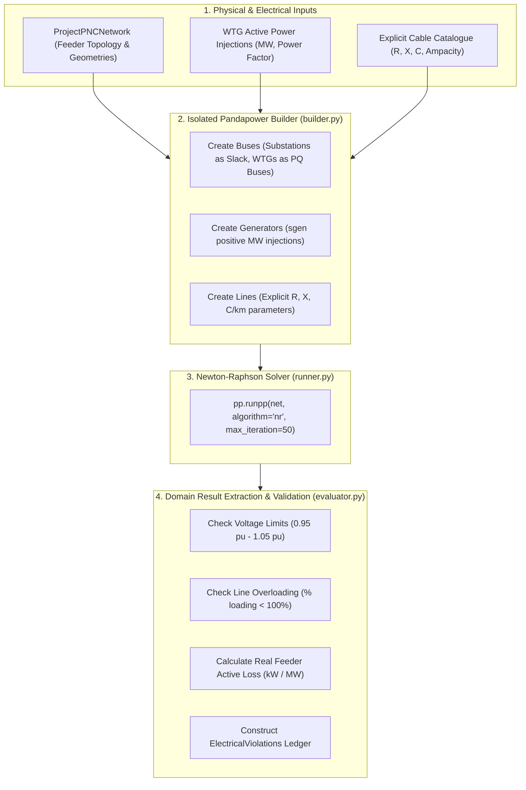

# ADR-007: Pandapower AC Load Flow Validation for Collector Networks

> [!success] Status: Accepted and Implemented  
> **Date**: 2026-08-12 (Updated 2026-08-16)  
> **Deciders**: SURGE Architecture & Electrical Engineering Teams  
> **Related Notes**: [[Python Engine]], [[Electrical Validation]], [[Cost Model]], [[ADR-004 Lifecycle Cost Objective]], [[Testing Status]]

---

## Context

SURGE generates candidate 33kV collector feeder topologies connecting wind turbine generators (WTGs) to regional grid substations.

While geometric algorithms (MILP clustering, Kruskal MST, and A\* routing) produce spatially valid, obstacle-avoiding paths, they cannot ensure physical electrical feasibility under operational conditions. Feeder networks are subject to:
- **Voltage Rise & Voltage Drop Limits**: Grid codes (e.g., IEC 60038, CEA Regulations) require bus voltages to remain within $\pm 5\%$ of nominal ($0.95 \le V_{\text{pu}} \le 1.05$).
- **Thermal Line Loading Limits**: Line currents must not exceed cable ampacity ($I_{\text{flow}} \le I_{\text{thermal, max}}$).
- **Reactive Power & Shunt Capacitance Effects**: Underground cables exhibit significant shunt capacitance causing Ferranti voltage rise under light load.
- **Accurate Active Power Losses ($I^2R$)**: True AC losses are essential for 25-year lifecycle OPEX evaluation.

---

## Decision

Integrate **Pandapower 2.14+** as the authoritative AC power flow engine within the Python optimization microservice.

Locate the validator at `app/electrical/load_flow/` as an isolated, downstream verification stage following physical collector network assembly.

---

## Key Design Patterns & Invariants

1. **Domain-Driven Electrical Configuration (`config.py`)**:
   - SURGE does not rely on opaque, version-dependent Pandapower standard library catalogs.
   - All cable types are explicitly defined via `LoadFlowCableType` domain models containing:
     - Resistance: $r\_ohm\_per\_km$ ($\Omega/\text{km}$)
     - Reactance: $x\_ohm\_per\_km$ ($\Omega/\text{km}$)
     - Capacitance: $c\_nf\_per\_km$ ($\text{nF}/\text{km}$)
     - Thermal Ampacity: $max\_i\_ka$ ($\text{kA}$)
2. **Positive Generator Injection Convention**:
   - Wind turbines inject power into the collector grid. WTG operating points are configured as positive `active_power_mw` injections mapped to Pandapower `sgen` elements, with reactive power determined by operational power factor ($\cos \phi = 0.95$ inductive/capacitive).
   - The grid substation is modeled as an infinite slack bus (`ext_grid`) maintaining $1.0\text{ pu}$ nominal voltage.
3. **Graceful Non-Convergence Handling**:
   - If the Newton-Raphson solver fails to converge within iteration limits, the runner catches `pp.LoadflowNotConverged` and returns a structured `LoadFlowNetworkResult` with `converged = False` and an explicit `LOAD_FLOW_NOT_CONVERGED` violation code.
   - The optimization orchestrator never crashes due to electrical non-convergence.
4. **Deterministic Identifier Mapping**:
   - Pandapower uses zero-indexed integer arrays for internal buses and lines.
   - The adapter builds bidirectional, deterministic lookup maps between domain string IDs (`WTG-001`, `SUB-01`, `SEG-104`) and integer indices, lexicographically sorting elements prior to network construction.
5. **Numba Disabled for Determinism**:
   - Just-in-time compilation via Numba is explicitly disabled to avoid cross-platform C-compiler dependencies and threading non-determinism across container environments.

---

## Consequences

- **Positive**: Rigorous AC power flow replaces rough heuristic approximations with validated physics.
- **Positive**: Real active power losses ($P_{\text{loss, kW}}$) feed directly into the Decimal Lifecycle Cost model (ADR-004).
- **Positive**: Identifies voltage and thermal violations before route designs are committed to PostGIS.
- **Negative**: Full Newton-Raphson iteration is computationally heavier than linear approximations (typically $5\text{--}15\text{ ms}$ per 40-bus network).

---

## Implementation References

- `optimisation-python/app/electrical/load_flow/builder.py`: Pandapower network construction from domain models.
- `optimisation-python/app/electrical/load_flow/runner.py`: Newton-Raphson solver execution and exception handling.
- `optimisation-python/app/electrical/load_flow/evaluator.py`: Voltage and thermal limit violation detection.
- `optimisation-python/app/electrical/load_flow/config.py`: Explicit cable parameter specifications.
- `optimisation-python/tests/test_load_flow.py`: Pytest suite for AC power flow convergence, loss calculation, and violation extraction.
