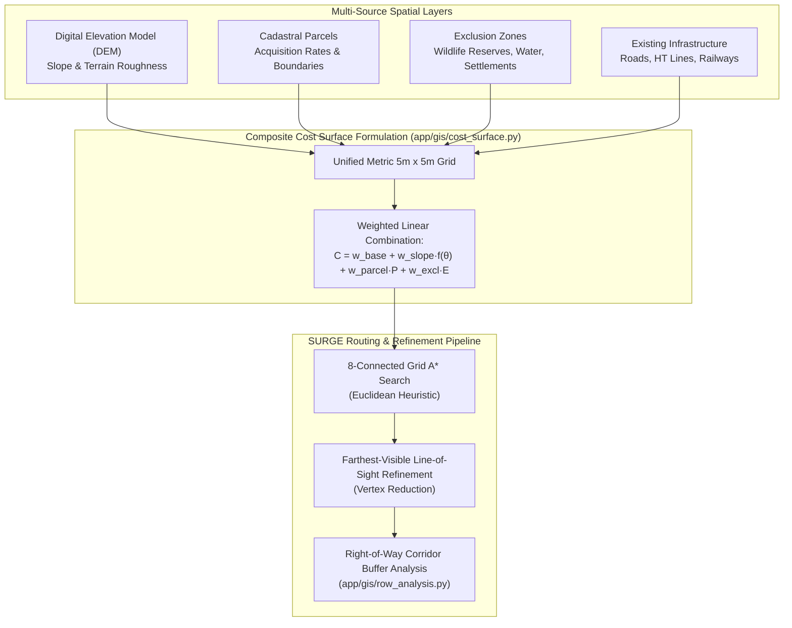

# Research Notes: GIS-Based Spatial Optimization and Cadastral Parcel Impact Mitigation for Utility Corridors

> [!info] Research Metadata
> **Topic**: Geospatial Multi-Criteria Corridor Routing & Cadastral Impact Optimization  
> **Key Literature**: 
> - *Bagli et al.*, "Routing of Power Lines Through Least-Cost Path Analysis in GIS Environments" (Environmental Modelling & Software)
> - *Monteiro et al.*, "GIS-Based Decision Support System for Overhead Power Transmission Line Routing" (Electric Power Systems Research)
> - *Eshragh et al.*, "Cadastral Impact and Right-of-Way Land Compensation Modeling in Linear Infrastructure" (Computers, Environment and Urban Systems)  
> **Relevance to SURGE**: Informs raster cost-surface generation, slope penalty matrices, cadastral parcel boundary snapping, and Right-of-Way (ROW) corridor compensation.  
> **Related Notes**: [[Routing]], [[Spatial Model]], [[Cost Model]], [[ADR-002 Use PostGIS]], [[ADR-006 Spatial Models and Unified UTM]], [[Testing Status]]

---

## Executive Summary & Academic Principles

Linear energy infrastructure (such as 33kV overhead lines and underground collector cables) must navigate complex spatial environments characterized by:
1. **Terrain Slope & Elevation**: Excessive slopes ($> 15\%$) increase tower foundation costs, induce mechanical tension imbalance, and raise erosion risks during civil construction.
2. **Cadastral Land Parcels**: Bisecting private agricultural or commercial plots leads to high compensation payouts, landowner opposition, and extended Right-of-Way (ROW) permitting timelines. Following existing cadastral boundaries significantly reduces civil acquisition friction.
3. **Environmental & Cultural Exclusions**: Strict exclusion buffers must be maintained around wildlife sanctuaries, forest reserves, water bodies, village settlements, and existing high-tension (HT) electrical corridors.

Academic research demonstrates that **Multi-Criteria Least-Cost Path (LCP)** analysis over composite raster cost surfaces provides the optimal theoretical framework for balancing these spatial constraints.

---

## Implementation in SURGE

SURGE translates the principles of GIS spatial optimization into a high-performance, containerized Python and PostGIS processing pipeline:

### 1. Unified Metric Spatial Coordinate System (ADR-006)
- Ingests WGS84 GeoJSON features and automatically projects them into the optimal local UTM zone (EPSG:326xx).
- Constructs high-resolution 2D NumPy raster cost grids ($5\text{ m} \times 5\text{ m}$ cell size) over the project bounding box.

### 2. Multi-Layer Cost Surface Generation (`app/gis/cost_surface.py`)
Each grid cell $(x, y)$ is assigned a composite traversability cost:

$$C(x, y) = C_{\text{base}} + \sum_{k} w_k \cdot f_k(x, y)$$

- **Hard Exclusions ($\infty$)**: Restricted environmental reserves, water bodies, and airport radar zones. Cells inside hard exclusions are marked impassable ($C = \infty$).
- **Slope Penalty**: Derived from DEM gradient analysis:
  $$f_{\text{slope}}(\theta) = \begin{cases} 
  1.0 & \text{if } \theta < 8^\circ \\
  1.0 + \alpha (\theta - 8^\circ)^2 & \text{if } 8^\circ \le \theta \le 25^\circ \\
  \infty & \text{if } \theta > 25^\circ 
  \end{cases}$$
- **Cadastral Boundary Preference**: Interior parcel land carries standard acquisition penalties, while a 5-meter buffer along parcel boundaries and public road reserves is assigned discounted traversability costs, naturally guiding routes along property edges.

### 3. Farthest-Visible Line-of-Sight Shortcut Refinement (`app/algorithms/`)
Raw A\* grid paths exhibit artificial zig-zag discretization artifacts. SURGE applies an aggressive ray-casting line-of-sight shortcutting pass:
- Tests direct linear segments between non-adjacent path vertices.
- If the direct segment does not intersect any hard exclusion zone or exceed maximum slope thresholds, intermediate vertices are eliminated.
- Reduces total line length by $3\text{--}8\%$ and eliminates unnecessary structural angle poles.

### 4. Right-of-Way (ROW) Corridor Analysis (`app/gis/row_analysis.py`)
- Automatically generates geometric corridor buffers around feeder paths ($w = 15\text{ m}$ for 33kV lines).
- Performs precise spatial polygon intersection against PostGIS `cadastral_parcels` to compute exact affected land area ($\text{m}^2$) and compensation cost line items.

---

## Comparative Evaluation

| Feature | Academic Standard (Literature) | SURGE Implementation |
| :--- | :--- | :--- |
| **Grid Representation** | Heavy GIS Desktop (ArcGIS / QGIS Python API) | **Lightweight NumPy / SciPy / Shapely** in FastAPI |
| **Path Smoothing** | Spline interpolation (creates unfeasible pole locations) | **Farthest-Visible LOS Ray-Casting** (preserves straight engineering spans) |
| **Cadastral Integration** | Simple binary land-use masks | **PostGIS GiST Polygonal Intersections** with parcel acquisition rates |
| **Database Persistence** | Flat ESRI Shapefiles or GeoPackages | **Enterprise PostGIS 16** with Flyway schema versioning (V1–V13) |

---

## References

1. Bagli, S., et al. (2011). *Routing of Power Lines Through Least-Cost Path Analysis in GIS Environments*. Environmental Modelling & Software, 26(12), 1708-1718.
2. Monteiro, C., et al. (2012). *GIS-Based Decision Support System for Overhead Power Transmission Line Routing*. Electric Power Systems Research, 84(1), 184-192.
3. SURGE Technical Specification: [[Routing]], [[Spatial Model]], [[Cost Model]], [[ADR-002 Use PostGIS]], [[ADR-006 Spatial Models and Unified UTM]].
