# Research Notes: Evolutionary and Combinatorial Algorithms for Wind Farm Collector Network Topology

> [!info] Research Metadata
> **Topic**: Wind Farm Collector Network Optimization & Feeder Clustering  
> **Key Literature**: 
> - *González-Longatt et al.*, "Optimal Electrical Network Design for Offshore Wind Farms Using Genetic Algorithms" (IEEE Trans. Energy Conversion)
> - *Dutta & Overbye*, "Cable Layout Optimization for Offshore Wind Farms Considering Cable Types and Crossings" (IEEE Trans. Sustainable Energy)
> - *Pillai et al.*, "Offshore Wind Farm Electrical Cable Layout Optimization" (Applied Energy)  
> **Relevance to SURGE**: Informs turbine grouping, feeder capacity allocation, branch topology generation, and solver selection.  
> **Related Notes**: [[WTG Grouping]], [[Python Engine]], [[ADR-005 Python Service Architecture and Schemas]], [[Cost Model]], [[Testing Status]]

---

## Executive Summary & Theoretical Context

Collector network design in utility-scale wind farms requires partitioning $N$ wind turbine generators (WTGs) across $M$ radial feeder circuits terminating at one or more central grid substations, such that:
1. **Capacity Limit**: The aggregate rated capacity on any feeder does not exceed the feeder thermal rating ($\sum_{i \in \mathcal{F}_m} P_i \le C_{\text{feeder}}$).
2. **Radial Feeder Topology**: Each feeder operates as a strictly radial tree rooted at the substation, with no operational loops.
3. **Branching & Crossings**: Physical line crossings are penalized or forbidden.

Academic literature extensively explores **Genetic Algorithms (GAs)** and **Particle Swarm Optimization (PSO)** for this problem due to its NP-hard combinatorial nature.

```mermaid
graph TD
    subgraph ResearchApproach["Academic Literature: Genetic Algorithms"]
        Chrom["Chromosome Encoding:<br/>Integer String / Prufer Sequence"]
        Cross["Genetic Crossover & Mutation"]
        Fit["Fitness Function:<br/>LCOE + Heuristic Losses + Penalty Terms"]
        Iter["Stochastic Iteration (1,000+ Generations)"]
        Chrom --> Cross --> Fit --> Iter
    end

    subgraph SurgeApproach["SURGE Production Implementation"]
        KMeans["1. Spatial K-Means Initialization<br/>(Centroid-based Seeds)"]
        MILP["2. Exact Mixed-Integer Linear Program<br/>(scipy.optimize.milp with Load Balancing)"]
        MST["3. Kruskal's Metric Minimum Spanning Tree<br/>(NetworkX on Projected UTM)"]
        Panda["4. AC Newton-Raphson Verification<br/>(Pandapower 2.14+)"]
        KMeans --> MILP --> MST --> Panda
    end
```

---

## Comparative Analysis: Genetic Algorithms vs. SURGE Implementation

| Optimization Attribute | Genetic Algorithm Approach (Literature) | SURGE Implementation (`app/algorithms/`) | Rationale in SURGE |
| :--- | :--- | :--- | :--- |
| **Turbine Grouping** | Stochastic chromosome mutation with penalty functions for capacity overload | **Hybrid K-Means + MILP (`wtg_grouping.py`)** | Exact capacity constraint enforcement with deterministic load balancing across feeders. Solves in $< 50\text{ ms}$. |
| **Topology Construction** | Prüfer sequences or randomized spanning tree mutations | **Kruskal's Metric MST (`topology.py`)** | Produces mathematically optimal radial trees for given clusters with $O(E \log V)$ efficiency. |
| **Determinism & Reproducibility** | Non-deterministic; different runs produce slightly different topologies | **100% Deterministic** | Engineering CAD and EPC contracts require identical, legally verifiable outputs for identical inputs. |
| **Electrical Feasibility** | Simplified heuristic $I^2R$ power loss estimations | **Pandapower AC Power Flow (`load_flow/`)** | Full Newton-Raphson solution capturing bus voltage drops, line reactive effects, and exact active losses. |
| **Execution Time** | Minutes to hours for multi-generation convergence | **Sub-second ($< 500\text{ ms}$)** | Enables interactive real-time parameter exploration in the Web GIS map. |

---

## Technical Details of SURGE Algorithmic Formulation

### 1. Mixed-Integer Linear Programming Formulation (`wtg_grouping.py`)
SURGE models feeder clustering as a balanced capacitated assignment problem:

$$\text{Minimize} \quad \sum_{i=1}^{N} \sum_{k=1}^{M} d(i, c_k) \cdot x_{ik} + \lambda \sum_{k=1}^{M} \left( \sum_{i=1}^{N} P_i x_{ik} - \bar{P} \right)^2$$

Subject to:
- Each turbine assigned to exactly one feeder: $\sum_{k=1}^{M} x_{ik} = 1, \quad \forall i \in \{1 \dots N\}$
- Feeder capacity limit: $\sum_{i=1}^{N} P_i x_{ik} \le C_{\text{feeder}}, \quad \forall k \in \{1 \dots M\}$
- Binary assignment: $x_{ik} \in \{0, 1\}$

Solved via `scipy.optimize.milp` using initial spatial cluster medoids from Scikit-Learn K-Means.

### 2. Radial Spanning Tree Topology (`topology.py`)
Within each cluster $\mathcal{F}_k \cup \{\text{Substation}\}$, SURGE constructs a complete metric distance graph in metric UTM coordinates (ADR-006) and applies Kruskal's algorithm to obtain the minimum-weight radial branch network.

---

## Key Takeaways for Future Enhancements

1. **Substation Bay Selection**: In multi-substation layouts, genetic crossover operators can be adapted to explore substation assignment boundaries where MILP relaxed bounds become loose.
2. **Dynamic Cable Sizing**: Combining evolutionary chromosome strings with discrete cable cross-sections ($185\text{ mm}^2, 300\text{ mm}^2, 630\text{ mm}^2$) along feeder branches.
3. **Obstacle-Constrained MST**: Applying Steiner Minimal Tree (SMT) heuristics when fixed routing corridors or physical obstacle boundaries divide turbine clusters.

---

## References

1. González-Longatt, F., et al. (2012). *Optimal Electrical Network Design for Offshore Wind Farms Using Genetic Algorithms*. IEEE Transactions on Energy Conversion, 27(3), 770-778.
2. Dutta, S., & Overbye, T. J. (2014). *Cable Layout Optimization for Offshore Wind Farms Considering Cable Types and Crossings*. IEEE Transactions on Sustainable Energy, 5(2), 523-530.
3. SURGE Technical Specification: [[WTG Grouping]], [[Python Engine]], [[ADR-005 Python Service Architecture and Schemas]].
