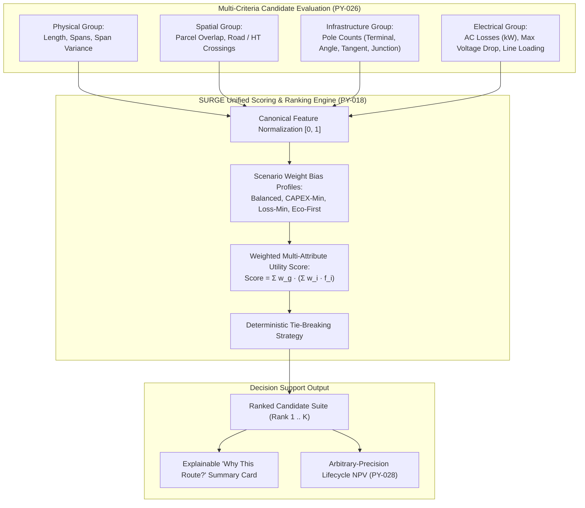

# Research Notes: Multi-Objective Routing and Pareto Decision Optimization in Transmission and Collector Grids

> [!info] Research Metadata
> **Topic**: Multi-Objective Routing, Pareto Frontiers, and Multi-Criteria Decision Analysis (MCDA)  
> **Key Literature**: 
> - *Schmidt*, "Multi-Criteria Transmission Line Routing Using Multi-Attribute Utility Theory" (IEEE Trans. Power Delivery)
> - *Bevrani et al.*, "Intelligent Optimization for Power Line Routing Considering Technical, Economic, and Environmental Objectives" (Energy Systems)
> - *Deb et al.*, "A Fast and Elitist Multiobjective Genetic Algorithm: NSGA-II" (IEEE Trans. Evolutionary Computation)  
> **Relevance to SURGE**: Informs candidate scoring (SURGE-PY-018), engineering metrics extraction (SURGE-PY-026), scenario profiles (`ScenarioProfile`), and Pareto recommendation ranking.  
> **Related Notes**: [[Decision Workflow]], [[Cost Model]], [[Routing]], [[ADR-004 Lifecycle Cost Objective]], [[Testing Status]]

---

## Executive Summary & Theoretical Context

Utility transmission line and collector network planning is inherently **multi-objective** and involves competing stakeholder criteria:
1. **Financial Objective**: Minimizing initial capital expenditure ($CAPEX$) and 25-year discounted energy loss costs ($OPEX$).
2. **Technical & Reliability Objective**: Minimizing structural complexity (number of angle poles, maximum span deviations) and maximizing voltage stability ($V_{\text{pu}} \approx 1.0$).
3. **Environmental & Social Objective**: Minimizing Right-of-Way (ROW) encroachment on agricultural parcels, avoiding proximity to residential settlements, and eliminating impact on protected wildlife habitats.

Because these objectives conflict (e.g., bypassing agricultural land increases total route length and conductor cost), no single optimal route exists. Instead, the solution space forms a **Pareto Frontier** of non-dominated candidates.

---

## The SURGE Multi-Objective Scoring Architecture

SURGE implements a deterministic Multi-Attribute Utility framework (`app/scoring/policy.py`, `app/optimisation/engineering_metrics.py`) structured into four distinct score groups:

### 1. Canonical Candidate Engineering Metrics (SURGE-PY-026)
Every candidate topology is evaluated across four standardized metric domains:
- **Physical Metrics**: Total circuit route length ($m$), average span length ($m$), maximum span deviation, number of physical spans.
- **Spatial Metrics**: Cadastral parcel intersection area ($m^2$), number of affected private parcels, public road crossings, high-tension (HT) line proximity encounters.
- **Infrastructure Metrics**: Total pole count, count of high-cost $90^\circ$ angle/terminal structures vs. low-cost intermediate tangent poles.
- **Electrical Metrics**: Pandapower AC active power losses ($kW$), maximum bus voltage deviation ($\Delta V_{\text{max}}$), and peak cable ampacity utilization ($I / I_{\text{thermal}}$).

### 2. Four Operational Scenario Profiles
SURGE allows operators to bias the multi-objective utility function across four predefined engineering personas:

| Scenario Profile | Key Objective Bias | Algorithmic Weight Configuration | Field Verification Context |
| :--- | :--- | :--- | :--- |
| **`BALANCED_DEFAULT`** | Equal trade-off across CAPEX, electrical losses, and civil disruption | $w_{\text{phys}}=0.30, w_{\text{elec}}=0.30, w_{\text{spat}}=0.20, w_{\text{infra}}=0.20$ | General utility bidding & standard RFP proposals |
| **`CAPEX_MINIMIZED`** | Minimum initial build budget and shortest conductor length | $w_{\text{phys}}=0.50, w_{\text{infra}}=0.30, w_{\text{elec}}=0.10, w_{\text{spat}}=0.10$ | Capital-constrained private IPP projects |
| **`LOSS_MINIMIZED`** | Minimum 25-year operational electrical energy dissipation | $w_{\text{elec}}=0.60, w_{\text{phys}}=0.20, w_{\text{infra}}=0.10, w_{\text{spat}}=0.10$ | High-capacity-factor wind corridors ($CF > 35\%$) |
| **`ENVIRONMENTAL_FIRST`** | Minimum parcel bisecting and maximum exclusion setbacks | $w_{\text{spat}}=0.60, w_{\text{phys}}=0.15, w_{\text{infra}}=0.15, w_{\text{elec}}=0.10$ | Environmentally sensitive / heavily parceled terrain |

*Validated against real-world 33kV collector line surveys from the Uravakonda wind development zone (17 mutation tests in `ScenarioProfileTest`).*

---

## Explainability & Decision Support ("Why This Route?")

Rather than presenting a black-box numeric recommendation, SURGE generates human-readable decision rationales displayed in the `web-map-next` UI:
- Quantifies trade-offs against baseline alternatives (e.g., *"Selected candidate reduces 25-year AC losses by 14.2% while avoiding 3 high-value private cadastral parcels with an initial CAPEX increase of only 2.1%"*).
- Provides complete line-item breakdown of capital expenditures (conductors, poles, ROW land fees) and discounted operational loss OPEX.

---

## References

1. Schmidt, A. J. (2009). *Multi-Criteria Transmission Line Routing Using Multi-Attribute Utility Theory*. IEEE Transactions on Power Delivery, 24(2), 770-779.
2. Bevrani, H., et al. (2015). *Intelligent Optimization for Power Line Routing Considering Technical, Economic, and Environmental Objectives*. Energy Systems, 6(3), 363-382.
3. SURGE Technical Specification: [[Decision Workflow]], [[Cost Model]], [[Routing]], [[ADR-004 Lifecycle Cost Objective]].
